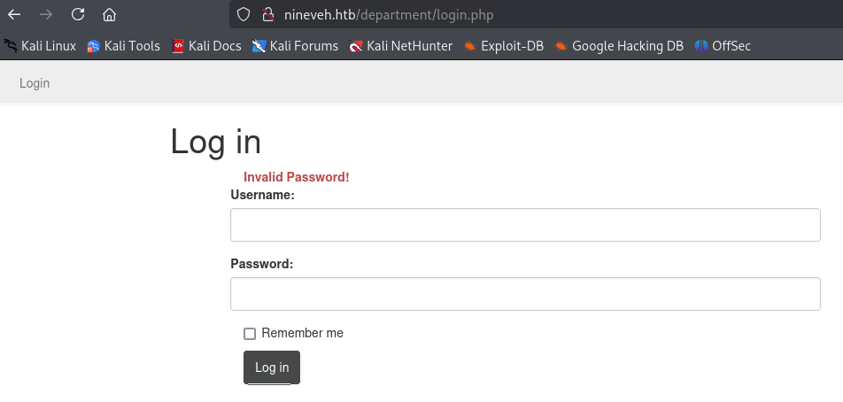
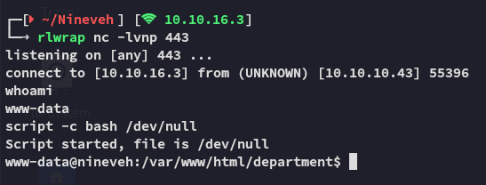
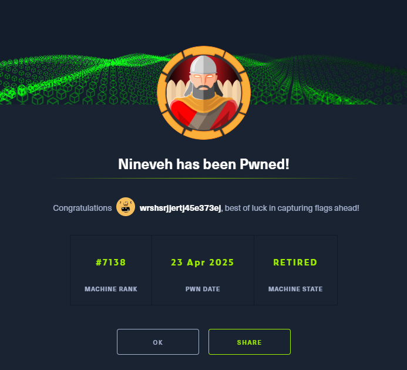

**Start 07:55 23-04-2025**

---
```
Scope:
10.10.10.43
```
## Recon

### Nmap

```bash
sudo nmap -sC -sV nineveh -sT -T5 --min-rate=5000 -Pn -vvvv

PORT    STATE SERVICE  REASON  VERSION
80/tcp  open  http     syn-ack Apache httpd 2.4.18 ((Ubuntu))
| http-methods: 
|_  Supported Methods: GET HEAD POST OPTIONS
|_http-title: Site doesn't have a title (text/html).
|_http-server-header: Apache/2.4.18 (Ubuntu)
443/tcp open  ssl/http syn-ack Apache httpd 2.4.18
|_http-server-header: Apache/2.4.18 (Ubuntu)
|_ssl-date: TLS randomness does not represent time
| tls-alpn: 
|_  http/1.1
| http-methods: 
|_  Supported Methods: GET HEAD POST OPTIONS
|_http-title: Site doesn't have a title (text/html).
```

### 443/TCP - HTTPS


I decided to launch `feroxbuster` and brute force directories.


I found a `phpLiteAdmin` page with version **1.9** running. This version has multiple vulnerabilities but let's first narrow it down. I decided to launch `gobuster` as well to do some more recon.


I found another interesting endpoint, let's check it out.

### Strings


Interesting, I saved the pictures and ran `exiftool` but didn't get anything useful:


Let's check it out using `strings`.


Unfortunately for us the SSH port is closed thus we have no way of accessing it.

### Hydra 

Time to brute force our way into the `/db` endpoint:


I easily found the password and tried it out on the target:


We got access!

## PoC

I then found a PoC on how to get **PHP Code Injection**:


### Reproducing steps


Then we go ahead and fill in the field:


## 80/TCP - HTTP

We return to port `80`. 




Here we find out that there are 2 error messages, if I enter a different username than *admin* I get the following message:


### More Hydra

Thus I yet again launched `hydra` to brute force myself in again:


And I was inside.


### LFI

Judging from the URL my senses started tingling and pointing towards some sort of **File Inclusion** vulnerability:


Let's see whether this param indeed is vulnerable.

I tried a bunch of combinations but in the end I found this one to work:

```
/manage.php?notes=files/ninevehNotes/../../../../../../etc/passwd
```


:::success
This is HIGHLY LIKELY because it still needs to read the note, when I input it without the `ninevehNotes` file it gives me this error:

:::

## Foothold
### RCE via Webshell

We should now be able to use the LFI exploit on the shell that we previously made.


It worked!!!

#### Reverse shell

Time to get out of this restricted webshell and get a full reverse shell.




Awesome! We got access as *www-data* now.

I then wanted to enable `ssh` so I could use the found `id_rsa` key to log in, but I had no `sudo` privs:


## Automatic Enum

I downloaded over `linpeas.sh` and started doing some enum.

While I found some possibly interesting PE vectors I also found this `knockd` binary:


This should be responsible for opening up the SSH port, which will let us get access with the *amrois* `id_rsa` key we found earlier.


Inside the `knockd.conf` file we found the sequence needed to open up SSH.

## Port Knock

We will be using `nmap` to port knock, however since the sequence must be precise, we will write a `bash` one-liner for it:

```bash
for i in 571 290 911; do
for> nmap -Pn --host-timeout 100 --max-retries 0 nineveh.htb -p $i        
for> done;
```


Now we can go ahead and SSH into the system.

## Shell as Amrois


### user.txt


## Privilege Escalation
### pspy64

I transferred over `pspy64` in order to check out the running PID's and found some interesting ones running under *root*:


Apparently there's a binary checking for rootkits.

I'll go ahead and look up whether there's some sort of exploit for this binary:


Indeed there is, a pretty old one at that as well, let's grab it.

:::note
There's also a `msfconsole` version of it, but I want to do it manually.

:::


I then went ahead and put a reverse shell inside a `/tmp/update` file:


Now it's sit and wait for the shell to fire.


### root.txt




---

**Finished 10:55 23-04-2025**

[^Links]: [[Hack The Box]] [[OSCP Prep]] 
