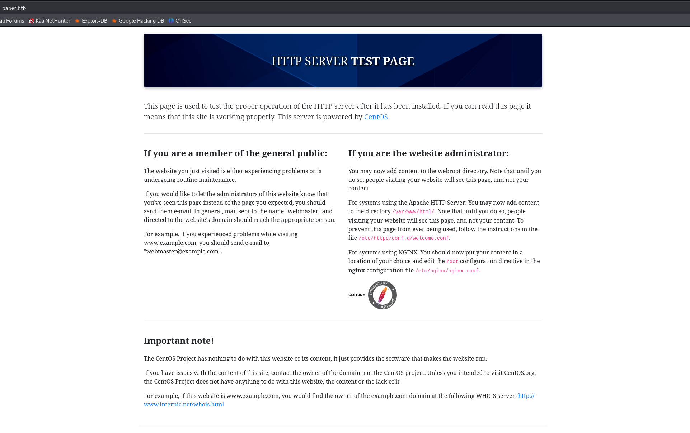
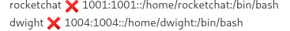
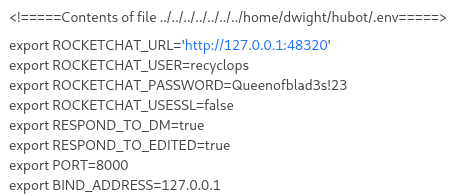
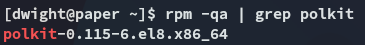

**Start 20:30 22-04-2025**

---
```
10.10.11.143
```
## Recon

### Nmap

```bash
┌──(kali㉿kali)-[~]
└─$ nmap -sC -sV -sT -T5 -vvvv -p- 10.10.11.143

PORT    STATE SERVICE  REASON  VERSION
22/tcp  open  ssh      syn-ack OpenSSH 8.0 (protocol 2.0)
80/tcp  open  http     syn-ack Apache httpd 2.4.37 ((centos) OpenSSL/1.1.1k mod_fcgid/2.3.9)
| http-methods: 
|   Supported Methods: GET POST OPTIONS HEAD TRACE
|_  Potentially risky methods: TRACE
|_http-generator: HTML Tidy for HTML5 for Linux version 5.7.28
|_http-server-header: Apache/2.4.37 (centos) OpenSSL/1.1.1k mod_fcgid/2.3.9
|_http-title: HTTP Server Test Page powered by CentOS
443/tcp open  ssl/http syn-ack Apache httpd 2.4.37 ((centos) OpenSSL/1.1.1k mod_fcgid/2.3.9)
|_ssl-date: TLS randomness does not represent time
| http-methods: 
|   Supported Methods: GET POST OPTIONS HEAD TRACE
|_  Potentially risky methods: TRACE
|_http-server-header: Apache/2.4.37 (centos) OpenSSL/1.1.1k mod_fcgid/2.3.9
commonName=localhost.localdomain/organizationName=Unspecified/countryName=US/emailAddress=root@localhost.localdomain/organizationalUnitName
```


### 80/TCP - HTTP



There really is nothing here, time for `feroxbuster` to do its thing.

Unfortunately apart from a bunch of `/manual/` endpoints we don't find anything useful, let's check `443`:


Since this didn't tell us anything I decided to check the response headers:


I found an `X-Backend-Server` header with the `office.paper` variable. I decided to add it to my `/etc/hosts` list as this was HIGHLY LIKELY a subdomain.


Correct indeed! Let's check the tech stack:


It's running **WordPress 5.2.3**, let's see if it's vulnerable.


It is vulnerable, let's see if this is what we need to find.


According to above comment it looks like it is the correct CVE, let's exploit it.


I went ahead and registered a new account via the found URL:


### LFI

This was all fun and games but I had no access to the admin panel, so I decided to check what I could get from the bot:


I was able to list files from the `/sales/` directory.

However I was *also* able to get the contents from the `/` directory.


Even better news:




Let's check out *dwight*'s `/home` directory.


Even though I had access, I unfortunately did *not* find a `.ssh` key here nor could I read the `user.txt` file yet.

However I noticed the `/hubot` directory, and checked it out:


In here I found the `.env` file which usually contains stuff developers want to hide from the rest.



Hell yeah.

```
recyclops
Queenofblad3s!23
```


When I try to log in I get the above message, but I am still able to log in:


## Foothold

Let's see if *dwight* uses the same password for SSH:


EZ PZ access.

### user.txt


Other than that I have no `sudo` privs:


## Privilege Escalation

I decide to download over `linpeas.sh` and run it.


I noticed this one which I haven't seen before amongst the suggestions, let's check it out.

Let's verify the version of `polkit` running:



I found a script that should automatically do this:


Hell yeah.

### root.txt


---

**Finished 22:07 22-04-2025**

[^Links]: [[Hack The Box]] [[OSCP Prep]]
