**Start - 19:05**

Start off with active recon:

`┌──(kali㉿kali)-[~]`
`└─$ nmap -sT -A 10.10.11.23` 
`Starting Nmap 7.94SVN ( https://nmap.org ) at 2024-07-10 18:03 IST`
`Nmap scan report for 10.10.11.23`
`Host is up (0.025s latency).`
`Not shown: 998 closed tcp ports (conn-refused)`
`PORT   STATE SERVICE VERSION`
`22/tcp open  ssh     OpenSSH 8.9p1 Ubuntu 3ubuntu0.10 (Ubuntu Linux; protocol 2.0)`
`| ssh-hostkey:` 
`|   256 e2:5c:5d:8c:47:3e:d8:72:f7:b4:80:03:49:86:6d:ef (ECDSA)`
`|_  256 1f:41:02:8e:6b:17:18:9c:a0:ac:54:23:e9:71:30:17 (ED25519)`
`80/tcp open  http    Apache httpd 2.4.52`
`|_http-title: Did not follow redirect to http://permx.htb`
`|_http-server-header: Apache/2.4.52 (Ubuntu)`
`Service Info: Host: 127.0.0.1; OS: Linux; CPE: cpe:/o:linux:linux_kernel`

`Service detection performed. Please report any incorrect results at https://nmap.org/submit/ .`
`Nmap done: 1 IP address (1 host up) scanned in 7.54 seconds`

Check Searchsploit for vulnerabilities:

`┌──(kali㉿kali)-[~]`
`└─$ searchsploit OpenSSH 8`
`------------------------------------------------------------------------------------------- ---------------------------------`
 `Exploit Title                                                                             |  Path`
`------------------------------------------------------------------------------------------- ---------------------------------`
`Debian OpenSSH - (Authenticated) Remote SELinux Privilege Escalation                       | linux/remote/6094.txt`
`glibc-2.2 / openssh-2.3.0p1 / glibc 2.1.9x - File Read                                     | linux/local/258.sh`
`Novell Netware 6.5 - OpenSSH Remote Stack Overflow                                         | novell/dos/14866.txt`
`OpenSSH 1.2 - '.scp' File Create/Overwrite                                                 | linux/remote/20253.sh`
`OpenSSH 2.3 < 7.7 - Username Enumeration                                                   | linux/remote/45233.py`
`OpenSSH 2.3 < 7.7 - Username Enumeration (PoC)                                             | linux/remote/45210.py`
`OpenSSH 2.x/3.0.1/3.0.2 - Channel Code Off-by-One                                          | unix/remote/21314.txt`
`OpenSSH 2.x/3.x - Kerberos 4 TGT/AFS Token Buffer Overflow                                 | linux/remote/21402.txt`
`OpenSSH 3.x - Challenge-Response Buffer Overflow (1)                                       | unix/remote/21578.txt`
`OpenSSH 3.x - Challenge-Response Buffer Overflow (2)                                       | unix/remote/21579.txt`
`OpenSSH 6.8 < 6.9 - 'PTY' Local Privilege Escalation                                       | linux/local/41173.c`
`OpenSSH 7.2 - Denial of Service                                                            | linux/dos/40888.py`
`OpenSSH 7.2p1 - (Authenticated) xauth Command Injection                                    | multiple/remote/39569.py`
`OpenSSH < 6.6 SFTP (x64) - Command Execution                                               | linux_x86-64/remote/45000.c`
`OpenSSH < 6.6 SFTP - Command Execution                                                     | linux/remote/45001.py`
`OpenSSH < 7.7 - User Enumeration (2)                                                       | linux/remote/45939.py`
`OpenSSH SCP Client - Write Arbitrary Files                                                 | multiple/remote/46516.py`
`OpenSSHd 7.2p2 - Username Enumeration                                                      | linux/remote/40113.txt`
`SSH (x2) - Remote Command Execution                                                        | multiple/remote/349.txt`
`------------------------------------------------------------------------------------------- ---------------------------------`
`Shellcodes: No Results`

Nothing of particular use since we're using OpenSSH 8.9.

Let's check port 80, it's an open `HTTP` port running Apache.

`┌──(kali㉿kali)-[~]`
`└─$ searchsploit Apache 2.4`
`------------------------------------------------------------------------------------------- ---------------------------------`
 `Exploit Title                                                                             |  Path`
`------------------------------------------------------------------------------------------- ---------------------------------`
`Apache + PHP < 5.3.12 / < 5.4.2 - cgi-bin Remote Code Execution                            | php/remote/29290.c`
`Apache + PHP < 5.3.12 / < 5.4.2 - Remote Code Execution + Scanner                          | php/remote/29316.py`
`Apache 2.2.4 - 413 Error HTTP Request Method Cross-Site Scripting                          | unix/remote/30835.sh`
`Apache 2.4.17 - Denial of Service                                                          | windows/dos/39037.php`
`Apache 2.4.17 < 2.4.38 - 'apache2ctl graceful' 'logrotate' Local Privilege Escalation      | linux/local/46676.php`
`Apache 2.4.23 mod_http2 - Denial of Service                                                | linux/dos/40909.py`
`Apache 2.4.7 + PHP 7.0.2 - 'openssl_seal()' Uninitialized Memory Code Execution            | php/remote/40142.php`
`Apache 2.4.7 mod_status - Scoreboard Handling Race Condition                               | linux/dos/34133.txt`
`Apache 2.4.x - Buffer Overflow                                                             | multiple/webapps/51193.py`
`Apache < 2.2.34 / < 2.4.27 - OPTIONS Memory Leak                                           | linux/webapps/42745.py`
`Apache CXF < 2.5.10/2.6.7/2.7.4 - Denial of Service                                        | multiple/dos/26710.txt`
`Apache HTTP Server 2.4.49 - Path Traversal & Remote Code Execution (RCE)                   | multiple/webapps/50383.sh`
`Apache HTTP Server 2.4.50 - Path Traversal & Remote Code Execution (RCE)                   | multiple/webapps/50406.sh`
`Apache HTTP Server 2.4.50 - Remote Code Execution (RCE) (2)                                | multiple/webapps/50446.sh`
`Apache HTTP Server 2.4.50 - Remote Code Execution (RCE) (3)                                | multiple/webapps/50512.py`
`Apache mod_ssl < 2.8.7 OpenSSL - 'OpenFuck.c' Remote Buffer Overflow                       | unix/remote/21671.c`
`Apache mod_ssl < 2.8.7 OpenSSL - 'OpenFuckV2.c' Remote Buffer Overflow (1)                 | unix/remote/764.c`
`Apache mod_ssl < 2.8.7 OpenSSL - 'OpenFuckV2.c' Remote Buffer Overflow (2)                 | unix/remote/47080.c`
`Apache OpenMeetings 1.9.x < 3.1.0 - '.ZIP' File Directory Traversal                        | linux/webapps/39642.txt`
`Apache Shiro 1.2.4 - Cookie RememberME Deserial RCE (Metasploit)                           | multiple/remote/48410.rb`
`Apache Tomcat 3.2.3/3.2.4 - 'RealPath.jsp' Information Disclosuree                         | multiple/remote/21492.txt`
`Apache Tomcat 3.2.3/3.2.4 - 'Source.jsp' Information Disclosure                            | multiple/remote/21490.txt`
`Apache Tomcat 3.2.3/3.2.4 - Example Files Web Root Full Path Disclosure                    | multiple/remote/21491.txt`
`Apache Tomcat < 5.5.17 - Remote Directory Listing                                          | multiple/remote/2061.txt`
`Apache Tomcat < 6.0.18 - 'utf8' Directory Traversal                                        | unix/remote/14489.c`
`Apache Tomcat < 6.0.18 - 'utf8' Directory Traversal (PoC)                                  | multiple/remote/6229.txt`
`Apache Tomcat < 9.0.1 (Beta) / < 8.5.23 / < 8.0.47 / < 7.0.8 - JSP Upload Bypass / Remote  | jsp/webapps/42966.py`
`Apache Tomcat < 9.0.1 (Beta) / < 8.5.23 / < 8.0.47 / < 7.0.8 - JSP Upload Bypass / Remote  | windows/webapps/42953.txt`
`Apache Xerces-C XML Parser < 3.1.2 - Denial of Service (PoC)                               | linux/dos/36906.txt`
`Webfroot Shoutbox < 2.32 (Apache) - Local File Inclusion / Remote Code Execution           | linux/remote/34.pl`
`------------------------------------------------------------------------------------------- ---------------------------------`
`Shellcodes: No Results`

Nothing really that stands out either.

After adding `permx.htb` to our `/etc/hosts` file, we are able to access the website like so:

On the `permx.htb/contact.html` page we find the following:

Here we see that the contact form appears to be inactive. We are told that we can make a functional form using `Ajax & PHP` . After following the **Download** link we do not find anything useful.

Time to do a directory search to see whether we can find anything useful.
We run the following to fuzz for subdomains:

`wfuzz -c --hc 400,404 -t 200 --hl 9 -w /usr/share/seclists/Discovery/DNS/subdomains-top1million-110000.txt -u http://permx.htb -H "Host: FUZZ.permx.htb"`.

If you do not have Seclists installed, just run `sudo apt install seclists`.

And we get the `lms` subdomain as a result. Add that to the `/etc/hosts` file again and we can access the website:

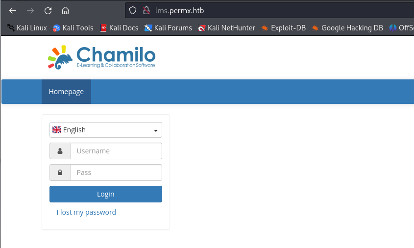

Afterwards run the following to fuzz the rest of the subdirectories:
`wfuzz -c --hc 400,404 -t 200  -w subdomains-top1million-110000.txt -u http://lms.permx.htb/FUZZ` 

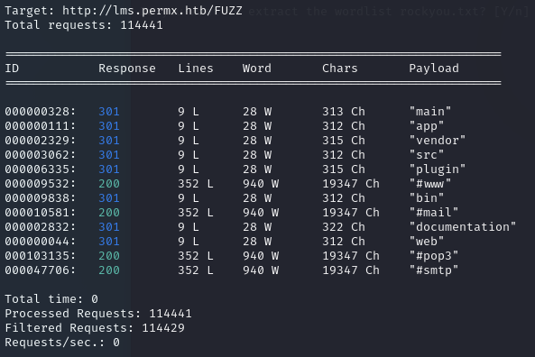

Time to exploit this site. 
We'll use the following CVE:
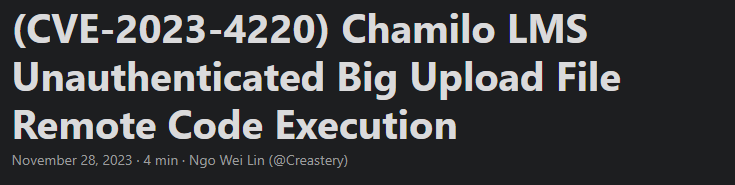

Here we need to check whether the `/main/inc/lib/javascript/bigupload/files/` directory allows uploads and in our case it is as seen below:

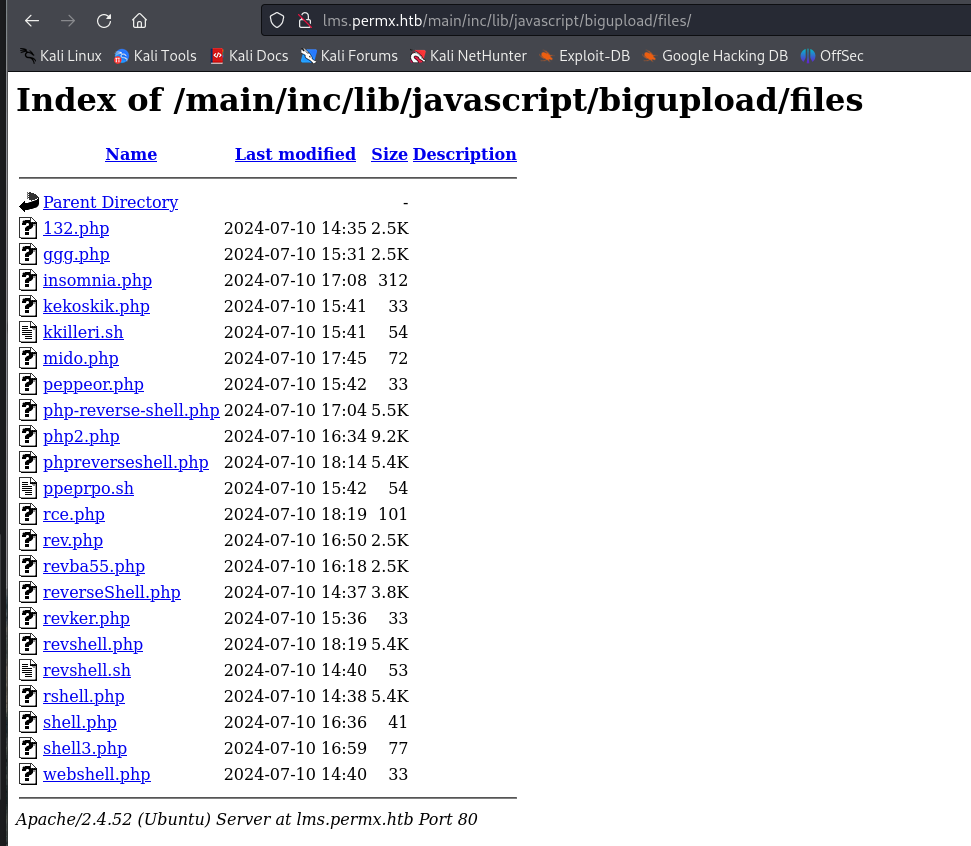

Now you have to upload any php-reverse shell of your choice like so:

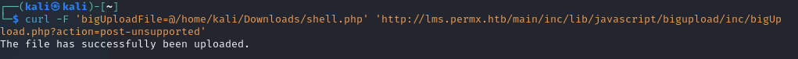

If you did everything correctly you should now get the following screen when you go to the address where you uploaded the reverse shell:

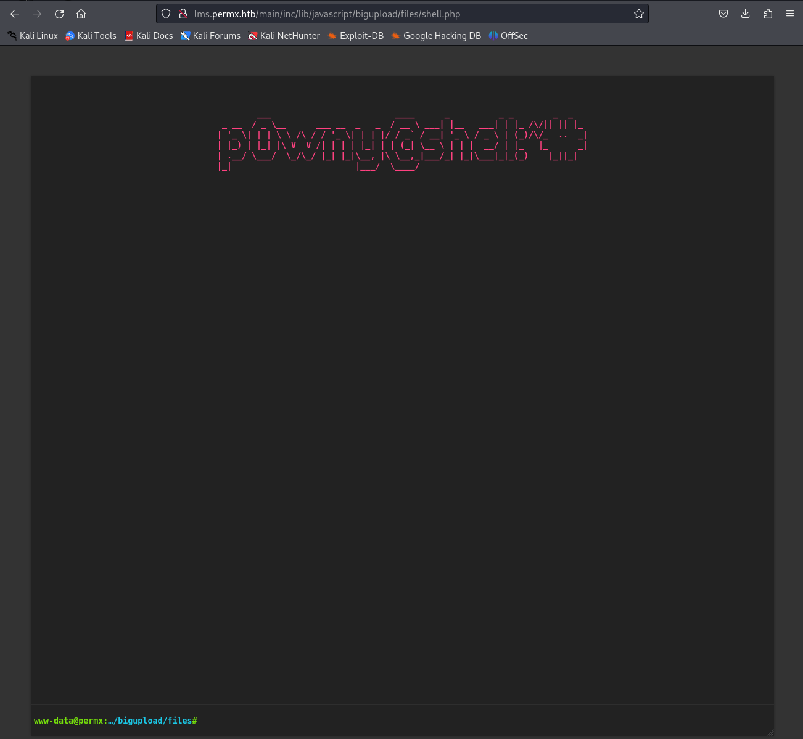

`Grep` the `db_user` and `db_password` as follows:

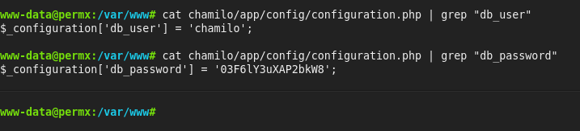

**03F6lY3uXAP2bkW8** 

Now we can use these credentials to log into `SSH`. Since we've found the following user in the `home` directory we'll use his user name:
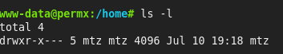

And we're in.
You'll find the `user.txt` flag in the same directory.

Now onto privilege escalation, after running `sudo -l` to check `sudo` privileges we get the following output:
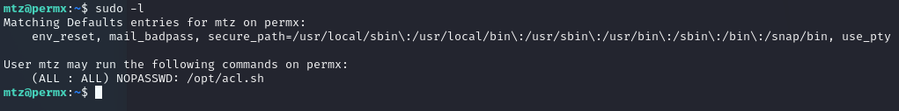

We'll need to modify the sudoers file to grant full privileges. First off run the following commands:
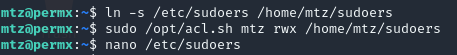

In the ==[sudoers](Linux%20Privilege%20Escalation.md#Sudoers)== file modify the last line from `mtz ALL=(ALL:ALL) NOPASSWD: /opt/acl.sh` to `mtz ALL=(ALL:ALL) ALL`.

Afterwards run `sudo su` and you should get `root` privileges.
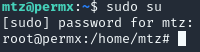

Lastly go to `/root` and `cat root.txt` 

**Finished 22:00** 

Links: [[Hack The Box]]
