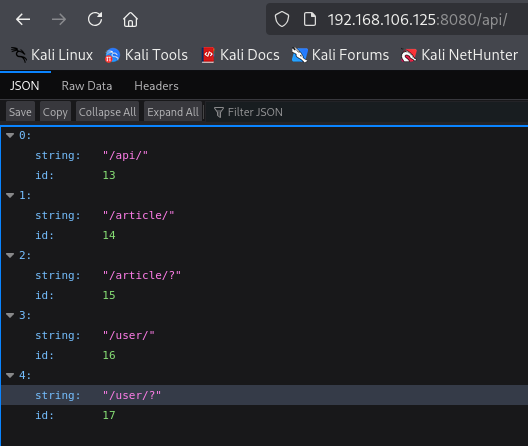

**Start 14:31 14-05-2025**

---
```
Scope:
192.168.106.125
```
## Recon

### Nmap

```bash
sudo nmap -sC -sV hunit -sT -vvvv -p- -Pn -T5 --min-rate=5000

PORT      STATE  SERVICE     REASON       VERSION
8080/tcp  open   http        syn-ack      Apache Tomcat (language: en)
|_http-title: My Haikus
| http-methods: 
|_  Supported Methods: GET HEAD OPTIONS
|_http-open-proxy: Proxy might be redirecting requests
12445/tcp open   netbios-ssn syn-ack      Samba smbd 4
18030/tcp open   http        syn-ack      Apache httpd 2.4.46 ((Unix))
|_http-title: Whack A Mole!
|_http-server-header: Apache/2.4.46 (Unix)
| http-methods: 
|   Supported Methods: OPTIONS HEAD GET POST TRACE
|_  Potentially risky methods: TRACE
43022/tcp open   ssh         syn-ack      OpenSSH 8.4 (protocol 2.0)
```

### 8080/TCP - HTTP


When we check the source code we find the following commented out:




We head on deeper into the rabbit hole:


### Hydra

I go on to brute force the login using `hydra`:


We get our user, let's log in!

## Foothold
### Shell as dademola

```
dademola
ExplainSlowQuest110
```


### local.txt


## Privilege Escalation
### Enumeration

For whatever reason I was not able to transfer files even after multiple attempts so I did my manual enum rounds:


Furthermore we also find another user present on the target:


Apparently this user has a `.ssh` directory as well as another interesting one, let's grab the `.ssh` key if its present and log in:

### Git


Since we are able to do the above we should just as well be able to clone the repo locally and modify the contents, then `push` the new commit to the target.

Let's set it up:


We should now modify the `backup.sh` file and make it contain a reverse shell.


We can now set up a listener and wait for the *root* shell to pop.

:::caution
DON'T FORGET TO MAKE THE BINARY EXECUTABLE OR IT WON'T WORK!!!!
:::


### proof.txt


---

**Finished 16:46 14-05-2025**

[^Links]: [[OSCP Prep]]