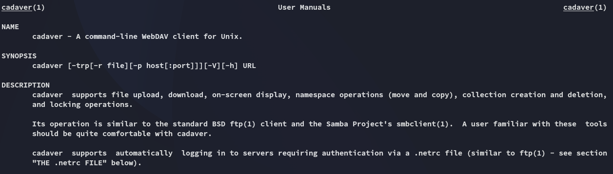

**Start 08:10 23-05-2025**

---
```
Scope:
192.168.156.122
```
# Recon

## Nmap

```bash
sudo nmap -sC -sV -sT -vvvv -p- -Pn -T5 --min-rate=5000 hutch

PORT      STATE SERVICE       REASON  VERSION
53/tcp    open  domain        syn-ack Simple DNS Plus
80/tcp    open  http          syn-ack Microsoft IIS httpd 10.0
|_http-title: IIS Windows Server
| http-methods: 
|   Supported Methods: OPTIONS TRACE GET HEAD POST COPY PROPFIND DELETE MOVE PROPPATCH MKCOL LOCK UNLOCK PUT
|_  Potentially risky methods: TRACE COPY PROPFIND DELETE MOVE PROPPATCH MKCOL LOCK UNLOCK PUT
| http-webdav-scan: 
|   Allowed Methods: OPTIONS, TRACE, GET, HEAD, POST, COPY, PROPFIND, DELETE, MOVE, PROPPATCH, MKCOL, LOCK, UNLOCK
|   WebDAV type: Unknown
|   Public Options: OPTIONS, TRACE, GET, HEAD, POST, PROPFIND, PROPPATCH, MKCOL, PUT, DELETE, COPY, MOVE, LOCK, UNLOCK
|   Server Type: Microsoft-IIS/10.0
|_  Server Date: Fri, 23 May 2025 06:12:38 GMT
|_http-server-header: Microsoft-IIS/10.0
88/tcp    open  kerberos-sec  syn-ack Microsoft Windows Kerberos (server time: 2025-05-23 06:11:50Z)
135/tcp   open  msrpc         syn-ack Microsoft Windows RPC
139/tcp   open  netbios-ssn   syn-ack Microsoft Windows netbios-ssn
389/tcp   open  ldap          syn-ack Microsoft Windows Active Directory LDAP (Domain: hutch.offsec0., Site: Default-First-Site-Name)
445/tcp   open  microsoft-ds? syn-ack
464/tcp   open  kpasswd5?     syn-ack
593/tcp   open  ncacn_http    syn-ack Microsoft Windows RPC over HTTP 1.0
636/tcp   open  tcpwrapped    syn-ack
3268/tcp  open  ldap          syn-ack Microsoft Windows Active Directory LDAP (Domain: hutch.offsec0., Site: Default-First-Site-Name)
3269/tcp  open  tcpwrapped    syn-ack
5985/tcp  open  http          syn-ack Microsoft HTTPAPI httpd 2.0 (SSDP/UPnP)
|_http-title: Not Found
|_http-server-header: Microsoft-HTTPAPI/2.0
9389/tcp  open  mc-nmf        syn-ack .NET Message Framing
49666/tcp open  msrpc         syn-ack Microsoft Windows RPC
49668/tcp open  msrpc         syn-ack Microsoft Windows RPC
49673/tcp open  ncacn_http    syn-ack Microsoft Windows RPC over HTTP 1.0
49674/tcp open  msrpc         syn-ack Microsoft Windows RPC
49676/tcp open  msrpc         syn-ack Microsoft Windows RPC
```

port `80` was a bust for now and so was port `445`, so I went ahead and enumerated `ldap 389`.

## 389/TCP - LDAP

We can enumerate `ldap` using the `nmap nse` scripts:

```bash
nmap -Pn -sV --script "ldap* and not brute" hutch.offsec

389/tcp  open  ldap          Microsoft Windows Active Directory LDAP (Domain: hutch.offsec, Site: Default-First-Site-Name)
| ldap-rootdse: 
| LDAP Results
|   <ROOT>
|       domainFunctionality: 7
|       forestFunctionality: 7
|       domainControllerFunctionality: 7
|       rootDomainNamingContext: DC=hutch,DC=offsec
|       ldapServiceName: hutch.offsec:hutchdc$@HUTCH.OFFSEC
|       isGlobalCatalogReady: TRUE
|       supportedSASLMechanisms: GSSAPI
|       supportedSASLMechanisms: GSS-SPNEGO
|       supportedSASLMechanisms: EXTERNAL
|       supportedSASLMechanisms: DIGEST-MD5
<SNIP>
| ldap-search: 
|   Context: DC=hutch,DC=offsec
|     dn: DC=hutch,DC=offsec
|     dn: CN=Administrator,CN=Users,DC=hutch,DC=offsec
|     dn: CN=Guest,CN=Users,DC=hutch,DC=offsec
|         objectClass: top
|         objectClass: person
|         objectClass: organizationalPerson
|         objectClass: user
|         cn: Guest
|         description: Built-in account for guest access to the computer/domain
```

We can further enumerate using `ldapsearch`.

### ldapsearch

For our `ldapsearch` command we will need the domain name which we found using `nmap`:

```bash
DC=hutch,DC=offsec
```

As for the rest of the command we will specify the host URI:

```bash
ldapsearch -v -x -b "DC=hutch,DC=offsec" -H "ldap://hutch.offsec" "(objectclass=*)"
```


Scrolling further down in our results we start finding users on the domain:


Fortunately for us (unfortunately for the user) we find a description of *Freddy* where his cleartext password is readable:


Further down we find his account name:


```
fmcsorley
CrabSharkJellyfish192
```

>[!note] 
>I also went ahead and added other found accounts to the `users.txt` list.

### Password Spray

Having found a valid set of creds I of course start spraying the creds right away:


This didn't seem remotely interesting, time to get started with `BloodHound`.

## BloodHound


I ingest all the files and start mapping.


This looks appealing.

>[!note]
>I got a little stuck here and found out that now that I have creds I can use `cadaver` to upload a `webshell.aspx` file to port `80` and gain access via it.

## 80/TCP - HTTP
### Cadaver




What a handy little tool! Let's give ourselves a reverse shell.

# Foothold
## Reverse shell

I used the following payload to get myself a shell:


Great we have the necessary privs to escalate, but first lets get the flag.

### local.txt


# Privilege Escalation
## SeImpersonatePrivilege

>[!info]
>At this point I just like to transfer fucking everything and then see which one works.


>[!warning]
>Files would get deleted UNLESS I was inside the `C:\Users\Public\Downloaded` folder, here they didnt get auto deleted and I could easily get a rev shell.


### proof.txt


>[!summary]
>I learned how to use the following 2 new tools:
>- ldapsearch
>- cadaver
>Super handy and really fun way of getting access.

---

**Finished 11:41 23-05-2025**

[^Links]: [[OSCP Prep]]

#cadaver #ldapsearch