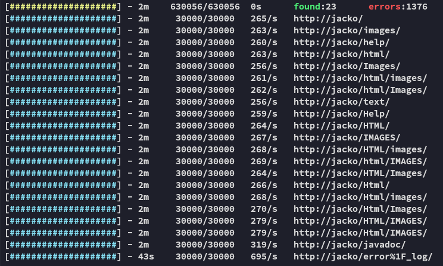
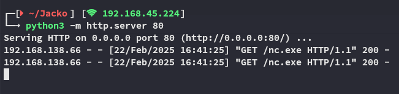
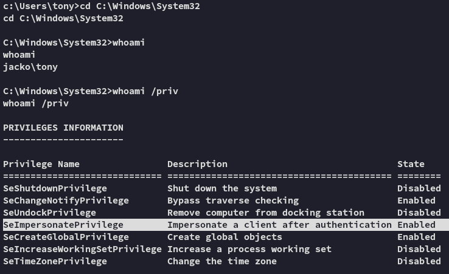

**Start 15:50 22-02-2025**

---
```
Scope:
192.168.138.66
```
# Recon

## Nmap

```bash
sudo nmap -sC -sV -vvvv -Pn -p- jacko -sT -T5 --min-rate=5000

PORT      STATE    SERVICE       REASON      VERSION
80/tcp    open     http          syn-ack     Microsoft IIS httpd 10.0
| http-methods: 
|   Supported Methods: OPTIONS TRACE GET HEAD POST
|_  Potentially risky methods: TRACE
|_http-title: H2 Database Engine (redirect)
135/tcp   open     msrpc         syn-ack     Microsoft Windows RPC
139/tcp   open     netbios-ssn   syn-ack     Microsoft Windows netbios-ssn
445/tcp   open     microsoft-ds? syn-ack
5040/tcp  open     unknown       syn-ack
7680/tcp  open     pando-pub?    syn-ack
8082/tcp  open     http          syn-ack     H2 database http console
|_http-title: H2 Console
|_http-favicon: Unknown favicon MD5: D2FBC2E4FB758DC8672CDEFB4D924540
| http-methods: 
|_  Supported Methods: GET POST
9092/tcp  open     XmlIpcRegSvc? syn-ack
49664/tcp open     unknown       syn-ack
49665/tcp open     unknown       syn-ack
49666/tcp open     unknown       syn-ack
49667/tcp open     unknown       syn-ack
49668/tcp open     unknown       syn-ack
49669/tcp open     unknown       syn-ack
Service Info: OS: Windows; CPE: cpe:/o:microsoft:windows
```


## 80/TCP - HTTP




Not much here, moving on


## 135/TCP - RPC


Nothing.


## 445/TCP - SMB


Moving on.


## 8082/TCP - HTTP


Let's see what this is about.


## Automatic Exploitation - FAIL


Could this be what we're looking for?


Nice!

Problem here was that, eventhough I had RCE, I didn't know what commands to issue:


I tried with 2 PoC's, and with both of them I had no clue why they wouldn't take commands. Let's take a deep dive on this software and how to take advantage.


## Manual Exploitation

It appears that neither of these payloads will do what we want it to, so we will have to exploit it manually instead.

For this we will be using the following found PoC as a guideline:


This PoC mentions first to **Write native library**, which we will copy paste as follows:


Next up we press **Clear** and paste the following part:


Now that the **Alias** is created we copy paste the last step, which executes the `whoami` command:


This returns the *jacko\tony* user under which the service is running.


# Foothold

Now comes the part where we gain our foothold. We will first upload the `nc.exe` binary so we can then create a reverse shell.




>[!warning]
>Issue the command *EXACTLY* as above or you will run into a bunch of errors!


That is extremely weird and honestly the first time ever I've had this issue? Let's change to our home directory.


What the hell is this...

Maybe if we switch on over to `C:\Windows\System32` the binary will run?



It did indeed and holy moly check out these sweet privs!


## local.txt

Anyways:


>[!note]
>Sorry OffSec, can't provide an ip address if `ipconfig` doesn't work.


# Privilege Escalation

## Potatoes - FAIL

Let's download over potatoes!


>[!fail]
>Quite unfortunate, let's try something else.

We will have to issue the following command if we wish to achieve anything:

```powershell
set PATH=%PATH%;C:\windows\system32;C:\windows;C:\windows\System32\Wbem;C:\windows\System32\WindowsPowerShell\v1.0\;C:\windows\System32\OpenSSH\;C:\Program Files\dotnet\
```

This sets the PATH environment variables, which let's us finally issue powershell commands:


I tried out `sweetpotato.exe` but this just kept hanging:


Let's instead try out `msfconsole`, see if that will work instead.


## Metasploit

We create our **meterpreter** payload (since it is way more stable, hopefully it'll work).


>[!success]
>First step is complete, let's launch `msfconsole`.


Let's launch the payload:


We now want to run `getsystem` right away so we can escalate our privs.


Well this just went way easier...


## proof.txt


>[!summary]
>The problem with this box wasn't the fact that it was hard, just that it was super annoying.
>None of the potatoes would fire which automatically forced me to use `msfconsole` to save any more time dwindling.
>Other than that it was for sure *intermediate*.

---

**Finished 17:16 22-02-2025**

[^Links]:  [[OSCP Prep]]

#metasploit #H2database 