**Start 08:26 23-02-2025**

---
```
Scope:
192.168.246.45
```
## Recon

### Nmap

```bash
sudo nmap -sC -sV -vvvv -Pn -p- kevin -sT -T5 --min-rate=5000

PORT      STATE    SERVICE       REASON      VERSION
80/tcp    open     http          syn-ack     GoAhead WebServer
|_http-server-header: GoAhead-Webs
| http-title: HP Power Manager
|_Requested resource was http://kevin/index.asp
| http-methods: 
|_  Supported Methods: GET HEAD
135/tcp   open     msrpc         syn-ack     Microsoft Windows RPC
139/tcp   open     netbios-ssn   syn-ack     Microsoft Windows netbios-ssn
445/tcp   open     microsoft-ds  syn-ack     Windows 7 Ultimate N 7600 microsoft-ds (workgroup: WORKGROUP)
3389/tcp  open     ms-wbt-server syn-ack     Microsoft Terminal Service
|_ssl-date: 2025-02-23T07:31:48+00:00; -1s from scanner time.
| rdp-ntlm-info: 
|   Target_Name: KEVIN
|   NetBIOS_Domain_Name: KEVIN
|   NetBIOS_Computer_Name: KEVIN
|   DNS_Domain_Name: kevin
|   DNS_Computer_Name: kevin
|   Product_Version: 6.1.7600
|_  System_Time: 2025-02-23T07:31:40+00:00
| ssl-cert: Subject: commonName=kevin
| Issuer: commonName=kevin
3573/tcp  open     tag-ups-1?    syn-ack
49152/tcp open     msrpc         syn-ack     Microsoft Windows RPC
49153/tcp open     msrpc         syn-ack     Microsoft Windows RPC
49154/tcp open     msrpc         syn-ack     Microsoft Windows RPC
49155/tcp open     msrpc         syn-ack     Microsoft Windows RPC
49158/tcp open     msrpc         syn-ack     Microsoft Windows RPC
49160/tcp open     msrpc         syn-ack     Microsoft Windows RPC
Service Info: OS: Windows; CPE: cpe:/o:microsoft:windows

Host script results:
| smb2-time: 
|   date: 2025-02-23T07:31:40
|_  start_date: 2025-02-23T07:29:34
| smb-security-mode: 
|   account_used: guest
|   authentication_level: user
|   challenge_response: supported
|_  message_signing: disabled (dangerous, but default)
|_clock-skew: mean: 1h35m58s, deviation: 3h34m39s, median: -1s
| p2p-conficker: 
|   Checking for Conficker.C or higher...
|   Check 1 (port 56863/tcp): CLEAN (Couldn't connect)
|   Check 2 (port 58031/tcp): CLEAN (Couldn't connect)
|   Check 3 (port 6220/udp): CLEAN (Timeout)
|   Check 4 (port 56658/udp): CLEAN (Failed to receive data)
|_  0/4 checks are positive: Host is CLEAN or ports are blocked
| nbstat: NetBIOS name: KEVIN, NetBIOS user: <unknown>, NetBIOS MAC: 00:50:56:9e:4c:ee (VMware)
| Names:
|   KEVIN<00>            Flags: <unique><active>
|   WORKGROUP<00>        Flags: <group><active>
|   WORKGROUP<1e>        Flags: <group><active>
|   KEVIN<20>            Flags: <unique><active>
|   WORKGROUP<1d>        Flags: <unique><active>
|   \x01\x02__MSBROWSE__\x02<01>  Flags: <group><active>
| Statistics:
|   00:50:56:9e:4c:ee:00:00:00:00:00:00:00:00:00:00:00
|   00:00:00:00:00:00:00:00:00:00:00:00:00:00:00:00:00
|_  00:00:00:00:00:00:00:00:00:00:00:00:00:00
| smb2-security-mode: 
|   2:1:0: 
|_    Message signing enabled but not required
| smb-os-discovery: 
|   OS: Windows 7 Ultimate N 7600 (Windows 7 Ultimate N 6.1)
|   OS CPE: cpe:/o:microsoft:windows_7::-
|   Computer name: kevin
|   NetBIOS computer name: KEVIN\x00
|   Workgroup: WORKGROUP\x00
|_  System time: 2025-02-22T23:31:40-08:00
```

Let's check it out.


### 80/TCP - HTTP

I was able to log in using default creds `admin - admin`

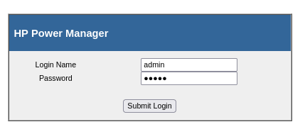

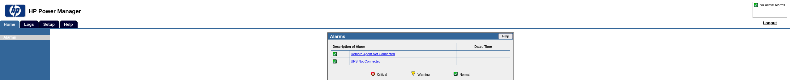

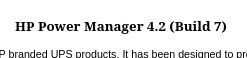


## Metasploit

I'll boot up metasploit for this one.

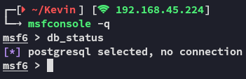


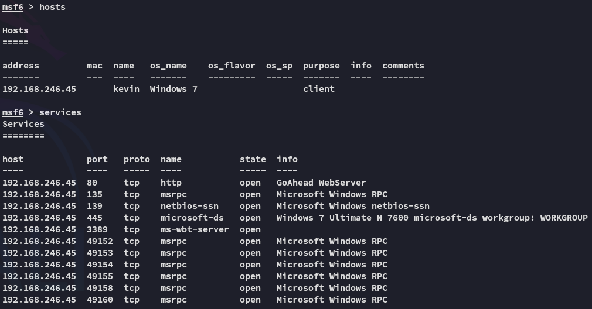


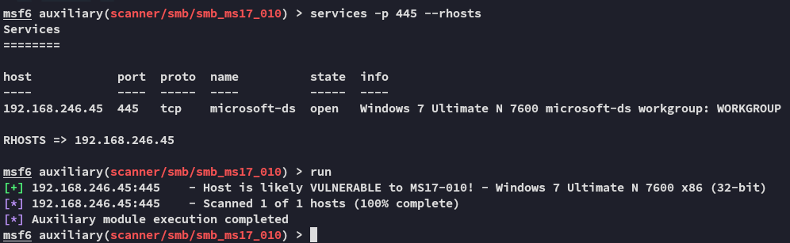

Always worth a try, especially with **Windows 7**

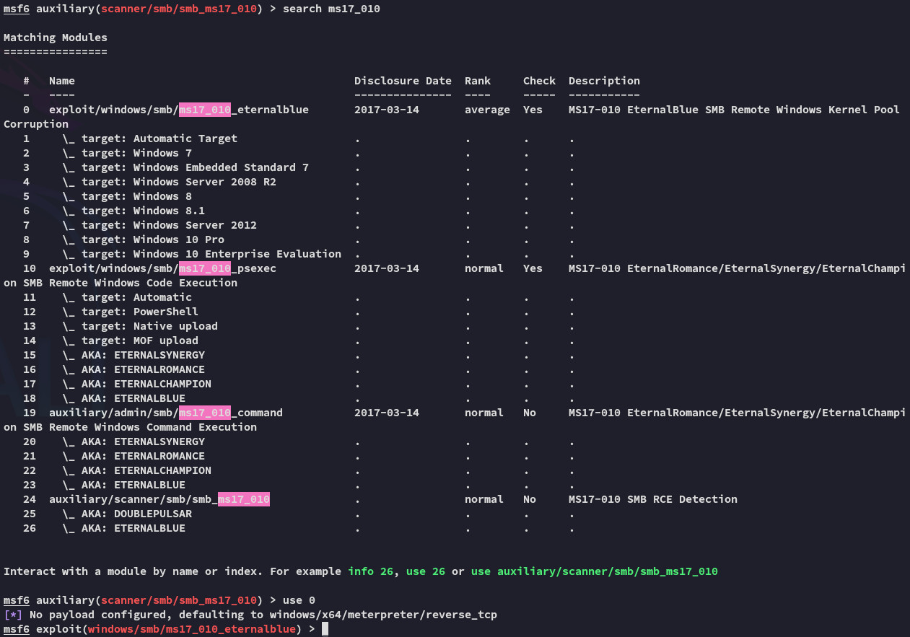

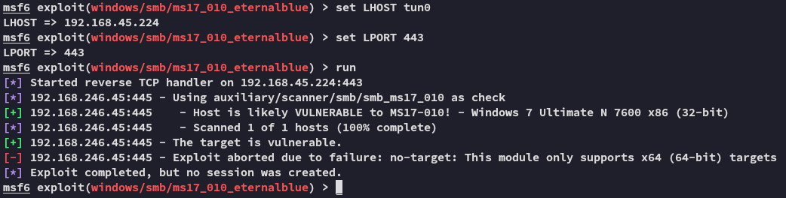

Unfortunate.

Let's look for **HP Power Manager**

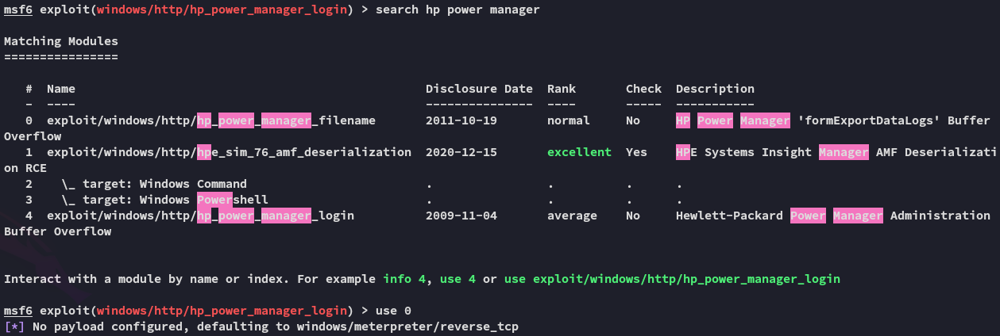

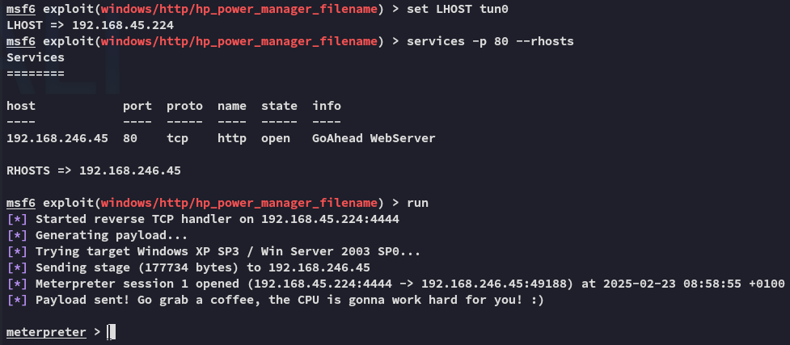


## Foothold

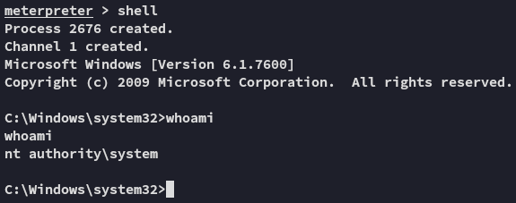


### proof.txt

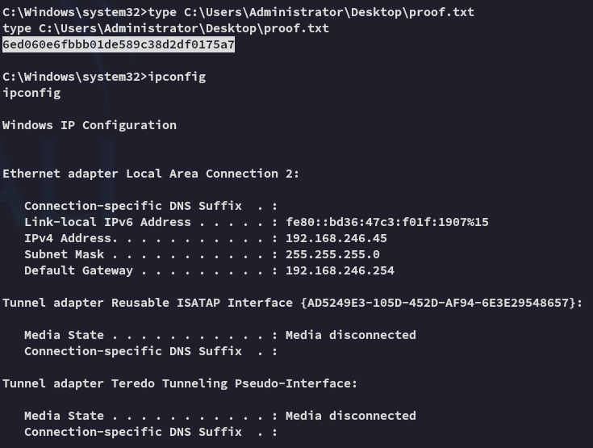

---

**Finished 09:00 23-02-2025**

[^Links]:  [[OSCP Prep]]
