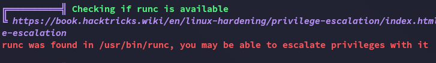

**Start 10:22 08-05-2025**

---
```
Scope:
192.168.145.24
```
# Recon

## Nmap

```bash
sudo nmap -sC -sV levram -sT -T5 --min-rate=5000 -Pn -vvvv -p-

PORT     STATE SERVICE REASON  VERSION
22/tcp   open  ssh     syn-ack OpenSSH 8.9p1 Ubuntu 3 (Ubuntu Linux; protocol 2.0)
8000/tcp open  http    syn-ack WSGIServer 0.2 (Python 3.10.6)
|_http-title: Gerapy
|_http-cors: GET POST PUT DELETE OPTIONS PATCH
| http-methods: 
|_  Supported Methods: GET OPTIONS
|_http-server-header: WSGIServer/0.2 CPython/3.10.6
Service Info: OS: Linux; CPE: cpe:/o:linux:linux_kernel
```

## 8000/TCP - HTTP


I ran `feroxbuster` and got the following out of it:


I was able to log in using `admin - admin`:


From here I clicked on the top right on **View Site** where I was transferred to another login screen of **Gerapy**, here I yet again successfully logged in using the same creds.


I found a version and decided to look up any exploits.


Great!

I tried manually testing for exploitation as well however:


This connected back to me but didn't work.

Then it clicked with me:


I tried goofing around some more with RFI but gave up and went with the ready made exploit.

# Foothold
## PoC

Pretty straightforward stuff, since we already created a project we didn't have to do anything:


### local.txt


## Enumeration





Hell yeah

# Privilege Escalation


## proof.txt


---

**Finished 11:02 08-05-2025**

[^Links]: [[OSCP Prep]]

#cap_setuid #CVE 
