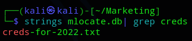

**Start 13:03 05-01-2025**

---
```
Scope:
192.168.195.225
```
# Recon

## Nmap

```bash
sudo nmap -sC -sV -oN nmap 192.168.195.225 -T5 -vvvv --min-rate=5000 -sT -p-

PORT   STATE SERVICE REASON  VERSION
22/tcp open  ssh     syn-ack OpenSSH 8.2p1 Ubuntu 4ubuntu0.5 (Ubuntu Linux; protocol 2.0)
80/tcp open  http    syn-ack Apache httpd 2.4.41 ((Ubuntu))
| http-methods: 
|_  Supported Methods: GET POST OPTIONS HEAD
|_http-server-header: Apache/2.4.41 (Ubuntu)
|_http-title: marketing.pg - Digital Marketing for you!
Service Info: OS: Linux; CPE: cpe:/o:linux:linux_kernel
```

I add the host to my `/etc/hosts` file and get to work.


## Gobuster

```bash
gobuster dir -u http://marketing.pg -w /usr/share/seclists/Discovery/Web-Content/directory-list-2.3-small.txt -x txt,php,config,zip,pdf
```

This yielded the `/old` endpoint which looked exactly the same as the current one.


*Except* for this part:


Here we could click the link and check it out. Upon clicking it we get redirected:


I then reran gobuster in order to enumerate the new domain.

```bash
gobuster dir -u http://customers-survey.marketing.pg -w /usr/share/seclists/Discovery/Web-Content/directory-list-2.3-small.txt -x txt,php,config,zip,pdf
```

This yielded significantly more results.


# Initial Foothold

## 80/TCP - HTTP

The main page had nothing significant but I found some LIKELY user data from the `/about-us.html` endpoint.


We can go ahead and enumerate whether these users exist on SSH and try to log in with a password list using `hydra`.


While Hydra was running I checked out the new domain again.

>[!note]
>Hydra got no results.


From here (according to our gobuster enumeration) we can head to `/admin` for the login page.


I looked for **LimeSurvey default passwords** and found a link:


```
admin - password
```


It worked!

But more importantly:


While uncertain if it would work I did find a PoC that could give us RCE:


Let's check the exploit and modify it.

The author has a GitHub page for the PoC where they explain the steps in detail:


>[!info]
>I tried the automatic exploit but it wouldn't fire, instead I tried the manual approach.


I then used the plugin upload to upload the zip file:


We could now go ahead and start it up.


Here we got 2 users, *m.sander* and *t.miller*.


We need to log in as t.miller in order to `cat` the `local.txt` file.


## Enumeration

In order to gain privileges I downloaded linpeas and ran it. The first thing that popped up was:


Then upon further analyzing I also found the following noteworthy stuff:


Bingo!
Let's check the file:


```
limesurvey_user
EzPwz2022_dev1$$23!!
```

I could now go ahead and access the **MySQL** server.


## MySQL


```
admin
$2y$10$QxdVgZGY9odLkWsUYF7dNOkI.STdeEWnUiUse/9rkI.lg7T3QI5UG
```


Let's crack it:

```bash
hashcat -m 3200 sql.hash /usr/share/wordlists/rockyou.txt -r /usr/share/hashcat/rules/best64.rule --force
```


Yeah it's the same password as previously.

>[!note]
>At this point I figured to try out logging in with the MySQL password into `t.miller`'s account.


### local.txt


Ez PZ. Let's upgrade our shell to a SSH shell.


# Privilege Escalation

I enumerated the environment once more using `sudo -l` and found the following:


We can run `/usr/bin/sync.sh` as *m.sander*. 

>[!info]
>This is just a script that compares *m.sander*'s notes in his personal folder, since we cannot access it we need to find something else.

After some enumeration using `id` I found out we're part of the `mlocate` group.


Accordingly I looked for any files matching this description:


Nothing in the cron job.

I checked the `mlocate.db` file but that is hugeeee, meaning we might be able to grep it.

>[!note]
>I was in fact *NOT* able to grep it.

I went ahead and downloaded the file over using `scp`:

```bash
scp t.miller@192.168.195.225:/home/t.miller/mlocate.db mlocate.db
```

Finally after a long while I found something that looked a bit useful:



>[!danger]
>Only with the help of a walkthrough was I able to figure out wtf I was supposed to from here.

I issued the following commands to create a **Symlink** and then used the binary to compare the two:


Now we can try to `su` to michael's account:


After trying out all three the last one worked.


Thank god we had ALL permissions.


### proof.txt


>[!summary]
>This box sucked, I had no idea how I would've solved the privesc part by myself.

---

**Finished 17:44 05-01-2025**

[^Links]:  [[OSCP Prep]]

#enumeration #priv-esc #mlocate #gobuster #LimeSurvey #MySQL 
