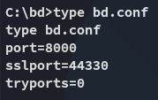

**Start 13:22 15-05-2025**

---
```
Scope:
192.168.169.127
```
# Recon

## Nmap

```bash
sudo nmap -sC -sV medjed -sT -vvvv -p- -Pn -T5 --min-rate=5000

PORT      STATE SERVICE       REASON  VERSION
135/tcp   open  msrpc         syn-ack Microsoft Windows RPC
139/tcp   open  netbios-ssn   syn-ack Microsoft Windows netbios-ssn
445/tcp   open  microsoft-ds? syn-ack
3306/tcp  open  mysql         syn-ack MariaDB 10.3.24 or later (unauthorized)
5040/tcp  open  unknown       syn-ack
8000/tcp  open  http-alt      syn-ack BarracudaServer.com (Windows)
|_http-server-header: BarracudaServer.com (Windows)
| http-methods: 
|   Supported Methods: OPTIONS GET HEAD PROPFIND PUT COPY DELETE MOVE MKCOL PROPPATCH LOCK UNLOCK POST
|_  Potentially risky methods: PROPFIND PUT COPY DELETE MOVE MKCOL PROPPATCH LOCK UNLOCK
|_http-favicon: Unknown favicon MD5: FDF624762222B41E2767954032B6F1FF
|_http-open-proxy: Proxy might be redirecting requests
| fingerprint-strings: 
|   FourOhFourRequest, Socks5: 
|     HTTP/1.1 200 OK
|     Date: Thu, 15 May 2025 12:00:26 GMT
|     Server: BarracudaServer.com (Windows)
|     Connection: Close
|   GenericLines, GetRequest: 
|     HTTP/1.1 200 OK
|     Date: Thu, 15 May 2025 12:00:20 GMT
|     Server: BarracudaServer.com (Windows)
|     Connection: Close
|   HTTPOptions, RTSPRequest: 
|     HTTP/1.1 200 OK
|     Date: Thu, 15 May 2025 12:00:31 GMT
|     Server: BarracudaServer.com (Windows)
|     Connection: Close
|   SIPOptions: 
|     HTTP/1.1 400 Bad Request
|     Date: Thu, 15 May 2025 12:01:34 GMT
|     Server: BarracudaServer.com (Windows)
|     Connection: Close
|     Content-Type: text/html
|     Cache-Control: no-store, no-cache, must-revalidate, max-age=0
|_    <html><body><h1>400 Bad Request</h1>Cant parse request<p>BarracudaServer.com (Windows)</p></body></html>
|_http-title: Home
| http-webdav-scan: 
|   Server Type: BarracudaServer.com (Windows)
|   Allowed Methods: OPTIONS, GET, HEAD, PROPFIND, PUT, COPY, DELETE, MOVE, MKCOL, PROPFIND, PROPPATCH, LOCK, UNLOCK
|   WebDAV type: Unknown
|_  Server Date: Thu, 15 May 2025 12:02:53 GMT
30021/tcp open  ftp           syn-ack FileZilla ftpd 0.9.41 beta
|_ftp-bounce: bounce working!
| ftp-anon: Anonymous FTP login allowed (FTP code 230)
| -r--r--r-- 1 ftp ftp            536 Nov 03  2020 .gitignore
| drwxr-xr-x 1 ftp ftp              0 Nov 03  2020 app
| drwxr-xr-x 1 ftp ftp              0 Nov 03  2020 bin
| drwxr-xr-x 1 ftp ftp              0 Nov 03  2020 config
| -r--r--r-- 1 ftp ftp            130 Nov 03  2020 config.ru
| drwxr-xr-x 1 ftp ftp              0 Nov 03  2020 db
| -r--r--r-- 1 ftp ftp           1750 Nov 03  2020 Gemfile
| drwxr-xr-x 1 ftp ftp              0 Nov 03  2020 lib
| drwxr-xr-x 1 ftp ftp              0 Nov 03  2020 log
| -r--r--r-- 1 ftp ftp             66 Nov 03  2020 package.json
| drwxr-xr-x 1 ftp ftp              0 Nov 03  2020 public
| -r--r--r-- 1 ftp ftp            227 Nov 03  2020 Rakefile
| -r--r--r-- 1 ftp ftp            374 Nov 03  2020 README.md
| drwxr-xr-x 1 ftp ftp              0 Nov 03  2020 test
| drwxr-xr-x 1 ftp ftp              0 Nov 03  2020 tmp
|_drwxr-xr-x 1 ftp ftp              0 Nov 03  2020 vendor
| ftp-syst: 
|_  SYST: UNIX emulated by FileZilla
33033/tcp open  unknown       syn-ack
| fingerprint-strings: 
|   GenericLines: 
|     HTTP/1.1 400 Bad Request
|   GetRequest, HTTPOptions: 
|     HTTP/1.0 403 Forbidden
|     Content-Type: text/html; charset=UTF-8
|     Content-Length: 3102
|     <!DOCTYPE html>
|     <html lang="en">
|     <head>
|     <meta charset="utf-8" />
|     <title>Action Controller: Exception caught</title>
|     <style>
|     body {
|     background-color: #FAFAFA;
|     color: #333;
|     margin: 0px;
|     body, p, ol, ul, td {
|     font-family: helvetica, verdana, arial, sans-serif;
|     font-size: 13px;
|     line-height: 18px;
|     font-size: 11px;
|     white-space: pre-wrap;
|     pre.box {
|     border: 1px solid #EEE;
|     padding: 10px;
|     margin: 0px;
|     width: 958px;
|     header {
|     color: #F0F0F0;
|     background: #C52F24;
|     padding: 0.5em 1.5em;
|     margin: 0.2em 0;
|     line-height: 1.1em;
|     font-size: 2em;
|     color: #C52F24;
|     line-height: 25px;
|     .details {
|_    bord
44330/tcp open  ssl/unknown   syn-ack
| ssl-cert: Subject: commonName=server demo 1024 bits/organizationName=Real Time Logic/stateOrProvinceName=CA/countryName=US/emailAddress=ginfo@realtimelogic.com/localityName=Laguna Niguel/organizationalUnitName=SharkSSL
| Issuer: commonName=demo CA/organizationName=Real Time
45332/tcp open  http          syn-ack Apache httpd 2.4.46 ((Win64) OpenSSL/1.1.1g PHP/7.3.23)
|_http-server-header: Apache/2.4.46 (Win64) OpenSSL/1.1.1g PHP/7.3.23
| http-methods: 
|   Supported Methods: GET POST OPTIONS HEAD TRACE
|_  Potentially risky methods: TRACE
|_http-title: Quiz App
45443/tcp open  http          syn-ack Apache httpd 2.4.46 ((Win64) OpenSSL/1.1.1g PHP/7.3.23)
|_http-server-header: Apache/2.4.46 (Win64) OpenSSL/1.1.1g PHP/7.3.23
| http-methods: 
|   Supported Methods: GET POST OPTIONS HEAD TRACE
|_  Potentially risky methods: TRACE
|_http-title: Quiz App
49664/tcp open  msrpc         syn-ack Microsoft Windows RPC
49665/tcp open  msrpc         syn-ack Microsoft Windows RPC
49666/tcp open  msrpc         syn-ack Microsoft Windows RPC
49667/tcp open  msrpc         syn-ack Microsoft Windows RPC
49668/tcp open  msrpc         syn-ack Microsoft Windows RPC
49669/tcp open  msrpc         syn-ack Microsoft Windows RPC
```

## 8000/TCP - HTTP


Here I just entered some random creds.


Here we can go ahead and view the local filesystem:


Pretty sweet actually, means we can get super easy acces.

>[!note]
>I then got both the `local.txt` and `proof.txt` flag as well, but we need to have a shell first so I'll add it later.
>
>

# Foothold
## Setting up Shell

To set it up we create the following 2 files:


We will then upload both but we can't run them from this page, we can only get files:


>[!note]
>Be sure to upload `run.php` to `C:\xampp\htdocs`, the other one was a mistake!

## Popping Shell

We then head on over to `medjed:45332/run.php` and activate the shell:


# Privilege Escalation
## Service Binary Hijacking

From here we go into the root directory and find a bunch of unusual directories:


I start from the top:


Checking the `bd.conf` file I now understand that this is the **Barracuda Drive** server running on port `8000` where we already found the flags:




Awesome! 


We will now go ahead and create a reverse shell and upload it under the same service binary name:


All that's left is to restart the binary or system:


Now we wait for the system to restart and give us our reverse shell:


### local & proof.tx


---

**Finished 14:43 15-05-2025**

[^Links]:  [[OSCP Prep]]

